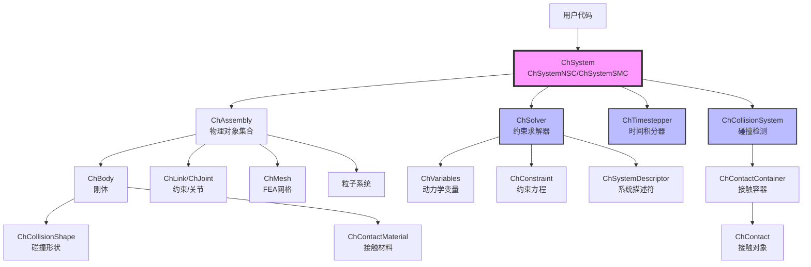
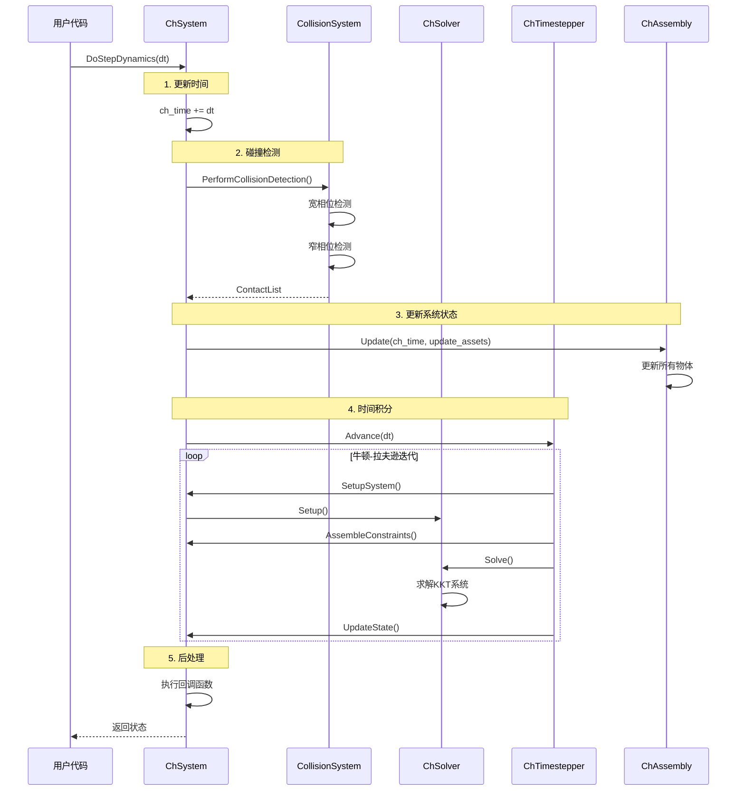
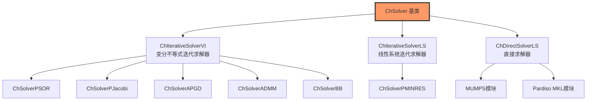
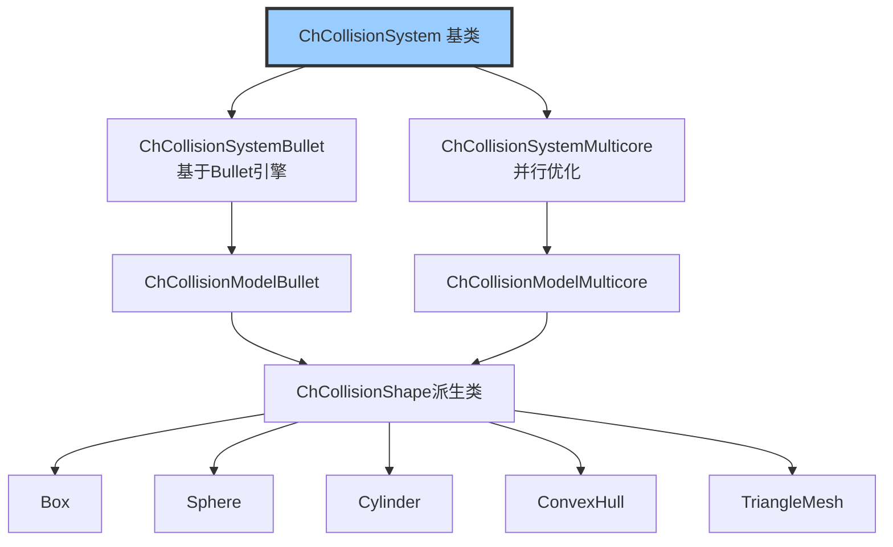
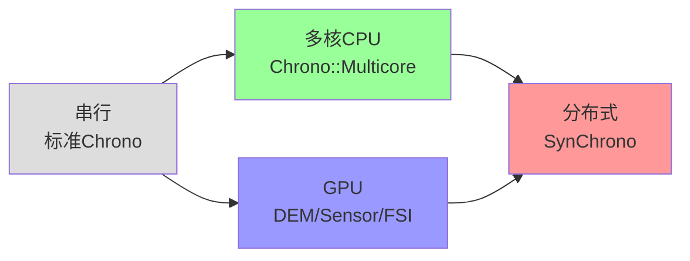
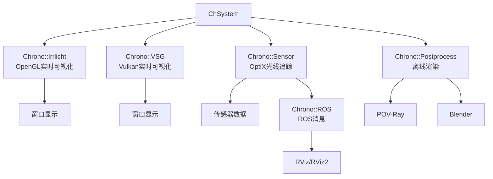
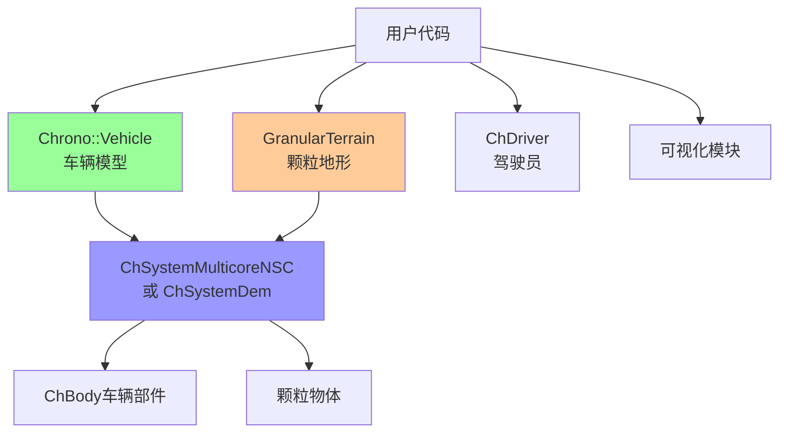
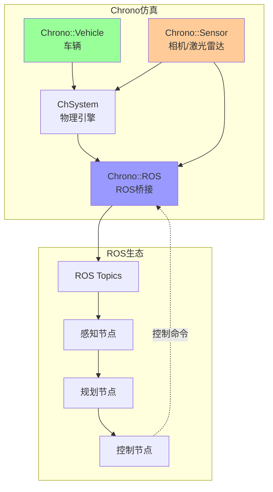

# Project Chrono 架构分析文档

## 概览

### Project Chrono 简介

Project Chrono 是一个开源的多物理仿真软件包，采用宽松的BSD许可证分发。Chrono被广泛应用于建模和仿真：

- **刚体多体动力学**：由微分代数方程（DAE）控制的大规模互连刚体系统动力学
- **柔性体动力学**：由偏微分方程（PDE）控制的可变形体动力学  
- **颗粒动力学**：使用非光滑接触（DVI问题）或光滑接触（DAE）的颗粒动力学
- **流固耦合**：由DAE和PDE耦合控制的流固耦合问题
- **一阶动态系统**：由常微分方程（ODE）控制的一阶动态系统
- **传感器仿真**：支持相机、激光雷达、GPS、IMU、SPAD等传感器，通过ROS2接口支持机器人和自主智能体

### 核心设计理念

Chrono的架构设计遵循以下核心理念：

1. **模块化架构**：核心引擎提供基础物理仿真能力，可选模块提供特定领域的扩展功能
2. **多物理支持**：统一框架下支持刚体、柔体、颗粒、流体等多种物理对象
3. **多求解器策略**：支持多种数值求解器，包括迭代求解器、直接求解器、NSC/SMC接触模型等
4. **并行化能力**：提供多核CPU（OpenMP）、GPU（CUDA）、分布式（MPI）等多种并行化后端
5. **跨平台**：使用C++实现，基于CMake构建系统，支持Linux、Windows、MacOS
6. **多语言接口**：提供C++ API、Python绑定（PyChrono）、C#绑定

当前版本：**9.0.1**


---

## 第0步：根目录结构与模块总览

### 顶层目录结构

| 目录/文件 | 用途说明 |
|---------|---------|
| `src/chrono/` | **核心引擎库**：包含基础物理引擎、求解器、碰撞系统、时间步进器等 |
| `src/chrono_multicore/` | **并行多核模块**：OpenMP/Thrust加速的刚体和颗粒动力学 |
| `src/chrono_vehicle/` | **车辆仿真模块**：完整的车辆建模框架（轮式/履带式车辆） |
| `src/chrono_fsi/` | **流固耦合模块**：基于SPH的流固耦合仿真 |
| `src/chrono_sensor/` | **传感器模块**：GPU加速的摄像头、激光雷达、雷达等传感器仿真 |
| `src/chrono_dem/` | **DEM模块**：GPU加速的离散元法（双GPU架构） |
| `src/chrono_synchrono/` | **分布式仿真模块**：基于MPI的分布式多智能体仿真 |
| `src/chrono_ros/` | **ROS接口模块**：与ROS2集成的接口 |
| `src/chrono_irrlicht/` | **Irrlicht可视化模块**：基于Irrlicht引擎的实时可视化 |
| `src/chrono_vsg/` | **VSG可视化模块**：基于VulkanSceneGraph的现代可视化 |
| `src/chrono_postprocess/` | **后处理模块**：数据导出和后处理工具 |
| `src/chrono_parsers/` | **解析器模块**：支持URDF、Python、OpenSim等格式解析 |
| `src/chrono_fea/` | **有限元分析**：已集成入核心chrono库（fea子目录） |
| `src/chrono_modal/` | **模态分析模块**：结构动力学模态分析 |
| `src/chrono_peridynamics/` | **近场动力学模块**：连续介质损伤和断裂 |
| `src/chrono_fmi/` | **FMI模块**：功能模拟接口（FMU导入/导出） |
| `src/chrono_matlab/` | **Matlab接口模块**：与Matlab/Simulink集成 |
| `src/chrono_cascade/` | **Cascade模块**：OpenCASCADE CAD几何支持 |
| `src/chrono_mumps/` | **MUMPS求解器模块**：直接稀疏求解器接口 |
| `src/chrono_pardisomkl/` | **Pardiso MKL模块**：Intel MKL Pardiso求解器接口 |
| `src/chrono_models/` | **预定义模型库**：车辆模型、机器人模型等 |
| `src/demos/` | **示例程序**：各模块的演示程序 |
| `src/tests/` | **单元测试**：自动化测试套件 |
| `data/` | **数据文件**：网格、纹理、配置文件等 |
| `cmake/` | **CMake脚本**：构建系统辅助脚本 |
| `docs/` | **文档**：项目文档 |
| `doxygen/` | **API文档配置**：Doxygen生成的API文档 |

### 主要模块列表

| 模块名称 | 简短描述 | 核心依赖 | 外部依赖 |
|---------|---------|---------|---------|
| **Core (chrono)** | 核心物理引擎 | - | Eigen3 |
| **Multicore** | 并行刚体/颗粒仿真 | Core | OpenMP, Thrust, Blaze |
| **Vehicle** | 车辆动力学仿真 | Core | OpenCRG (可选), Irrklang (可选) |
| **FSI** | 流固耦合仿真 | Core | - |
| **DEM** | GPU加速离散元 | Core | CUDA |
| **Sensor** | GPU传感器仿真 | Core | CUDA, OptiX, GLM, GLEW, GLFW |
| **SynChrono** | 分布式仿真 | Core, Vehicle | MPI |
| **ROS** | ROS2接口 | Core | ROS2 (rclcpp, tf2_ros, etc.) |
| **Irrlicht** | 实时可视化 | Core | Irrlicht |
| **VSG** | Vulkan可视化 | Core | VulkanSceneGraph |
| **Postprocess** | 后处理导出 | Core | - |
| **Parsers** | 文件格式解析 | Core | - |
| **Modal** | 模态分析 | Core | Spectra |
| **Peridynamics** | 近场动力学 | Core | - |
| **FMI** | FMU co-simulation | Core | FMI库 |
| **Matlab** | Matlab接口 | Core | Matlab Engine |
| **Cascade** | CAD几何支持 | Core | OpenCASCADE |
| **MUMPS** | 直接求解器 | Core | MUMPS |
| **PardisoMKL** | MKL求解器 | Core | Intel MKL |


---

## 第1步：核心引擎（Core Engine）架构分析

### 核心命名空间与目录结构

核心引擎位于 `src/chrono/` 目录，使用 `chrono` 命名空间。核心子目录包括：

| 子目录 | 职责 |
|-------|------|
| `physics/` | 物理对象（刚体、关节、力、接触等） |
| `solver/` | 约束求解器、变量、系统描述符 |
| `timestepper/` | 时间积分器（显式/隐式） |
| `collision/` | 碰撞检测系统与形状 |
| `fea/` | 有限元分析（梁、壳、体积元） |
| `core/` | 核心数学类型（向量、矩阵、坐标系等） |
| `geometry/` | 几何基元与网格 |
| `assets/` | 可视化资源 |
| `functions/` | 数学函数与插值 |
| `serialization/` | 序列化/反序列化 |
| `output/` | 输出接口 |
| `utils/` | 实用工具 |

### 核心类层次结构

#### 1. 系统层（ChSystem）

**ChSystem** 是Chrono的顶层仿真系统类，负责管理：
- 物理对象集合（刚体、FEA网格、颗粒等）
- 求解器和时间步进器
- 碰撞系统
- 系统级参数（重力、时间等）

**派生类**：
- `ChSystemNSC`：使用**Non-Smooth Contact (NSC)** 模型，将接触建模为补充性问题（DVI）
- `ChSystemSMC`：使用**Smooth Contact (SMC)** 模型，将接触建模为基于惩罚的力

#### 2. 物理对象层

##### 刚体类
- **ChBody**：标准刚体，质心为参考系原点
- **ChBodyAuxRef**：带辅助参考系的刚体，允许质心与几何中心分离
- **ChBodyEasy***：便捷的刚体创建类（ChBodyEasyBox, ChBodyEasySphere等）

##### 约束与关节类
- **ChLink**：基础连接类
- **ChLinkBase**：抽象基类
- **ChJoint**：关节约束基类
  - 派生类：ChLinkLockRevolute, ChLinkLockPrismatic, ChLinkLockSpherical等

##### 接触类
- **ChContactMaterial**：接触材料属性
  - **ChContactMaterialNSC**：NSC材料（摩擦、阻尼、粘性）
  - **ChContactMaterialSMC**：SMC材料（刚度、阻尼、粘聚力）
- **ChContact**：接触对象
- **ChContactContainer**：接触管理容器

##### FEA节点与元素
- **ChNodeFEA***：有限元节点（ChNodeFEAxyz, ChNodeFEAxyzrot等）
- **ChElement***：有限元单元
  - 梁元素：ChElementBeamEuler, ChElementBeamANCF等
  - 壳元素：ChElementShellANCF等
  - 体积元素：ChElementHexaANCF, ChElementTetraCorot等

#### 3. 求解器层（Solver）

Chrono提供多种求解器用于求解约束和动力学方程：

##### 迭代求解器（VI - Variational Inequality）
用于NSC系统，求解DVI问题：
- **ChSolverPSOR**：投影超松弛（Projected SOR）
- **ChSolverPJacobi**：投影Jacobi
- **ChSolverAPGD**：加速投影梯度下降
- **ChSolverADMM**：交替方向乘子法（大规模问题）
- **ChSolverBB**：Barzilai-Borwein方法

##### 迭代求解器（LS - Linear System）
用于SMC系统和FEA：
- **ChSolverPMINRES**：预条件MINRES

##### 直接求解器
- **ChDirectSolverLS**：直接稀疏求解器接口
- 通过模块支持：MUMPS, Pardiso MKL等

##### 求解器相关类
- **ChSystemDescriptor**：系统描述符，管理变量和约束
- **ChVariables**：动力学变量（位置、速度）
- **ChConstraint**：约束方程

#### 4. 时间步进器（Timestepper）

**ChTimestepper** 基类及其派生类负责时间积分：

- **ChTimestepperEulerImplicit**：隐式欧拉（默认NSC）
- **ChTimestepperEulerImplicitLinearized**：线性化隐式欧拉
- **ChTimestepperEulerImplicitProjected**：投影隐式欧拉
- **ChTimestepperEulerExplIIorder**：二阶显式欧拉
- **ChTimestepperNewmark**：Newmark方法
- **ChTimestepperHHT**：HHT-α方法（推荐FEA）
- **ChTimestepperRungeKutta**：Runge-Kutta方法

#### 5. 碰撞系统（Collision System）

**ChCollisionSystem** 负责碰撞检测：

- **Bullet**：基于Bullet物理引擎（默认）
- **Multicore**：多核优化的碰撞检测

碰撞相关类：
- **ChCollisionModel**：碰撞模型
- **ChCollisionShape**：碰撞形状基类
  - 支持形状：Box, Sphere, Cylinder, Capsule, ConvexHull, TriangleMesh等

### 核心架构分层图



### 仿真时间步流程

一次仿真时间步 `DoStepDynamics(step_size)` 的典型执行流程：



**流程详解**：

1. **时间更新**：系统时间递增
2. **碰撞检测**：
   - 宽相位：快速剔除不可能接触的对象对
   - 窄相位：精确计算接触点、法向、侵入深度
3. **系统更新**：更新所有物体的内部状态
4. **时间积分**（核心）：
   - **Setup**：组装系统矩阵（质量矩阵M、约束雅可比矩阵Cq等）
   - **Assemble**：组装约束方程和力向量
   - **Solve**：求解线性/非线性系统
     - NSC系统：求解DVI（Differential Variational Inequality）
     - SMC系统：求解DAE（Differential Algebraic Equation）
   - **Update**：更新状态变量（位置、速度、加速度）
5. **后处理**：执行用户回调、输出数据等


---

## 第2-3步：重要模块详解

### 1. Chrono::Multicore 模块

#### 模块概述
并行多核物理仿真模块，专为大规模刚体和颗粒系统优化。

**源码位置**：`src/chrono_multicore/`

#### 核心职责
- 使用OpenMP进行多核CPU并行化
- 大规模刚体接触动力学（百万级接触）
- 颗粒材料仿真（DEM风格）
- 优化的数据结构和算法

#### 核心类与架构
- **ChSystemMulticore** / **ChSystemMulticoreNSC** / **ChSystemMulticoreSMC**
  - 替代标准ChSystem，使用并行化数据结构
- **并行求解器**：
  - APGD（加速投影梯度下降）
  - BB（Barzilai-Borwein）
  - Jacobi
- **并行碰撞检测**：
  - 基于空间分箱的宽相位
  - MPR（Minkowski Portal Refinement）窄相位

#### 依赖关系
- **核心依赖**：ChronoEngine
- **外部库**：OpenMP, Thrust（NVIDIA并行算法库）, Blaze（线性代数）

#### 使用方式
```cpp
#include "chrono_multicore/physics/ChSystemMulticoreNSC.h"
using namespace chrono;

ChSystemMulticoreNSC system;
system.SetNumThreads(8);
// 添加物体和约束...
system.DoStepDynamics(0.01);
```

#### 特色与限制
**特色**：
- 高效并行化，适合大规模颗粒/刚体系统
- 低内存开销的数据结构
- 支持刚性几何和复杂形状

**限制**：
- 不直接支持FEA
- 与标准Chrono API存在部分差异
- 主要优化点接触，复杂约束支持有限

---

### 2. Chrono::Vehicle 模块

#### 模块概述
完整的车辆动力学仿真框架，支持轮式和履带式车辆。

**源码位置**：`src/chrono_vehicle/`

#### 核心职责
- 车辆系统建模与仿真
- 模板化子系统设计（悬挂、轮胎、动力传动等）
- 地形模型（刚性、SCM、颗粒、可变形FEA地形）
- 驾驶员模型

#### 目录结构与子系统
```
chrono_vehicle/
├── chassis/              # 车架子系统
├── wheeled_vehicle/      # 轮式车辆
│   ├── suspension/       # 悬挂（双横臂、麦弗逊、多连杆等）
│   ├── tire/            # 轮胎模型（刚性、Pac89、TMSF等）
│   ├── driveline/       # 传动系统
│   ├── steering/        # 转向系统
│   ├── brake/           # 制动系统
│   └── wheel/           # 车轮
├── tracked_vehicle/      # 履带式车辆
│   ├── suspension/       # 履带悬挂
│   ├── track_assembly/  # 履带总成
│   ├── track_shoe/      # 履带板
│   ├── sprocket/        # 链轮
│   └── idler/           # 惰轮
├── powertrain/          # 动力总成（发动机、变速箱）
├── driver/              # 驾驶员模型（交互式、数据驱动）
├── terrain/             # 地形模型
└── utils/               # 实用工具
```

#### 核心类
- **ChVehicle**：车辆基类
  - **ChWheeledVehicle**：轮式车辆
  - **ChTrackedVehicle**：履带式车辆
- **ChPart**：车辆子系统基类
  - **ChSuspension**：悬挂基类（派生出各种悬挂类型）
  - **ChTire**：轮胎基类
  - **ChDriveline**：传动系基类
- **ChTerrain**：地形接口
  - **RigidTerrain**：刚性地形
  - **SCMTerrain**：土壤接触模型地形
  - **GranularTerrain**：颗粒地形（需Multicore或GPU）
- **ChDriver**：驾驶员模型

#### 与ChSystem的交互
- 车辆模型基于标准ChSystem
- 各子系统创建ChBody和ChLink对象并添加到系统
- 支持与Multicore/DEM/FSI系统集成用于地形仿真

#### 扩展点
- **自定义子系统**：继承ChPart派生类，实现特定组件
- **自定义轮胎模型**：继承ChTire，实现力/力矩计算
- **自定义地形**：继承ChTerrain，实现高度和力查询

#### 特色与限制
**特色**：
- 完整的模板化车辆库
- 支持JSON配置文件定义车辆
- 与Multicore/GPU集成用于高保真地形
- 丰富的预定义车辆模型（chrono_models）

**限制**：
- 主要面向地面车辆
- 某些高级轮胎模型需专业参数

---

### 3. Chrono::FSI 模块

#### 模块概述
流固耦合仿真模块，基于光滑粒子流体动力学（SPH）方法。

**源码位置**：`src/chrono_fsi/`

#### 核心职责
- SPH流体求解
- 流体与刚体/柔体耦合
- 多相流（流体-固体-气体）
- 自由表面流动

#### 核心类
- **ChFsiSystem**：FSI系统主类，管理流体和固体
- **ChFsiFluidSystem**：流体系统（SPH粒子）
- **ChFsiInterface**：流固耦合接口
- **ChFsiBoundary**：边界条件

#### 物理模型
- **WCSPH**：弱可压缩SPH
- **IISPH**：隐式不可压缩SPH
- **SPH核函数**：支持多种核函数（Wendland, Quintic等）

#### 与ChSystem的交互
- 创建独立的ChFsiSystem或关联现有ChSystem
- 流体力通过耦合接口施加到ChBody上
- 支持双向耦合

#### 特色与限制
**特色**：
- 高保真流固耦合
- GPU加速（CUDA）
- 支持复杂几何体的流体交互

**限制**：
- 主要适用于低雷诺数流动
- SPH粒子分辨率影响计算成本
- 需要CUDA支持

---

### 4. Chrono::DEM 模块

#### 模块概述
GPU加速的离散元法（DEM）仿真，采用双GPU架构设计。

**源码位置**：`src/chrono_dem/`

#### 核心职责
- 大规模颗粒系统（百万级颗粒）
- GPU并行计算
- 高性能接触检测和力计算

#### 核心类
- **ChSystemDem**：DEM系统类
- GPU数据结构和核函数

#### 依赖关系
- **核心依赖**：ChronoEngine
- **外部库**：CUDA, Eigen3 (≥3.3.6)

#### 与Multicore对比
- **DEM**：纯GPU，更高性能，专用于颗粒
- **Multicore**：CPU多核，更灵活，支持复杂约束

#### 特色与限制
**特色**：
- 极高性能（GPU加速）
- 双GPU架构可进一步提升性能
- 优化的接触算法

**限制**：
- 需要NVIDIA GPU和CUDA
- 主要用于颗粒，不适合通用多体问题

---

### 5. Chrono::Sensor 模块

#### 模块概述
GPU加速的传感器仿真模块，支持摄像头、激光雷达、雷达、GPS、IMU等。

**源码位置**：`src/chrono_sensor/`

#### 核心职责
- 光线追踪渲染（OptiX）
- 传感器数据生成
- 滤波和后处理链
- 与ROS2集成

#### 核心类
- **ChSensorManager**：传感器管理器
- **ChSensor**：传感器基类
  - **ChCameraSensor**：相机（RGB、深度、分割）
  - **ChLidarSensor**：激光雷达
  - **ChRadarSensor**：雷达
  - **ChGPSSensor**：GPS
  - **ChIMUSensor**：惯性测量单元
- **ChFilter**：传感器数据滤波器链

#### 渲染管线
1. **OptiX光线追踪**：GPU加速的光线追踪
2. **滤波链**：噪声、模糊、畸变等
3. **数据导出**：保存到文件或发布到ROS

#### 依赖关系
- **核心依赖**：ChronoEngine
- **外部库**：CUDA, OptiX, GLM, GLEW, GLFW
- **可选**：TensorRT（深度学习推理）

#### 使用方式
```cpp
#include "chrono_sensor/ChSensorManager.h"
#include "chrono_sensor/sensors/ChCameraSensor.h"

auto sensor_manager = chrono_types::make_shared<ChSensorManager>(&system);
auto camera = chrono_types::make_shared<ChCameraSensor>(
    body, update_rate, offset_pose, image_width, image_height, fov);
camera->PushFilter(chrono_types::make_shared<ChFilterRGBA8Access>());
sensor_manager->AddSensor(camera);
```

#### 特色与限制
**特色**：
- 高性能GPU渲染
- 逼真的传感器模拟
- 可配置的滤波链
- ROS2集成

**限制**：
- 需要NVIDIA GPU和OptiX
- 复杂场景可能导致性能下降

---

### 6. Chrono::SynChrono 模块

#### 模块概述
分布式多智能体仿真模块，基于MPI。

**源码位置**：`src/chrono_synchrono/`

#### 核心职责
- 分布式仿真管理
- 智能体同步
- 通信协议

#### 核心类
- **SynChronoManager**：分布式仿真管理器
- **SynAgent**：智能体基类
  - **SynWheeledVehicleAgent**：轮式车辆智能体
  - **SynTrackedVehicleAgent**：履带车辆智能体
- **通信层**：MPI消息传递

#### 依赖关系
- **核心依赖**：ChronoEngine, Chrono::Vehicle
- **外部库**：MPI

#### 同步策略
- **时间同步**：各节点协调时间步
- **状态同步**：智能体状态交换
- **事件同步**：关键事件广播

#### 特色与限制
**特色**：
- 大规模多智能体仿真
- 地理分布式计算
- 与Vehicle模块紧密集成

**限制**：
- 需要MPI环境
- 主要依赖Vehicle模块
- 网络延迟影响性能

---

### 7. Chrono::ROS 模块

#### 模块概述
ROS2接口模块，实现Chrono与ROS生态的集成。

**源码位置**：`src/chrono_ros/`

#### 核心职责
- ROS2节点创建
- Chrono数据到ROS消息转换
- 时钟同步
- TF（坐标变换）发布

#### 核心类
- **ChROSManager**：ROS管理器
- **ChROSHandler**：ROS数据处理器
  - **ChROSClockHandler**：时钟发布
  - **ChROSBodyHandler**：刚体状态发布
  - **ChROSTFHandler**：TF发布

#### 依赖关系
- **核心依赖**：ChronoEngine
- **外部库**：ROS2 (rclcpp, tf2_ros, std_msgs, geometry_msgs, sensor_msgs)

#### 使用方式
```cpp
#include "chrono_ros/ChROSManager.h"

auto ros_manager = chrono_types::make_shared<ChROSManager>();
ros_manager->Initialize();
// 注册处理器...
while (system.GetChTime() < tend) {
    system.DoStepDynamics(step_size);
    ros_manager->Update();
}
```

#### 与Sensor模块集成
- Sensor数据可直接发布为ROS消息
- 支持sensor_msgs::Image, sensor_msgs::PointCloud2等

#### 特色与限制
**特色**：
- 无缝ROS2集成
- 实时数据流
- 标准ROS消息类型

**限制**：
- 需要ROS2环境
- 实时性能依赖于仿真复杂度

---

### 8. 其他重要模块

#### Chrono::Irrlicht / Chrono::VSG
**可视化模块**：
- **Irrlicht**：传统OpenGL可视化（Windows友好）
- **VSG**：现代Vulkan可视化（跨平台，性能更好）

#### Chrono::Postprocess
**后处理模块**：
- 数据导出到POV-Ray、Blender等
- GNUplot集成
- 自定义输出格式

#### Chrono::Parsers
**解析器模块**：
- URDF文件解析（机器人描述）
- OpenSim文件解析（生物力学模型）
- Python脚本解析

#### Chrono::Modal
**模态分析模块**：
- 结构特征值分析
- 模态叠加
- 频率响应分析

#### Chrono::Peridynamics
**近场动力学模块**：
- 连续介质损伤
- 裂纹扩展
- 断裂力学

#### Chrono::FMI
**功能模拟接口模块**：
- FMU（Functional Mock-up Unit）导入/导出
- Co-simulation标准


---

## 第4步：跨模块共性机制

### 求解器体系

Chrono的求解器架构是模块化的，不同模块可以重用或提供专用求解器。

#### 求解器层次结构



#### 各模块的求解器策略

| 模块 | 求解器类型 | 说明 |
|------|-----------|------|
| **Core (NSC)** | 迭代VI求解器 | PSOR, APGD, ADMM等用于DVI问题 |
| **Core (SMC)** | 迭代LS求解器 | PMINRES等用于光滑接触 |
| **Core (FEA)** | 直接/迭代LS | MUMPS, Pardiso MKL等用于大型稀疏系统 |
| **Multicore** | 专用并行VI求解器 | 优化的APGD, BB, Jacobi（OpenMP） |
| **DEM** | GPU求解器 | CUDA内核实现的专用求解器 |
| **FSI** | SPH求解器 | WCSPH或IISPH求解器 |

#### 求解器选择策略

```cpp
// NSC系统 - 使用迭代VI求解器
ChSystemNSC system;
auto solver = chrono_types::make_shared<ChSolverAPGD>();
solver->SetMaxIterations(100);
solver->SetTolerance(1e-4);
system.SetSolver(solver);

// SMC系统 - 使用迭代LS求解器
ChSystemSMC system_smc;
auto solver_smc = chrono_types::make_shared<ChSolverPMINRES>();
system_smc.SetSolver(solver_smc);

// FEA系统 - 使用直接求解器
// 需要Chrono::MUMPS模块
auto solver_mumps = chrono_types::make_shared<ChSolverMumps>();
system.SetSolver(solver_mumps);
```

---

### 碰撞与接触系统

#### 碰撞系统架构

Chrono提供统一的碰撞接口，不同实现可互换：



#### 各模块的碰撞实现

| 模块 | 碰撞实现 | 特点 |
|------|---------|------|
| **Core** | Bullet | 通用、稳定、支持复杂形状 |
| **Multicore** | 自定义并行 | 空间分箱、MPR窄相位、OpenMP加速 |
| **DEM** | GPU碰撞 | CUDA实现、球形或简单形状 |
| **FSI** | SPH邻域搜索 | 粒子-边界碰撞 |

#### 碰撞检测流程

1. **宽相位（Broad Phase）**：
   - Bullet：AABB树或扫描剪枝
   - Multicore：均匀网格分箱
   - DEM：GPU空间哈希

2. **窄相位（Narrow Phase）**：
   - Bullet：GJK/EPA算法
   - Multicore：MPR（Minkowski Portal Refinement）
   - DEM：解析公式（球-球等）

3. **接触生成**：
   - 创建ChContact对象
   - 添加到ChContactContainer
   - 传递给求解器

---

### 并行化与硬件加速

Chrono支持多层次并行化：

#### 并行化层次



#### 并行实现对比

| 技术 | 模块 | 并行粒度 | 适用场景 |
|------|------|---------|---------|
| **OpenMP** | Multicore | 线程级并行 | 大规模刚体/颗粒（多核CPU） |
| **CUDA** | DEM, Sensor, FSI | 大规模并行 | 百万级颗粒、光线追踪、SPH |
| **MPI** | SynChrono | 进程级并行 | 地理分布、异构仿真 |
| **Thrust** | Multicore | 算法并行 | 排序、归约等算法 |

#### 硬件选择指南

- **小规模系统（< 1000刚体）**：标准Chrono（单核）
- **中等规模（1000-100K刚体）**：Chrono::Multicore（多核CPU）
- **大规模颗粒（> 100K）**：Chrono::DEM（GPU）
- **流固耦合**：Chrono::FSI（GPU）
- **传感器仿真**：Chrono::Sensor（GPU）
- **多智能体分布式**：Chrono::SynChrono（MPI集群）

---

### I/O与可视化

#### 可视化路径



#### 数据输出

**实时可视化**：
- **Irrlicht**：适合Windows、教学演示
- **VSG**：现代API、跨平台、高性能

**传感器数据**：
- **Sensor模块**：RGB图像、深度图、点云、雷达数据
- **ROS集成**：发布到ROS topics

**后处理**：
- **Postprocess模块**：导出到POV-Ray、Blender
- **自定义输出**：CSV、HDF5、JSON等

**FMI接口**：
- **FMI模块**：导出为FMU用于co-simulation
- 与Simulink、dSPACE等工具集成

---

## 第5步：典型使用场景端到端分析

### 场景1：纯刚体多体系统

#### 场景描述
模拟由刚体和关节组成的机械系统（如机械臂、连杆机构）。

#### 使用模块
- **Chrono Core**：ChSystemNSC或ChSystemSMC
- **Chrono::Irrlicht**：可视化（可选）

#### 关键类
- `ChSystemNSC`：系统
- `ChBody` / `ChBodyEasy*`：刚体
- `ChLinkLock*` / `ChLinkMate*`：关节约束
- `ChVisualSystemIrrlicht`：可视化

#### 仿真主流程

```mermaid
sequenceDiagram
    participant User as 用户代码
    participant Sys as ChSystemNSC
    participant Body as ChBody
    participant Link as ChLink
    participant Vis as ChVisualSystem
    
    User->>Sys: 创建系统
    User->>Body: 创建刚体、设置属性
    User->>Sys: 添加刚体
    User->>Link: 创建关节
    User->>Sys: 添加关节
    User->>Vis: 创建可视化系统
    
    loop 仿真循环
        Vis->>Vis: BeginScene()
        Vis->>Vis: Render()
        Sys->>Sys: DoStepDynamics(dt)
        Vis->>Vis: EndScene()
    end
```

#### 代码框架
```cpp
#include "chrono/physics/ChSystemNSC.h"
#include "chrono/physics/ChBodyEasy.h"
#include "chrono/physics/ChLinkLockRevolute.h"

using namespace chrono;

int main() {
    // 1. 创建系统
    ChSystemNSC system;
    system.SetGravitationalAcceleration(ChVector3d(0, -9.81, 0));
    
    // 2. 创建地面（固定）
    auto ground = chrono_types::make_shared<ChBodyEasyBox>(
        10, 1, 10, 1000, true, false);
    ground->SetFixed(true);
    system.Add(ground);
    
    // 3. 创建运动刚体
    auto body = chrono_types::make_shared<ChBodyEasyBox>(
        1, 1, 1, 1000, true, true);
    body->SetPos(ChVector3d(0, 5, 0));
    system.Add(body);
    
    // 4. 创建关节
    auto joint = chrono_types::make_shared<ChLinkLockRevolute>();
    joint->Initialize(ground, body, ChFrame<>(ChVector3d(0, 3, 0)));
    system.Add(joint);
    
    // 5. 仿真循环
    double time_step = 0.01;
    while (system.GetChTime() < 10.0) {
        system.DoStepDynamics(time_step);
        // 输出状态...
    }
    
    return 0;
}
```

---

### 场景2：车辆在颗粒地形上行驶

#### 场景描述
轮式车辆在松软颗粒地形（如沙地、泥地）上行驶，研究车辆-地形交互和terramechanics。

#### 使用模块
- **Chrono::Vehicle**：车辆建模
- **Chrono::Multicore** 或 **Chrono::DEM**：颗粒地形
- **Chrono::Irrlicht** 或 **Chrono::VSG**：可视化

#### 关键类
- `ChWheeledVehicle`：车辆
- `ChDriver`：驾驶员输入
- `GranularTerrain`：颗粒地形（基于Multicore或DEM）
- `ChSystemMulticoreNSC` 或 `ChSystemDem`：物理系统

#### 模块组合模式



#### 仿真主流程

1. **初始化阶段**：
   - 创建Multicore/DEM系统
   - 创建车辆对象（从JSON或代码）
   - 创建颗粒地形
   - 初始化驾驶员
   - 设置可视化

2. **仿真循环**：
   ```
   获取驾驶员输入 → 
   同步车辆与系统 → 
   推进车辆子系统 → 
   执行系统动力学步 → 
   更新可视化 → 
   记录数据
   ```

#### 代码框架
```cpp
#include "chrono_vehicle/ChVehicleModelData.h"
#include "chrono_vehicle/wheeled_vehicle/ChWheeledVehicle.h"
#include "chrono_vehicle/terrain/GranularTerrain.h"
#include "chrono_multicore/physics/ChSystemMulticoreNSC.h"

using namespace chrono;
using namespace chrono::vehicle;

int main() {
    // 1. 创建Multicore系统
    ChSystemMulticoreNSC system;
    system.SetNumThreads(8);
    
    // 2. 创建车辆（从JSON文件）
    WheeledVehicle vehicle(
        vehicle::GetDataFile("hmmwv/vehicle/HMMWV_Vehicle.json"));
    vehicle.Initialize(ChCoordsys<>(ChVector3d(0, 1, 0)));
    vehicle.SetChassisVisualizationType(VisualizationType::MESH);
    vehicle.SetSuspensionVisualizationType(VisualizationType::PRIMITIVES);
    vehicle.SetWheelVisualizationType(VisualizationType::MESH);
    
    // 3. 创建颗粒地形
    GranularTerrain terrain(&system);
    terrain.SetContactMaterial(0.9f, 0.01f, 2e7f, 0.3f);
    terrain.EnableVisualization(true);
    terrain.Initialize(ChVector3d(0, 0, 0), 20.0, 10.0, 200000);
    
    // 4. 创建驾驶员
    ChDriver driver(vehicle);
    
    // 5. 仿真循环
    double time_step = 1e-3;
    while (system.GetChTime() < 20.0) {
        double time = system.GetChTime();
        
        // 获取驾驶员输入
        DriverInputs driver_inputs = driver.GetInputs();
        
        // 同步子系统
        driver.Synchronize(time);
        terrain.Synchronize(time);
        vehicle.Synchronize(time, driver_inputs, terrain);
        
        // 推进动力学
        driver.Advance(time_step);
        terrain.Advance(time_step);
        vehicle.Advance(time_step);
        
        // 执行系统步
        system.DoStepDynamics(time_step);
    }
    
    return 0;
}
```

---

### 场景3：带传感器的机器人/车辆场景

#### 场景描述
自主车辆或机器人在环境中导航，配备摄像头、激光雷达等传感器，通过ROS与感知/规划算法交互。

#### 使用模块
- **Chrono::Vehicle**：车辆/机器人
- **Chrono::Sensor**：传感器仿真
- **Chrono::ROS**：ROS接口
- **Chrono Core**：物理系统

#### 关键类
- `ChWheeledVehicle`：车辆
- `ChSensorManager`：传感器管理
- `ChCameraSensor`, `ChLidarSensor`：传感器
- `ChROSManager`：ROS管理器

#### 系统架构



#### 数据流

1. **仿真 → ROS**：
   - 传感器数据（图像、点云）→ sensor_msgs
   - 车辆状态（位置、速度）→ geometry_msgs
   - TF变换 → tf2_msgs

2. **ROS → 仿真**：
   - 控制命令 → 驾驶员输入
   - 路径点 → 车辆目标

#### 代码框架
```cpp
#include "chrono_vehicle/ChVehicle.h"
#include "chrono_sensor/ChSensorManager.h"
#include "chrono_sensor/sensors/ChCameraSensor.h"
#include "chrono_sensor/sensors/ChLidarSensor.h"
#include "chrono_ros/ChROSManager.h"

using namespace chrono;
using namespace chrono::vehicle;
using namespace chrono::sensor;
using namespace chrono::ros;

int main() {
    // 1. 创建系统和车辆
    ChSystemNSC system;
    auto vehicle = chrono_types::make_shared<WheeledVehicle>(/*...*/);
    
    // 2. 创建传感器管理器
    auto sensor_manager = chrono_types::make_shared<ChSensorManager>(&system);
    sensor_manager->scene->AddPointLight({0, 0, 100}, {1, 1, 1}, 500);
    
    // 3. 添加相机传感器
    auto camera = chrono_types::make_shared<ChCameraSensor>(
        vehicle->GetChassisBody(),
        30.0,  // 更新率 Hz
        chrono::ChFrame<double>({0, 0, 2}, QuatFromAngleZ(0)),
        1280, 720,  // 分辨率
        CH_PI / 3   // FOV
    );
    camera->SetName("Camera");
    camera->PushFilter(chrono_types::make_shared<ChFilterRGBA8Access>());
    sensor_manager->AddSensor(camera);
    
    // 4. 添加激光雷达
    auto lidar = chrono_types::make_shared<ChLidarSensor>(
        vehicle->GetChassisBody(),
        10.0,  // 更新率
        chrono::ChFrame<double>({0, 0, 2}),
        900, 16,  // 水平/垂直分辨率
        2 * CH_PI, CH_PI / 12,  // 水平/垂直FOV
        100.0  // 最大距离
    );
    lidar->SetName("Lidar");
    lidar->PushFilter(chrono_types::make_shared<ChFilterPCfromDepth>());
    sensor_manager->AddSensor(lidar);
    
    // 5. 创建ROS管理器
    auto ros_manager = chrono_types::make_shared<ChROSManager>();
    
    // 6. 注册传感器数据到ROS
    auto camera_handler = chrono_types::make_shared<ChROSCameraHandler>(
        camera, "/vehicle/camera/image");
    ros_manager->RegisterHandler(camera_handler);
    
    auto lidar_handler = chrono_types::make_shared<ChROSLidarHandler>(
        lidar, "/vehicle/lidar/points");
    ros_manager->RegisterHandler(lidar_handler);
    
    // 7. 仿真循环
    double time_step = 0.01;
    while (system.GetChTime() < 100.0) {
        // 更新传感器
        sensor_manager->Update();
        
        // 执行物理步
        system.DoStepDynamics(time_step);
        
        // 更新ROS
        if (!ros_manager->Update(time_step))
            break;  // ROS关闭
    }
    
    return 0;
}
```

#### 扩展点
- **自定义传感器**：继承ChSensor，实现新传感器类型
- **自定义滤波器**：继承ChFilter，实现数据后处理
- **自定义ROS消息**：继承ChROSHandler，发布/订阅自定义消息


---

## 总结与评估

### 架构优势

#### 1. 模块化设计
- **核心与扩展分离**：核心引擎稳定，模块按需启用
- **职责清晰**：每个模块有明确的功能边界
- **依赖管理良好**：模块间依赖关系明确，耦合度低

#### 2. 多物理能力
- **统一框架**：刚体、柔体、颗粒、流体在同一系统
- **多尺度仿真**：从微米级粒子到公里级地形
- **多物理耦合**：FSI、车辆-地形、传感器-环境等

#### 3. 可扩展性
- **求解器可替换**：迭代/直接、NSC/SMC、串行/并行
- **碰撞系统可插拔**：Bullet、Multicore、自定义
- **用户扩展点丰富**：自定义车辆子系统、传感器、材料模型等

#### 4. 性能优化
- **多层次并行**：OpenMP、CUDA、MPI
- **专用模块**：针对特定场景优化（Multicore、DEM）
- **GPU加速**：传感器、流体、颗粒

#### 5. 生态集成
- **可视化**：Irrlicht、VSG、POV-Ray、Blender
- **语言绑定**：Python、C#
- **标准接口**：ROS2、FMI、URDF
- **工业集成**：Matlab、Simulink、dSPACE

### 潜在复杂点

#### 1. 学习曲线
- **模块众多**：初学者需要理解各模块适用场景
- **API差异**：Multicore与Core API存在差异
- **配置复杂**：大型系统的CMake配置和依赖管理

#### 2. 模块耦合
- **SynChrono依赖Vehicle**：限制了分布式仿真的灵活性
- **Sensor依赖GPU**：硬件要求高
- **某些模块相互排斥**：如不能同时用Multicore和DEM系统

#### 3. 性能调优
- **求解器选择**：需要经验判断最佳求解器
- **接触参数敏感**：NSC/SMC材料参数影响稳定性和精度
- **并行效率**：不是所有场景都能线性加速

#### 4. 文档完整性
- **部分模块文档不足**：新模块（如DEM）文档较少
- **最佳实践分散**：需要从论坛和demo中学习
- **版本迭代**：API在版本间有变化

### 架构演进趋势

基于源码结构和模块依赖，可以看出Chrono的发展方向：

1. **GPU加速普及**：DEM、Sensor、FSI都采用GPU
2. **机器人与自主系统**：Sensor + ROS模块支持体现
3. **分布式仿真**：SynChrono为大规模多智能体铺路
4. **标准化接口**：FMI、URDF、ROS等工业标准集成
5. **现代化可视化**：从Irrlicht向VSG (Vulkan)迁移

### 对后续研究/二次开发的启发

#### 研究方向建议

1. **多物理耦合算法**
   - FSI与结构损伤耦合
   - 热-力-电多物理场
   - 多尺度桥接方法

2. **大规模并行**
   - 异构GPU集群
   - 动态负载均衡
   - 通信优化

3. **智能仿真**
   - 数据驱动的材料模型
   - 机器学习加速求解
   - 自适应时间步和网格

4. **实时仿真**
   - 模型降阶技术
   - 硬件在环集成
   - 预测性碰撞检测

#### 二次开发建议

1. **模块开发**
   - 参考现有模块的CMake结构
   - 继承核心接口（ChSystem, ChSolver等）
   - 提供清晰的依赖声明

2. **自定义组件**
   - 继承ChBody/ChLink实现特殊物理对象
   - 继承ChForce实现自定义力
   - 继承ChContactMaterial实现新材料模型

3. **求解器扩展**
   - 继承ChSolver实现专用求解器
   - 利用ChSystemDescriptor访问系统矩阵
   - 参考ADMM等现代求解器实现

4. **可视化定制**
   - 使用ChVisualSystem接口
   - 自定义ChVisualShape
   - 集成新的渲染引擎

5. **传感器扩展**
   - 继承ChSensor实现新传感器
   - 开发OptiX shader支持新光学效果
   - 实现ChFilter进行数据后处理

### 结语

Project Chrono是一个功能强大、架构清晰的多物理仿真平台。其模块化设计和丰富的扩展点使其既适合科研探索，也适合工业应用。核心引擎稳定成熟，专用模块针对性强，生态集成完善。

对于：
- **初学者**：建议从Core模块和简单demo入手，逐步探索专用模块
- **研究者**：可深入求解器算法、多物理耦合、大规模并行等方向
- **工程师**：可利用Vehicle、Sensor、ROS等模块快速搭建应用原型

Chrono的持续发展（GPU加速、ROS集成、分布式仿真）表明其紧跟学术前沿和工业需求，是多体动力学和多物理仿真领域的重要工具。

---

## 附录：关键源码位置速查

| 功能 | 源码路径 |
|------|---------|
| 核心系统 | `src/chrono/physics/ChSystem*.h` |
| 刚体 | `src/chrono/physics/ChBody*.h` |
| 约束 | `src/chrono/physics/ChLink*.h` |
| 求解器 | `src/chrono/solver/ChSolver*.h` |
| 时间步进器 | `src/chrono/timestepper/ChTimestepper*.h` |
| 碰撞 | `src/chrono/collision/` |
| FEA | `src/chrono/fea/` |
| Vehicle | `src/chrono_vehicle/` |
| Multicore | `src/chrono_multicore/` |
| DEM | `src/chrono_dem/` |
| FSI | `src/chrono_fsi/` |
| Sensor | `src/chrono_sensor/` |
| ROS | `src/chrono_ros/` |
| SynChrono | `src/chrono_synchrono/` |
| 示例程序 | `src/demos/` |
| 单元测试 | `src/tests/` |

---

**文档版本**：v1.0  
**基于Chrono版本**：9.0.1  
**分析日期**：2025-11-18  
**文档位置**：`readings/Chrono架构分析文档.md`

