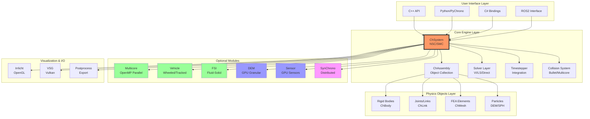
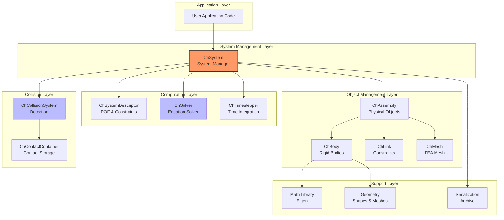
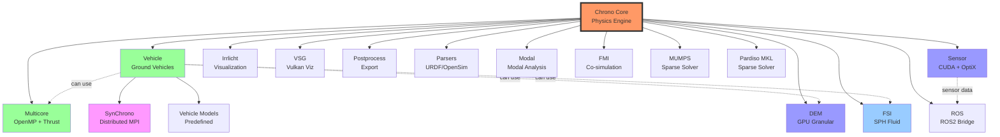
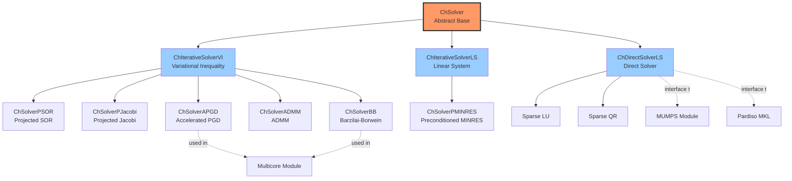
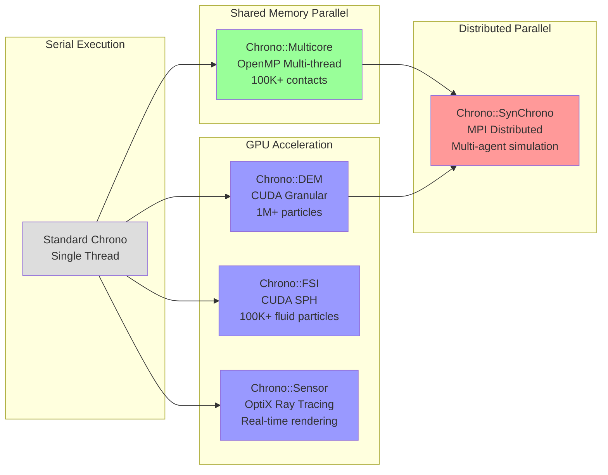
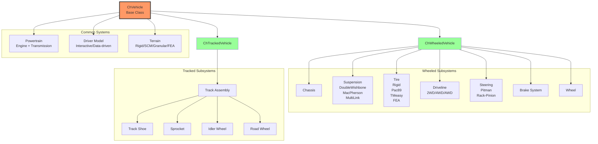
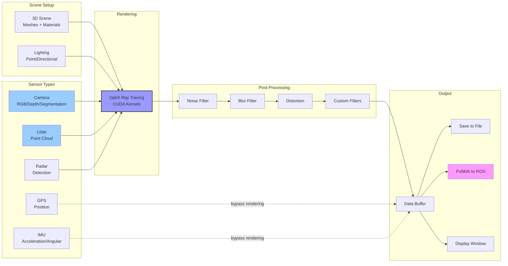
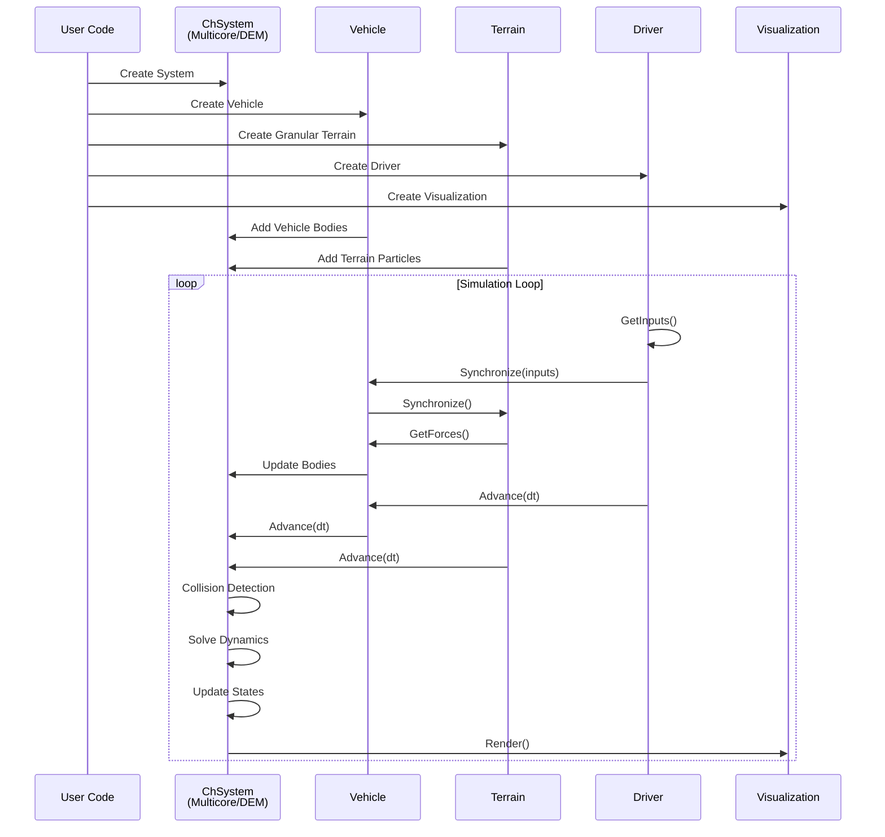

# Chrono Architecture Diagrams

This document contains visual diagrams illustrating the Project Chrono architecture.

## Overall System Architecture



## Core Physics Engine Stack



## Module Dependency Graph



## Solver Hierarchy



## Parallelization Strategy



## Vehicle Module Architecture



## Sensor Module Pipeline



## Typical Workflow: Vehicle on Granular Terrain



## ROS Integration Architecture

```mermaid
graph TB
    subgraph "Chrono Simulation"
        System[ChSystem]
        Vehicle[Vehicle System]
        Sensor[Sensor Manager]
        Bodies[Rigid Bodies]
        
        System --> Vehicle
        System --> Bodies
        Sensor --> System
    end
    
    subgraph "Chrono::ROS Bridge"
        ROSMgr[ChROSManager]
        ClockHandler[Clock Handler]
        BodyHandler[Body Handler]
        TFHandler[TF Handler]
        SensorHandler[Sensor Handler]
        
        ROSMgr --> ClockHandler
        ROSMgr --> BodyHandler
        ROSMgr --> TFHandler
        ROSMgr --> SensorHandler
    end
    
    subgraph "ROS2 Topics"
        ClockTopic[/clock]
        OdomTopic[/odom]
        TFTopic[/tf]
        ImageTopic[/camera/image]
        PCTopic[/lidar/points]
    end
    
    subgraph "ROS2 Applications"
        RViz[RViz2<br/>Visualization]
        Navigation[Nav2<br/>Navigation]
        Perception[Perception<br/>Node]
        Control[Control<br/>Node]
    end
    
    System --> ROSMgr
    Vehicle --> BodyHandler
    Sensor --> SensorHandler
    Bodies --> TFHandler
    
    ClockHandler --> ClockTopic
    BodyHandler --> OdomTopic
    TFHandler --> TFTopic
    SensorHandler --> ImageTopic
    SensorHandler --> PCTopic
    
    ClockTopic --> RViz
    OdomTopic --> Navigation
    TFTopic --> RViz
    ImageTopic --> Perception
    PCTopic --> Perception
    
    Control -.cmd_vel.-> ROSMgr
    
    style System fill:#f96
    style ROSMgr fill:#f9f
    style RViz fill:#9f9
    style Navigation fill:#9f9
```

---

**Note**: These diagrams use Mermaid syntax and can be rendered in:
- GitHub Markdown
- GitLab Markdown  
- Many Markdown editors (Typora, VS Code with Mermaid extension)
- Online Mermaid editors (mermaid.live)
