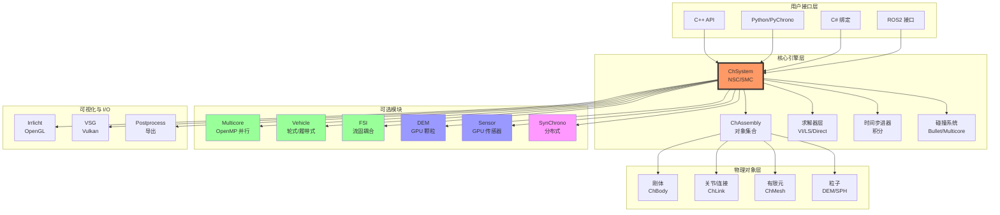
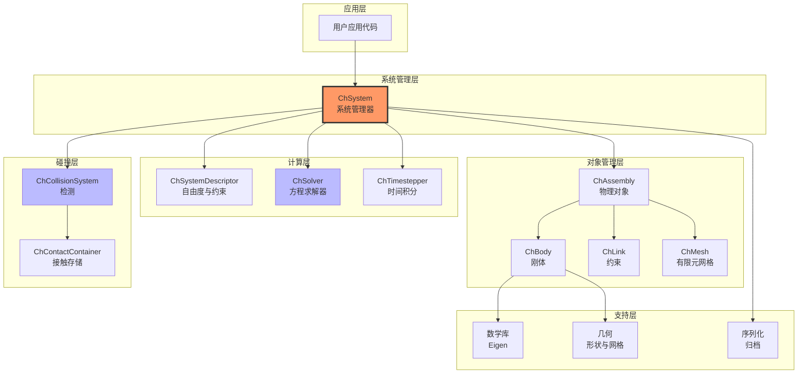
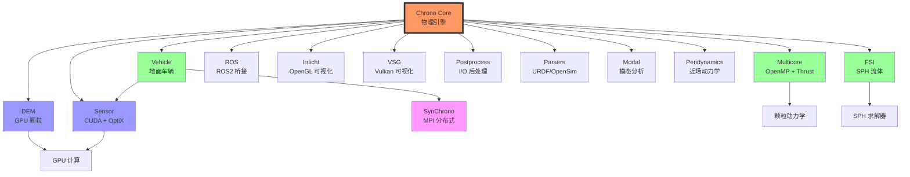
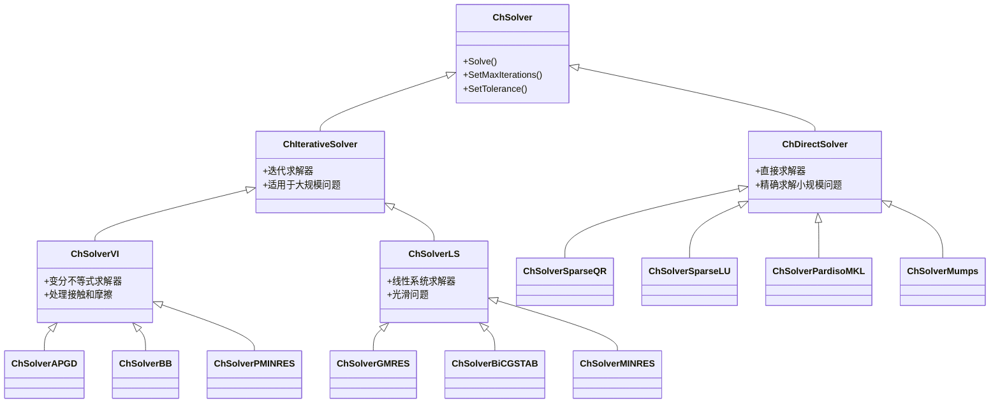
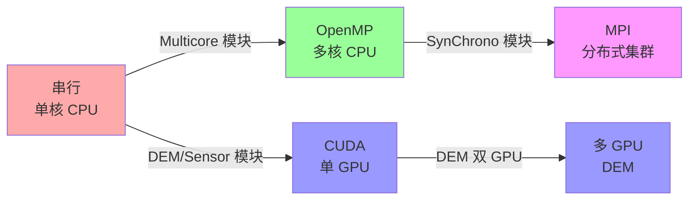
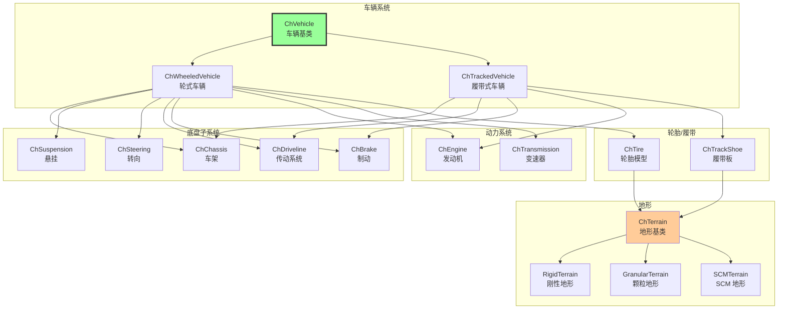
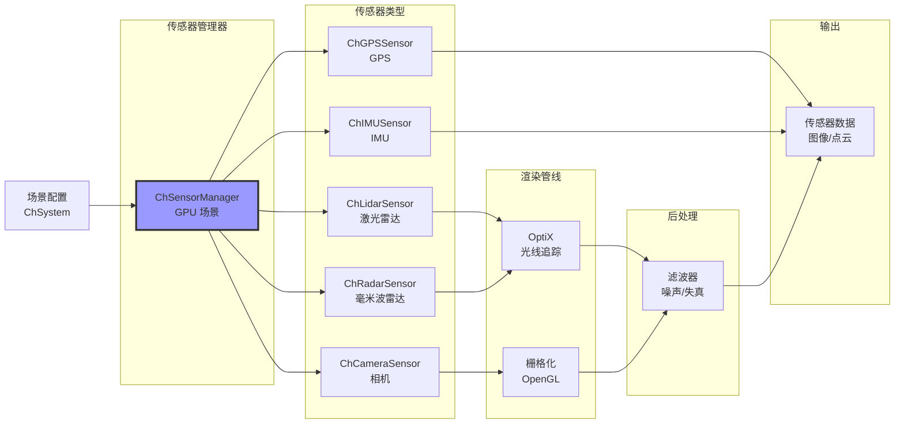
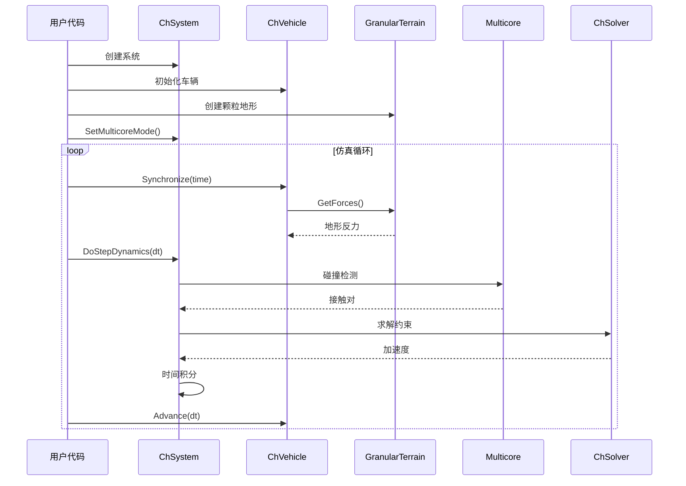
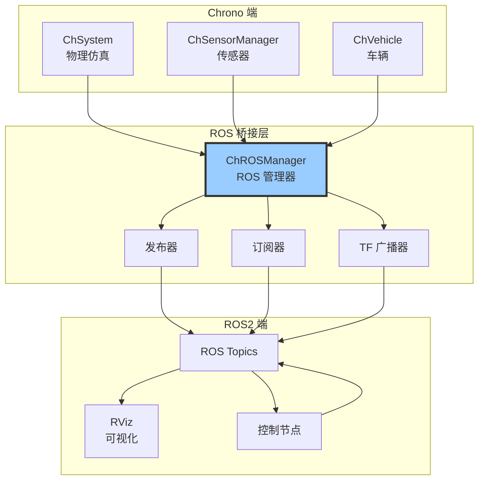

# Chrono 架构图表

本文档包含展示 Project Chrono 架构的可视化图表。

## 整体系统架构

## 核心物理引擎栈

## 模块依赖图

## 求解器层次结构

## 并行化策略

## 车辆模块架构

## 传感器模块管线

## 典型工作流：颗粒地形上的车辆

## ROS 集成架构

---

**说明**：所有图表使用 Mermaid 格式，可在 GitHub、GitLab、VS Code（需扩展）或 [mermaid.live](https://mermaid.live) 上查看。
