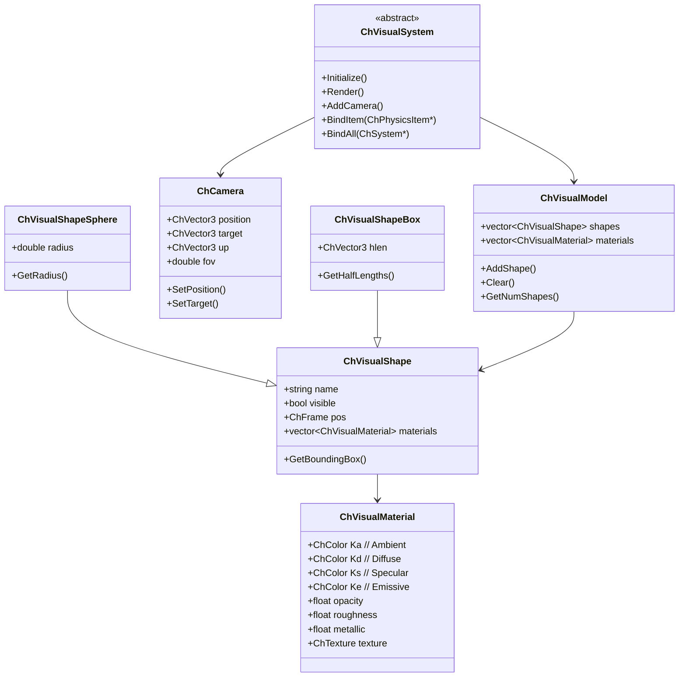
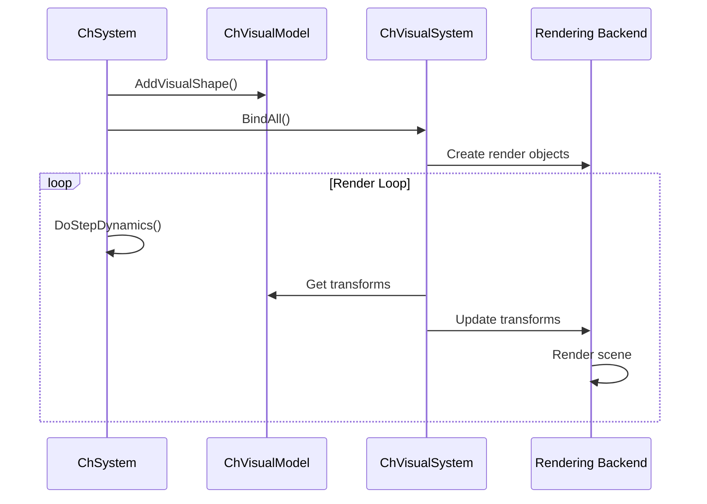

# Assets Module Architecture Analysis

## Overview

The `src/chrono/assets` folder contains the visualization and rendering infrastructure for Chrono. It provides visual shapes, materials, textures, cameras, and the abstract visualization system interface that connects to rendering backends (Irrlicht, VSG, OpenGL, etc.).

## Main Functionality

### Primary Responsibilities
1. **Visual Shapes**: Geometric primitives for visualization (separate from collision)
2. **Visual Models**: Collections of shapes attached to physics objects
3. **Materials**: Surface appearance (color, texture, reflectance)
4. **Cameras**: Virtual camera definitions
5. **Visualization System**: Abstract interface for rendering backends
6. **Glyphs**: Visual markers and symbols

## Design Characteristics

### Architecture Patterns
- **Composite Pattern**: Visual models contain multiple shapes
- **Bridge Pattern**: Visual system abstracts rendering backend
- **Decorator Pattern**: Materials decorate shapes
- **Strategy Pattern**: Different shape representations
- **Visitor Pattern**: Shape traversal for rendering

### Performance Considerations
- **Level of Detail (LOD)**: Future support for different detail levels
- **Instance Rendering**: Shared shape data for multiple instances
- **Culling Ready**: Bounding boxes for frustum culling
- **Deferred Updates**: Visual updates decoupled from physics
- **Backend Optimization**: Actual rendering delegated to specialized engines

## File Structure and Relationships

### Core Visual Classes
```
ChVisualSystem.h/cpp        - Abstract visualization backend
ChVisualModel.h/cpp         - Collection of visual shapes
ChVisualShape.h/cpp         - Base visual shape class
ChCamera.h/cpp              - Camera definition
```

### Visual Shapes (Primitives)
```
ChVisualShapeBox.h/cpp              - Box shape
ChVisualShapeSphere.h/cpp           - Sphere shape
ChVisualShapeCylinder.h/cpp         - Cylinder shape
ChVisualShapeCone.h/cpp             - Cone shape
ChVisualShapeCapsule.h/cpp          - Capsule shape
ChVisualShapeEllipsoid.h/cpp        - Ellipsoid shape
ChVisualShapeBarrel.h/cpp           - Barrel shape
ChVisualShapeRoundedBox.h/cpp       - Box with rounded edges
ChVisualShapeRoundedCylinder.h/cpp  - Cylinder with rounded caps
```

### Advanced Shapes
```
ChVisualShapeTriangleMesh.h/cpp     - Triangle mesh
ChVisualShapeModelFile.h/cpp        - Load from file (OBJ, etc.)
ChVisualShapeLine.h/cpp             - Line shape
ChVisualShapePath.h/cpp             - Path/curve shape
ChVisualShapeSurface.h/cpp          - Parametric surface
ChVisualShapePointPoint.h/cpp       - Point-to-point connector
```

### FEA Visualization
```
ChVisualShapeFEA.h/cpp      - FEA mesh visualization
```

### Materials and Appearance
```
ChVisualMaterial.h/cpp      - Material properties (PBR-ready)
ChColor.h/cpp               - Color representation
ChColormap.h/cpp            - Color mapping for scalar fields
ChTexture.h/cpp             - Texture definition
```

### Glyphs and Markers
```
ChGlyphs.h/cpp              - Visual markers (arrows, points, etc.)
```

### Utility Header
```
ChVisualShapes.h            - Convenience header including all shapes
```

## Architecture Diagram

```mermaid
graph TB
    subgraph "Visualization System"
        VS[ChVisualSystem]
        VSI[ChVisualSystemIrrlicht]
        VSVSG[ChVisualSystemVSG]
        VSOGL[ChVisualSystemOpenGL]
    end
    
    subgraph "Visual Model"
        VM[ChVisualModel]
        VSHAPE[ChVisualShape]
    end
    
    subgraph "Shape Types"
        VSBOX[ChVisualShapeBox]
        VSSPH[ChVisualShapeSphere]
        VSCYL[ChVisualShapeCylinder]
        VSMESH[ChVisualShapeTriangleMesh]
        VSFILE[ChVisualShapeModelFile]
        VSFEA[ChVisualShapeFEA]
    end
    
    subgraph "Appearance"
        MAT[ChVisualMaterial]
        COLOR[ChColor]
        TEX[ChTexture]
        CMAP[ChColormap]
    end
    
    subgraph "Camera"
        CAM[ChCamera]
    end
    
    subgraph "Glyphs"
        GLYPH[ChGlyphs]
    end
    
    VSI --|> VS
    VSVSG --|> VS
    VSOGL --|> VS
    
    VM --> VSHAPE
    
    VSBOX --|> VSHAPE
    VSSPH --|> VSHAPE
    VSCYL --|> VSHAPE
    VSMESH --|> VSHAPE
    VSFILE --|> VSHAPE
    VSFEA --|> VSHAPE
    
    VSHAPE --> MAT
    MAT --> COLOR
    MAT --> TEX
    
    VS --> VM
    VS --> CAM
    
    style VS fill:#e1f5ff
    style VM fill:#ffe1f5
    style VSHAPE fill:#fff5e1
    style MAT fill:#e1ffe1
```

## Class Hierarchy



## Core External Interfaces

### 1. Visual System (ChVisualSystem.h)
```cpp
class ChApi ChVisualSystem {
public:
    // Lifecycle
    virtual void Initialize() = 0;
    virtual void Shutdown();
    
    // Rendering
    virtual void Render() = 0;
    virtual void BeginScene();
    virtual void EndScene();
    
    // Binding physics objects
    virtual void BindItem(std::shared_ptr<ChPhysicsItem> item);
    virtual void BindAll(std::shared_ptr<ChSystem> system);
    virtual void UnbindItem(std::shared_ptr<ChPhysicsItem> item);
    
    // Camera management
    virtual void AddCamera(std::shared_ptr<ChCamera> camera);
    virtual void SetCameraPosition(const ChVector3& pos);
    virtual void SetCameraTarget(const ChVector3& target);
    
    // Window management
    virtual void SetWindowSize(unsigned int width, unsigned int height);
    virtual void SetWindowTitle(const std::string& title);
    
    // Update
    virtual void UpdateFromPhysics();
    
    // Lights
    virtual void AddLight(const ChVector3& pos, 
                         const ChColor& color,
                         double intensity);
};
```

### 2. Visual Model (ChVisualModel.h)
```cpp
class ChApi ChVisualModel {
public:
    // Shape management
    void AddShape(std::shared_ptr<ChVisualShape> shape,
                 const ChFrame<>& frame = ChFrame<>());
    
    void RemoveShape(std::shared_ptr<ChVisualShape> shape);
    void Clear();
    
    // Access
    size_t GetNumShapes() const;
    std::shared_ptr<ChVisualShape> GetShape(size_t i);
    const ChFrame<>& GetShapeFrame(size_t i) const;
    
    // Material
    void AddMaterial(std::shared_ptr<ChVisualMaterial> mat);
    std::vector<std::shared_ptr<ChVisualMaterial>>& GetMaterials();
    
    // Bounding box
    ChAABB GetBoundingBox() const;
};
```

### 3. Visual Shape (ChVisualShape.h)
```cpp
class ChApi ChVisualShape {
public:
    // Visibility
    void SetVisible(bool visible);
    bool IsVisible() const;
    
    // Name/tag
    void SetName(const std::string& name);
    const std::string& GetName() const;
    
    // Material
    void SetMaterial(size_t i, std::shared_ptr<ChVisualMaterial> mat);
    void AddMaterial(std::shared_ptr<ChVisualMaterial> mat);
    std::vector<std::shared_ptr<ChVisualMaterial>>& GetMaterials();
    
    // Bounding box
    virtual ChAABB GetBoundingBox() const = 0;
    
    // Color (convenience)
    void SetColor(const ChColor& color);
    void SetOpacity(float opacity);
    void SetTexture(const std::string& texture_file);
};

// Specific shapes
class ChApi ChVisualShapeSphere : public ChVisualShape {
public:
    ChVisualShapeSphere(double radius);
    double GetRadius() const;
    void SetRadius(double radius);
};

class ChApi ChVisualShapeBox : public ChVisualShape {
public:
    ChVisualShapeBox(double hx, double hy, double hz);
    ChVisualShapeBox(const ChVector3& hlengths);
    const ChVector3& GetHalfLengths() const;
};
```

### 4. Visual Material (ChVisualMaterial.h)
```cpp
class ChApi ChVisualMaterial {
public:
    // Classic Phong material
    void SetAmbientColor(const ChColor& color);
    void SetDiffuseColor(const ChColor& color);
    void SetSpecularColor(const ChColor& color);
    void SetEmissiveColor(const ChColor& color);
    
    ChColor GetAmbientColor() const;
    ChColor GetDiffuseColor() const;
    
    // PBR properties
    void SetRoughness(float roughness);    // 0-1
    void SetMetallic(float metallic);      // 0-1
    float GetRoughness() const;
    float GetMetallic() const;
    
    // Opacity
    void SetOpacity(float opacity);        // 0-1
    float GetOpacity() const;
    
    // Texture
    void SetKdTexture(const std::string& filename);
    void SetNormalMapTexture(const std::string& filename);
    void SetMetallicTexture(const std::string& filename);
    void SetRoughnessTexture(const std::string& filename);
    
    std::string GetKdTexture() const;
    
    // Presets
    static std::shared_ptr<ChVisualMaterial> Default();
    static std::shared_ptr<ChVisualMaterial> DefaultMetal();
    static std::shared_ptr<ChVisualMaterial> DefaultPlastic();
};
```

### 5. Camera (ChCamera.h)
```cpp
class ChApi ChCamera {
public:
    // Construction
    ChCamera();
    
    // Position and orientation
    void SetPosition(const ChVector3& pos);
    void SetTarget(const ChVector3& target);
    void SetUpVector(const ChVector3& up);
    
    ChVector3 GetPosition() const;
    ChVector3 GetTarget() const;
    ChVector3 GetUpVector() const;
    
    // Projection
    void SetFOV(double fov_degrees);
    void SetAspectRatio(double aspect);
    void SetNearClipDistance(double near_clip);
    void SetFarClipDistance(double far_clip);
    
    double GetFOV() const;
    
    // View matrix
    ChMatrix33<> GetRotationMatrix() const;
    ChFrame<> GetFrame() const;
};
```

### 6. Glyphs (ChGlyphs.h)
```cpp
class ChApi ChGlyphs {
public:
    enum class Type {
        POINT,
        VECTOR,
        COORDSYS,
        TENSOR
    };
    
    // Reserve space
    void Reserve(size_t n);
    
    // Add glyphs
    void SetGlyphPoint(size_t i, 
                      const ChVector3& pos,
                      const ChColor& color = ChColor(1,1,1));
    
    void SetGlyphVector(size_t i,
                       const ChVector3& pos,
                       const ChVector3& dir,
                       const ChColor& color = ChColor(1,0,0));
    
    void SetGlyphCoordsys(size_t i,
                         const ChCoordsys<>& csys);
    
    // Configuration
    void SetDrawMode(Type type);
    void SetGlyphsSize(double size);
    void SetZbufferHide(bool hide);
};
```

## Dependencies

### External Dependencies
- **None**: Assets module is independent of rendering backends

### Internal Dependencies
- **core**: ChVector3, ChColor, ChFrame for geometry and transforms
- **geometry**: ChTriangleMesh for mesh shapes
- **physics**: ChPhysicsItem for binding visual models

### Usage by Other Modules
- **chrono_irrlicht**: Implements ChVisualSystemIrrlicht
- **chrono_vsg**: Implements ChVisualSystemVSG  
- **chrono_opengl**: Implements ChVisualSystemOpenGL
- **chrono_sensor**: Uses visual shapes for sensor simulation

## Key Design Decisions

### 1. Separation from Collision
**Decision**: Completely separate visual and collision shapes
**Rationale**:
- Visual detail independent of collision complexity
- Different LODs for visualization and collision
- Simplified collision shapes for performance
- Detailed visual shapes for aesthetics

### 2. Abstract Visual System
**Decision**: ChVisualSystem is abstract interface
**Rationale**:
- Support multiple rendering backends
- No dependency on specific graphics library
- Easy to add new visualization systems
- Physics engine independent of visualization

### 3. Material System
**Decision**: Support both classic Phong and modern PBR
**Rationale**:
- Backward compatibility with Phong
- Modern rendering with PBR (metallic/roughness)
- Flexibility for different backends
- Texture support for detailed appearance

### 4. Visual Model as Container
**Decision**: ChVisualModel contains multiple shapes
**Rationale**:
- Complex objects from primitives
- Independent materials per shape
- Efficient rendering (batch similar shapes)
- Clear ownership and lifetime

### 5. Deferred Updates
**Decision**: Visual updates separate from physics updates
**Rationale**:
- Physics and rendering at different rates
- Interpolation possible for smooth rendering
- Reduced coupling between systems
- Better performance characteristics

## Performance Characteristics

### Strengths
1. **Lightweight Core**: Assets module has minimal overhead
2. **Instance Rendering**: Shared geometry data
3. **Culling Ready**: Bounding boxes computed
4. **Deferred Loading**: Meshes loaded on demand
5. **Backend Optimization**: Actual rendering optimized per backend

### Considerations
1. **Large Meshes**: High polygon count impacts rendering
2. **Many Objects**: Scene complexity affects frame rate
3. **Texture Size**: Large textures consume memory
4. **Material Switches**: Frequent material changes slow rendering
5. **Transparency**: Alpha blending requires sorting

## Typical Usage Patterns

### Adding Visual Shapes to Body
```cpp
// Create body
auto body = chrono_types::make_shared<ChBody>();

// Add visual box
auto box_shape = chrono_types::make_shared<ChVisualShapeBox>(1.0, 0.5, 2.0);
box_shape->SetColor(ChColor(0.6f, 0.3f, 0.3f));
body->AddVisualShape(box_shape, ChFrame<>(ChVector3(0, 0, 0)));

// Add visual sphere
auto sphere_shape = chrono_types::make_shared<ChVisualShapeSphere>(0.3);
sphere_shape->SetColor(ChColor(0.3f, 0.3f, 0.6f));
body->AddVisualShape(sphere_shape, ChFrame<>(ChVector3(0, 1, 0)));

system.AddBody(body);
```

### Loading Mesh from File
```cpp
auto mesh_shape = chrono_types::make_shared<ChVisualShapeModelFile>();
mesh_shape->SetFilename("path/to/model.obj");
mesh_shape->SetScale(ChVector3(0.01, 0.01, 0.01));  // Scale if needed
body->AddVisualShape(mesh_shape);
```

### Custom Material
```cpp
auto material = chrono_types::make_shared<ChVisualMaterial>();
material->SetDiffuseColor(ChColor(0.8f, 0.2f, 0.2f));
material->SetSpecularColor(ChColor(1.0f, 1.0f, 1.0f));
material->SetRoughness(0.3f);
material->SetMetallic(0.8f);
material->SetKdTexture("texture.png");

box_shape->AddMaterial(material);
```

### Setting Up Visualization System
```cpp
// Create visualization system (e.g., Irrlicht)
auto vis = chrono_types::make_shared<ChVisualSystemIrrlicht>();
vis->AttachSystem(&system);
vis->SetWindowSize(1280, 720);
vis->SetWindowTitle("Chrono Simulation");
vis->Initialize();

// Add camera
auto camera = chrono_types::make_shared<ChCamera>();
camera->SetPosition(ChVector3(0, 5, -10));
camera->SetTarget(ChVector3(0, 0, 0));
vis->AddCamera(camera);

// Add lights
vis->AddLight(ChVector3(10, 10, 10), ChColor(1, 1, 1), 100);

// Render loop
while (vis->Run()) {
    vis->BeginScene();
    vis->Render();
    vis->EndScene();
    system.DoStepDynamics(0.01);
}
```

### FEA Visualization
```cpp
// Visualize FEA mesh
auto fea_shape = chrono_types::make_shared<ChVisualShapeFEA>(mesh);
fea_shape->SetFEMdataType(ChVisualShapeFEA::DataType::SURFACE);
fea_shape->SetSmoothFaces(true);
fea_shape->SetWireframe(false);

// Color by strain
fea_shape->SetFEMglyphType(ChVisualShapeFEA::GlyphType::NODE_CSYS);
fea_shape->SetColorscaleMinMax(0.0, 0.1);

mesh->AddVisualShapeFEA(fea_shape);
```

### Glyphs for Debugging
```cpp
// Create glyphs for forces
auto glyphs = chrono_types::make_shared<ChGlyphs>();
glyphs->SetDrawMode(ChGlyphs::Type::VECTOR);
glyphs->SetGlyphsSize(0.1);

// Update each frame
for (size_t i = 0; i < forces.size(); i++) {
    glyphs->SetGlyphVector(i, positions[i], forces[i], 
                          ChColor(1, 0, 0));
}

body->AddVisualShape(glyphs);
```

## Visual Shape Types and Use Cases

### Primitive Shapes (Fast)
- **Sphere**: Particles, balls, joints
- **Box**: Crates, buildings, platforms
- **Cylinder**: Pillars, wheels, shafts
- **Capsule**: Robot links, rounded obstacles
- **Cone**: Markers, spotlights

### Compound Shapes
- **Multiple Primitives**: Complex objects from simple shapes
- **Mesh + Primitives**: Detailed model with simplified collision

### Mesh Shapes (Detailed but Expensive)
- **Triangle Mesh**: Detailed geometry, terrain
- **Model Files**: CAD models, scanned objects
- **FEA Meshes**: Deformable structures

### Special Shapes
- **Line/Path**: Trajectories, connections
- **Surface**: Parametric surfaces, terrain
- **Glyphs**: Forces, moments, coordinate systems

## Color and Material Examples

### Solid Colors
```cpp
// Red plastic
auto mat = chrono_types::make_shared<ChVisualMaterial>();
mat->SetDiffuseColor(ChColor(0.8f, 0.2f, 0.2f));
mat->SetRoughness(0.5f);
mat->SetMetallic(0.0f);
```

### Metallic Materials
```cpp
// Gold
auto mat = chrono_types::make_shared<ChVisualMaterial>();
mat->SetDiffuseColor(ChColor(1.0f, 0.84f, 0.0f));
mat->SetRoughness(0.2f);
mat->SetMetallic(1.0f);
```

### Textured Materials
```cpp
// Brick texture
auto mat = chrono_types::make_shared<ChVisualMaterial>();
mat->SetKdTexture("brick_diffuse.png");
mat->SetNormalMapTexture("brick_normal.png");
mat->SetRoughness(0.8f);
```

## Integration with Rendering Backends



## Best Practices

### 1. Shape Complexity
- Use primitives when possible for better performance
- Reserve meshes for objects needing visual detail
- Consider LOD for distant objects

### 2. Material Usage
- Reuse materials across similar objects
- Minimize material switches during rendering
- Use texture atlases to reduce state changes

### 3. Transparency
- Minimize transparent objects (expensive)
- Use alpha testing for sharp edges (cheaper than blending)
- Ensure proper rendering order for transparency

### 4. Update Frequency
- Physics updates independent of rendering
- Interpolate positions for smooth 60fps rendering from 100Hz physics
- Update visual models only when needed

## Summary

The assets module provides:
- Flexible visual representation independent of collision
- Support for both simple primitives and complex meshes
- Modern PBR material system alongside classic Phong
- Abstract visualization interface for multiple backends
- Efficient scene representation for rendering optimization

Its design emphasizes separation of concerns between physics and visualization, enabling flexible rendering solutions and performance optimization while maintaining ease of use for common visualization tasks.
