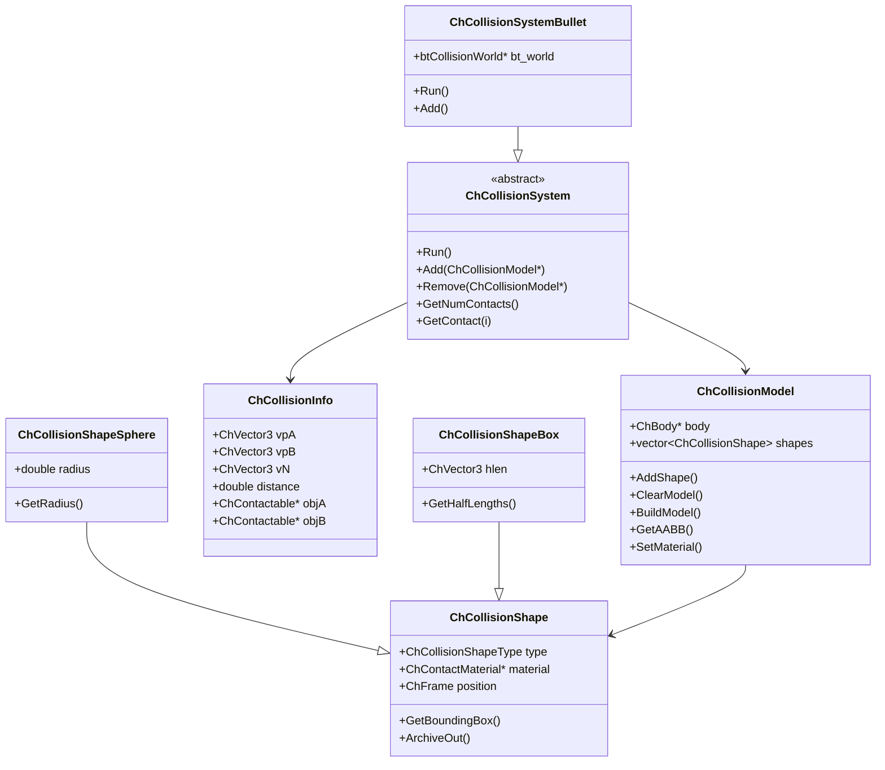
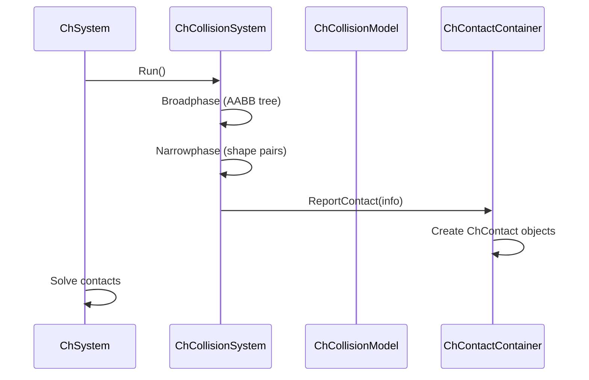

# Collision Module Architecture Analysis

## Overview

The `src/chrono/collision` folder implements the collision detection system for Chrono, providing a flexible architecture for detecting contacts between various geometric shapes. The module includes shape definitions, collision models, and integration with the Bullet physics library for broadphase and narrowphase collision detection.

## Main Functionality

### Primary Responsibilities
1. **Collision Shapes**: Geometric primitives for collision detection (box, sphere, cylinder, etc.)
2. **Collision Models**: Per-body collections of collision shapes
3. **Collision System**: Orchestrates broadphase and narrowphase detection
4. **Contact Reporting**: Generates contact pairs with geometric information
5. **Bullet Integration**: Wrapper around Bullet collision detection library
6. **Material Properties**: Surface properties for contact generation

## Design Characteristics

### Architecture Patterns
- **Strategy Pattern**: Different collision backends (Bullet, multicore)
- **Composite Pattern**: Collision models contain multiple shapes
- **Factory Pattern**: Shape creation with type-specific parameters
- **Adapter Pattern**: Bullet library integration through adapters
- **Visitor Pattern**: Shape-specific collision algorithms

### Performance Considerations
- **Broadphase Optimization**: Spatial partitioning (AABB tree, sweep-and-prune)
- **Shape Caching**: Collision shapes shared across instances
- **Lazy Updates**: AABB updates only when needed
- **Memory Pooling**: Reusable contact point storage
- **SIMD Support**: Vectorized operations in Bullet backend

## File Structure and Relationships

### Core Collision Classes
```
ChCollisionSystem.h/cpp         - Abstract collision system interface
ChCollisionModel.h/cpp          - Per-body collision representation
ChCollisionShape.h/cpp          - Base collision shape class
ChCollisionInfo.h               - Contact point information
ChCollisionPair.h               - Pair of colliding objects
```

### Shape Hierarchy (Primitives)
```
ChCollisionShapeBox.h/cpp           - Axis-aligned box
ChCollisionShapeSphere.h/cpp        - Sphere
ChCollisionShapeCylinder.h/cpp      - Cylinder
ChCollisionShapeCone.h/cpp          - Cone
ChCollisionShapeCapsule.h/cpp       - Capsule (rounded cylinder)
ChCollisionShapeEllipsoid.h/cpp     - Ellipsoid
ChCollisionShapeBarrel.h/cpp        - Barrel shape
```

### Advanced Shapes
```
ChCollisionShapeConvexHull.h/cpp    - Arbitrary convex polyhedron
ChCollisionShapeTriangleMesh.h/cpp  - Triangle mesh (concave)
ChCollisionShapeMeshTriangle.h/cpp  - Single triangle
ChCollisionShapePath2D.h/cpp        - 2D path/curve
ChCollisionShapeArc2D.h/cpp         - 2D arc segment
ChCollisionShapeSegment.h/cpp       - Line segment
ChCollisionShapeSegment2D.h/cpp     - 2D line segment
ChCollisionShapePoint.h/cpp         - Point shape
```

### Rounded Shapes
```
ChCollisionShapeRoundedBox.h/cpp        - Box with rounded edges
ChCollisionShapeRoundedCylinder.h/cpp   - Cylinder with rounded caps
```

### Special Shapes
```
ChCollisionShapeCylindricalShell.h/cpp  - Hollow cylinder surface
ChCollisionShapeTetrahedron.h/cpp       - Tetrahedron
```

### Bullet Integration
```
bullet/ChCollisionSystemBullet.h/cpp    - Bullet-based system
bullet/ChCollisionModelBullet.h/cpp     - Bullet collision model
bullet/ChCollisionAlgorithmsBullet.h/cpp - Custom algorithms
bullet/cbtMultiBodyConstraintSolver.h/cpp - Multibody solver
bullet/cbtBulletCollision*.h            - Modified Bullet headers
```

## Architecture Diagram

```mermaid
graph TB
    subgraph "Collision System Layer"
        CS[ChCollisionSystem]
        CSB[ChCollisionSystemBullet]
        CSM[ChCollisionSystemMulticore]
    end
    
    subgraph "Model Layer"
        CM[ChCollisionModel]
        CMB[ChCollisionModelBullet]
        CMM[ChCollisionModelMulticore]
    end
    
    subgraph "Shape Layer"
        SHAPE[ChCollisionShape]
        BOX[ChCollisionShapeBox]
        SPH[ChCollisionShapeSphere]
        CYL[ChCollisionShapeCylinder]
        CAPS[ChCollisionShapeCapsule]
        HULL[ChCollisionShapeConvexHull]
        MESH[ChCollisionShapeTriangleMesh]
    end
    
    subgraph "Contact Information"
        INFO[ChCollisionInfo]
        PAIR[ChCollisionPair]
    end
    
    subgraph "External Libraries"
        BULLET[Bullet3]
    end
    
    CSB --|> CS
    CSM --|> CS
    
    CMB --|> CM
    CMM --|> CM
    
    BOX --|> SHAPE
    SPH --|> SHAPE
    CYL --|> SHAPE
    CAPS --|> SHAPE
    HULL --|> SHAPE
    MESH --|> SHAPE
    
    CS --> CM
    CM --> SHAPE
    CS --> INFO
    CS --> PAIR
    
    CSB --> BULLET
    CMB --> BULLET
    
    style CS fill:#e1f5ff
    style CM fill:#ffe1f5
    style SHAPE fill:#fff5e1
    style BULLET fill:#e1ffe1
```

## Class Hierarchy



## Core External Interfaces

### 1. Collision System (ChCollisionSystem.h)
```cpp
class ChApi ChCollisionSystem {
public:
    // Collision detection
    virtual void Run() = 0;
    virtual void Clear() = 0;
    
    // Model management
    virtual void Add(std::shared_ptr<ChCollisionModel> model) = 0;
    virtual void Remove(std::shared_ptr<ChCollisionModel> model) = 0;
    
    // Contact retrieval
    virtual int GetNumContacts() const = 0;
    virtual const ChCollisionInfo& GetContact(int i) const = 0;
    
    // Configuration
    virtual void SetNumThreads(int num_threads);
    virtual void SetBroadphaseGridSize(int size);
    
    // Visualization
    virtual void Visualize(int flags);
};
```

### 2. Collision Model (ChCollisionModel.h)
```cpp
class ChApi ChCollisionModel {
public:
    // Shape management
    bool AddBox(double hx, double hy, double hz,
                const ChVector3& pos = VNULL,
                const ChMatrix33<>& rot = ChMatrix33<>(1));
    
    bool AddSphere(double radius,
                   const ChVector3& pos = VNULL);
    
    bool AddCylinder(double rx, double ry, double rz,
                     const ChVector3& pos = VNULL,
                     const ChMatrix33<>& rot = ChMatrix33<>(1));
    
    bool AddConvexHull(const std::vector<ChVector3>& points,
                       const ChVector3& pos = VNULL,
                       const ChMatrix33<>& rot = ChMatrix33<>(1));
    
    bool AddTriangleMesh(std::shared_ptr<ChTriangleMesh> trimesh,
                         bool is_static,
                         bool is_convex,
                         const ChVector3& pos = VNULL,
                         const ChMatrix33<>& rot = ChMatrix33<>(1));
    
    // Model lifecycle
    virtual void ClearModel() = 0;
    virtual void BuildModel() = 0;
    
    // Material
    void SetMaterial(std::shared_ptr<ChContactMaterial> mat);
    std::shared_ptr<ChContactMaterial> GetMaterial() const;
    
    // Queries
    virtual void GetAABB(ChVector3& bbmin, ChVector3& bbmax) const = 0;
    int GetNumShapes() const;
    std::shared_ptr<ChCollisionShape> GetShape(int index);
    
    // Enable/disable
    void SetCollisionEnabled(bool enable);
    bool GetCollisionEnabled() const;
};
```

### 3. Collision Shape (ChCollisionShape.h)
```cpp
class ChApi ChCollisionShape {
public:
    // Type information
    ChCollisionShapeType GetType() const;
    
    // Transform
    const ChFrame<>& GetPosition() const;
    void SetPosition(const ChFrame<>& frame);
    
    // Material
    void SetMaterial(std::shared_ptr<ChContactMaterial> mat);
    std::shared_ptr<ChContactMaterial> GetMaterial() const;
    
    // Bounding box
    virtual ChAABB GetBoundingBox() const = 0;
    
    // Serialization
    virtual void ArchiveOut(ChArchiveOut& archive_out);
    virtual void ArchiveIn(ChArchiveIn& archive_in);
};

// Specific shape types
class ChApi ChCollisionShapeSphere : public ChCollisionShape {
public:
    ChCollisionShapeSphere(double radius);
    double GetRadius() const;
};

class ChApi ChCollisionShapeBox : public ChCollisionShape {
public:
    ChCollisionShapeBox(double hx, double hy, double hz);
    ChVector3 GetHalfLengths() const;
};

class ChApi ChCollisionShapeCylinder : public ChCollisionShape {
public:
    ChCollisionShapeCylinder(double rx, double ry, double rz);
    ChVector3 GetRadii() const;
};
```

### 4. Contact Information (ChCollisionInfo.h)
```cpp
struct ChApi ChCollisionInfo {
    // Contact geometry
    ChVector3 vpA;          // Point on object A
    ChVector3 vpB;          // Point on object B
    ChVector3 vN;           // Normal from B to A
    double distance;        // Penetration depth (negative if penetrating)
    
    // Contact objects
    ChContactable* objA;    // First contactable object
    ChContactable* objB;    // Second contactable object
    
    // Shape information
    ChCollisionShape* shapeA;
    ChCollisionShape* shapeB;
    
    // Friction/restitution override
    float eff_radius;       // Effective contact radius
};
```

### 5. Bullet System (ChCollisionSystemBullet.h)
```cpp
class ChApi ChCollisionSystemBullet : public ChCollisionSystem {
public:
    // Construction
    ChCollisionSystemBullet();
    
    // Collision detection
    void Run() override;
    void Clear() override;
    
    // Configuration
    void SetBroadphaseType(BroadphaseType type);
    enum BroadphaseType {
        AXIS_SWEEP_3,
        DYNAMIC_AABB_TREE,
        SIMPLE_BROADPHASE
    };
    
    // Narrow phase
    void SetNarrowphaseAlgorithm(CollisionShapeType typeA,
                                 CollisionShapeType typeB,
                                 btCollisionAlgorithm* algo);
    
    // Bullet access
    btCollisionWorld* GetBulletWorld();
    btCollisionConfiguration* GetBulletConfiguration();
};
```

## Dependencies

### External Dependencies
- **Bullet3**: Core collision detection library
  - btCollisionWorld: Main collision world
  - btBroadphaseInterface: Spatial partitioning
  - btCollisionAlgorithm: Narrowphase detection
  - btCollisionShape: Shape representations

### Internal Dependencies
- **core**: ChVector3, ChQuaternion, ChFrame for geometry
- **geometry**: ChTriangleMesh for mesh shapes
- **physics**: ChContactMaterial for surface properties
- **physics**: ChContactable interface for collision callbacks

### Usage by Other Modules
- **physics**: ChSystem uses collision system for contact detection
- **vehicle**: Terrain collision with vehicle components
- **fea**: FEA mesh collision detection
- **particlefactory**: Particle-particle and particle-boundary collisions

## Key Design Decisions

### 1. Pluggable Collision Backend
**Decision**: Abstract ChCollisionSystem with multiple implementations
**Rationale**:
- Bullet: General-purpose, mature, feature-rich
- Multicore: Optimized for parallel execution
- Custom: Application-specific optimizations
- Allows benchmarking and comparison

### 2. Shape-Material Association
**Decision**: Each shape can have its own material
**Rationale**:
- Supports multi-material bodies
- Enables heterogeneous contact properties
- Simplifies per-feature material assignment

### 3. Two-Phase Build Process
**Decision**: ClearModel() → AddShape() → BuildModel()
**Rationale**:
- Allows batch shape addition
- Enables backend optimization
- Separates construction from compilation

### 4. Bullet Wrapper Design
**Decision**: Thin wrapper around Bullet with custom algorithms
**Rationale**:
- Leverages mature Bullet broadphase
- Adds Chrono-specific shapes
- Maintains performance of native Bullet
- Allows custom contact generation

### 5. Contact Information Structure
**Decision**: Lightweight ChCollisionInfo struct
**Rationale**:
- Efficient contact reporting
- Decouples collision from contact mechanics
- Enables post-processing and filtering

## Performance Characteristics

### Strengths
1. **Broadphase Efficiency**: Bullet's AABB tree is highly optimized
2. **SIMD Acceleration**: Bullet uses vectorized operations
3. **Spatial Partitioning**: Efficient culling of distant objects
4. **Shape Caching**: Convex hulls and meshes computed once
5. **Parallel Detection**: Multicore backend supports threading

### Considerations
1. **Triangle Mesh Cost**: Mesh-mesh collision is expensive
2. **Contact Generation**: Many shapes create many contacts
3. **Memory Usage**: Large meshes consume significant memory
4. **Update Cost**: Moving objects require AABB updates
5. **Narrowphase Overhead**: Complex shapes have higher collision cost

## Common Collision Patterns

### Setting Up Collision Model
```cpp
// Create body with collision
auto body = chrono_types::make_shared<ChBody>();
body->EnableCollision(true);

// Build collision model
body->GetCollisionModel()->ClearModel();
body->GetCollisionModel()->AddBox(1.0, 0.5, 2.0);
body->GetCollisionModel()->AddSphere(0.3, ChVector3(0, 1, 0));
body->GetCollisionModel()->BuildModel();

// Set material
auto material = chrono_types::make_shared<ChContactMaterialNSC>();
material->SetFriction(0.6f);
body->GetCollisionModel()->SetMaterial(material);
```

### Using Convex Hull
```cpp
std::vector<ChVector3> points = {/* vertex data */};
body->GetCollisionModel()->ClearModel();
body->GetCollisionModel()->AddConvexHull(points);
body->GetCollisionModel()->BuildModel();
```

### Triangle Mesh Collision
```cpp
auto trimesh = chrono_types::make_shared<ChTriangleMesh>();
// ... populate triangle mesh ...

body->GetCollisionModel()->ClearModel();
body->GetCollisionModel()->AddTriangleMesh(
    trimesh,
    true,   // is_static
    false,  // is_convex
    ChVector3(0, 0, 0),
    ChMatrix33<>(1)
);
body->GetCollisionModel()->BuildModel();
```

### Custom Collision System
```cpp
// Use specific collision backend
auto collision_sys = chrono_types::make_shared<ChCollisionSystemBullet>();
collision_sys->SetBroadphaseType(
    ChCollisionSystemBullet::DYNAMIC_AABB_TREE);

// Assign to system
system.SetCollisionSystem(collision_sys);
```

## Shape Types and Use Cases

### Primitive Shapes (Fast)
- **Box**: Crates, walls, platforms
- **Sphere**: Balls, wheels, particles
- **Cylinder**: Pillars, shafts, wheels
- **Capsule**: Rounded obstacles, robot links

### Advanced Shapes (Moderate Cost)
- **Convex Hull**: Arbitrary convex objects
- **Rounded Shapes**: Smooth collision response
- **Ellipsoid**: Deformed spheres

### Complex Shapes (Expensive)
- **Triangle Mesh**: Detailed geometry, terrain
- **2D Paths**: Curves and arcs (for specialized applications)

## Integration with Contact System



## Advanced Features

### 1. Custom Collision Algorithms
```cpp
// Register custom algorithm for specific shape pairs
collision_system->SetNarrowphaseAlgorithm(
    ChCollisionShapeType::SPHERE,
    ChCollisionShapeType::BOX,
    custom_algorithm
);
```

### 2. Collision Families/Groups
```cpp
// Set collision family
body->GetCollisionModel()->SetFamily(2);
body->GetCollisionModel()->DisallowCollisionsWith(1);

// Bodies in family 2 won't collide with family 1
```

### 3. Ghost Objects
```cpp
// Create ghost collision object (no dynamics)
auto ghost = chrono_types::make_shared<ChCollisionModelBullet>();
ghost->AddBox(10, 1, 10);
ghost->SetGhostObject(true);
collision_system->Add(ghost);
```

## Bullet Integration Details

### Modified Bullet Components
The module includes customized Bullet files (prefixed with `cbt`):
- **cbtMultiBodyConstraintSolver**: Custom solver integration
- **cbtBulletCollisionCommon.h**: Adapted headers
- Custom collision algorithms for Chrono-specific shapes

### Bullet Configuration
```cpp
// Bullet uses:
// - btDbvtBroadphase: Dynamic AABB tree broadphase
// - btDefaultCollisionConfiguration: Standard configuration
// - btCollisionDispatcher: Collision algorithm dispatcher
// - Custom algorithms for Chrono shapes
```

## Limitations and Considerations

### Current Limitations
1. **Mesh-Mesh**: Very expensive for moving meshes
2. **Concave Shapes**: Limited support, require decomposition
3. **Continuous Collision**: Not fully supported for all shapes
4. **Deformable Collision**: Limited FEA collision support

### Best Practices
1. Use primitive shapes when possible
2. Decompose concave meshes into convex hulls
3. Use static meshes for terrain/environment
4. Limit number of contact points per pair
5. Consider collision families for selective detection

## Summary

The collision module provides:
- Comprehensive shape library from primitives to meshes
- Flexible architecture supporting multiple backends
- Efficient Bullet-based collision detection
- Material-per-shape contact properties
- Integration with Chrono's contact mechanics

Its design emphasizes performance through spatial partitioning, caching, and SIMD operations while maintaining flexibility through abstract interfaces and pluggable backends.
