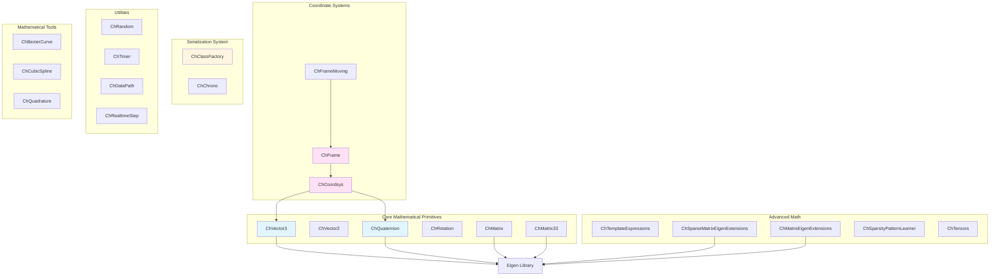
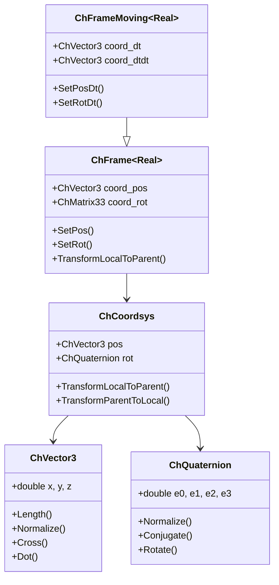

# Core Module Architecture Analysis

## Overview

The `src/chrono/core` folder contains the fundamental data structures and mathematical primitives that form the foundation of the entire Chrono physics engine. This module provides essential building blocks used throughout the codebase.

## Main Functionality

### Primary Responsibilities
1. **Mathematical Primitives**: Vectors, quaternions, matrices, and coordinate systems
2. **Serialization Infrastructure**: Class factory and registration system
3. **Utility Classes**: Random number generation, timers, data path management
4. **Template Expression Optimization**: Expression templates for efficient math operations
5. **Sparse Matrix Support**: Extensions for Eigen sparse matrix operations

## Design Characteristics

### Architecture Patterns
- **Value Semantics**: Most classes use value semantics for efficient copy and move operations
- **Template-Based Design**: Heavy use of C++ templates for type flexibility and compile-time optimization
- **Eigen Integration**: Tight integration with Eigen library for linear algebra
- **CRTP (Curiously Recurring Template Pattern)**: Used in ChFrame hierarchy for static polymorphism
- **Expression Templates**: Used for mathematical operations to eliminate temporary objects

### Performance Considerations
- **Header-Only Implementation**: Many classes are header-only for inlining and optimization
- **Alignment**: ChAlignedAllocator ensures proper memory alignment for SIMD operations
- **Zero-Cost Abstractions**: Template-based design allows abstraction without runtime overhead
- **Sparse Matrix Optimization**: Specialized sparse matrix extensions for large-scale problems

## File Structure and Relationships

### Core Data Types
```
ChVector3.h/cpp         - 3D vector (x, y, z)
ChVector2.h             - 2D vector (x, y)
ChQuaternion.h/cpp      - Quaternion for rotations
ChMatrix.h              - Generic matrix wrapper
ChMatrix33.h            - 3x3 rotation matrix
ChRotation.h/cpp        - Rotation representation
```

### Coordinate Systems
```
ChCoordsys.h/cpp        - Position + Rotation coordinate system
ChFrame.h               - Reference frame with position and orientation
ChFrameMoving.h         - Frame with velocity and acceleration
```

### Serialization
```
ChClassFactory.h/cpp    - Factory pattern for object creation
ChChrono.h              - Core type definitions and macros
```

### Utilities
```
ChRandom.h/cpp          - Random number generators
ChTimer.h               - High-precision timing
ChDataPath.h/cpp        - Data file path management
ChRealtimeStep.h        - Real-time step controller
```

### Mathematical Tools
```
ChBezierCurve.h/cpp     - Bezier curve utilities
ChCubicSpline.h/cpp     - Cubic spline interpolation
ChQuadrature.h/cpp      - Numerical integration
```

### Advanced Features
```
ChTemplateExpressions.h      - Expression templates for math ops
ChSparseMatrixEigenExtensions.h - Sparse matrix utilities
ChMatrixEigenExtensions.h    - Dense matrix utilities
ChSparsityPatternLearner.h   - Sparse pattern detection
ChTensors.h                  - Tensor operations
```

## Architecture Diagram



## Class Hierarchy



## Core External Interfaces

### 1. Vector Operations (ChVector3.h)
```cpp
class ChApi ChVector3 {
public:
    // Construction
    ChVector3(double x, double y, double z);
    
    // Basic operations
    double Length() const;
    ChVector3 GetNormalized() const;
    double Dot(const ChVector3& other) const;
    ChVector3 Cross(const ChVector3& other) const;
    
    // Operators
    ChVector3 operator+(const ChVector3& other) const;
    ChVector3 operator*(double scalar) const;
};
```

### 2. Quaternion Operations (ChQuaternion.h)
```cpp
class ChApi ChQuaternion {
public:
    // Construction
    ChQuaternion(double e0, double e1, double e2, double e3);
    static ChQuaternion FromAxisAngle(const ChVector3& axis, double angle);
    
    // Operations
    ChQuaternion GetConjugate() const;
    ChVector3 Rotate(const ChVector3& v) const;
    void Normalize();
    
    // Conversions
    ChMatrix33 GetRotMat() const;
};
```

### 3. Coordinate System (ChCoordsys.h)
```cpp
class ChCoordsys {
public:
    ChVector3 pos;
    ChQuaternion rot;
    
    // Transformations
    ChVector3 TransformLocalToParent(const ChVector3& local) const;
    ChVector3 TransformParentToLocal(const ChVector3& parent) const;
    
    // Composition
    ChCoordsys operator>>(const ChCoordsys& other) const;
};
```

### 4. Reference Frame (ChFrame.h)
```cpp
template <class Real = double>
class ChFrame {
public:
    // Position and orientation
    void SetPos(const ChVector3& pos);
    void SetRot(const ChQuaternion& rot);
    const ChVector3& GetPos() const;
    const ChMatrix33& GetRot() const;
    
    // Coordinate transformations
    ChVector3 TransformLocalToParent(const ChVector3& local) const;
    ChVector3 TransformDirectionLocalToParent(const ChVector3& dir) const;
};
```

### 5. Class Factory (ChClassFactory.h)
```cpp
class ChApi ChClassFactory {
public:
    // Register a class for serialization
    static void RegisterClass(const std::string& name, 
                              std::function<void*()> creator);
    
    // Create an instance by name
    static void* Create(const std::string& name);
    
    // Check if class is registered
    static bool IsClassRegistered(const std::string& name);
};
```

### 6. Random Number Generation (ChRandom.h)
```cpp
class ChApi ChRandom {
public:
    // Set seed
    static void SetSeed(unsigned int seed);
    
    // Generate random numbers
    static double GetRandom();  // [0, 1]
    static double GetRandom(double min, double max);
    static int GetRandomInt(int min, int max);
    
    // Distributions
    static double GetGaussianRandom(double mean, double stddev);
};
```

## Dependencies

### External Dependencies
- **Eigen3**: Core linear algebra library (required)
  - Used for matrix operations, decompositions, and numerical methods
  - ChVector3 and ChMatrix classes wrap Eigen types
  
### Internal Dependencies (within chrono)
- **chrono/serialization**: Archive system for object persistence
- **chrono/utils**: Constants and utility functions

### Usage by Other Modules
The core module is used by virtually all other modules in Chrono:
- **physics**: Uses ChVector3, ChQuaternion, ChFrame for body states
- **collision**: Uses geometric primitives for shape definitions
- **solver**: Uses matrix and vector classes for numerical computation
- **fea**: Uses coordinate systems for element definitions
- **geometry**: Uses mathematical primitives for geometric operations

## Key Design Decisions

### 1. Eigen Integration
**Decision**: Wrap Eigen types rather than inherit from them
**Rationale**: 
- Allows adding Chrono-specific methods
- Provides consistent API across different Eigen versions
- Enables serialization support

### 2. Template-Based Frames
**Decision**: Use templates for ChFrame with Real type parameter
**Rationale**:
- Supports both float and double precision
- Enables compile-time optimization
- Allows specialized implementations

### 3. Header-Only Math
**Decision**: Implement simple math operations in headers
**Rationale**:
- Enables aggressive compiler inlining
- Reduces function call overhead for hot paths
- Allows compiler to optimize across translation units

### 4. Value Semantics
**Decision**: Use value types for mathematical objects
**Rationale**:
- Natural syntax for mathematical expressions
- Enables move semantics and RVO
- Simplifies memory management

## Performance Characteristics

### Strengths
1. **Zero-Cost Abstractions**: Template-based design eliminates runtime overhead
2. **SIMD Friendly**: Proper alignment and data layout for vectorization
3. **Inlining**: Header-only implementation enables aggressive inlining
4. **Expression Templates**: Eliminate temporary objects in complex expressions

### Considerations
1. **Compilation Time**: Heavy template use increases compile time
2. **Code Size**: Template instantiation can increase binary size
3. **Debug Performance**: Template-heavy code can be slower in debug builds

## Usage Examples

### Creating and Manipulating Frames
```cpp
// Create a coordinate system
ChCoordsys csys(ChVector3(1, 2, 3), Q_from_AngAxis(CH_PI/4, VECT_Z));

// Create a frame
ChFrame<> frame;
frame.SetPos(ChVector3(10, 0, 0));
frame.SetRot(Q_from_AngAxis(CH_PI/2, VECT_Y));

// Transform vectors
ChVector3 local_point(1, 0, 0);
ChVector3 world_point = frame.TransformLocalToParent(local_point);
```

### Matrix Operations
```cpp
// Create matrices
ChMatrixDynamic<> A(3, 3);
ChMatrixDynamic<> B(3, 3);

// Matrix operations using Eigen
ChMatrixDynamic<> C = A * B;
ChVectorDynamic<> x = A.colPivHouseholderQr().solve(b);
```

## Future Considerations

1. **SIMD Optimization**: Explicit SIMD intrinsics for critical operations
2. **GPU Support**: Consider GPU-compatible data structures
3. **Constexpr**: More compile-time computation for constant expressions
4. **Concepts**: Use C++20 concepts for better template constraints

## Summary

The core module is the mathematical foundation of Chrono, providing:
- Efficient, type-safe mathematical primitives
- Zero-overhead abstractions through templates
- Tight integration with Eigen for advanced linear algebra
- Consistent API used throughout the entire codebase

Its design emphasizes performance, flexibility, and ease of use, making it suitable for both simple simulations and complex multi-physics scenarios.
