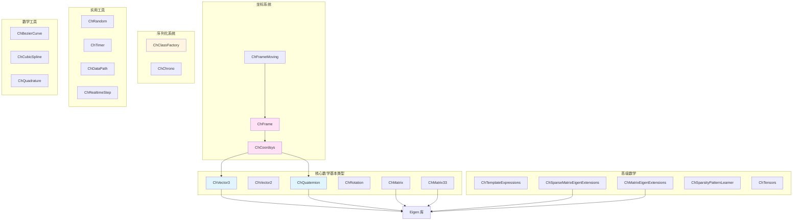
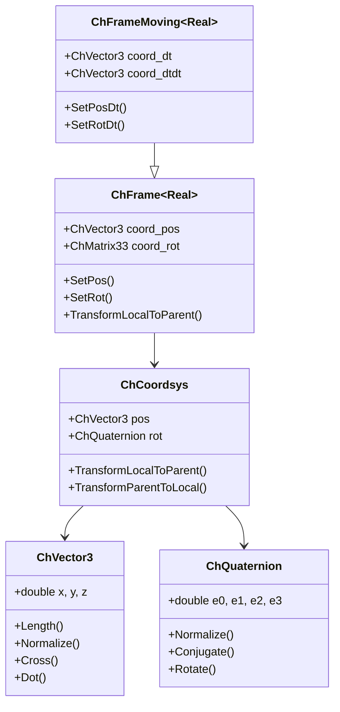

# Core 模块架构分析

## 概述

`src/chrono/core` 文件夹包含构成整个 Chrono 物理引擎基础的基本数据结构和数学基本类型。该模块提供了整个代码库中使用的基本构建块。

## 主要功能

### 主要职责
1. **数学基本类型**：向量、四元数、矩阵和坐标系统
2. **序列化基础设施**：类工厂和注册系统
3. **实用工具类**：随机数生成、计时器、数据路径管理
4. **模板表达式优化**：用于高效数学运算的表达式模板
5. **稀疏矩阵支持**：Eigen 稀疏矩阵操作的扩展

## 设计特性

### 架构模式
- **值语义**：大多数类使用值语义以实现高效的复制和移动操作
- **基于模板的设计**：大量使用 C++ 模板以实现类型灵活性和编译时优化
- **Eigen 集成**：与 Eigen 库紧密集成用于线性代数
- **CRTP（奇异递归模板模式）**：在 ChFrame 层次结构中用于静态多态
- **表达式模板**：用于数学运算以消除临时对象

### 性能考虑
- **仅头文件实现**：许多类仅使用头文件以便内联和优化
- **对齐**：ChAlignedAllocator 确保 SIMD 操作的正确内存对齐
- **零成本抽象**：基于模板的设计允许无运行时开销的抽象
- **稀疏矩阵优化**：针对大规模问题的专用稀疏矩阵扩展

## 文件结构和关系

### 核心数据类型
```
ChVector3.h/cpp         - 3D 向量 (x, y, z)
ChVector2.h             - 2D 向量 (x, y)
ChQuaternion.h/cpp      - 用于旋转的四元数
ChMatrix.h              - 通用矩阵包装器
ChMatrix33.h            - 3x3 旋转矩阵
ChRotation.h/cpp        - 旋转表示
```

### 坐标系统
```
ChCoordsys.h/cpp        - 位置 + 旋转坐标系统
ChFrame.h               - 带位置和方向的参考系
ChFrameMoving.h         - 带速度和加速度的参考系
```

### 序列化
```
ChClassFactory.h/cpp    - 用于对象创建的工厂模式
ChChrono.h              - 核心类型定义和宏
```

### 实用工具
```
ChRandom.h/cpp          - 随机数生成器
ChTimer.h               - 高精度计时
ChDataPath.h/cpp        - 数据文件路径管理
ChRealtimeStep.h        - 实时步长控制器
```

### 数学工具
```
ChBezierCurve.h/cpp     - Bezier 曲线实用程序
ChCubicSpline.h/cpp     - 三次样条插值
ChQuadrature.h/cpp      - 数值积分
```

### 高级功能
```
ChTemplateExpressions.h      - 用于数学运算的表达式模板
ChSparseMatrixEigenExtensions.h - 稀疏矩阵实用程序
ChMatrixEigenExtensions.h    - 密集矩阵实用程序
ChSparsityPatternLearner.h   - 稀疏模式检测
ChTensors.h                  - 张量操作
```

## 架构图



## 类层次结构



## 核心外部接口

### 1. 向量操作 (ChVector3.h)
```cpp
class ChApi ChVector3 {
public:
    // 构造
    ChVector3(double x, double y, double z);
    
    // 基本操作
    double Length() const;
    ChVector3 GetNormalized() const;
    double Dot(const ChVector3& other) const;
    ChVector3 Cross(const ChVector3& other) const;
    
    // 运算符
    ChVector3 operator+(const ChVector3& other) const;
    ChVector3 operator*(double scalar) const;
};
```

### 2. 四元数操作 (ChQuaternion.h)
```cpp
class ChApi ChQuaternion {
public:
    // 构造
    ChQuaternion(double e0, double e1, double e2, double e3);
    static ChQuaternion FromAxisAngle(const ChVector3& axis, double angle);
    
    // 操作
    ChQuaternion GetConjugate() const;
    ChVector3 Rotate(const ChVector3& v) const;
    void Normalize();
    
    // 转换
    ChMatrix33 GetRotMat() const;
};
```

### 3. 坐标系统 (ChCoordsys.h)
```cpp
class ChCoordsys {
public:
    ChVector3 pos;
    ChQuaternion rot;
    
    // 变换
    ChVector3 TransformLocalToParent(const ChVector3& local) const;
    ChVector3 TransformParentToLocal(const ChVector3& parent) const;
    
    // 组合
    ChCoordsys operator>>(const ChCoordsys& other) const;
};
```

### 4. 参考系 (ChFrame.h)
```cpp
template <class Real = double>
class ChFrame {
public:
    // 位置和方向
    void SetPos(const ChVector3& pos);
    void SetRot(const ChQuaternion& rot);
    const ChVector3& GetPos() const;
    const ChMatrix33& GetRot() const;
    
    // 坐标变换
    ChVector3 TransformLocalToParent(const ChVector3& local) const;
    ChVector3 TransformDirectionLocalToParent(const ChVector3& dir) const;
};
```

### 5. 类工厂 (ChClassFactory.h)
```cpp
class ChApi ChClassFactory {
public:
    // 注册类以进行序列化
    static void RegisterClass(const std::string& name, 
                              std::function<void*()> creator);
    
    // 按名称创建实例
    static void* Create(const std::string& name);
    
    // 检查类是否已注册
    static bool IsClassRegistered(const std::string& name);
};
```

### 6. 随机数生成 (ChRandom.h)
```cpp
class ChApi ChRandom {
public:
    // 设置种子
    static void SetSeed(unsigned int seed);
    
    // 生成随机数
    static double GetRandom();  // [0, 1]
    static double GetRandom(double min, double max);
    static int GetRandomInt(int min, int max);
    
    // 分布
    static double GetGaussianRandom(double mean, double stddev);
};
```

## 依赖关系

### 外部依赖
- **Eigen3**：核心线性代数库（必需）
  - 用于矩阵运算、分解和数值方法
  - ChVector3 和 ChMatrix 类包装 Eigen 类型
  
### 内部依赖（chrono 内部）
- **chrono/serialization**：对象持久化的归档系统
- **chrono/utils**：常量和实用函数

### 其他模块的使用
core 模块几乎被 Chrono 中的所有其他模块使用：
- **physics**：使用 ChVector3、ChQuaternion、ChFrame 表示刚体状态
- **collision**：使用几何基本类型定义形状
- **solver**：使用矩阵和向量类进行数值计算
- **fea**：使用坐标系统定义单元
- **geometry**：使用数学基本类型进行几何运算

## 关键设计决策

### 1. Eigen 集成
**决策**：包装 Eigen 类型而不是继承它们
**理由**：
- 允许添加 Chrono 特定的方法
- 在不同 Eigen 版本间提供一致的 API
- 启用序列化支持

### 2. 基于模板的参考系
**决策**：使用带 Real 类型参数的模板定义 ChFrame
**理由**：
- 支持浮点和双精度
- 启用编译时优化
- 允许专用实现

### 3. 仅头文件数学运算
**决策**：在头文件中实现简单的数学运算
**理由**：
- 启用积极的编译器内联
- 减少热路径的函数调用开销
- 允许编译器跨翻译单元优化

### 4. 值语义
**决策**：对数学对象使用值类型
**理由**：
- 数学表达式的自然语法
- 启用移动语义和 RVO
- 简化内存管理

## 性能特性

### 优势
1. **零成本抽象**：基于模板的设计消除了运行时开销
2. **SIMD 友好**：适当的对齐和数据布局支持向量化
3. **内联**：仅头文件实现支持积极内联
4. **表达式模板**：消除复杂表达式中的临时对象

### 注意事项
1. **编译时间**：大量使用模板会增加编译时间
2. **代码大小**：模板实例化可能会增加二进制文件大小
3. **调试性能**：模板密集型代码在调试构建中可能较慢

## 使用示例

### 创建和操作参考系
```cpp
// 创建坐标系统
ChCoordsys csys(ChVector3(1, 2, 3), Q_from_AngAxis(CH_PI/4, VECT_Z));

// 创建参考系
ChFrame<> frame;
frame.SetPos(ChVector3(10, 0, 0));
frame.SetRot(Q_from_AngAxis(CH_PI/2, VECT_Y));

// 变换向量
ChVector3 local_point(1, 0, 0);
ChVector3 world_point = frame.TransformLocalToParent(local_point);
```

### 矩阵操作
```cpp
// 创建矩阵
ChMatrixDynamic<> A(3, 3);
ChMatrixDynamic<> B(3, 3);

// 使用 Eigen 进行矩阵操作
ChMatrixDynamic<> C = A * B;
ChVectorDynamic<> x = A.colPivHouseholderQr().solve(b);
```

## 未来考虑

1. **SIMD 优化**：为关键操作使用显式 SIMD 内建函数
2. **GPU 支持**：考虑 GPU 兼容的数据结构
3. **Constexpr**：为常量表达式增加更多编译时计算
4. **概念**：使用 C++20 概念改进模板约束

## 总结

core 模块是 Chrono 的数学基础，提供：
- 高效、类型安全的数学基本类型
- 通过模板实现的零开销抽象
- 与 Eigen 的紧密集成以支持高级线性代数
- 在整个代码库中使用的一致 API

其设计强调性能、灵活性和易用性，适用于简单仿真和复杂的多物理场景。
