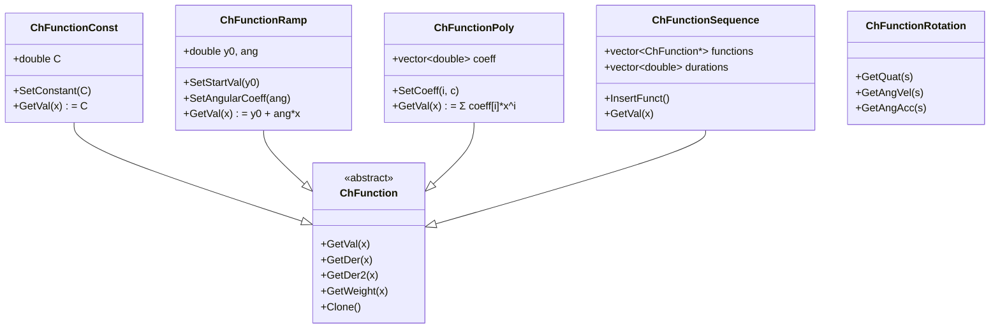
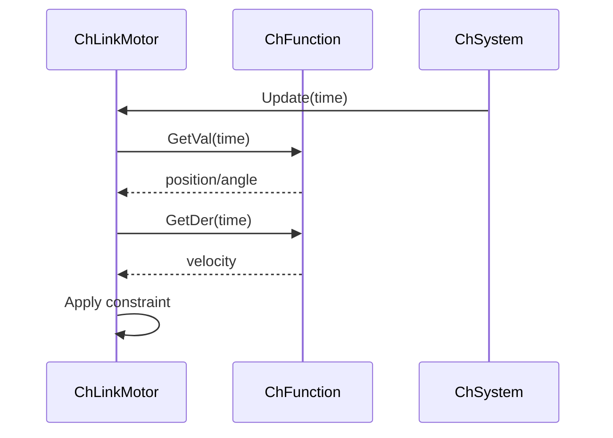

# Functions 模块架构分析

## 概述

The `src/chrono/functions` folder provides mathematical function representations for time-dependent and parametric functions. These functions are used throughout Chrono for motion profiles, actuator control, force functions, and data interpolation.

## 主要功能

### 主要职责
1. **Function Interface**: Abstract base for 1D functions f(x) → y
2. **Basic Functions**: Constants, ramps, polynomials, sinusoids
3. **Interpolation**: Linear, cubic spline, B-spline interpolation
4. **Operations**: Function composition, arithmetic, derivatives
5. **Motion Profiles**: Prescribed motion for actuators and constraints
6. **Rotation Functions**: 3D rotation as function of parameter

## 设计特性

### 架构模式
- **Strategy Pattern**: Interchangeable function implementations
- **Composite Pattern**: Combined functions (sum, product, composition)
- **Template Method**: Base class defines evaluation interface
- **Decorator Pattern**: Function wrappers for modifications
- **Factory Pattern**: Common function creation

### 性能考虑
- **Efficient Evaluation**: Fast computation of function values
- **Derivative Caching**: Analytical derivatives when possible
- **Lookup Tables**: Pre-computed values for expensive functions
- **Inline Operations**: Small functions inlined for performance
- **Minimal Allocation**: Value types, no unnecessary copies

## File Structure and Relationships

### Base Classes
```
ChFunction.h/cpp            - Abstract 1D function base
ChFunctionBase.h            - Additional base functionality
ChFunctionRotation.h/cpp    - Base for rotation functions
```

### Basic Functions
```
ChFunctionConst.h/cpp       - Constant value
ChFunctionRamp.h/cpp        - Linear ramp
ChFunctionPoly.h/cpp        - Polynomial (generic degree)
ChFunctionPoly23.h/cpp      - 2nd and 3rd degree polynomials
ChFunctionPoly345.h/cpp     - 3rd, 4th, 5th degree polynomials
ChFunctionSine.h/cpp        - Sinusoidal function
ChFunctionCos.h/cpp         - Cosine function
```

### Interpolation Functions
```
ChFunctionInterp.h/cpp      - Linear interpolation
ChFunctionBSpline.h/cpp     - B-spline interpolation
ChFunctionBspline.h         - Alternative B-spline
```

### Combined Functions
```
ChFunctionSequence.h/cpp    - Piecewise sequence of functions
ChFunctionOperator.h/cpp    - Arithmetic operations on functions
ChFunctionDerivative.h/cpp  - Numerical derivative of function
ChFunctionIntegral.h/cpp    - Numerical integral of function
```

### Motion Profile Functions
```
ChFunctionConstAcc.h/cpp    - Constant acceleration profile
ChFunctionConstJerk.h/cpp   - Constant jerk profile
ChFunctionCycloidal.h/cpp   - Cycloidal motion profile
ChFunctionLambda.h/cpp      - Custom function from lambda
```

### Rotation Functions
```
ChFunctionRotation.h/cpp                - Base rotation function
ChFunctionRotationAxis.h/cpp            - Rotation about axis
ChFunctionRotationABCFunctions.h/cpp    - Euler angles as functions
ChFunctionRotationBSpline.h/cpp         - B-spline rotation
ChFunctionRotationSetpoint.h/cpp        - Setpoint interpolation
ChFunctionRotationSQUAD.h/cpp           - Spherical quadrangle interpolation
```

### Special Functions
```
ChFunctionMirror.h/cpp      - Mirror function about axis
ChFunctionRepeat.h/cpp      - Repeat function periodically
ChFunctionFillet3.h/cpp     - Smooth fillet between segments
```

## 架构图

```mermaid
graph TB
    subgraph "Base Classes"
        FUNC[ChFunction]
        FBASE[ChFunctionBase]
        FROT[ChFunctionRotation]
    end
    
    subgraph "Basic Functions"
        CONST[ChFunctionConst]
        RAMP[ChFunctionRamp]
        POLY[ChFunctionPoly]
        SINE[ChFunctionSine]
        COS[ChFunctionCos]
    end
    
    subgraph "Interpolation"
        INTERP[ChFunctionInterp]
        BSPL[ChFunctionBSpline]
    end
    
    subgraph "Motion Profiles"
        CACC[ChFunctionConstAcc]
        CJERK[ChFunctionConstJerk]
        CYCL[ChFunctionCycloidal]
    end
    
    subgraph "Combined"
        SEQ[ChFunctionSequence]
        OP[ChFunctionOperator]
        DER[ChFunctionDerivative]
    end
    
    subgraph "Rotation Functions"
        RAXIS[ChFunctionRotationAxis]
        RABC[ChFunctionRotationABCFunctions]
        RBSPL[ChFunctionRotationBSpline]
        RSQUAD[ChFunctionRotationSQUAD]
    end
    
    FBASE --|> FUNC
    
    CONST --|> FUNC
    RAMP --|> FUNC
    POLY --|> FUNC
    SINE --|> FUNC
    COS --|> FUNC
    
    INTERP --|> FUNC
    BSPL --|> FUNC
    
    CACC --|> FUNC
    CJERK --|> FUNC
    CYCL --|> FUNC
    
    SEQ --|> FUNC
    OP --|> FUNC
    DER --> FUNC
    
    RAXIS --|> FROT
    RABC --|> FROT
    RBSPL --|> FROT
    RSQUAD --|> FROT
    
    style FUNC fill:#e1f5ff
    style FROT fill:#ffe1f5
    style SEQ fill:#fff5e1
```

## 类层次结构



## 核心外部接口

### 1. Function Base (ChFunction.h)
```cpp
class ChApi ChFunction {
public:
    // Evaluation
    virtual double GetVal(double x) const = 0;
    virtual double GetDer(double x) const;
    virtual double GetDer2(double x) const;
    virtual double GetDer3(double x) const;
    
    // Weight (for optimization, typically 1.0)
    virtual double GetWeight(double x) const;
    
    // Domain
    virtual double GetMin() const;
    virtual double GetMax() const;
    
    // Integration
    virtual double GetIntegral(double x1, double x2) const;
    virtual double GetPositiveAcceleration(double x) const;
    
    // Operations
    virtual void Estimate_x_range(double& xmin, double& xmax) const;
    virtual void Estimate_y_range(double xmin, double xmax,
                                  double& ymin, double& ymax,
                                  int derivate = 0) const;
    
    // Cloning
    virtual ChFunction* Clone() const = 0;
};
```

### 2. Constant Function (ChFunctionConst.h)
```cpp
class ChApi ChFunctionConst : public ChFunction {
public:
    ChFunctionConst(double value = 0);
    
    void SetConstant(double value);
    double GetConstant() const;
    
    double GetVal(double x) const override { return C; }
    double GetDer(double x) const override { return 0; }
};
```

### 3. Polynomial (ChFunctionPoly.h)
```cpp
class ChApi ChFunctionPoly : public ChFunction {
public:
    ChFunctionPoly(int degree);
    
    // Coefficient access
    void SetCoeff(int i, double coeff);
    double GetCoeff(int i) const;
    int GetOrder() const;
    
    // Evaluation: y = c0 + c1*x + c2*x^2 + ...
    double GetVal(double x) const override;
    double GetDer(double x) const override;
    double GetDer2(double x) const override;
};
```

### 4. Interpolation (ChFunctionInterp.h)
```cpp
class ChApi ChFunctionInterp : public ChFunction {
public:
    enum class InterpolationType {
        LINEAR,
        CUBIC_SPLINE,
        AKIMA
    };
    
    // Add data points
    void AddPoint(double x, double y);
    void SetPoints(const std::vector<double>& x,
                  const std::vector<double>& y);
    
    // Configuration
    void SetInterpolationType(InterpolationType type);
    void SetExtrapolation(bool extrapolate);
    
    // Evaluation (interpolates between points)
    double GetVal(double x) const override;
    double GetDer(double x) const override;
    
    // Access
    size_t GetNumPoints() const;
    double GetPointX(size_t i) const;
    double GetPointY(size_t i) const;
};
```

### 5. B-Spline Function (ChFunctionBSpline.h)
```cpp
class ChApi ChFunctionBSpline : public ChFunction {
public:
    // Construction
    ChFunctionBSpline(int order,
                     const std::vector<double>& control_points,
                     const std::vector<double>& knots = {});
    
    // Setup
    void SetupUniform(int order,
                     const std::vector<double>& control_points);
    
    // Evaluation
    double GetVal(double x) const override;
    double GetDer(double x) const override;
    
    // Access
    int GetOrder() const;
    const std::vector<double>& GetControlPoints() const;
    void SetControlPoint(int i, double value);
};
```

### 6. Function Sequence (ChFunctionSequence.h)
```cpp
class ChApi ChFunctionSequence : public ChFunction {
public:
    // Add functions
    void InsertFunct(std::shared_ptr<ChFunction> func,
                    double duration,
                    double weight = 1.0,
                    bool cont_derivative = false);
    
    // Evaluation (selects appropriate function based on x)
    double GetVal(double x) const override;
    double GetDer(double x) const override;
    
    // Access
    size_t GetNumFunctions() const;
    std::shared_ptr<ChFunction> GetFunction(size_t i);
    double GetDuration(size_t i) const;
    
    // Domain
    double GetTotalDuration() const;
};
```

### 7. Motion Profiles (ChFunctionConstAcc.h)
```cpp
class ChApi ChFunctionConstAcc : public ChFunction {
public:
    // Configure motion from y0 to y1 in time T
    // with constant acceleration/deceleration
    void SetDisplacement(double y1, double y0 = 0);
    void SetDuration(double T);
    void SetAccelerationTime(double t_acc);  // Time for accel phase
    
    // Evaluation (smooth motion profile)
    double GetVal(double x) const override;
    double GetDer(double x) const override;
    double GetDer2(double x) const override;
};
```

### 8. Rotation Functions (ChFunctionRotation.h)
```cpp
class ChApi ChFunctionRotation {
public:
    // Get quaternion at parameter s
    virtual ChQuaternion<> GetQuat(double s) const = 0;
    
    // Get angular velocity (derivative)
    virtual ChVector3 GetAngVel(double s) const;
    
    // Get angular acceleration (second derivative)
    virtual ChVector3 GetAngAcc(double s) const;
    
    // Clone
    virtual ChFunctionRotation* Clone() const = 0;
};

// Rotation about fixed axis
class ChApi ChFunctionRotationAxis : public ChFunctionRotation {
public:
    ChFunctionRotationAxis(const ChVector3& axis,
                          std::shared_ptr<ChFunction> angle_func);
    
    void SetAxis(const ChVector3& axis);
    void SetAngleFunction(std::shared_ptr<ChFunction> func);
    
    ChQuaternion<> GetQuat(double s) const override;
};
```

## 依赖关系

### 外部依赖
- **None**: Functions module is self-contained

### 内部依赖
- **core**: ChVector3, ChQuaternion for rotation functions
- **serialization**: For saving/loading functions

### 其他模块的使用
- **physics**: Motion profiles for motors and actuators
- **timestepper**: Time-dependent forcing functions
- **vehicle**: Steering and throttle functions
- **sensors**: Time-varying sensor properties

## 关键设计决策

### 1. Pure Virtual Interface
**决策**: ChFunction is abstract with pure virtual GetVal()
**理由**:
- Forces implementation in derived classes
- Clear contract for all functions
- Enables polymorphism
- Type-safe function pointers

### 2. Analytical Derivatives
**决策**: Optional override of GetDer(), GetDer2()
**理由**:
- Analytical derivatives when available (fast, accurate)
- Fallback to numerical differentiation
- Important for implicit time integration
- Enables optimization algorithms

### 3. Separation of Scalar and Rotation
**决策**: Separate ChFunction and ChFunctionRotation
**理由**:
- Rotations are not scalar (Lie group)
- Different interpolation (SLERP, SQUAD)
- Clear API for each use case
- Prevents misuse

### 4. Function Composition
**决策**: Support for combined functions (sequence, operators)
**理由**:
- Build complex from simple functions
- Reusability of basic functions
- Expressive for motion profiles
- Enables procedural generation

### 5. Lightweight Design
**决策**: Value semantics, minimal overhead
**理由**:
- Functions evaluated frequently
- Small memory footprint
- Fast cloning and copying
- Cache-friendly

## 性能特性

### 优势
1. **Fast Evaluation**: Simple functions compute quickly
2. **Analytical Derivatives**: Faster than numerical
3. **No Allocation**: Evaluation doesn't allocate memory
4. **Inline Potential**: Small functions can be inlined
5. **Lookup Tables**: Pre-computed for expensive functions

### 注意事项
1. **Virtual Call Overhead**: Polymorphism has small cost
2. **Complex Functions**: B-splines more expensive than polynomials
3. **Derivative Computation**: Numerical derivatives slower
4. **Sequence Lookup**: O(n) to find active function segment

## 典型使用模式

### Basic Functions
```cpp
// Constant
auto const_func = chrono_types::make_shared<ChFunctionConst>(5.0);

// Ramp
auto ramp = chrono_types::make_shared<ChFunctionRamp>(0, 2.0);  // y = 2*x

// Sine wave
auto sine = chrono_types::make_shared<ChFunctionSine>(
    0,     // phase
    2.0,   // frequency
    1.0    // amplitude
);

// Polynomial: y = 1 + 2x + 3x²
auto poly = chrono_types::make_shared<ChFunctionPoly>(2);
poly->SetCoeff(0, 1.0);
poly->SetCoeff(1, 2.0);
poly->SetCoeff(2, 3.0);
```

### Interpolation
```cpp
// Linear interpolation through points
auto interp = chrono_types::make_shared<ChFunctionInterp>();
interp->AddPoint(0.0, 0.0);
interp->AddPoint(1.0, 2.0);
interp->AddPoint(2.0, 1.5);
interp->AddPoint(3.0, 3.0);

// B-spline smooth curve
std::vector<double> control_values = {0, 1, 3, 2, 0};
auto bspline = chrono_types::make_shared<ChFunctionBSpline>();
bspline->SetupUniform(3, control_values);
```

### Motion Profiles
```cpp
// Smooth motion from 0 to 10 in 5 seconds
auto profile = chrono_types::make_shared<ChFunctionConstAcc>();
profile->SetDisplacement(10.0, 0.0);
profile->SetDuration(5.0);
profile->SetAccelerationTime(1.0);  // 1s accel, 3s const, 1s decel

// Use for motor
motor->SetMotionFunction(profile);
```

### Function Sequences
```cpp
// Piecewise motion: ramp up, hold, ramp down
auto sequence = chrono_types::make_shared<ChFunctionSequence>();

auto ramp_up = chrono_types::make_shared<ChFunctionRamp>(0, 1.0);
sequence->InsertFunct(ramp_up, 2.0);  // 2 seconds

auto hold = chrono_types::make_shared<ChFunctionConst>(2.0);
sequence->InsertFunct(hold, 3.0);  // 3 seconds

auto ramp_down = chrono_types::make_shared<ChFunctionRamp>(2.0, -1.0);
sequence->InsertFunct(ramp_down, 2.0);  // 2 seconds

// Total duration: 7 seconds
```

### Rotation Functions
```cpp
// Rotation about Z axis with sine angle
auto angle_func = chrono_types::make_shared<ChFunctionSine>(0, 1.0, CH_PI/4);
auto rotation = chrono_types::make_shared<ChFunctionRotationAxis>(
    ChVector3(0, 0, 1),  // Z axis
    angle_func
);

// Get rotation at time t
ChQuaternion<> quat = rotation->GetQuat(t);
ChVector3 angvel = rotation->GetAngVel(t);
```

### Lambda Functions (Custom)
```cpp
// Define custom function with lambda
auto custom = chrono_types::make_shared<ChFunctionLambda>(
    [](double x) { return std::exp(-x) * std::sin(x); }
);

double y = custom->GetVal(2.0);
```

## Common Use Cases

### 1. Motor Control
```cpp
// Position motor with trajectory
auto motor_pos = chrono_types::make_shared<ChLinkMotorRotationAngle>();
motor_pos->SetAngleFunction(profile_function);
```

### 2. Time-Varying Forces
```cpp
// Apply sinusoidal force
auto force_function = chrono_types::make_shared<ChFunctionSine>(0, 1.0, 100.0);
auto load = chrono_types::make_shared<ChLoadBodyForce>(
    body, force_function, ...);
```

### 3. Prescribed Motion
```cpp
// Body follows path
auto motion_x = chrono_types::make_shared<ChFunctionInterp>();
// ... add points ...
body->SetPosDtDt_x_function(motion_x);
```

### 4. Material Properties
```cpp
// Time-varying stiffness
auto stiffness_func = chrono_types::make_shared<ChFunctionRamp>(1e6, 1e5);
spring->SetSpringFunction(stiffness_func);
```

## Function Operations

### Arithmetic
```cpp
// Sum of two functions
auto sum = chrono_types::make_shared<ChFunctionOperator>();
sum->SetFunction1(func1);
sum->SetFunction2(func2);
sum->SetOperation(ChFunctionOperator::ADD);

// Product
auto product = chrono_types::make_shared<ChFunctionOperator>();
product->SetOperation(ChFunctionOperator::MUL);
```

### Derivatives
```cpp
// Numerical derivative
auto derivative = chrono_types::make_shared<ChFunctionDerivative>(func);
double dydx = derivative->GetVal(x);  // ≈ df/dx at x
```

### Mirroring and Repeating
```cpp
// Mirror function about axis
auto mirrored = chrono_types::make_shared<ChFunctionMirror>(func);

// Repeat function periodically
auto repeated = chrono_types::make_shared<ChFunctionRepeat>(func, period);
```

## Advanced Features

### Cycloidal Motion (Smooth Start/Stop)
```cpp
// Cycloidal profile: smooth acceleration at endpoints
auto cycloidal = chrono_types::make_shared<ChFunctionCycloidal>(
    0.0,   // start value
    10.0,  // end value
    5.0    // duration
);
// Zero acceleration at t=0 and t=5
```

### SQUAD Rotation Interpolation
```cpp
// Smooth quaternion interpolation (spherical cubic)
auto squad = chrono_types::make_shared<ChFunctionRotationSQUAD>();
squad->AddPoint(0.0, quat0);
squad->AddPoint(1.0, quat1);
squad->AddPoint(2.0, quat2);
squad->AddPoint(3.0, quat3);
// Smooth rotation through keyframes
```

### B-Spline Rotations
```cpp
// Rotation as B-spline over SO(3)
auto rot_bspline = chrono_types::make_shared<ChFunctionRotationBSpline>();
// Add control quaternions...
// Smooth rotation interpolation
```

## Integration with Physics



## 总结

The functions module provides:
- Flexible 1D function interface for time-dependent quantities
- Rich library of basic and interpolation functions
- Smooth motion profile generators
- Rotation function support for 3D orientations
- Function composition and operations
- Efficient evaluation with analytical derivatives

Its design emphasizes simplicity, performance, and composability, making it easy to create complex motion profiles from simple building blocks while maintaining computational efficiency for real-time simulation.
