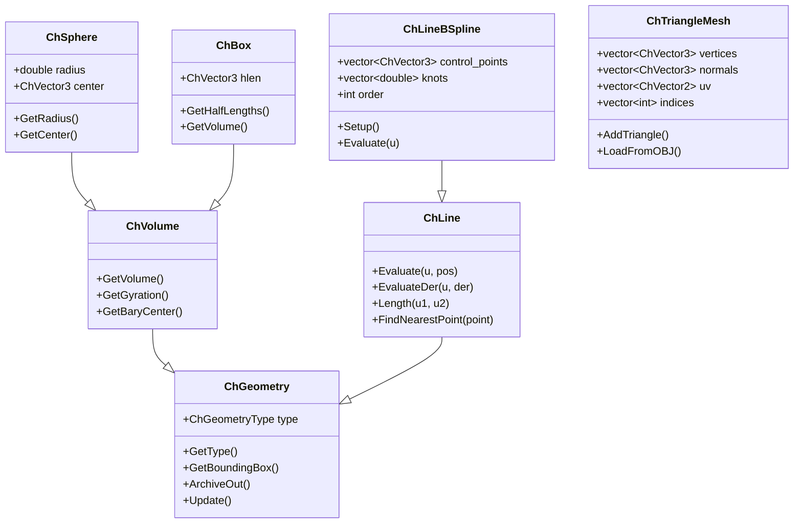

# Geometry 模块架构分析

## 概述

The `src/chrono/geometry` folder provides geometric primitives, curves, surfaces, and computational geometry utilities. It includes shape definitions, parametric curves (B-splines, NURBS), geometric operations, and triangle mesh handling.

## 主要功能

### 主要职责
1. **Geometric Primitives**: Basic shapes (box, sphere, cylinder, etc.)
2. **Curves**: Lines, arcs, B-splines, NURBS, Bezier curves
3. **Surfaces**: Parametric surfaces, NURBS surfaces
4. **Triangle Meshes**: Mesh representation and operations
5. **Geometric Operations**: Intersections, projections, transformations
6. **Computational Geometry**: Convex hulls, closest points, volumes

## 设计特性

### 架构模式
- **Abstract Base Classes**: ChGeometry for all geometric objects
- **Visitor Pattern**: Polymorphic operations on different shapes
- **Strategy Pattern**: Different algorithms for same operation
- **Factory Pattern**: Shape creation with specific parameters
- **Composite Pattern**: Complex shapes from primitives

### 性能考虑
- **Bounding Box Caching**: AABB computed and cached
- **Level of Detail**: Support for different detail levels (curves/surfaces)
- **Efficient Evaluation**: Optimized parametric curve/surface evaluation
- **Memory Efficiency**: Shared vertex data in meshes
- **Computational Geometry**: Optimized algorithms (convex hull, etc.)

## File Structure and Relationships

### Base Classes
```
ChGeometry.h/cpp            - Abstract base for all geometry
ChVolume.h/cpp              - Base for volume-enclosed shapes
```

### Primitive Shapes
```
ChBox.h/cpp                 - Axis-aligned box
ChSphere.h/cpp              - Sphere
ChCylinder.h/cpp            - Cylinder
ChCone.h/cpp                - Cone
ChCapsule.h/cpp             - Capsule (rounded cylinder)
ChEllipsoid.h/cpp           - Ellipsoid
ChRoundedBox.h/cpp          - Box with rounded edges
ChRoundedCylinder.h/cpp     - Cylinder with rounded caps
```

### Curves
```
ChLine.h/cpp                - Abstract base for curves
ChLineArc.h/cpp             - Circular arc
ChLineBezier.h/cpp          - Bezier curve
ChLineBSpline.h/cpp         - B-spline curve
ChLineNurbs.h/cpp           - NURBS curve
ChLinePath.h/cpp            - Piecewise path from segments
ChLineSegment.h/cpp         - Straight line segment
ChLineCam.h/cpp             - Cam profile curve
ChLinePoly.h/cpp            - Polyline
```

### Surfaces
```
ChSurface.h/cpp             - Abstract base for surfaces
ChSurfaceNurbs.h/cpp        - NURBS surface
```

### Triangle Meshes
```
ChTriangle.h/cpp            - Single triangle
ChTriangleMesh.h/cpp        - Triangle mesh representation
ChTriangleMeshConnected.h/cpp - Mesh with connectivity info
ChTriangleMeshSoup.h/cpp    - Simple triangle soup
```

### Basis Functions (Splines)
```
ChBasisToolsBSpline.h       - B-spline basis functions
ChBasisToolsNurbs.h         - NURBS basis functions
```

### Geometric Operations
```
ChGeometryCollision.h       - Collision between geometries
ChGeometryQuery.h           - Geometric queries (distance, etc.)
```

## 架构图

```mermaid
graph TB
    subgraph "Base Classes"
        GEOM[ChGeometry]
        VOL[ChVolume]
        LINE[ChLine]
        SURF[ChSurface]
    end
    
    subgraph "Primitive Shapes"
        BOX[ChBox]
        SPHERE[ChSphere]
        CYL[ChCylinder]
        CONE[ChCone]
        CAPS[ChCapsule]
        ELLIP[ChEllipsoid]
    end
    
    subgraph "Curves"
        ARC[ChLineArc]
        BEZ[ChLineBezier]
        BSPL[ChLineBSpline]
        NURBS[ChLineNurbs]
        PATH[ChLinePath]
        SEG[ChLineSegment]
    end
    
    subgraph "Surfaces"
        SNURBS[ChSurfaceNurbs]
    end
    
    subgraph "Meshes"
        TRI[ChTriangle]
        MESH[ChTriangleMesh]
        MESHC[ChTriangleMeshConnected]
    end
    
    subgraph "Tools"
        BBSP[ChBasisToolsBSpline]
        BNURBS[ChBasisToolsNurbs]
    end
    
    VOL --|> GEOM
    LINE --|> GEOM
    SURF --|> GEOM
    
    BOX --|> VOL
    SPHERE --|> VOL
    CYL --|> VOL
    CONE --|> VOL
    CAPS --|> VOL
    ELLIP --|> VOL
    
    ARC --|> LINE
    BEZ --|> LINE
    BSPL --|> LINE
    NURBS --|> LINE
    PATH --|> LINE
    SEG --|> LINE
    
    SNURBS --|> SURF
    
    MESHC --|> MESH
    
    BSPL --> BBSP
    NURBS --> BNURBS
    SNURBS --> BNURBS
    
    style GEOM fill:#e1f5ff
    style LINE fill:#ffe1f5
    style VOL fill:#fff5e1
    style MESH fill:#e1ffe1
```

## 类层次结构



## 核心外部接口

### 1. Geometry Base (ChGeometry.h)
```cpp
class ChApi ChGeometry {
public:
    enum class Type {
        BOX,
        SPHERE,
        CYLINDER,
        CONE,
        CAPSULE,
        ELLIPSOID,
        LINE,
        TRIANGLE_MESH,
        // ... more types
    };
    
    // Type information
    Type GetType() const;
    
    // Bounding box
    virtual void GetBoundingBox(ChVector3& bbmin, 
                               ChVector3& bbmax,
                               const ChMatrix33<>& rot = ChMatrix33<>(1)) const = 0;
    
    // Update (for dynamic geometries)
    virtual void Update();
    
    // Archiving
    virtual void ArchiveOut(ChArchiveOut& archive_out);
    virtual void ArchiveIn(ChArchiveIn& archive_in);
};
```

### 2. Volume Shapes (ChVolume.h)
```cpp
class ChApi ChVolume : public ChGeometry {
public:
    // Mass properties
    virtual double GetVolume() const = 0;
    virtual ChMatrix33<> GetGyration() const = 0;
    virtual ChVector3 GetBaryCenter() const;
    
    // Inertia calculation
    ChMatrix33<> GetInertia(double density) const;
};

// Specific volumes
class ChApi ChSphere : public ChVolume {
public:
    ChSphere(double radius);
    ChSphere(const ChVector3& center, double radius);
    
    double GetRadius() const;
    void SetRadius(double radius);
    const ChVector3& GetCenter() const;
    
    double GetVolume() const override;
    ChMatrix33<> GetGyration() const override;
};

class ChApi ChBox : public ChVolume {
public:
    ChBox(double hx, double hy, double hz);
    ChBox(const ChVector3& hlengths);
    
    const ChVector3& GetHalfLengths() const;
    
    double GetVolume() const override;
    ChMatrix33<> GetGyration() const override;
};
```

### 3. Curves (ChLine.h)
```cpp
class ChApi ChLine : public ChGeometry {
public:
    // Parametric evaluation (u typically in [0,1])
    virtual void Evaluate(ChVector3& pos, double u) const = 0;
    virtual void EvaluateDer(ChVector3& der, double u) const;
    virtual void EvaluateDer2(ChVector3& der2, double u) const;
    
    // Arc length
    virtual double Length(double u1, double u2, int sampling = 10) const;
    
    // Find parameter for nearest point
    virtual double FindNearestPoint(const ChVector3& point,
                                   double u_guess = 0.5,
                                   int max_iters = 20) const;
    
    // Discretization
    void SamplePoints(std::vector<ChVector3>& points, int num_points) const;
};
```

### 4. B-spline Curve (ChLineBSpline.h)
```cpp
class ChApi ChLineBSpline : public ChLine {
public:
    // Construction
    ChLineBSpline(int order,
                  const std::vector<ChVector3>& control_points,
                  const std::vector<double>& knots = {});
    
    // Setup with uniform knots
    void SetupUniform(int order,
                     const std::vector<ChVector3>& control_points,
                     bool closed = false);
    
    // Evaluation
    void Evaluate(ChVector3& pos, double u) const override;
    void EvaluateDer(ChVector3& der, double u) const override;
    
    // Access
    int GetOrder() const;
    const std::vector<ChVector3>& GetControlPoints() const;
    const std::vector<double>& GetKnots() const;
    
    // Modification
    void SetControlPoint(int i, const ChVector3& point);
    void InsertKnot(double u);
};
```

### 5. NURBS Curve (ChLineNurbs.h)
```cpp
class ChApi ChLineNurbs : public ChLine {
public:
    // Construction with weights
    ChLineNurbs(int order,
                const std::vector<ChVector3>& control_points,
                const std::vector<double>& weights,
                const std::vector<double>& knots = {});
    
    // Rational evaluation
    void Evaluate(ChVector3& pos, double u) const override;
    
    // Weights
    const std::vector<double>& GetWeights() const;
    void SetWeight(int i, double weight);
    
    // Convert to B-spline (if all weights equal)
    bool IsUniform() const;
};
```

### 6. Triangle Mesh (ChTriangleMesh.h)
```cpp
class ChApi ChTriangleMesh : public ChGeometry {
public:
    // Add geometry
    void AddTriangle(const ChVector3& v1,
                    const ChVector3& v2,
                    const ChVector3& v3);
    
    void AddTriangle(const ChTriangle& triangle);
    
    // Load from file
    bool LoadFromOBJ(const std::string& filename);
    bool SaveToOBJ(const std::string& filename);
    
    // Access
    size_t GetNumTriangles() const;
    size_t GetNumVertices() const;
    ChTriangle GetTriangle(size_t i) const;
    
    // Transformation
    void Transform(const ChVector3& displacement,
                  const ChMatrix33<>& rotation);
    
    // Properties
    double GetVolume() const;
    ChVector3 GetBarycenter() const;
    ChMatrix33<> GetInertia() const;
    
    // Mesh operations
    void RepairDuplicateVertices();
    void ComputeNormals();
    void ComputeAABB(ChVector3& bbmin, ChVector3& bbmax) const;
};
```

### 7. NURBS Surface (ChSurfaceNurbs.h)
```cpp
class ChApi ChSurfaceNurbs : public ChSurface {
public:
    // Construction
    ChSurfaceNurbs(int order_u, int order_v,
                   const std::vector<std::vector<ChVector3>>& control_points,
                   const std::vector<double>& weights = {},
                   const std::vector<double>& knots_u = {},
                   const std::vector<double>& knots_v = {});
    
    // Evaluation at (u, v)
    ChVector3 Evaluate(double u, double v) const;
    ChVector3 EvaluateDu(double u, double v) const;
    ChVector3 EvaluateDv(double u, double v) const;
    
    // Normal vector
    ChVector3 Normal(double u, double v) const;
    
    // Tessellation
    void CreateMesh(ChTriangleMesh& mesh,
                   int res_u, int res_v) const;
};
```

## 依赖关系

### 外部依赖
- **None**: Geometry module is self-contained

### 内部依赖
- **core**: ChVector3, ChMatrix33 for geometric computations
- **serialization**: For saving/loading geometry

### 其他模块的使用
- **collision**: Shape definitions for collision detection
- **assets**: Visual shape definitions
- **fea**: Mesh generation for FEA
- **vehicle**: Terrain surface definitions
- **particlefactory**: Emitter geometry

## 关键设计决策

### 1. Separation of Concerns
**决策**: Geometry separate from physics and visualization
**理由**:
- Pure geometric operations
- Reusable across modules
- Clear interface boundaries
- Independent testing

### 2. Parametric Representation
**决策**: Parametric curves and surfaces (u, v parameters)
**理由**:
- Standard in CAD/graphics
- Smooth representation
- Easy to sample/tessellate
- Supports deformation

### 3. B-splines and NURBS
**决策**: Full support for B-splines and NURBS
**理由**:
- Industry standard (CAD interoperability)
- Smooth curves with local control
- Exact representation of conics (NURBS)
- Efficient evaluation

### 4. Triangle Mesh Format
**决策**: Simple vertex/index array representation
**理由**:
- Compatible with graphics APIs
- Easy to create procedurally
- Standard OBJ file support
- Memory efficient

### 5. Mass Properties
**决策**: Geometric objects compute mass properties
**理由**:
- Useful for physics setup
- Automatic inertia calculation
- Consistent with solid modeling
- Supports composite shapes

## 性能特性

### 优势
1. **Efficient Evaluation**: Optimized spline evaluation algorithms
2. **Caching**: Bounding boxes and derived quantities cached
3. **Level of Detail**: Adjustable tesselation resolution
4. **Memory Efficiency**: Shared vertex data in meshes
5. **Vectorized Operations**: Where applicable

### 注意事项
1. **Curve Evaluation**: NURBS more expensive than B-splines
2. **Mesh Size**: Large meshes consume memory
3. **Tessellation Cost**: High-resolution surfaces expensive to mesh
4. **Convex Hull**: O(n log n) for point clouds
5. **Closest Point**: Iterative, may need good initial guess

## 典型使用模式

### Creating Primitive Shapes
```cpp
// Sphere
auto sphere = chrono_types::make_shared<ChSphere>(1.0);
double volume = sphere->GetVolume();
ChMatrix33<> gyration = sphere->GetGyration();

// Box
auto box = chrono_types::make_shared<ChBox>(1.0, 0.5, 2.0);
ChVector3 bary = box->GetBaryCenter();

// Cylinder
auto cyl = chrono_types::make_shared<ChCylinder>(0.5, 2.0);
```

### Working with B-splines
```cpp
// Create B-spline curve
std::vector<ChVector3> control_points = {
    ChVector3(0, 0, 0),
    ChVector3(1, 2, 0),
    ChVector3(2, 1, 0),
    ChVector3(3, 0, 0)
};

auto bspline = chrono_types::make_shared<ChLineBSpline>();
bspline->SetupUniform(3, control_points, false);

// Evaluate at parameter u
ChVector3 pos, tangent;
bspline->Evaluate(pos, 0.5);
bspline->EvaluateDer(tangent, 0.5);

// Sample points
std::vector<ChVector3> points;
bspline->SamplePoints(points, 100);
```

### Creating and Using Meshes
```cpp
// Load from OBJ file
auto mesh = chrono_types::make_shared<ChTriangleMesh>();
mesh->LoadFromOBJ("model.obj");

// Or create procedurally
mesh->AddTriangle(
    ChVector3(0, 0, 0),
    ChVector3(1, 0, 0),
    ChVector3(0, 1, 0)
);

// Compute properties
double volume = mesh->GetVolume();
ChVector3 com = mesh->GetBarycenter();
ChMatrix33<> inertia = mesh->GetInertia();

// Transform
mesh->Transform(ChVector3(1, 2, 3), ChMatrix33<>(1));
```

### NURBS Surface
```cpp
// Create control point grid
std::vector<std::vector<ChVector3>> control_grid;
// ... populate grid ...

auto nurbs_surf = chrono_types::make_shared<ChSurfaceNurbs>(
    3, 3,  // order in u and v
    control_grid
);

// Evaluate point on surface
ChVector3 point = nurbs_surf->Evaluate(0.5, 0.5);
ChVector3 normal = nurbs_surf->Normal(0.5, 0.5);

// Tessellate to mesh
ChTriangleMesh mesh;
nurbs_surf->CreateMesh(mesh, 20, 20);  // 20x20 resolution
```

### Path Following
```cpp
// Create path from segments
auto path = chrono_types::make_shared<ChLinePath>();
path->AddSubLine(chrono_types::make_shared<ChLineSegment>(
    ChVector3(0, 0, 0), ChVector3(1, 0, 0)));
path->AddSubLine(chrono_types::make_shared<ChLineArc>(
    ChCoordsys<>(ChVector3(1, 0, 0)),
    0.5, CH_PI/2));

// Traverse path
for (double u = 0; u <= 1.0; u += 0.01) {
    ChVector3 pos;
    path->Evaluate(pos, u);
    // Use position...
}
```

## Geometric Algorithms

### Bounding Box Computation
```cpp
// All geometries support bounding box
ChVector3 bbmin, bbmax;
geometry->GetBoundingBox(bbmin, bbmax);

// With rotation
ChMatrix33<> rot = Q_from_AngAxis(CH_PI/4, VECT_Z).GetRotMat();
geometry->GetBoundingBox(bbmin, bbmax, rot);
```

### Mass Properties
```cpp
// For volume shapes
double mass = volume->GetVolume() * density;
ChMatrix33<> inertia_tensor = volume->GetGyration();
inertia_tensor *= mass;  // Scale by mass
```

### Curve Operations
```cpp
// Arc length
double len = curve->Length(0.0, 1.0, 100);  // 100 samples

// Find nearest point
ChVector3 query_point(1, 2, 3);
double u_nearest = curve->FindNearestPoint(query_point);
ChVector3 closest;
curve->Evaluate(closest, u_nearest);
```

## Integration with Other Modules

### With Collision Module
```cpp
// Geometry defines shape, collision uses it
auto collision_box = chrono_types::make_shared<ChCollisionShapeBox>(
    box->GetHalfLengths());
```

### With Assets Module
```cpp
// Visual shape from geometry
auto visual_sphere = chrono_types::make_shared<ChVisualShapeSphere>(
    sphere->GetRadius());
```

### With FEA Module
```cpp
// Generate FEA mesh from surface
ChTriangleMesh surface_mesh;
nurbs_surface->CreateMesh(surface_mesh, 50, 50);
// Convert to FEA mesh...
```

## Advanced Features

### Closed Curves
```cpp
// Create closed B-spline
bspline->SetupUniform(3, control_points, true);  // closed=true
// First and last points automatically connected
```

### Weighted NURBS
```cpp
// Exact circle as NURBS (weights create conic)
std::vector<double> weights = {1.0, 0.707, 1.0, 0.707, 1.0};
auto circle = chrono_types::make_shared<ChLineNurbs>(
    2, control_points, weights);
```

### Mesh Repair
```cpp
// Fix duplicate vertices
mesh->RepairDuplicateVertices();

// Compute smooth normals
mesh->ComputeNormals();
```

## 总结

The geometry module provides:
- Comprehensive geometric primitive library
- Advanced curve/surface representations (B-splines, NURBS)
- Triangle mesh handling and operations
- Mass property calculations
- Standard geometric operations and queries
- Clean separation from physics and visualization

Its design emphasizes mathematical rigor, CAD compatibility, and reusability across different Chrono subsystems while maintaining performance through caching and optimized algorithms.
