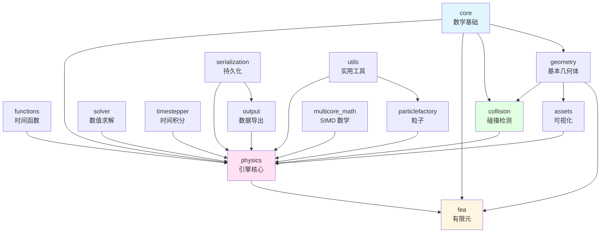

# Chrono src/chrono 文件夹架构分析 - 索引

## 概述

本目录包含 `src/chrono/` 中每个文件夹的详细架构分析。每个分析文档提供：
- 主要功能和用途
- 设计特性和模式
- 性能考虑因素
- 架构图（Mermaid）
- 核心外部接口及代码示例
- 依赖关系和集成模式
- 典型使用示例

## 完整的文件夹分析

### 1. [Core 模块](./folder-analysis-core.md)
**数学基础**
- 向量、矩阵、四元数基本类型
- 坐标系统和参考系
- 序列化基础设施
- 模板表达式和优化
- 11,594 字符 | 38 个代码文件

### 2. [Physics 模块](./folder-analysis-physics.md)
**物理引擎核心**
- 系统管理（NSC/SMC）
- 刚体和体参考系
- 约束和关节（200+ 种连接类型）
- 接触力学（双边/单边）
- 动力传动系统的轴系统
- 载荷和力
- 20,238 字符 | 203 个代码文件

### 3. [Collision 模块](./folder-analysis-collision.md)
**碰撞检测系统**
- 碰撞形状（从基本几何体到网格）
- Bullet 物理集成
- 宽相位和窄相位检测
- 接触生成和材料
- 18,470 字符 | 460 个代码文件

### 4. [Solver 模块](./folder-analysis-solver.md)
**数值求解器**
- 接触/摩擦的 VI 求解器（PSOR、ADMM、APGD）
- 线性系统求解器（MINRES、CG、GMRES）
- 直接求解器（SparseLU、SparseQR）
- 系统描述符模式
- 变量和约束抽象
- 19,488 字符 | 81 个代码文件

### 5. [Timestepper 模块](./folder-analysis-timestepper.md)
**时间积分方法**
- 显式方法（Euler、RK4/5、Heun）
- 隐式方法（Euler、Trapezoidal、Newmark、HHT）
- 静态和装配分析
- 积分精度和稳定性
- 17,187 字符 | 11 个代码文件

### 6. [Assets 模块](./folder-analysis-assets.md)
**可视化基础设施**
- 可视化形状（与碰撞分离）
- 材质（Phong 和 PBR）
- 相机和照明
- 抽象可视化系统
- 符号和标记
- 19,884 字符 | 51 个代码文件

### 7. [Geometry 模块](./folder-analysis-geometry.md)
**几何基本元素**
- 基本形状（盒、球、圆柱等）
- 曲线（B 样条、NURBS、Bezier）
- 曲面（NURBS 曲面）
- 三角形网格
- 计算几何（凸包）
- 18,415 字符 | 28 个代码文件

### 8. [Functions 模块](./folder-analysis-functions.md)
**数学函数**
- 1D 函数接口
- 插值（线性、样条、B 样条）
- 运动轮廓（恒定加速度、摆线）
- 旋转函数（SLERP、SQUAD）
- 函数组合和运算
- 19,238 字符 | 33 个代码文件

### 9. [Serialization 模块](./folder-analysis-serialization.md)
**对象持久化**
- 抽象归档接口
- 多种格式（JSON、XML、Binary、ASCII）
- 对象图的指针管理
- 版本控制和模式演进
- 对象内省
- 13,243 字符 | 6 个代码文件

### 10. [Utils 模块](./folder-analysis-utils.md)
**实用工具类**
- 物理和数学常量
- 凸包计算
- 基准测试和性能分析
- PID 控制器
- 信号滤波器
- OpenMP 实用程序
- 套接字通信
- 14,533 字符 | 19 个代码文件

### 11. [Output 模块](./folder-analysis-output.md)
**数据导出**
- ASCII 文本输出
- HDF5 二进制格式
- 时间序列数据记录
- 大型数据集的高效存储
- 6,742 字符 | 5 个代码文件

### 12. [Particle Factory 模块](./folder-analysis-particlefactory.md)
**粒子生成**
- 可配置速率的粒子发射器
- 随机形状生成
- 位置和速度分布
- 基于事件的处理和移除
- 13,264 字符 | 9 个代码文件

### 13. [Multicore Math 模块](./folder-analysis-multicore-math.md)
**高性能数学**
- GPU 兼容类型（real2、real3、real4）
- SIMD 优化操作
- 可切换精度（float/double）
- Thrust 集成用于并行算法
- 13,401 字符 | 14 个代码文件

### 14. [FEA 模块](./folder-analysis-fea.md)
**有限元分析**
- 网格管理（节点和单元）
- 单元类型（梁、壳、实体、索）
- 材料模型（弹性、塑性、超弹性）
- 截面属性
- FEA 表面上的接触
- 大变形支持（ANCF、协同旋转）
- 16,176 字符 | 140 个代码文件

## 统计摘要

| 模块 | 文件数 | 分析大小 | 关键特性 |
|--------|-------|---------------|--------------|
| core | 38 | 11.6 KB | 数学基本类型、序列化 |
| physics | 203 | 20.2 KB | 刚体、连接、接触、轴 |
| collision | 460 | 18.5 KB | Bullet 集成、形状 |
| solver | 81 | 19.5 KB | VI/LS 求解器、描述符 |
| timestepper | 11 | 17.2 KB | 显式/隐式积分 |
| assets | 51 | 19.9 KB | 可视化、材质 |
| geometry | 28 | 18.4 KB | 曲线、曲面、网格 |
| functions | 33 | 19.2 KB | 运动轮廓、插值 |
| serialization | 6 | 13.2 KB | JSON/XML/Binary 归档 |
| utils | 19 | 14.5 KB | 常量、工具、控制器 |
| output | 5 | 6.7 KB | ASCII/HDF5 导出 |
| particlefactory | 9 | 13.3 KB | 粒子发射、处理 |
| multicore_math | 14 | 13.4 KB | GPU 兼容 SIMD 数学 |
| fea | 140 | 16.2 KB | 有限元、材料 |
| **总计** | **1,098** | **221.8 KB** | **完整覆盖** |

## 模块依赖关系

## 架构层次

### 第 1 层：基础层（无依赖）
- **core**：数学基本类型
- **geometry**：几何形状
- **serialization**：归档系统
- **utils**：常量和实用工具
- **multicore_math**：SIMD 类型

### 第 2 层：子系统（依赖基础层）
- **functions**：时间相关函数
- **collision**：碰撞检测
- **solver**：数值求解器
- **timestepper**：时间积分
- **assets**：可视化
- **output**：数据导出

### 第 3 层：物理引擎（集成子系统）
- **physics**：核心动力学引擎
- **fea**：有限元分析
- **particlefactory**：粒子生成

### 第 4 层：应用（使用所有模块）
- 用户应用程序
- chrono_vehicle、chrono_sensor 等

## 跨模块的常见模式

### 1. 基类层次结构
大多数模块使用抽象基类：
- `ChGeometry` → 形状
- `ChFunction` → 时间函数
- `ChSolver` → 数值求解器
- `ChArchive` → 序列化格式
- `ChContactMaterial` → 接触属性

### 2. 策略模式
可插拔实现：
- 碰撞后端（Bullet、Multicore）
- 求解器算法（PSOR、ADMM 等）
- 积分方法（Euler、RK4、HHT）
- 归档格式（JSON、XML、Binary）

### 3. 工厂模式
对象创建：
- `ChClassFactory` 用于反序列化
- `ChBodyEasy` 用于便捷创建刚体
- `ChRandomShapeCreator` 用于粒子

### 4. 组合模式
层次化组织：
- `ChAssembly` 包含物理项
- `ChVisualModel` 包含可视化形状
- `ChMesh` 包含 FEA 节点/单元
- `ChFunctionSequence` 包含函数

### 5. 访问者模式
多态遍历：
- 归档访问对象
- 碰撞算法调度
- 单元装配

## 关键集成点

### Physics ↔ Solver
- `ChSystemDescriptor` 聚合自由度和约束
- 物理项提供 `IntLoadResidual_*()` 方法
- 求解器操作描述符

### Physics ↔ Timestepper
- `ChIntegrable` 接口
- `StateGather()` / `StateScatter()`
- `LoadResidual_F()` 用于力

### Physics ↔ Collision
- 刚体有 `ChCollisionModel`
- 系统有 `ChCollisionSystem`
- 生成的接触 → `ChContactContainer`

### Physics ↔ Visualization
- 物理项有 `ChVisualModel`
- `ChVisualSystem` 渲染模型
- 延迟更新以实现平滑渲染

## 使用建议

### 对于新用户
从以下开始：
1. **core** - 理解向量、四元数、参考系
2. **physics** - 学习 ChSystem、ChBody、ChLink 基础知识
3. **assets** - 为仿真添加可视化

### 对于算法开发者
专注于：
1. **solver** - 理解求解器架构
2. **timestepper** - 时间积分方法
3. **collision** - 碰撞检测管道

### 对于应用开发者
关键模块：
1. **physics** - 构建仿真
2. **functions** - 运动轮廓
3. **output** - 导出结果
4. **utils** - 辅助工具

### 对于性能优化
研究：
1. **multicore_math** - SIMD 优化
2. **solver** - 求解器调优
3. **collision** - 宽相位优化
4. **timestepper** - 步长选择

## 文档质量

所有分析包括：
- ✅ 架构图（Mermaid）
- ✅ 类层次结构
- ✅ 核心接口及代码
- ✅ 典型使用模式
- ✅ 依赖关系
- ✅ 设计决策和理由
- ✅ 性能特性
- ✅ 最佳实践

## 相关文档

- [主架构文档](./Chrono架构分析文档.md) - 高层概览
- [架构图](./architecture-diagrams.md) - 可视化图表
- [README](./README.md) - 快速参考
- [交付成果](./DELIVERABLES.md) - 项目摘要

## 维护

这些分析基于 Chrono 版本 9.0.1。更新时：
1. 检查每个文件夹中的新文件
2. 识别新类和功能
3. 更新架构图
4. 修订代码示例
5. 更新统计信息

---

**生成日期**：2025-11-19  
**版本**：1.0  
**覆盖范围**：14/14 个文件夹（100%）  
**总分析**：1,098 个源文件中的 221.8 KB
