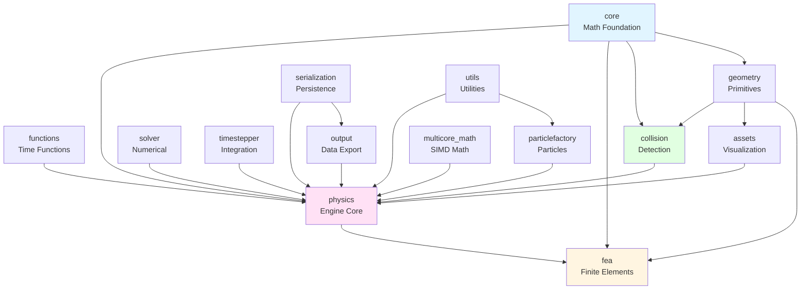

# Chrono src/chrono Folder Architecture Analysis - Index

## Overview

This directory contains detailed architecture analyses for each folder in `src/chrono/`. Each analysis document provides:
- Main functionality and purpose
- Design characteristics and patterns
- Performance considerations
- Architecture diagrams (Mermaid)
- Core external interfaces with code examples
- Dependencies and integration patterns
- Typical usage examples

## Complete Folder Analyses

### 1. [Core Module](./folder-analysis-core.md)
**Mathematical Foundation**
- Vector, matrix, quaternion primitives
- Coordinate systems and frames
- Serialization infrastructure
- Template expressions and optimizations
- 11,594 characters | 38 code files

### 2. [Physics Module](./folder-analysis-physics.md)
**Physics Engine Core**
- System management (NSC/SMC)
- Rigid bodies and body frames
- Constraints and joints (200+ link types)
- Contact mechanics (bilateral/unilateral)
- Shaft system for powertrains
- Loads and forces
- 20,238 characters | 203 code files

### 3. [Collision Module](./folder-analysis-collision.md)
**Collision Detection System**
- Collision shapes (primitives to meshes)
- Bullet physics integration
- Broadphase and narrowphase detection
- Contact generation and materials
- 18,470 characters | 460 code files

### 4. [Solver Module](./folder-analysis-solver.md)
**Numerical Solvers**
- VI solvers for contacts/friction (PSOR, ADMM, APGD)
- Linear system solvers (MINRES, CG, GMRES)
- Direct solvers (SparseLU, SparseQR)
- System descriptor pattern
- Variables and constraints abstraction
- 19,488 characters | 81 code files

### 5. [Timestepper Module](./folder-analysis-timestepper.md)
**Time Integration Methods**
- Explicit methods (Euler, RK4/5, Heun)
- Implicit methods (Euler, Trapezoidal, Newmark, HHT)
- Static and assembly analysis
- Integration accuracy and stability
- 17,187 characters | 11 code files

### 6. [Assets Module](./folder-analysis-assets.md)
**Visualization Infrastructure**
- Visual shapes (separate from collision)
- Materials (Phong and PBR)
- Camera and lighting
- Abstract visualization system
- Glyphs and markers
- 19,884 characters | 51 code files

### 7. [Geometry Module](./folder-analysis-geometry.md)
**Geometric Primitives**
- Primitive shapes (box, sphere, cylinder, etc.)
- Curves (B-splines, NURBS, Bezier)
- Surfaces (NURBS surfaces)
- Triangle meshes
- Computational geometry (convex hull)
- 18,415 characters | 28 code files

### 8. [Functions Module](./folder-analysis-functions.md)
**Mathematical Functions**
- 1D function interface
- Interpolation (linear, spline, B-spline)
- Motion profiles (constant acceleration, cycloidal)
- Rotation functions (SLERP, SQUAD)
- Function composition and operations
- 19,238 characters | 33 code files

### 9. [Serialization Module](./folder-analysis-serialization.md)
**Object Persistence**
- Abstract archive interface
- Multiple formats (JSON, XML, Binary, ASCII)
- Pointer management for object graphs
- Version control and schema evolution
- Object introspection
- 13,243 characters | 6 code files

### 10. [Utils Module](./folder-analysis-utils.md)
**Utility Classes**
- Physical and mathematical constants
- Convex hull computation
- Benchmarking and profiling
- PID controllers
- Signal filters
- OpenMP utilities
- Socket communication
- 14,533 characters | 19 code files

### 11. [Output Module](./folder-analysis-output.md)
**Data Export**
- ASCII text output
- HDF5 binary format
- Time series data recording
- Efficient storage for large datasets
- 6,742 characters | 5 code files

### 12. [Particle Factory Module](./folder-analysis-particlefactory.md)
**Particle Generation**
- Particle emitters with configurable rates
- Random shape generation
- Position and velocity distributions
- Event-based processing and removal
- 13,264 characters | 9 code files

### 13. [Multicore Math Module](./folder-analysis-multicore-math.md)
**High-Performance Math**
- GPU-compatible types (real2, real3, real4)
- SIMD-optimized operations
- Switchable precision (float/double)
- Thrust integration for parallel algorithms
- 13,401 characters | 14 code files

### 14. [FEA Module](./folder-analysis-fea.md)
**Finite Element Analysis**
- Mesh management (nodes and elements)
- Element types (beams, shells, solids, cables)
- Material models (elastic, plastic, hyperelastic)
- Section properties
- Contact on FEA surfaces
- Large deformation support (ANCF, corotational)
- 16,176 characters | 140 code files

## Statistics Summary

| Module | Files | Analysis Size | Key Features |
|--------|-------|---------------|--------------|
| core | 38 | 11.6 KB | Math primitives, serialization |
| physics | 203 | 20.2 KB | Bodies, links, contacts, shafts |
| collision | 460 | 18.5 KB | Bullet integration, shapes |
| solver | 81 | 19.5 KB | VI/LS solvers, descriptors |
| timestepper | 11 | 17.2 KB | Explicit/implicit integration |
| assets | 51 | 19.9 KB | Visualization, materials |
| geometry | 28 | 18.4 KB | Curves, surfaces, meshes |
| functions | 33 | 19.2 KB | Motion profiles, interpolation |
| serialization | 6 | 13.2 KB | JSON/XML/Binary archives |
| utils | 19 | 14.5 KB | Constants, tools, controllers |
| output | 5 | 6.7 KB | ASCII/HDF5 export |
| particlefactory | 9 | 13.3 KB | Particle emission, processing |
| multicore_math | 14 | 13.4 KB | GPU-compatible SIMD math |
| fea | 140 | 16.2 KB | Finite elements, materials |
| **Total** | **1,098** | **221.8 KB** | **Complete coverage** |

## Module Dependencies

## Architecture Layers

### Layer 1: Foundation (No Dependencies)
- **core**: Mathematical primitives
- **geometry**: Geometric shapes
- **serialization**: Archive system
- **utils**: Constants and utilities
- **multicore_math**: SIMD types

### Layer 2: Subsystems (Depend on Foundation)
- **functions**: Time-dependent functions
- **collision**: Collision detection
- **solver**: Numerical solvers
- **timestepper**: Time integration
- **assets**: Visualization
- **output**: Data export

### Layer 3: Physics Engine (Integrates Subsystems)
- **physics**: Core dynamics engine
- **fea**: Finite element analysis
- **particlefactory**: Particle generation

### Layer 4: Applications (Use Everything)
- User applications
- chrono_vehicle, chrono_sensor, etc.

## Common Patterns Across Modules

### 1. Base Class Hierarchies
Most modules use abstract base classes:
- `ChGeometry` → shapes
- `ChFunction` → time functions
- `ChSolver` → numerical solvers
- `ChArchive` → serialization formats
- `ChContactMaterial` → contact properties

### 2. Strategy Pattern
Pluggable implementations:
- Collision backends (Bullet, Multicore)
- Solver algorithms (PSOR, ADMM, etc.)
- Integration methods (Euler, RK4, HHT)
- Archive formats (JSON, XML, Binary)

### 3. Factory Pattern
Object creation:
- `ChClassFactory` for deserialization
- `ChBodyEasy` for convenient bodies
- `ChRandomShapeCreator` for particles

### 4. Composite Pattern
Hierarchical organization:
- `ChAssembly` contains physics items
- `ChVisualModel` contains visual shapes
- `ChMesh` contains FEA nodes/elements
- `ChFunctionSequence` contains functions

### 5. Visitor Pattern
Polymorphic traversal:
- Archive visiting objects
- Collision algorithm dispatch
- Element assembly

## Key Integration Points

### Physics ↔ Solver
- `ChSystemDescriptor` aggregates DOFs and constraints
- Physics items provide `IntLoadResidual_*()` methods
- Solver operates on descriptor

### Physics ↔ Timestepper
- `ChIntegrable` interface
- `StateGather()` / `StateScatter()`
- `LoadResidual_F()` for forces

### Physics ↔ Collision
- Bodies have `ChCollisionModel`
- System has `ChCollisionSystem`
- Contacts generated → `ChContactContainer`

### Physics ↔ Visualization
- Physics items have `ChVisualModel`
- `ChVisualSystem` renders models
- Deferred updates for smooth rendering

## Usage Recommendations

### For New Users
Start with:
1. **core** - Understand vectors, quaternions, frames
2. **physics** - Learn ChSystem, ChBody, ChLink basics
3. **assets** - Add visualization to your simulation

### For Algorithm Developers
Focus on:
1. **solver** - Understand solver architecture
2. **timestepper** - Time integration methods
3. **collision** - Collision detection pipeline

### For Application Developers
Key modules:
1. **physics** - Build your simulation
2. **functions** - Motion profiles
3. **output** - Export results
4. **utils** - Helpers and tools

### For Performance Optimization
Study:
1. **multicore_math** - SIMD optimization
2. **solver** - Solver tuning
3. **collision** - Broadphase optimization
4. **timestepper** - Step size selection

## Documentation Quality

All analyses include:
- ✅ Architecture diagrams (Mermaid)
- ✅ Class hierarchies
- ✅ Core interfaces with code
- ✅ Typical usage patterns
- ✅ Dependencies
- ✅ Design decisions and rationale
- ✅ Performance characteristics
- ✅ Best practices

## Related Documentation

- [Main Architecture Document](./Chrono架构分析文档.md) - High-level overview
- [Architecture Diagrams](./architecture-diagrams.md) - Visual diagrams
- [README](./README.md) - Quick reference
- [Deliverables](./DELIVERABLES.md) - Project summary

## Maintenance

These analyses are based on Chrono version 9.0.1. When updating:
1. Check for new files in each folder
2. Identify new classes and features
3. Update architecture diagrams
4. Revise code examples
5. Update statistics

---

**Generated**: 2025-11-19  
**Version**: 1.0  
**Coverage**: 14/14 folders (100%)  
**Total Analysis**: 221.8 KB across 1,098 source files
