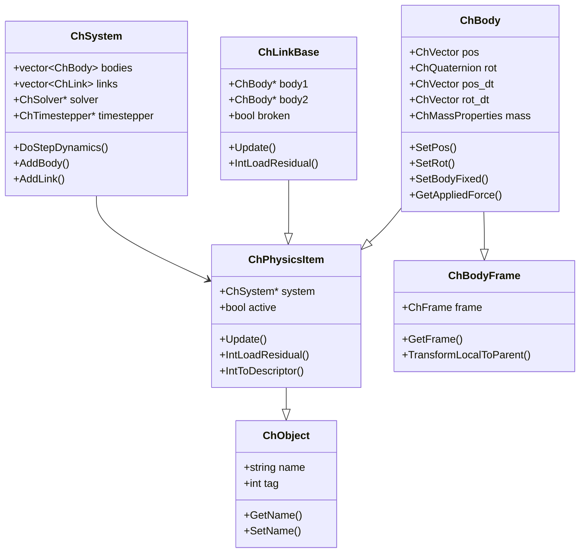

# Physics Module Architecture Analysis

## Overview

The `src/chrono/physics` folder contains the core physics engine implementation, including the simulation system, rigid bodies, constraints (links), contact mechanics, and loads. This is the heart of Chrono's multibody dynamics capabilities.

## Main Functionality

### Primary Responsibilities
1. **System Management**: ChSystem - the main simulation coordinator
2. **Rigid Bodies**: ChBody and variants for representing physical objects
3. **Constraints**: ChLink hierarchy for joints and constraints between bodies
4. **Contact Mechanics**: Contact containers and materials (NSC and SMC formulations)
5. **Shafts System**: 1D rotational elements for powertrains
6. **Loads and Forces**: External loads, forces, and torques
7. **Assemblies**: Hierarchical organization of physics items
8. **Nodes**: Point masses and particle systems

## Design Characteristics

### Architecture Patterns
- **Component Pattern**: Physics items are components added to the system
- **Strategy Pattern**: Different solver and contact formulations (NSC vs SMC)
- **Composite Pattern**: ChAssembly allows hierarchical composition
- **Visitor Pattern**: Used for collision detection and constraint assembly
- **Factory Pattern**: ChBodyEasy for convenient body creation

### Performance Considerations
- **Cache-Friendly Design**: Data structures optimized for sequential access
- **Lazy Evaluation**: Constraint Jacobians computed only when needed
- **Contact Pooling**: Reusable contact objects to reduce allocations
- **Parallel-Ready**: Designed to support OpenMP parallelization

## File Structure and Relationships

### Core System Classes
```
ChSystem.h/cpp              - Abstract base system class
ChSystemNSC.h/cpp           - Non-smooth contact (DVI) formulation
ChSystemSMC.h/cpp           - Smooth contact (penalty) formulation
ChAssembly.h/cpp            - Container for hierarchical organization
```

### Body Hierarchy
```
ChObject.h/cpp              - Root base class with name/tag
ChPhysicsItem.h/cpp         - Base for all physical entities
ChBodyFrame.h/cpp           - Coordinate system for bodies
ChBody.h/cpp                - Standard rigid body
ChBodyAuxRef.h/cpp          - Body with auxiliary reference frame
ChBodyEasy.h/cpp            - Convenience factories for common shapes
```

### Link/Constraint Hierarchy
```
ChLinkBase.h/cpp            - Base for all constraints
ChLink.h/cpp                - Base for marker-based links
ChLinkMarkers.h/cpp         - Links using marker points

Mates (modern constraint API):
ChLinkMate.h/cpp            - Base for mate constraints
ChJoint.h/cpp               - Base for joint constraints
ChLinkRevolute.h/cpp        - Revolute joint
ChLinkUniversal.h/cpp       - Universal joint

Motors:
ChLinkMotor.h/cpp           - Base motor class
ChLinkMotorRotation*.h/cpp  - Rotational motors (angle, speed, torque)
ChLinkMotorLinear*.h/cpp    - Linear motors (position, speed, force)

Legacy Locks:
ChLinkLock.h/cpp            - Legacy lock-based constraints
ChLinkLockGear.h/cpp        - Gear constraint
ChLinkLockPulley.h/cpp      - Pulley constraint

Spring-Dampers:
ChLinkTSDA.h/cpp            - Translational spring-damper-actuator
ChLinkRSDA.h/cpp            - Rotational spring-damper-actuator
ChLinkBushing.h/cpp         - 6-DOF bushing element
```

### Contact System
```
ChContact.h/cpp                 - Base contact class
ChContactNSC.h/cpp              - NSC (DVI) contact
ChContactSMC.h/cpp              - SMC (penalty) contact
ChContactContainer.h/cpp        - Base container
ChContactContainerNSC.h/cpp     - NSC contact storage
ChContactContainerSMC.h/cpp     - SMC contact storage
ChContactMaterial.h/cpp         - Base material
ChContactMaterialNSC.h/cpp      - NSC material properties
ChContactMaterialSMC.h/cpp      - SMC material properties (restitution, etc)
ChContactable.h/cpp             - Interface for contactable objects
```

### Shaft System (1D Rotation)
```
ChShaft.h/cpp                   - 1D rotational element
ChShaftsCouple.h                - Base for shaft couplers
ChShaftsGear.h/cpp              - Gear constraint
ChShaftsClutch.h/cpp            - Clutch with engagement
ChShaftsFreewheel.h/cpp         - One-way coupling
ChShaftsMotor*.h/cpp            - Motors for shafts
ChShaftsTorque.h/cpp            - Applied torque
ChShaftsThermalEngine.h/cpp     - ICE model
ChShaftsTorqueConverter.h/cpp   - Torque converter
ChShaftsPlanetary.h/cpp         - Planetary gear set
```

### Loads System
```
ChLoad.h/cpp                - Base load class
ChLoadContainer.h/cpp       - Container for loads
ChLoadable.h                - Interface for loadable objects
ChLoader*.h/cpp             - Load application strategies
ChLoadsBody.h/cpp           - Loads on rigid bodies
ChLoadsNodeXYZ.h/cpp        - Loads on nodes
ChLoadBodyMesh.h/cpp        - Distributed loads on meshes
```

### Nodes and Particles
```
ChNodeBase.h/cpp            - Base node class
ChNodeXYZ.h/cpp             - 3D point node
ChIndexedNodes.h/cpp        - Container for nodes
ChIndexedParticles.h/cpp    - Particle system
ChParticleCloud.h/cpp       - Cloud of particles
```

### Special Elements
```
ChMarker.h/cpp                  - Reference point on body
ChForce.h/cpp                   - Applied force/torque
ChConveyor.h/cpp                - Conveyor belt primitive
ChFeeder.h/cpp                  - Particle feeder
ChMassProperties.h/cpp          - Inertia calculations
ChProximityContainer.h/cpp      - Proximity detection container
```

### Advanced Features
```
ChExternalDynamicsDAE.h/cpp     - External DAE system coupling
ChExternalDynamicsODE.h/cpp     - External ODE system coupling
ChHydraulicActuator.h/cpp       - Hydraulic actuator model
ChHydraulicCircuit.h/cpp        - Hydraulic circuit model
```

## Architecture Diagram

```mermaid
graph TB
    subgraph "System Layer"
        SYS[ChSystem]
        NSC[ChSystemNSC]
        SMC[ChSystemSMC]
        ASM[ChAssembly]
    end
    
    subgraph "Body Layer"
        PHY[ChPhysicsItem]
        BF[ChBodyFrame]
        BODY[ChBody]
        BAUX[ChBodyAuxRef]
        BEASY[ChBodyEasy]
    end
    
    subgraph "Constraint Layer"
        LB[ChLinkBase]
        LINK[ChLink]
        MATE[ChLinkMate]
        JNT[ChJoint]
        MOT[ChLinkMotor]
    end
    
    subgraph "Contact Layer"
        CONT[ChContact]
        CNSC[ChContactNSC]
        CSMC[ChContactSMC]
        CCN[ChContactContainer]
        MAT[ChContactMaterial]
    end
    
    subgraph "Shaft Layer"
        SFT[ChShaft]
        SGEAR[ChShaftsGear]
        SMOTOR[ChShaftsMotor]
        SCOUPLE[ChShaftsCouple]
    end
    
    subgraph "Load Layer"
        LOAD[ChLoad]
        LCONT[ChLoadContainer]
        LBODY[ChLoadsBody]
    end
    
    NSC --|> SYS
    SMC --|> SYS
    SYS --> ASM
    ASM --> PHY
    
    BODY --|> PHY
    BAUX --|> BODY
    BEASY --> BODY
    BODY --> BF
    
    LINK --|> LB
    MATE --|> LB
    JNT --|> LB
    MOT --|> LB
    
    LB --|> PHY
    
    CNSC --|> CONT
    CSMC --|> CONT
    CCN --> CONT
    
    SFT --|> PHY
    SGEAR --> SFT
    SMOTOR --> SFT
    
    LOAD --|> PHY
    LCONT --> LOAD
    LBODY --|> LOAD
    
    style SYS fill:#e1f5ff
    style BODY fill:#ffe1f5
    style LB fill:#fff5e1
    style CONT fill:#e1ffe1
```

## Class Hierarchy



## Core External Interfaces

### 1. System Management (ChSystem.h)
```cpp
class ChApi ChSystem {
public:
    // Time stepping
    bool DoStepDynamics(double step_size);
    void DoAssembly(int action);
    
    // Add/remove objects
    void AddBody(std::shared_ptr<ChBody> body);
    void AddLink(std::shared_ptr<ChLinkBase> link);
    void AddShaft(std::shared_ptr<ChShaft> shaft);
    void RemoveBody(std::shared_ptr<ChBody> body);
    
    // Configuration
    void SetSolver(std::shared_ptr<ChSolver> solver);
    void SetTimestepper(std::shared_ptr<ChTimestepper> stepper);
    void SetCollisionSystem(std::shared_ptr<ChCollisionSystem> coll);
    
    // State access
    double GetChTime() const;
    void SetChTime(double time);
    int GetNumBodies() const;
    
    // Solver settings
    void SetMaxItersSolverSpeed(int max_iters);
    void SetTolForce(double tolerance);
};
```

### 2. Rigid Body (ChBody.h)
```cpp
class ChApi ChBody : public ChPhysicsItem, 
                      public ChBodyFrame,
                      public ChContactable {
public:
    // Position and orientation
    void SetPos(const ChVector3& pos);
    void SetRot(const ChQuaternion& rot);
    const ChVector3& GetPos() const;
    const ChQuaternion& GetRot() const;
    
    // Velocity
    void SetPosDt(const ChVector3& vel);
    void SetRotDt(const ChQuaternion& rot_dt);
    const ChVector3& GetPosDt() const;
    
    // Mass properties
    void SetMass(double mass);
    void SetInertiaXX(const ChVector3& inertia);
    double GetMass() const;
    
    // Forces
    void AccumulateForce(const ChVector3& force, 
                        const ChVector3& point, bool local);
    void AccumulateTorque(const ChVector3& torque, bool local);
    ChVector3 GetAppliedForce() const;
    
    // State
    void SetBodyFixed(bool fixed);
    bool IsBodyFixed() const;
    
    // Collision
    void EnableCollision(bool enable);
    void SetCollisionShape(std::shared_ptr<ChCollisionShape> shape);
};
```

### 3. Links/Constraints (ChLinkBase.h, ChJoint.h)
```cpp
// Base for all constraints
class ChApi ChLinkBase : public ChPhysicsItem {
public:
    // Connected bodies
    ChBody* GetBody1() const;
    ChBody* GetBody2() const;
    
    // State
    virtual void Update(double time, bool update_assets = true);
    bool IsBroken() const;
    
    // Reaction forces
    virtual ChVector3 GetReactionForce() const;
    virtual ChVector3 GetReactionTorque() const;
};

// Modern joint interface
class ChApi ChJoint : public ChLinkBase {
public:
    // Frame definitions
    void SetFrame1(const ChFrame<>& frame);
    void SetFrame2(const ChFrame<>& frame);
    
    // Violation
    ChVectorDynamic<> GetConstraintViolation() const;
};
```

### 4. Contact Material (ChContactMaterial.h)
```cpp
// SMC (penalty) material
class ChApi ChContactMaterialSMC : public ChContactMaterial {
public:
    // Mechanical properties
    void SetYoungModulus(float E);
    void SetPoissonRatio(float nu);
    void SetRestitution(float rest);
    void SetFriction(float mu);
    
    float GetYoungModulus() const;
    float GetRestitution() const;
    
    // Damping
    void SetAdhesion(float adhesion);
    void SetKn(float kn);  // Normal stiffness
    void SetGn(float gn);  // Normal damping
    void SetKt(float kt);  // Tangent stiffness
    void SetGt(float gt);  // Tangent damping
};

// NSC (DVI) material
class ChApi ChContactMaterialNSC : public ChContactMaterial {
public:
    // Friction
    void SetFriction(float mu);
    float GetFriction() const;
    
    // Rolling friction
    void SetRollingFriction(float mu_roll);
    void SetSpinningFriction(float mu_spin);
    
    // Compliance
    void SetCompliance(float compliance);
    void SetComplianceT(float compliance);
};
```

### 5. Shaft System (ChShaft.h)
```cpp
class ChApi ChShaft : public ChPhysicsItem {
public:
    // State
    void SetPos(double pos);  // Angular position
    void SetPosDt(double vel);  // Angular velocity
    double GetPos() const;
    double GetPosDt() const;
    
    // Inertia
    void SetInertia(double inertia);
    double GetInertia() const;
    
    // Applied loads
    void SetAppliedTorque(double torque);
    double GetAppliedTorque() const;
    
    // Fixed/free
    void SetShaftFixed(bool fixed);
    bool IsShaftFixed() const;
};
```

### 6. Loads (ChLoad.h)
```cpp
class ChApi ChLoad {
public:
    // Load computation
    virtual void ComputeQ(ChState* state, ChStateDelta* Q) = 0;
    virtual void ComputeJacobian(ChState* state, 
                                 ChStateDelta* K) = 0;
    
    // Loadable object
    std::shared_ptr<ChLoadable> GetLoadable() const;
};

// Body loads
class ChApi ChLoadBodyForce : public ChLoadBase {
public:
    ChLoadBodyForce(std::shared_ptr<ChBody> body,
                    const ChVector3& force,
                    bool local,
                    const ChVector3& point);
    
    void SetForce(const ChVector3& force);
    void SetApplicationPoint(const ChVector3& point);
};
```

## Dependencies

### External Dependencies
- **Eigen3**: Linear algebra for constraint Jacobians and state vectors
- **collision module**: For collision detection system
- **solver module**: For constraint solving
- **timestepper module**: For time integration

### Internal Dependencies
- **core**: ChVector3, ChQuaternion, ChFrame, ChMatrix
- **geometry**: Collision shapes and geometric primitives
- **serialization**: For saving/loading simulation state

### Usage by Other Modules
- **fea**: Uses ChNodeXYZ, ChLoadable for FEA nodes
- **vehicle**: Uses ChBody, ChLink for vehicle components
- **particlefactory**: Uses ChParticleCloud for particle generation
- **multicore**: Alternative implementation of ChSystemNSC

## Key Design Decisions

### 1. NSC vs SMC Formulations
**Decision**: Separate system classes for different contact models
**Rationale**:
- NSC (Non-Smooth Contact): DVI formulation, exact constraint enforcement
- SMC (Smooth Contact): Penalty method, continuous forces
- Each has different solver requirements and performance characteristics

### 2. Marker-Based vs Direct Links
**Decision**: Support both legacy marker-based and modern direct constraints
**Rationale**:
- Markers: Legacy API, more complex but flexible
- Direct (Mate/Joint): Modern API, simpler and more efficient
- Both maintained for backward compatibility

### 3. Shaft System
**Decision**: Separate 1D rotational elements from 3D bodies
**Rationale**:
- Powertrain systems need many DOFs but simpler kinematics
- Reduced computational cost for shaft-only systems
- Can couple with 3D bodies via ChShaftBodyConstraint

### 4. Contact Container Design
**Decision**: Separate storage for NSC and SMC contacts
**Rationale**:
- Different data requirements (DVI vs penalty)
- Optimized storage layout for each type
- Enables specialized collision algorithms

### 5. PhysicsItem Base Class
**Decision**: All simulation objects inherit from ChPhysicsItem
**Rationale**:
- Uniform interface for system management
- Enables polymorphic storage in containers
- Provides common Update/IntLoadResidual interface

## Performance Characteristics

### Strengths
1. **Efficient Contact Handling**: Pooled contact objects reduce allocations
2. **Lazy Evaluation**: Jacobians computed only when constraints are active
3. **Hierarchical Organization**: ChAssembly enables scene graph optimization
4. **Direct State Access**: Contiguous state vectors for solver efficiency

### Considerations
1. **Virtual Function Overhead**: Polymorphism has cost in tight loops
2. **Contact Creation**: Creating new contacts each step can be expensive
3. **Constraint Complexity**: Many constraints increase solver iterations
4. **Cache Locality**: Large systems may have poor cache behavior

## Typical Usage Patterns

### Creating a Simple System
```cpp
// Create system
ChSystemSMC system;
system.SetGravitationalAcceleration(ChVector3(0, -9.81, 0));

// Create ground
auto ground = chrono_types::make_shared<ChBody>();
ground->SetBodyFixed(true);
system.AddBody(ground);

// Create moving body
auto body = chrono_types::make_shared<ChBody>();
body->SetMass(10.0);
body->SetInertiaXX(ChVector3(1, 1, 1));
body->SetPos(ChVector3(0, 5, 0));
system.AddBody(body);

// Create constraint
auto link = chrono_types::make_shared<ChLinkLockRevolute>();
link->Initialize(ground, body, ChFrame<>(ChVector3(0, 0, 0)));
system.AddLink(link);

// Simulate
while (system.GetChTime() < 10.0) {
    system.DoStepDynamics(0.01);
}
```

### Setting Up Contact Materials
```cpp
// SMC material
auto mat_smc = chrono_types::make_shared<ChContactMaterialSMC>();
mat_smc->SetYoungModulus(1e7);
mat_smc->SetRestitution(0.3f);
mat_smc->SetFriction(0.5f);

// Apply to body
body->GetCollisionModel()->SetMaterial(mat_smc);
```

### Applying Loads
```cpp
// Create load container
auto load_container = chrono_types::make_shared<ChLoadContainer>();
system.Add(load_container);

// Apply body force
auto force_load = chrono_types::make_shared<ChLoadBodyForce>(
    body,
    ChVector3(100, 0, 0),  // Force
    false,                  // Global frame
    ChVector3(0, 0, 0)      // Application point
);
load_container->Add(force_load);
```

## Common Subsystems

### 1. Body Types
- **ChBody**: Standard rigid body
- **ChBodyAuxRef**: Body with auxiliary reference (COM ≠ ref frame)
- **ChBodyEasy**: Factory functions for common shapes

### 2. Joint Types
- **Revolute**: 1-DOF rotation about axis
- **Prismatic**: 1-DOF translation along axis
- **Spherical**: 3-DOF rotation (ball joint)
- **Universal**: 2-DOF rotation (cardan joint)
- **Cylindrical**: 2-DOF (rotation + translation)

### 3. Motor Types
- **Position Control**: Prescribed motion trajectory
- **Speed Control**: Prescribed velocity
- **Force/Torque Control**: Prescribed force/torque

### 4. Spring-Damper Types
- **TSDA**: Translational spring-damper-actuator
- **RSDA**: Rotational spring-damper-actuator
- **Bushing**: 6-DOF compliant connection

## Integration Points

### With Solver Module
```cpp
// System configures solver
system.SetSolver(std::make_shared<ChSolverPSOR>());
system.SetMaxItersSolverSpeed(50);

// Physics items populate constraint system
virtual void IntLoadResidual_F(ChVectorDynamic<>& R, double c);
virtual void IntLoadResidual_Mv(ChVectorDynamic<>& R, 
                               const ChVectorDynamic<>& w, double c);
virtual void IntLoadConstraint_C(ChVectorDynamic<>& Qc, double c);
virtual void IntLoadConstraint_Ct(ChVectorDynamic<>& Qc, double c);
```

### With Timestepper Module
```cpp
// System configures timestepper
system.SetTimestepper(std::make_shared<ChTimestepperEulerImplicitLinearized>());

// Timestepper calls system methods
virtual void IntLoadResidual_F(double t, ChVectorDynamic<>& R);
virtual void IntLoadJacobian(double t, ChMatrixNM<>& K);
```

### With Collision Module
```cpp
// Body enables collision
body->EnableCollision(true);

// Add collision shapes
body->GetCollisionModel()->ClearModel();
body->GetCollisionModel()->AddBox(1.0, 0.5, 2.0);
body->GetCollisionModel()->BuildModel();

// System performs collision detection
system.GetCollisionSystem()->Run();
```

## Summary

The physics module is the core of Chrono's multibody dynamics engine, providing:
- Flexible system architecture supporting NSC and SMC formulations
- Rich hierarchy of bodies, constraints, and special elements
- Efficient contact mechanics with material properties
- 1D shaft system for powertrain modeling
- Modern and legacy APIs for different use cases

Its design balances flexibility, performance, and ease of use, making it suitable for applications ranging from simple mechanisms to complex multi-body systems with contacts, motors, and advanced constraints.
