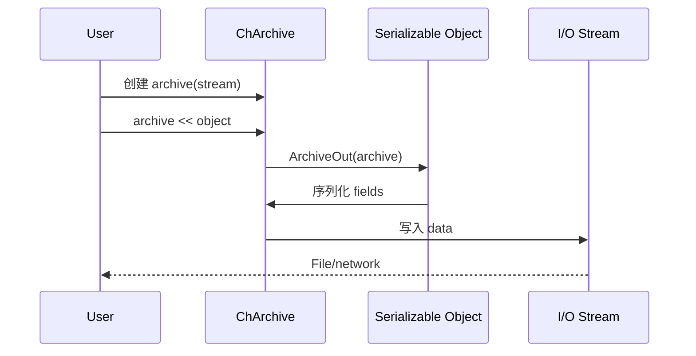

# Serialization 模块架构分析

## 概述

`src/chrono/serialization` 文件夹提供 object serialization and deserialization infrastructure for Chrono. It enables saving and loading simulation states, exporting data to various formats, and supporting checkpoint/restart functionality.

## 主要功能

### 主要职责
1. **Archive Interface**: Abstract serialization interface
2. **Multiple Formats**: JSON, XML, Binary, ASCII support
3. **Object Registration**: Class factory for polymorphic deserialization
4. **Version Control**: Handle schema changes across versions
5. **Pointer Management**: 序列化 object graphs with shared pointers
6. **Introspection**: Object explorer for debugging and inspection

## 设计特性

### 架构模式
- **访问者模式**: Archive visits serializable objects
- **工厂模式**: Class registration for deserialization
- **策略模式**: Different archive formats
- **Template Method**: Base archive defines workflow
- **RAII**: Archive lifetime manages stream state

### 性能考虑
- **Lazy Loading**: Objects loaded on-demand
- **Binary Format**: Compact and fast for large data
- **Buffering**: Efficient I/O through buffering
- **Shared Pointer Tracking**: Preserve object identity
- **Minimal Overhead**: Non-intrusive serialization

## File Structure and Relationships

### Core Classes
```
ChArchive .h/cpp             - Abstract archive base
ChArchiveIn.h               - Input archive (loading)
ChArchiveOut.h              - Output archive (saving)
```

### Format 实现s
```
ChArchiveJSON .h/cpp         - JSON format (human-readable, web-compatible)
ChArchiveXML .h/cpp          - XML format (human-readable, standard)
ChArchiveBinary .h/cpp       - Binary format (compact, fast)
ChArchiveASCII .h/cpp        - ASCII format (simple text)
```

### Supporting Classes
```
ChObjectExplorer .h/cpp      - Introspection and exploration
```

## 架构图

```mermaid
graph TB
    subgraph "Archive Base"
        ARCH[ChArchive]
        ARCHIN[ChArchiveIn]
        ARCHOUT[ChArchiveOut]
    end
    
    subgraph "Format 实现s"
        JSON[ChArchiveJSON]
        XML[ChArchiveXML]
        BIN[ChArchiveBinary]
        ASCII[ChArchiveASCII]
    end
    
    subgraph "实用程序"
        EXPL[ChObjectExplorer]
    end
    
    ARCHIN --|> ARCH
    ARCHOUT --|> ARCH
    
    JSON --> ARCHIN
    JSON --> ARCHOUT
    XML --> ARCHIN
    XML --> ARCHOUT
    BIN --> ARCHIN
    BIN --> ARCHOUT
    ASCII --> ARCHIN
    ASCII --> ARCHOUT
    
    EXPL --> ARCH
    
    style ARCH fill:#e1f5ff
    style JSON fill:#ffe1f5
    style XML fill:#fff5e1
```

## 类层次结构


## 核心外部接口

### 1. Archive Base (ChArchive.h)
```cpp
class ChApi ChArchive {
public:
    // Serialization operators
    template <class T>
    ChArchiveOut& operator<<(const T& obj);
    
    template <class T>
    ChArchiveIn& operator>>(T& obj);
    
    // Named serialization
    template <class T>
    void out(const char* name, const T& obj);
    
    template <class T>
    void in(const char* name, T& obj);
    
    // Versioning
    void SetClassVersion(int version);
    int GetClassVersion() const;
    
    // Pointer management
    bool TrySharePointer(void* ptr);
};
```

### 2. JSON Archive (ChArchiveJSON.h)
```cpp
class ChApi ChArchiveOutJSON : public ChArchiveOut {
public:
    ChArchiveOutJSON(std::ostream& stream);
    
    // 配置
    void SetIndent(int spaces);
    void SetPrettyPrint(bool pretty);
    
    // 写入 operations
    void out(const std::string& name, int value);
    void out(const std::string& name, double value);
    void out(const std::string& name, const std::string& value);
    void out(const std::string& name, bool value);
    
    // Array/container support
    void out_array_pre(const std::string& name, size_t size);
    void out_array_between();
    void out_array_end();
};

class ChApi ChArchiveInJSON : public ChArchiveIn {
public:
    ChArchiveInJSON(std::istream& stream);
    
    // 读取 operations
    void in(const std::string& name, int& value);
    void in(const std::string& name, double& value);
    void in(const std::string& name, std::string& value);
    void in(const std::string& name, bool& value);
    
    // Array/container support
    void in_array_pre(const std::string& name);
    bool in_array_between();
    void in_array_end();
};
```

### 3. Object Explorer (ChObjectExplorer.h)
```cpp
class ChApi ChObjectExplorer {
public:
    // Explore object structure
    static void Explore(ChArchiveOut& archive,
                       const std::string& name,
                       const void* obj);
    
    // Print to console
    static void PrintToConsole(const void* obj,
                              int max_depth = 10);
    
    // 生成 report
    static std::string 生成Report(const void* obj);
};
```

## 依赖关系

### 外部依赖
- **JSON library**: For JSON parsing/generation
- **XML library**: For XML parsing/generation  
- **Standard streams**: std::iostream for I/O

### 内部依赖
- **core**: ChClassFactory for object creation

### 其他模块的使用
- **All modules**: Any class can be serialized
- **output**: Uses archives for data export
- **postprocess**: Load simulation results

## Serialization Example

### Making a Class Serializable
```cpp
class MyClass {
public:
    int value;
    std::string name;
    std::shared_ptr<ChBody> body;
    
    // Serialization method
    void ArchiveOut(ChArchiveOut& archive_out) {
        archive_out << CHNVP(value);
        archive_out << CHNVP(name);
        archive_out << CHNVP(body);
    }
    
    void ArchiveIn(ChArchiveIn& archive_in) {
        archive_in >> CHNVP(value);
        archive_in >> CHNVP(name);
        archive_in >> CHNVP(body);
    }
};

// Register for polymorphic serialization
CH_CLASS_VERSION(MyClass, 1)
```

### Saving to JSON
```cpp
// 创建 archive
std::ofstream file("simulation.json");
ChArchiveOutJSON archive(file);
archive.SetPrettyPrint(true);

// 序列化 system
archive << CHNVP(system);

// Or with name
archive.out("my_system", system);
```

### Loading from JSON
```cpp
// 打开 archive
std::ifstream file("simulation.json");
ChArchiveInJSON archive(file);

// Deserialize
ChSystemNSC system;
archive >> CHNVP(system);
```

## 关键设计决策

### 1. Non-Intrusive Serialization
**决策**: ArchiveOut/ArchiveIn methods, not base class
**理由**:
- No forced inheritance
- Works with existing classes
- Optional serialization
- Clear separation of concerns

### 2. Multiple Format Support
**决策**: Abstract archive with format implementations
**理由**:
- Choose format for use case (JSON for web, binary for performance)
- Same serialization code works for all formats
- Easy to add new formats
- Format-specific features accessible

### 3. Shared Pointer Tracking
**决策**: Maintain pointer identity across serialization
**理由**:
- Preserve object graphs
- Avoid duplicate objects
- Maintain shared ownership
- Essential for complex systems

### 4. Versioning Support
**决策**: Store class version in archive
**理由**:
- Handle schema evolution
- Backward compatibility
- Forward compatibility (with care)
- Clear migration path

### 5. Named Values (CHNVP)
**决策**: Macro for name-value pairs
**理由**:
- Human-readable output
- Self-documenting serialization
- Easy debugging
- JSON/XML compatibility

## 性能特性

### 优势
1. **Binary Format**: Fast and compact for large data
2. **Buffered I/O**: Efficient stream operations
3. **Lazy Loading**: Objects created on-demand
4. **Minimal Copies**: Move semantics where possible
5. **Shared Pointer Reuse**: Avoid duplicate deserialization

### 注意事项
1. **JSON/XML Parsing**: Slower than binary
2. **Large Objects**: Memory usage during serialization
3. **Deep Hierarchies**: Stack depth for nested objects
4. **Pointer Resolution**: Overhead tracking shared pointers

## 典型使用模式

### Complete System Serialization
```cpp
// Save entire simulation
ChSystemNSC system;
// ... build system ...

std::ofstream file("state.json");
ChArchiveOutJSON archive(file);
archive << CHNVP(system);

// Later, restore
ChSystemNSC restored_system;
std::ifstream infile("state.json");
ChArchiveInJSON in_archive(infile);
in_archive >> CHNVP(restored_system);
```

### Selective Serialization
```cpp
// Save only specific objects
archive << CHNVP(body1);
archive << CHNVP(body2);
archive << CHNVP(link);
```

### Containers
```cpp
// 序列化 vectors
std::vector<std::shared_ptr<ChBody>> bodies;
archive << CHNVP(bodies);

// Maps
std::map<std::string, double> parameters;
archive << CHNVP(parameters);
```

### Custom Objects
```cpp
// Implement ArchiveOut/ArchiveIn
void MyData::ArchiveOut(ChArchiveOut& archive) {
    archive << CHNVP(position);
    archive << CHNVP(velocity);
    archive << CHNVP(force);
}

void MyData::ArchiveIn(ChArchiveIn& archive) {
    archive >> CHNVP(position);
    archive >> CHNVP(velocity);
    archive >> CHNVP(force);
}
```

### Object Exploration
```cpp
// Debug object structure
ChObjectExplorer::PrintToConsole(&body);

// 生成 report
std::string report = ChObjectExplorer::生成Report(&system);
std::cout << report;
```

## Format Comparison

### JSON
- **Pros**: Human-readable, web-compatible, debuggable
- **Cons**: Larger files, slower parsing
- **Use**: Configuration, debugging, web integration

### XML
- **Pros**: Human-readable, standard, schema validation
- **Cons**: Verbose, slower than binary
- **Use**: Industry standards, data exchange

### Binary
- **Pros**: Compact, fast, efficient
- **Cons**: Not human-readable, harder to debug
- **Use**: Checkpoints, large data, performance-critical

### ASCII
- **Pros**: Simple, human-readable
- **Cons**: Limited features
- **Use**: Simple data, legacy compatibility

## Advanced Features

### Versioning Example
```cpp
void MyClass::ArchiveIn(ChArchiveIn& archive) {
    int version = archive.GetClassVersion();
    
    if (version >= 1) {
        archive >> CHNVP(field1);
        archive >> CHNVP(field2);
    }
    
    if (version >= 2) {
        archive >> CHNVP(field3);  // Added in version 2
    } else {
        field3 = default_value;
    }
}

CH_CLASS_VERSION(MyClass, 2)
```

### Conditional Serialization
```cpp
void ArchiveOut(ChArchiveOut& archive) {
    archive << CHNVP(always_saved);
    
    if (detailed_output) {
        archive << CHNVP(optional_field);
    }
}
```

### Checkpoint/Restart
```cpp
// Periodic checkpointing
void Simulation::Checkpoint(double time) {
    std::ofstream file("checkpoint_" + std::to_string(time) + ".dat");
    ChArchiveOutBinary archive(file);
    archive << CHNVP(system);
    archive << CHNVP(time);
}

// Restart from checkpoint
void Simulation::Restart(const std::string& filename) {
    std::ifstream file(filename);
    ChArchiveInBinary archive(file);
    archive >> CHNVP(system);
    archive >> CHNVP(current_time);
}
```

## 集成 with Other Systems



## Best Practices

### 1. Always Use CHNVP
```cpp
// Good
archive << CHNVP(my_variable);

// Bad (no name)
archive << my_variable;
```

### 2. Version Your Classes
```cpp
// Declare version
CH_CLASS_VERSION(MyClass, 1)

// Handle in ArchiveIn
if (archive.GetClassVersion() >= 2) {
    // New fields
}
```

### 3. Test Serialization Round-Trip
```cpp
// Save
archive_out << CHNVP(object);

// Load
archive_in >> CHNVP(loaded_object);

// Verify
assert(object == loaded_object);
```

### 4. Use Appropriate Format
- JSON: Configuration, debugging
- Binary: Performance, large data
- XML: Standards compliance

## 总结

The serialization 模块提供:
- Flexible serialization framework with multiple formats
- Non-intrusive design compatible with existing classes
- Shared pointer tracking for object graphs
- Versioning support for schema evolution
- Object introspection for debugging
- Efficient binary format for performance

Its design emphasizes flexibility and ease of use while supporting both human-readable formats for development and efficient binary formats for production use.
