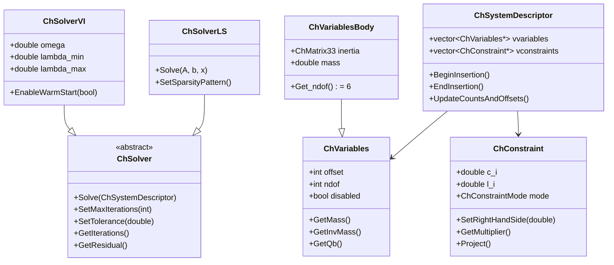
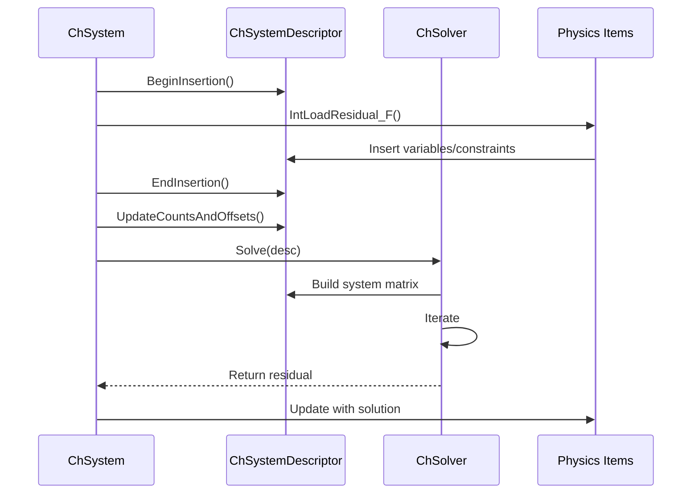

# Solver 模块架构分析

## 概述

The `src/chrono/solver` folder contains the numerical solvers for solving the equations of motion in Chrono. It includes constraint-based solvers for both variational inequality (VI) problems and linear systems, supporting different formulations (NSC/DVI and SMC) and optimization algorithms.

## 主要功能

### 主要职责
1. **Constraint Solving**: Solve constrained equations of motion
2. **Variational Inequality Solvers**: Handle complementarity conditions (contacts, friction)
3. **Linear System Solvers**: Solve KKT systems and sparse linear systems
4. **Direct Solvers**: Dense and sparse direct methods
5. **Iterative Solvers**: Conjugate gradient, MINRES, SOR, Jacobi methods
6. **Variable Management**: Represent degrees of freedom and Lagrange multipliers
7. **Constraint Representation**: Bilateral and unilateral constraints

## 设计特性

### 架构模式
- **Strategy Pattern**: Pluggable solver algorithms
- **Template Method**: Base solver with customizable steps
- **Composite Pattern**: Constraint tuples for multi-body constraints
- **Iterator Pattern**: Traversal of constraint and variable lists
- **Descriptor Pattern**: ChSystemDescriptor aggregates all DOFs and constraints

### 性能考虑
- **Sparse Matrix Operations**: Optimized for sparse Jacobians
- **Iterative Refinement**: Trade accuracy for speed
- **Warm Starting**: Reuse previous solution as initial guess
- **Parallel Solvers**: Some solvers support OpenMP parallelization
- **Memory Efficiency**: In-place operations, minimal allocations

## File Structure and Relationships

### Solver Base Classes
```
ChSolver.h/cpp              - Abstract base solver
ChSolverVI.h/cpp            - VI (complementarity) solver base
ChSolverLS.h/cpp            - Linear system solver base
ChDirectSolverLS.h/cpp      - Direct linear solver base
ChDirectSolverLScomplex.h   - Complex direct solver
ChIterativeSolver.h/cpp     - Iterative solver base
```

### Iterative VI Solvers
```
ChSolverPSOR.h/cpp          - Projected SOR (fastest, default for NSC)
ChSolverPSSOR.h/cpp         - Projected symmetric SOR
ChSolverPJacobi.h/cpp       - Projected Jacobi
ChSolverAPGD.h/cpp          - Accelerated projected gradient descent
ChSolverADMM.h/cpp          - ADMM (Alternating Direction Method)
ChSolverBB.h/cpp            - Barzilai-Borwein method
```

### Linear System Solvers
```
ChSolverPMINRES.h/cpp       - Preconditioned MINRES
ChSolverGMRES.h/cpp         - GMRES iterative method
ChSolverBiCGSTAB.h/cpp      - BiCGSTAB method
ChSolverCG.h/cpp            - Conjugate Gradient
```

### Direct Solvers (External)
```
ChDirectSolverLS.h          - Interface for direct solvers
ChSolverSparseLU.h/cpp      - Sparse LU decomposition (Eigen)
ChSolverSparseQR.h/cpp      - Sparse QR decomposition (Eigen)
ChSolverDenseQR.h/cpp       - Dense QR (small systems)
```

### System Descriptor
```
ChSystemDescriptor.h/cpp    - Aggregates variables and constraints
ChKRMBlock.h/cpp            - KKT matrix block representation
```

### Variables (DOFs)
```
ChVariables.h/cpp                   - Base DOF container
ChVariablesBody.h/cpp               - 6-DOF rigid body
ChVariablesBodyOwnMass.h/cpp        - Body with own mass matrix
ChVariablesGeneric.h/cpp            - Generic n-DOF
ChVariablesGenericDiagonalMass.h    - Diagonal mass matrix
ChVariablesNode.h/cpp               - Node (FEA, particles)
ChVariablesShaft.h/cpp              - 1-DOF shaft
```

### Constraints
```
ChConstraint.h/cpp                  - Base constraint
ChConstraintTwo.h/cpp               - 2-body constraint base
ChConstraintTwoBodies.h/cpp         - 2 rigid bodies
ChConstraintTwoGeneric.h/cpp        - 2 generic variables
ChConstraintTwoGenericBoxed.h/cpp   - Boxed constraint (limits)
ChConstraintThree.h/cpp             - 3-body constraint base
ChConstraintThreeGeneric.h/cpp      - 3 generic variables
ChConstraintThreeBBShaft.h/cpp      - 2 bodies + 1 shaft
ChConstraintNgeneric.h/cpp          - N generic variables
```

### Contact Constraints
```
ChConstraintContactNormal.h/cpp         - Normal contact force
ChConstraintContactTangential.h/cpp     - Tangential friction
ChConstraintRollingNormal.h/cpp         - Rolling friction
ChConstraintRollingTangential.h/cpp     - Spinning friction
```

### Constraint Tuples
```
ChConstraintTuple.h             - Base tuple interface
ChConstraintTwoTuples.h         - 2-variable tuple
ChConstraintThreeTuples.h       - 3-variable tuple
ChConstraintNTuples.h           - N-variable tuple
```

## 架构图

```mermaid
graph TB
    subgraph "Solver Layer"
        SOL[ChSolver]
        SOLVI[ChSolverVI]
        SOLLS[ChSolverLS]
    end
    
    subgraph "VI Solvers"
        PSOR[ChSolverPSOR]
        PSSOR[ChSolverPSSOR]
        APGD[ChSolverAPGD]
        ADMM[ChSolverADMM]
        BB[ChSolverBB]
    end
    
    subgraph "Linear Solvers"
        PMINRES[ChSolverPMINRES]
        GMRES[ChSolverGMRES]
        CG[ChSolverCG]
        LU[ChSolverSparseLU]
    end
    
    subgraph "System Descriptor"
        SD[ChSystemDescriptor]
        KRM[ChKRMBlock]
    end
    
    subgraph "Variables (DOFs)"
        VAR[ChVariables]
        VBODY[ChVariablesBody]
        VGEN[ChVariablesGeneric]
        VSHAFT[ChVariablesShaft]
    end
    
    subgraph "Constraints"
        CONS[ChConstraint]
        C2[ChConstraintTwo]
        C3[ChConstraintThree]
        CCONT[ChConstraintContactNormal]
    end
    
    SOLVI --|> SOL
    SOLLS --|> SOL
    
    PSOR --|> SOLVI
    PSSOR --|> SOLVI
    APGD --|> SOLVI
    ADMM --|> SOLVI
    BB --|> SOLVI
    
    PMINRES --|> SOLLS
    GMRES --|> SOLLS
    CG --|> SOLLS
    LU --|> SOLLS
    
    SD --> VAR
    SD --> CONS
    
    VBODY --|> VAR
    VGEN --|> VAR
    VSHAFT --|> VAR
    
    C2 --|> CONS
    C3 --|> CONS
    CCONT --|> CONS
    
    SOL --> SD
    
    style SOL fill:#e1f5ff
    style SD fill:#ffe1f5
    style VAR fill:#fff5e1
    style CONS fill:#e1ffe1
```

## 类层次结构



## 核心外部接口

### 1. Solver Base (ChSolver.h)
```cpp
class ChApi ChSolver {
public:
    // Main solve method
    virtual double Solve(ChSystemDescriptor& sysd) = 0;
    
    // Configuration
    void SetMaxIterations(int max_iters);
    int GetMaxIterations() const;
    
    void SetTolerance(double tolerance);
    double GetTolerance() const;
    
    // Results
    int GetIterations() const;
    double GetResidual() const;
    double GetError() const;
    
    // Verbose output
    void SetVerbose(bool verbose);
};
```

### 2. VI Solver (ChSolverVI.h)
```cpp
class ChApi ChSolverVI : public ChSolver {
public:
    // Relaxation parameter
    void SetOmega(double omega);  // Typically 1.0
    double GetOmega() const;
    
    // Sharpness (friction cone approximation)
    void SetSharpnessLambda(double sharpness);  // 1.0 = perfect cone
    double GetSharpnessLambda() const;
    
    // Warm start
    void EnableWarmStart(bool enable);
    bool IsWarmStartEnabled() const;
    
    // Solve VI problem: find lambda such that:
    // M*v = k + Cq'*lambda
    // C*v + c >= 0
    // lambda >= 0
    // lambda * (C*v + c) = 0
    double Solve(ChSystemDescriptor& sysd) override;
};
```

### 3. System Descriptor (ChSystemDescriptor.h)
```cpp
class ChApi ChSystemDescriptor {
public:
    // Variable/constraint management
    void InsertVariables(ChVariables* var);
    void InsertConstraint(ChConstraint* cons);
    
    void BeginInsertion();  // Prepare for batch insertion
    void EndInsertion();    // Finalize and update offsets
    
    // Build system matrices
    void UpdateCountsAndOffsets();
    int CountActiveVariables();
    int CountActiveConstraints();
    
    // System building
    void BuildSystemMatrix(ChSparseMatrix* mat);
    void BuildRhsVector(ChVectorDynamic<>& rhs);
    
    // Matrix operations
    void SystemProduct(ChVectorDynamic<>& result,
                      const ChVectorDynamic<>& x);
    
    // Constraint Jacobian operations
    void ConstraintsProject(ChVectorDynamic<>& multipliers);
    void ConstraintsFetch_react(double factor);
    
    // Access
    std::vector<ChVariables*>& GetVariables();
    std::vector<ChConstraint*>& GetConstraints();
};
```

### 4. Variables (ChVariables.h)
```cpp
class ChApi ChVariables {
public:
    // DOF information
    virtual int GetDOF() const = 0;
    int GetOffset() const;
    
    // State vectors
    virtual ChVectorRef GetQb() = 0;          // Force vector
    virtual ChVectorRef GetState() = 0;       // Position/velocity
    virtual ChVectorRef GetStateDt() = 0;     // Velocity/acceleration
    
    // Mass matrix operations
    virtual void ComputeMassInverseTimesVector(
        ChVectorRef result,
        ChVectorConstRef vect) const = 0;
    
    // Disable/enable
    void SetDisabled(bool disabled);
    bool IsDisabled() const;
    
    // Active state
    bool IsActive() const;
};

// Body variables (6 DOF)
class ChApi ChVariablesBody : public ChVariables {
public:
    int GetDOF() const override { return 6; }
    
    void SetBodyMass(double mass);
    void SetBodyInertia(const ChMatrix33<>& inertia);
    
    const ChMatrix33<>& GetBodyInertia() const;
    double GetBodyMass() const;
};
```

### 5. Constraints (ChConstraint.h)
```cpp
class ChApi ChConstraint {
public:
    enum Mode {
        FREE,       // No constraint
        LOCK,       // Bilateral constraint
        UNILATERAL  // Inequality constraint (>= 0)
    };
    
    // Configuration
    void SetMode(Mode mode);
    Mode GetMode() const;
    
    // Constraint equation: C*q + c = 0 (bilateral)
    //                  or: C*q + c >= 0 (unilateral)
    void SetRightHandSide(double c_i);
    double GetRightHandSide() const;
    
    // Lagrange multiplier
    void SetMultiplier(double l_i);
    double GetMultiplier() const;
    
    // Projection (for VI solvers)
    virtual void Project() = 0;
    
    // Constraint Jacobian contributions
    virtual void MultiplyTandAdd(ChVectorRef result,
                                ChVectorConstRef vect) const = 0;
    virtual void MultiplyAndAdd(ChVectorRef result,
                               ChVectorConstRef vect) const = 0;
    
    // Active state
    bool IsActive() const;
    void SetActive(bool active);
};
```

### 6. Two-Body Constraint (ChConstraintTwo.h)
```cpp
class ChApi ChConstraintTwo : public ChConstraint {
public:
    // Variables
    ChVariables* GetVariables_a();
    ChVariables* GetVariables_b();
    
    void SetVariables(ChVariables* var_a, ChVariables* var_b);
    
    // Jacobian vectors (constraint gradient w.r.t. each variable)
    virtual ChVectorConstRef Get_Cq_a() const = 0;
    virtual ChVectorConstRef Get_Cq_b() const = 0;
    
    // Compliance (inverse stiffness)
    void SetComplianceMatrix(const ChMatrixConstRef& C);
    const ChMatrix& GetComplianceMatrix() const;
};
```

## 依赖关系

### 外部依赖
- **Eigen3**: Matrix operations, sparse solvers (SparseLU, SparseQR)
- **MKL (optional)**: Intel Math Kernel Library for Pardiso solver
- **MUMPS (optional)**: Parallel sparse direct solver

### 内部依赖
- **core**: ChVector, ChMatrix for linear algebra
- **physics**: ChPhysicsItem provides variables and constraints
- **timestepper**: Provides mass matrix and force calculations

### 其他模块的使用
- **physics**: ChSystem uses solvers via ChSystemDescriptor
- **fea**: FEA elements contribute variables and constraints
- **vehicle**: Vehicle constraints solved by core solvers

## 关键设计决策

### 1. Descriptor Pattern
**决策**: ChSystemDescriptor aggregates all variables and constraints
**理由**:
- Centralized system assembly
- Efficient sparse matrix construction
- Uniform interface for all solvers
- Enables different solver backends

### 2. Separate VI and LS Solvers
**决策**: Distinct solver hierarchies for VI and linear systems
**理由**:
- VI solvers handle complementarity (contacts, friction)
- LS solvers for smooth systems (no contacts)
- Different algorithms and convergence criteria
- Enables specialized optimizations

### 3. Variable Abstraction
**决策**: ChVariables hides DOF implementation details
**理由**:
- Bodies, nodes, shafts have different DOF structures
- Uniform interface for solver
- Enables custom variable types
- Supports block-structured operations

### 4. Constraint Tuples
**决策**: Constraints reference variables via tuples
**理由**:
- Efficient Jacobian-vector products
- Supports arbitrary number of coupled variables
- Cache-friendly data layout
- Enables constraint templates

### 5. Warm Starting
**决策**: Optional reuse of previous Lagrange multipliers
**理由**:
- Faster convergence for similar configurations
- Important for real-time applications
- Small overhead if not beneficial
- Enabled by default in VI solvers

## 性能特性

### 优势
1. **Sparse Operations**: Optimized for sparse constraint Jacobians
2. **Iterative Solvers**: Scale well to large systems
3. **Warm Starting**: Reduces iterations in sequential time steps
4. **Block Structure**: Exploits block diagonal mass matrix
5. **Parallel Potential**: Some solvers support parallelization

### 注意事项
1. **Iteration Count**: May require many iterations for tight tolerances
2. **Stiff Systems**: Challenging for iterative methods
3. **Conditioning**: Poor conditioning increases iteration count
4. **Contact Friction**: Increases problem complexity
5. **Memory Bandwidth**: Large systems limited by memory access

## Solver Selection Guide

### For NSC Systems (DVI, contacts)
```cpp
// Default: Projected SOR (fast, robust)
auto solver = chrono_types::make_shared<ChSolverPSOR>();
solver->SetMaxIterations(50);
solver->SetOmega(1.0);
solver->EnableWarmStart(true);

// Accurate: ADMM (slower, more accurate)
auto solver = chrono_types::make_shared<ChSolverADMM>();
solver->SetMaxIterations(100);
solver->SetRho(0.1);  // ADMM parameter

// Fast: APGD (accelerated gradient)
auto solver = chrono_types::make_shared<ChSolverAPGD>();
solver->SetMaxIterations(30);
```

### For SMC Systems (smooth, penalty)
```cpp
// Default: MINRES (preconditioned)
auto solver = chrono_types::make_shared<ChSolverPMINRES>();
solver->SetMaxIterations(100);
solver->SetTolerance(1e-6);

// Conjugate Gradient (symmetric positive definite)
auto solver = chrono_types::make_shared<ChSolverCG>();

// Direct solver (small systems)
auto solver = chrono_types::make_shared<ChSolverSparseLU>();
```

## Typical Solver Configuration

```cpp
// Configure system descriptor
ChSystemDescriptor system_descriptor;

// Add variables (automatically done by physics items)
// Add constraints (automatically done by links, contacts)

// Build system
system_descriptor.BeginInsertion();
system_descriptor.EndInsertion();

// Solve
double residual = solver->Solve(system_descriptor);

// Extract solution (Lagrange multipliers in constraints)
for (auto& constraint : system_descriptor.GetConstraints()) {
    double lambda = constraint->GetMultiplier();
}
```

## Advanced Features

### 1. Custom Constraints
```cpp
class MyConstraint : public ChConstraintTwo {
public:
    void Project() override {
        // Custom projection for special constraint
        if (l_i < lower_limit) l_i = lower_limit;
        if (l_i > upper_limit) l_i = upper_limit;
    }
    
    ChVectorConstRef Get_Cq_a() const override {
        return my_jacobian_a;
    }
};
```

### 2. Constraint Compliance
```cpp
// Add compliance (softness) to constraint
constraint->SetComplianceMatrix(ChMatrixConstRef(compliance));
// Equivalent to spring with stiffness = 1/compliance
```

### 3. Direct Solver for Subproblems
```cpp
// Use direct solver for part of the system
auto direct_solver = chrono_types::make_shared<ChSolverSparseLU>();

// Build and solve subsystem
ChSparseMatrix A;
ChVectorDynamic<> b, x;
// ... build A and b ...
direct_solver->Solve(A, b, x);
```

## Solver Algorithms Overview

### PSOR (Projected Successive Over-Relaxation)
- **Type**: Iterative VI solver
- **Complexity**: O(n) per iteration
- **Strengths**: Fast, robust, good for contacts
- **Weaknesses**: May need many iterations

### ADMM (Alternating Direction Method of Multipliers)
- **Type**: Iterative VI solver with consensus
- **Complexity**: O(n) per iteration
- **Strengths**: More accurate than PSOR
- **Weaknesses**: Slower, requires tuning ρ parameter

### APGD (Accelerated Projected Gradient Descent)
- **Type**: Accelerated iterative VI solver
- **Complexity**: O(n) per iteration
- **Strengths**: Fast convergence for well-conditioned problems
- **Weaknesses**: May oscillate on ill-conditioned systems

### PMINRES (Preconditioned Minimum Residual)
- **Type**: Krylov subspace iterative LS solver
- **Complexity**: O(n) per iteration
- **Strengths**: Handles non-symmetric systems
- **Weaknesses**: Requires preconditioning for fast convergence

## Integration with Physics System



## 总结

The solver module provides:
- Comprehensive solver library for constrained dynamics
- Specialized VI solvers for contact/friction (NSC)
- Linear system solvers for smooth systems (SMC)
- Efficient sparse matrix operations
- Flexible variable and constraint abstractions
- Integration with external solver libraries

Its design emphasizes performance through sparse operations and iterative methods while maintaining flexibility through abstract interfaces and pluggable solver algorithms. The descriptor pattern enables efficient system assembly and uniform solver interfaces.
