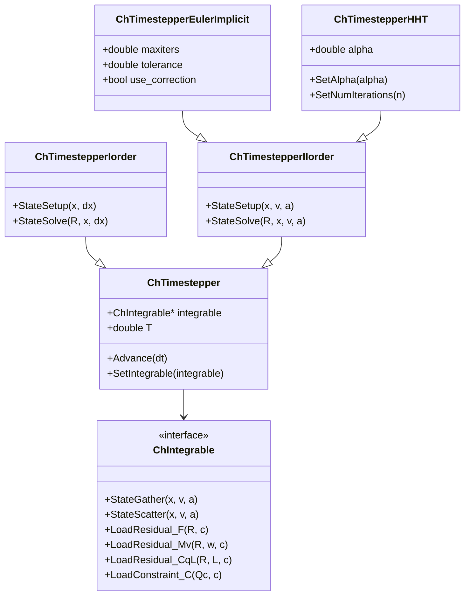
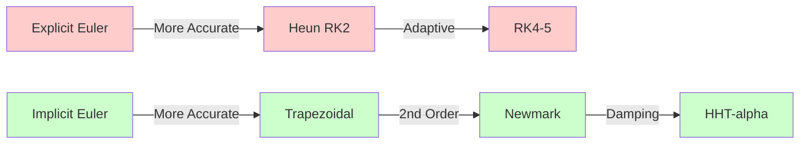
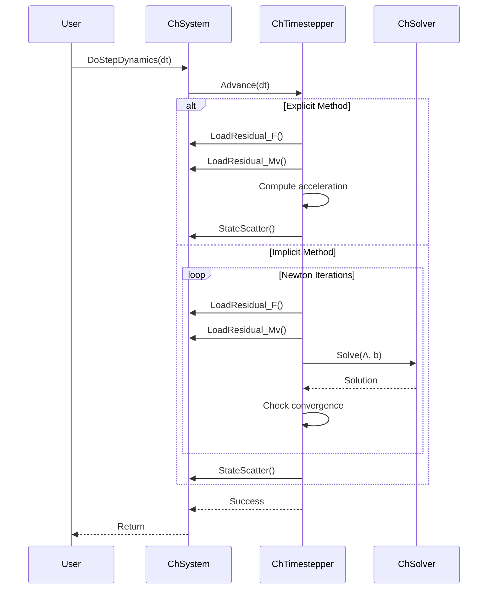

# Timestepper 模块架构分析

## 概述

The `src/chrono/timestepper` folder implements time integration methods for advancing the simulation state. It provides various integration schemes from explicit Euler to implicit methods with different accuracy, stability, and computational cost characteristics.

## 主要功能

### 主要职责
1. **Time Integration**: Advance system state from t to t+dt
2. **Integration Schemes**: Explicit and implicit methods
3. **Stability Control**: Methods with different stability regions
4. **State Management**: Handle positions, velocities, accelerations
5. **Static Analysis**: Solve equilibrium problems
6. **Assembly Analysis**: Satisfy initial constraints

## 设计特性

### 架构模式
- **Strategy Pattern**: Pluggable time integration algorithms
- **Template Method**: Base class defines integration workflow
- **State Pattern**: Different states (position, velocity, acceleration)
- **Chain of Responsibility**: Nested integrators for higher-order schemes

### 性能考虑
- **Explicit Methods**: Fast per-step, limited stability
- **Implicit Methods**: Slower per-step, better stability
- **Adaptive Stepping**: Automatic step size control
- **Linear System Reuse**: Factorization caching for implicit methods

## File Structure and Relationships

### Base Classes
```
ChIntegrable.h              - Interface for integrable systems
ChState.h                   - State vector representation
ChTimestepper.h/cpp         - Abstract base timestepper
```

### Explicit Methods
```
ChTimestepperEulerExpl.h/cpp              - Forward Euler (1st order)
ChTimestepperEulerExplIIorder.h/cpp       - Explicit Euler for 2nd order
ChTimestepperRungeKutta45.h/cpp           - RK4(5) adaptive
ChTimestepperHeun.h/cpp                   - Heun's method (RK2)
```

### Implicit Methods
```
ChTimestepperEulerImplicit.h/cpp          - Backward Euler
ChTimestepperEulerImplicitLinearized.h/cpp - Linearized backward Euler
ChTimestepperEulerImplicitProjected.h/cpp  - Projected backward Euler
ChTimestepperTrapezoidalLinearized.h/cpp   - Trapezoidal rule
ChTimestepperNewmark.h/cpp                 - Newmark method
ChTimestepperHHT.h/cpp                     - HHT-alpha method
```

### Special Analysis
```
ChStaticAnalysis.h/cpp      - Static equilibrium solver
ChAssemblyAnalysis.h/cpp    - Initial constraint satisfaction
```

## 架构图

```mermaid
graph TB
    subgraph "Integrable Interface"
        INT[ChIntegrable]
        STATE[ChState]
    end
    
    subgraph "Timestepper Base"
        TS[ChTimestepper]
        TSI[ChTimestepperIorder]
        TSII[ChTimestepperIIorder]
    end
    
    subgraph "Explicit Methods"
        EE[ChTimestepperEulerExpl]
        EE2[ChTimestepperEulerExplIIorder]
        RK45[ChTimestepperRungeKutta45]
        HEUN[ChTimestepperHeun]
    end
    
    subgraph "Implicit Methods"
        EI[ChTimestepperEulerImplicit]
        EIL[ChTimestepperEulerImplicitLinearized]
        TRAP[ChTimestepperTrapezoidalLinearized]
        NEW[ChTimestepperNewmark]
        HHT[ChTimestepperHHT]
    end
    
    subgraph "Special Analysis"
        STATIC[ChStaticAnalysis]
        ASM[ChAssemblyAnalysis]
    end
    
    TSI --|> TS
    TSII --|> TS
    
    EE --|> TSI
    RK45 --|> TSI
    HEUN --|> TSI
    
    EE2 --|> TSII
    EI --|> TSII
    EIL --|> TSII
    TRAP --|> TSII
    NEW --|> TSII
    HHT --|> TSII
    
    TS --> INT
    TS --> STATE
    
    STATIC --> TS
    ASM --> TS
    
    style TS fill:#e1f5ff
    style TSI fill:#ffe1f5
    style TSII fill:#fff5e1
    style INT fill:#e1ffe1
```

## 类层次结构



## 核心外部接口

### 1. Integrable Interface (ChIntegrable.h)
```cpp
class ChApi ChIntegrable {
public:
    // State information
    virtual int GetNumCoordsPosLevel() = 0;  // Position DOFs
    virtual int GetNumCoordsVelLevel() = 0;  // Velocity DOFs
    virtual int GetNumConstraints() = 0;      // Constraints
    
    // State scatter/gather
    virtual void StateGather(ChState& x, ChStateDelta& v, double& T) = 0;
    virtual void StateScatter(const ChState& x, 
                             const ChStateDelta& v, 
                             const double T) = 0;
    
    // Residuals
    virtual void LoadResidual_F(ChVectorDynamic<>& R, double c) = 0;
    virtual void LoadResidual_Mv(ChVectorDynamic<>& R,
                                const ChVectorDynamic<>& w,
                                double c) = 0;
    
    // Constraints
    virtual void LoadConstraint_C(ChVectorDynamic<>& Qc,
                                 const double c,
                                 bool do_clamp = false,
                                 double clamp = 1e30) = 0;
    
    virtual void LoadConstraint_Ct(ChVectorDynamic<>& Qc,
                                  const double c) = 0;
};
```

### 2. Timestepper Base (ChTimestepper.h)
```cpp
class ChApi ChTimestepper {
public:
    // Integration step
    virtual void Advance(const double dt) = 0;
    
    // Configuration
    void SetIntegrable(ChIntegrable* integrable);
    ChIntegrable* GetIntegrable();
    
    // Time management
    double GetTime() const;
    void SetTime(double t);
    
    // Verbose output
    void SetVerbose(bool verbose);
    
    // Solver access
    virtual ChSolver* GetSolver();
    virtual void SetSolver(std::shared_ptr<ChSolver> solver);
};
```

### 3. Implicit Timestepper (ChTimestepperEulerImplicit.h)
```cpp
class ChApi ChTimestepperEulerImplicit : public ChTimestepperIIorder {
public:
    // Advance one step
    void Advance(const double dt) override;
    
    // Newton-Raphson parameters
    void SetMaxIters(int iters);
    int GetMaxIters() const;
    
    void SetAbsTolerances(double tol_pos, double tol_vel);
    void SetRelTolerances(double tol_pos, double tol_vel);
    
    // Residual scaling
    void SetMode(eChImplicitMode mode);
    enum eChImplicitMode {
        ALGEBRAIC,      // Standard implicit
        INCREMENTAL,    // Incremental form
        POSITION        // Position level
    };
    
    // Correction iteration
    void SetUseCorrection(bool use);
};
```

### 4. HHT Method (ChTimestepperHHT.h)
```cpp
class ChApi ChTimestepperHHT : public ChTimestepperIIorder {
public:
    // HHT-alpha parameter
    void SetAlpha(double alpha);  // -1/3 to 0 (0 = Newmark)
    double GetAlpha() const;
    
    // Modified alpha method
    void SetModifiedNewton(bool use);
    
    // Scaling factors
    void SetStepControl(bool use);
    void SetMinStepSize(double min_step);
    
    // Advance
    void Advance(const double dt) override;
};
```

### 5. Static Analysis (ChStaticAnalysis.h)
```cpp
class ChApi ChStaticAnalysis {
public:
    // Solve static equilibrium
    bool StaticSolve(int max_iters = 20,
                    bool verbose = false);
    
    // Linear static analysis
    bool LinearStaticSolve(bool verbose = false);
    
    // Incremental static loading
    bool IncrementalStaticSolve(int increments,
                               bool verbose = false);
    
    // Solver configuration
    void SetIntegrable(ChIntegrable* integrable);
    void SetMaxIters(int iters);
    void SetTolerances(double tol_pos, double tol_vel);
};
```

### 6. Assembly Analysis (ChAssemblyAnalysis.h)
```cpp
class ChApi ChAssemblyAnalysis {
public:
    // Satisfy constraints at initial configuration
    bool AssemblyAnalysis(int max_iters = 20,
                         double tolerance = 1e-6);
    
    // Assembly levels
    enum class Level {
        POSITION,       // Satisfy C(q) = 0
        VELOCITY,       // Satisfy Cq*v = 0
        ACCELERATION    // Satisfy Cq*a + Ct = 0
    };
    
    bool AssemblyAnalysis(Level level,
                         int max_iters = 20,
                         double tolerance = 1e-6);
    
    // Configuration
    void SetIntegrable(ChIntegrable* integrable);
};
```

## 依赖关系

### 外部依赖
- **Eigen3**: For state vectors and linear algebra

### 内部依赖
- **core**: ChVector, ChMatrix for state representation
- **solver**: ChSolver for implicit methods
- **physics**: ChSystem implements ChIntegrable interface

### 其他模块的使用
- **physics**: ChSystem uses timesteppers for simulation
- **fea**: Dynamic FEA analysis uses implicit timesteppers

## 关键设计决策

### 1. Integrable Interface
**决策**: Separate time integration from physics implementation
**理由**:
- Physics engine focuses on forces and constraints
- Timestepper focuses on numerical integration
- Enables testing different integration schemes
- Supports custom integrable systems

### 2. State Abstraction
**决策**: ChState and ChStateDelta for position/velocity
**理由**:
- Uniform interface for different coordinate systems
- Supports Lie groups (e.g., quaternions)
- Enables automatic differentiation
- Simplifies integrator implementation

### 3. I-order vs II-order
**决策**: Separate base classes for 1st and 2nd order ODEs
**理由**:
- Most mechanical systems are 2nd order
- Specialized methods for 2nd order (Newmark, HHT)
- 1st order useful for custom systems
- Clear API for each type

### 4. Implicit with Linearization
**决策**: Provide linearized versions of implicit methods
**理由**:
- Faster than full Newton-Raphson
- Acceptable accuracy for many systems
- One iteration per step
- Suitable for real-time applications

### 5. Static and Assembly Analysis
**决策**: Separate classes for special analyses
**理由**:
- Different convergence criteria
- Specialized algorithms
- Clear API for users
- Reuses solver infrastructure

## 性能特性

### Explicit Methods
**Strengths:**
- Very fast per step
- No linear system solve
- Minimal memory

**Weaknesses:**
- Stability limited (dt < critical)
- Not suitable for stiff systems
- Position drift in long simulations

### Implicit Methods
**Strengths:**
- Unconditionally stable (some)
- Handles stiff systems
- Better long-term accuracy

**Weaknesses:**
- Expensive linear solves
- Nonlinear iterations needed
- More memory for factorization

## Integration Scheme Comparison



## 典型使用模式

### Selecting a Timestepper
```cpp
// Fast explicit (only for non-stiff, no contacts)
system.SetTimestepperType(ChTimestepper::Type::EULER_EXPLICIT);

// Default implicit (balanced)
system.SetTimestepperType(ChTimestepper::Type::EULER_IMPLICIT_LINEARIZED);

// High accuracy implicit
auto stepper = chrono_types::make_shared<ChTimestepperHHT>();
stepper->SetAlpha(-0.2);  // Numerical damping
stepper->SetMaxIters(20);
stepper->SetAbsTolerances(1e-6, 1e-6);
system.SetTimestepper(stepper);

// Adaptive explicit
auto stepper_rk = chrono_types::make_shared<ChTimestepperRungeKutta45>();
stepper_rk->SetTolerance(1e-4);
system.SetTimestepper(stepper_rk);
```

### Static Analysis
```cpp
// Solve static equilibrium
ChStaticAnalysis static_analysis;
static_analysis.SetIntegrable(&system);
static_analysis.SetMaxIters(100);
static_analysis.SetTolerances(1e-10, 1e-10);

bool success = static_analysis.StaticSolve();
if (success) {
    // System is now at equilibrium
}
```

### Assembly Analysis
```cpp
// Satisfy initial constraints
ChAssemblyAnalysis assembly;
assembly.SetIntegrable(&system);

// Position level
assembly.AssemblyAnalysis(
    ChAssemblyAnalysis::Level::POSITION, 100, 1e-6);

// Velocity level (after position)
assembly.AssemblyAnalysis(
    ChAssemblyAnalysis::Level::VELOCITY, 100, 1e-6);
```

### Custom Integrable
```cpp
class MySystem : public ChIntegrable {
    int GetNumCoordsPosLevel() override { return n_pos; }
    int GetNumCoordsVelLevel() override { return n_vel; }
    
    void LoadResidual_F(ChVectorDynamic<>& R, double c) override {
        // Add forces: R += c * F
    }
    
    void LoadResidual_Mv(ChVectorDynamic<>& R,
                        const ChVectorDynamic<>& w,
                        double c) override {
        // Add mass term: R += c * M * w
    }
};
```

## Integration Step Workflow



## Advanced Features

### 1. Modified Newton Iteration
```cpp
// For implicit methods, reuse Jacobian
stepper->SetModifiedNewton(true);
// Factorize once, iterate with same matrix
```

### 2. Step Size Control
```cpp
// Adaptive timestepping
auto stepper = chrono_types::make_shared<ChTimestepperRungeKutta45>();
stepper->SetTolerance(1e-4);
stepper->SetMinStepSize(1e-6);
stepper->SetMaxStepSize(0.01);
// Step size automatically adjusted
```

### 3. Incremental Loading
```cpp
// Apply load gradually
static_analysis.IncrementalStaticSolve(
    10,    // 10 increments
    true   // verbose
);
// Useful for large deformations
```

## Integration Accuracy

### Order of Accuracy
- **Euler Explicit**: O(dt) - 1st order
- **Heun (RK2)**: O(dt²) - 2nd order  
- **RK4**: O(dt⁴) - 4th order
- **Euler Implicit**: O(dt) - 1st order
- **Trapezoidal**: O(dt²) - 2nd order
- **Newmark**: O(dt²) - 2nd order
- **HHT-alpha**: O(dt²) - 2nd order with damping

### Stability Regions
- **Explicit Euler**: Conditionally stable (dt < 2/ω_max)
- **RK4**: Conditionally stable (larger than Euler)
- **Implicit Euler**: Unconditionally stable, overdamped
- **Trapezoidal**: Conditionally stable
- **Newmark**: Conditionally stable (β ≥ 1/4)
- **HHT-alpha**: Unconditionally stable, controllable damping

## Recommended Settings

### Rigid Body Systems with Contacts (NSC)
```cpp
// Implicit linearized (fast, stable)
system.SetTimestepperType(
    ChTimestepper::Type::EULER_IMPLICIT_LINEARIZED);
// dt: 0.001 - 0.01 seconds
```

### Smooth Systems (SMC, no contacts)
```cpp
// HHT-alpha (accurate, stable)
auto hht = chrono_types::make_shared<ChTimestepperHHT>();
hht->SetAlpha(-0.2);
system.SetTimestepper(hht);
// dt: 0.001 - 0.01 seconds
```

### FEA Systems
```cpp
// HHT-alpha with tight tolerances
auto hht = chrono_types::make_shared<ChTimestepperHHT>();
hht->SetAlpha(-0.3);  // More damping for stiff systems
hht->SetMaxIters(50);
hht->SetAbsTolerances(1e-8, 1e-8);
// dt: 0.0001 - 0.001 seconds
```

### Real-Time Applications
```cpp
// Euler implicit linearized (one iteration)
auto euler = chrono_types::make_shared<ChTimestepperEulerImplicitLinearized>();
euler->SetMaxIters(1);  // Force single iteration
// dt: fixed at frame rate (e.g., 1/60)
```

## 总结

The timestepper module provides:
- Comprehensive time integration methods from explicit to implicit
- Specialized methods for mechanical systems (2nd order ODEs)
- Static and assembly analysis capabilities
- Flexible integrable interface for custom systems
- Performance/accuracy trade-offs through method selection

Its design emphasizes numerical stability and accuracy while providing options for real-time performance. The separation of integration from physics allows easy experimentation with different schemes and enables extension to custom dynamical systems.
