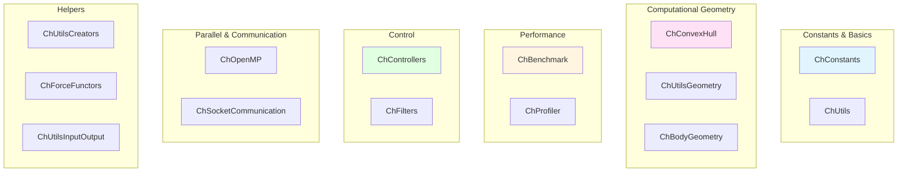

# Utils 模块架构分析

## 概述

The `src/chrono/utils` folder contains utility classes and helper functions used across the Chrono codebase. It provides benchmarking tools, geometric utilities, constants, controllers, convex hull computation, and various helper functions.

## 主要功能

### 主要职责
1. **Constants**: Physical and mathematical constants
2. **Convex Hull**: Computational geometry for convex hulls
3. **Benchmarking**: Performance measurement tools
4. **Controllers**: PID and other control algorithms
5. **Body Geometry**: Helper functions for body creation
6. **Filters**: Signal processing and data filtering
7. **OpenMP Utilities**: Parallel computing helpers
8. **Socket Communication**: Network communication support

## File Structure and Relationships

### Core Utilities
```
ChConstants.h               - Physical and mathematical constants
ChUtilsCreators.h          - Factory functions for common objects
ChUtils.h                  - General utility functions
ChFilters.h                - Signal filtering and processing
```

### Computational Geometry
```
ChConvexHull.h/cpp         - Convex hull computation (Quickhull)
```

### Performance and Benchmarking
```
ChBenchmark.h/cpp          - Performance benchmarking tools
ChProfiler.h               - Code profiling utilities
```

### Control Systems
```
ChControllers.h/cpp        - PID and control algorithms
```

### Body Creation
```
ChBodyGeometry.h/cpp       - Helper functions for body geometry
ChUtilsGeometry.h          - Geometric utility functions
```

### Parallel Computing
```
ChOpenMP.h                 - OpenMP helpers and utilities
```

### Communication
```
ChSocketCommunication.h/cpp - TCP/IP socket communication
ChSocketFramework.h         - Socket framework support
```

### Force Functors
```
ChForceFunctors.h          - Reusable force calculation functors
```

### Input/Output
```
ChUtilsInputOutput.h       - I/O helper functions
```

## 架构图



## 核心外部接口

### 1. Constants (ChConstants.h)
```cpp
namespace chrono {
    // Mathematical constants
    static const double CH_PI = 3.141592653589793;
    static const double CH_2PI = 2.0 * CH_PI;
    static const double CH_PI_2 = CH_PI / 2.0;
    static const double CH_DEG_TO_RAD = CH_PI / 180.0;
    static const double CH_RAD_TO_DEG = 180.0 / CH_PI;
    
    // Physical constants
    static const double CH_GRAVITY = 9.81;  // m/s^2
    static const double CH_SPEEDLIGHT = 299792458.0;  // m/s
    
    // Tolerances
    static const double CH_SMALL = 1e-20;
    static const double CH_MEDIUM = 1e-10;
    static const double CH_LARGE = 1e10;
}
```

### 2. Convex Hull (ChConvexHull.h)
```cpp
class ChApi ChConvexHull {
public:
    // Compute convex hull from point cloud
    static bool ComputeHull(const std::vector<ChVector3>& points,
                           std::vector<ChVector3>& hull_points,
                           std::vector<int>& hull_faces);
    
    // Compute with triangle indices
    static bool ComputeHullWithTriangles(
        const std::vector<ChVector3>& points,
        std::vector<ChVector3>& hull_points,
        std::vector<ChVector<int>>& hull_triangles);
    
    // Check if point is inside hull
    static bool IsPointInsideHull(const ChVector3& point,
                                  const std::vector<ChVector3>& hull_points,
                                  const std::vector<int>& hull_faces);
    
    // Get hull volume
    static double GetHullVolume(const std::vector<ChVector3>& hull_points,
                               const std::vector<int>& hull_faces);
};
```

### 3. Benchmarking (ChBenchmark.h)
```cpp
class ChApi ChBenchmark {
public:
    // Start timing
    void Start();
    
    // Stop and record time
    void Stop();
    
    // Reset
    void Reset();
    
    // Get results
    double GetTimeMS() const;  // Milliseconds
    double GetTimeSec() const;  // Seconds
    
    // Multiple runs
    void StartRun();
    void EndRun();
    double GetAverageTimeMS() const;
    double GetMinTimeMS() const;
    double GetMaxTimeMS() const;
    
    // Print report
    void PrintReport(const std::string& name) const;
};

// Convenience macros
#define CH_BENCHMARK_START(name) \
    ChBenchmark bench_##name; \
    bench_##name.Start();

#define CH_BENCHMARK_END(name) \
    bench_##name.Stop(); \
    bench_##name.PrintReport(#name);
```

### 4. Controllers (ChControllers.h)
```cpp
class ChApi ChControllerPID {
public:
    ChControllerPID(double Kp, double Ki, double Kd);
    
    // Set gains
    void SetGains(double Kp, double Ki, double Kd);
    void SetPGain(double Kp);
    void SetIGain(double Ki);
    void SetDGain(double Kd);
    
    // Limits
    void SetOutputLimits(double min, double max);
    void SetIntegralLimits(double min, double max);
    
    // Compute control output
    double Compute(double setpoint,
                  double measured,
                  double dt);
    
    // Reset
    void Reset();
    
    // Get state
    double GetProportional() const;
    double GetIntegral() const;
    double GetDerivative() const;
};
```

### 5. Body Geometry Helpers (ChBodyGeometry.h)
```cpp
namespace utils {
    // Create body with box collision and visual
    std::shared_ptr<ChBody> CreateBoxBody(
        const ChVector3& size,
        double density,
        const ChVector3& pos,
        const ChQuaternion<>& rot,
        bool collide = true,
        bool visual = true
    );
    
    // Create sphere body
    std::shared_ptr<ChBody> CreateSphereBody(
        double radius,
        double density,
        const ChVector3& pos,
        bool collide = true,
        bool visual = true
    );
    
    // Create cylinder body
    std::shared_ptr<ChBody> CreateCylinderBody(
        double radius,
        double height,
        double density,
        const ChVector3& pos,
        const ChQuaternion<>& rot,
        bool collide = true,
        bool visual = true
    );
    
    // Add collision shapes to body
    void AddBoxCollision(std::shared_ptr<ChBody> body,
                        const ChVector3& size,
                        const ChVector3& pos = VNULL);
    
    void AddSphereCollision(std::shared_ptr<ChBody> body,
                           double radius,
                           const ChVector3& pos = VNULL);
}
```

### 6. Filters (ChFilters.h)
```cpp
class ChApi ChLowPassFilter {
public:
    ChLowPassFilter(double cutoff_freq, double dt);
    
    // Process sample
    double Filter(double input);
    
    // Reset
    void Reset();
    
    // Configuration
    void SetCutoffFrequency(double freq);
    void SetTimeStep(double dt);
};

class ChApi ChMovingAverage {
public:
    ChMovingAverage(size_t window_size);
    
    // Add sample
    void AddSample(double value);
    
    // Get average
    double GetAverage() const;
    
    // Reset
    void Reset();
};

class ChApi ChButterworth {
public:
    // Butterworth filter (low-pass, high-pass, band-pass)
    enum Type { LOW_PASS, HIGH_PASS, BAND_PASS };
    
    ChButterworth(Type type, int order, double freq, double dt);
    
    double Filter(double input);
    void Reset();
};
```

### 7. OpenMP Utilities (ChOpenMP.h)
```cpp
namespace ChOpenMP {
    // Get/set number of threads
    int GetNumThreads();
    void SetNumThreads(int num_threads);
    
    // Get thread ID
    int GetThreadNum();
    
    // Check if parallel region
    bool InParallel();
    
    // Parallel for helper
    template <typename Func>
    void ParallelFor(int start, int end, Func func);
    
    // Reduction helpers
    template <typename T>
    T ParallelSum(const std::vector<T>& data);
}
```

### 8. Socket Communication (ChSocketCommunication.h)
```cpp
class ChApi ChSocketTCP {
public:
    // Server side
    bool BindAsServer(int port);
    bool AcceptClient();
    
    // Client side
    bool ConnectToServer(const std::string& host, int port);
    
    // Communication
    bool SendData(const void* data, size_t size);
    bool ReceiveData(void* data, size_t size);
    
    // String helpers
    bool SendString(const std::string& str);
    bool ReceiveString(std::string& str);
    
    // Close
    void Close();
    
    // Status
    bool IsConnected() const;
};
```

## 依赖关系

### 外部依赖
- **OpenMP**: For parallel utilities (optional)
- **Sockets**: For network communication

### 内部依赖
- **core**: ChVector3, ChMatrix33 for geometry
- **geometry**: For convex hull and geometric utilities

### 其他模块的使用
- **All modules**: Use constants, benchmarking, utilities
- **vehicle**: Uses PID controllers
- **sensor**: Uses filters for sensor data
- **particlefactory**: Uses convex hull

## 典型使用模式

### Using Constants
```cpp
// Physical constants
double g = CH_GRAVITY;  // 9.81 m/s^2

// Math constants
double angle_rad = 45.0 * CH_DEG_TO_RAD;
double angle_deg = CH_PI * CH_RAD_TO_DEG;

// Tolerances
if (std::abs(value) < CH_SMALL) {
    // Value is essentially zero
}
```

### Benchmarking
```cpp
// Simple timing
ChBenchmark bench;
bench.Start();
// ... code to measure ...
bench.Stop();
std::cout << "Time: " << bench.GetTimeMS() << " ms\n";

// Multiple runs
for (int i = 0; i < 100; i++) {
    bench.StartRun();
    // ... code ...
    bench.EndRun();
}
bench.PrintReport("My Function");

// Using macros
CH_BENCHMARK_START(myfunction)
MyFunction();
CH_BENCHMARK_END(myfunction)
```

### Convex Hull
```cpp
// Compute convex hull from point cloud
std::vector<ChVector3> points = {/* ... */};
std::vector<ChVector3> hull_vertices;
std::vector<int> hull_faces;

bool success = ChConvexHull::ComputeHull(points,
                                         hull_vertices,
                                         hull_faces);

if (success) {
    double volume = ChConvexHull::GetHullVolume(hull_vertices,
                                                 hull_faces);
}
```

### PID Controller
```cpp
// Create PID controller
ChControllerPID pid(1.0, 0.1, 0.01);  // Kp, Ki, Kd
pid.SetOutputLimits(-100, 100);

// Control loop
double setpoint = 10.0;
while (simulating) {
    double measured = GetMeasurement();
    double control = pid.Compute(setpoint, measured, dt);
    ApplyControl(control);
}
```

### Body Creation Helpers
```cpp
// Create box body with collision and visual
auto box = utils::CreateBoxBody(
    ChVector3(1, 0.5, 2),  // size
    1000,                   // density
    ChVector3(0, 5, 0),    // position
    QUNIT,                  // rotation
    true,                   // collision
    true                    // visual
);
system.AddBody(box);

// Create sphere
auto sphere = utils::CreateSphereBody(0.5, 1000,
                                     ChVector3(1, 1, 0));
system.AddBody(sphere);
```

### Filtering
```cpp
// Low-pass filter
ChLowPassFilter lpf(10.0, 0.01);  // 10 Hz cutoff, 0.01s timestep

while (acquiring_data) {
    double raw_data = GetSensorData();
    double filtered = lpf.Filter(raw_data);
    UseFilteredData(filtered);
}

// Moving average
ChMovingAverage avg(10);  // 10-sample window
for (double sample : data) {
    avg.AddSample(sample);
    double smoothed = avg.GetAverage();
}
```

### OpenMP Parallelization
```cpp
// Set number of threads
ChOpenMP::SetNumThreads(8);

// Parallel for loop
std::vector<double> results(1000);
ChOpenMP::ParallelFor(0, 1000, [&](int i) {
    results[i] = ExpensiveComputation(i);
});

// Parallel reduction
std::vector<double> data(10000);
double sum = ChOpenMP::ParallelSum(data);
```

### Socket Communication
```cpp
// Server side
ChSocketTCP server;
server.BindAsServer(8080);
server.AcceptClient();

std::string message;
server.ReceiveString(message);
server.SendString("ACK");

server.Close();

// Client side
ChSocketTCP client;
client.ConnectToServer("localhost", 8080);

client.SendString("Hello");
std::string response;
client.ReceiveString(response);

client.Close();
```

## 性能特性

### 优势
1. **Efficient Algorithms**: Optimized convex hull (Quickhull)
2. **Low Overhead**: Lightweight utilities
3. **Parallel Support**: OpenMP helpers for multi-threading
4. **Inline Functions**: Many utilities are header-only
5. **Minimal Dependencies**: Self-contained implementations

### 注意事项
1. **Convex Hull**: O(n log n) complexity
2. **Filters**: State maintenance overhead
3. **Socket I/O**: Network latency
4. **Benchmarking**: Some timing overhead

## 关键设计决策

### 1. Header-Only Utilities
**决策**: Many utilities in header files
**理由**:
- Easy to use (just include)
- Compiler can inline
- No linking required
- Fast compilation for small utilities

### 2. Namespace Organization
**决策**: Group related utilities in namespaces
**理由**:
- Avoid name collisions
- Clear organization
- Logical grouping
- Easy discovery

### 3. Independent Utilities
**决策**: Utilities are self-contained
**理由**:
- Minimal dependencies
- Easy to extract and reuse
- Clear interface boundaries
- Modular design

### 4. Generic Algorithms
**决策**: Template-based for type flexibility
**理由**:
- Works with different numeric types
- Compile-time optimization
- Type-safe
- Reusable

## 总结

The utils module provides:
- Essential constants and helper functions
- Computational geometry (convex hull)
- Performance benchmarking and profiling
- Control algorithms (PID)
- Signal filtering and processing
- Body creation helpers
- OpenMP utilities for parallelization
- Socket communication support

Its design emphasizes reusability, performance, and ease of use, providing common functionality needed across the Chrono codebase in a well-organized and efficient manner.
