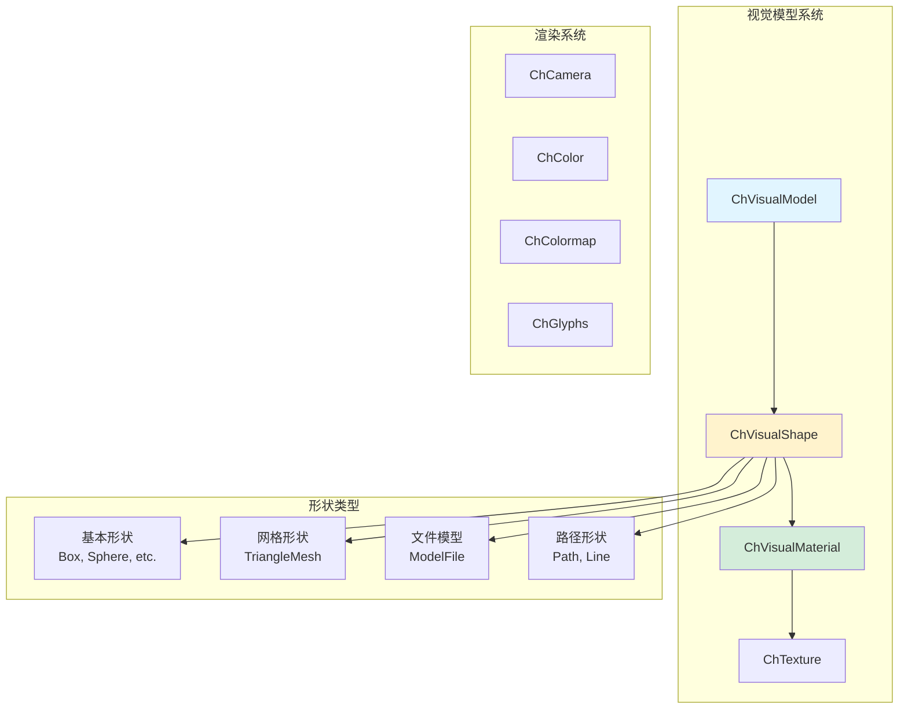
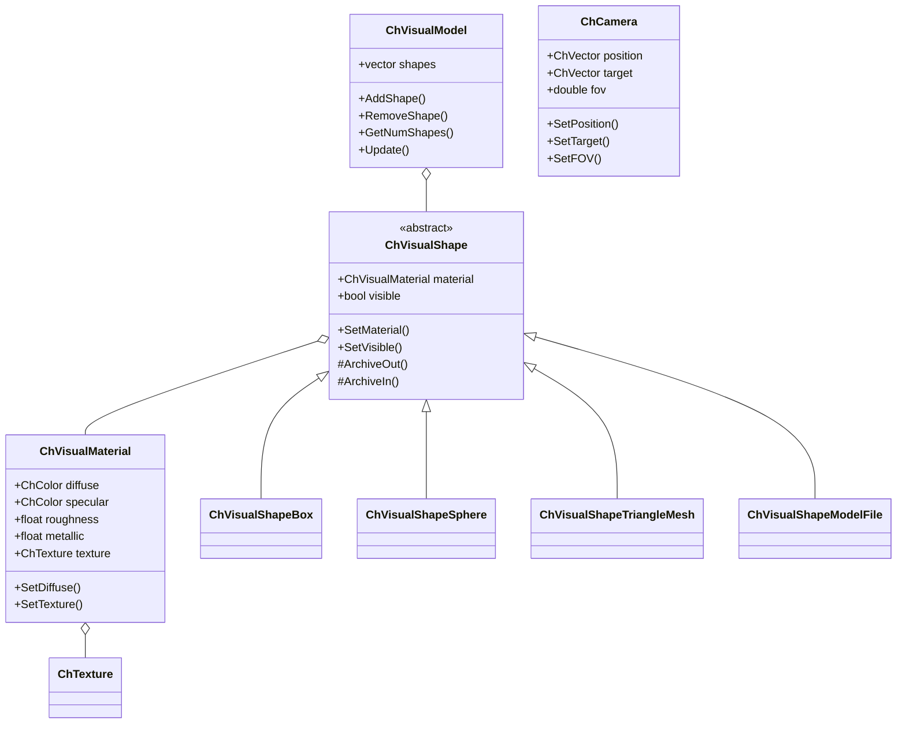
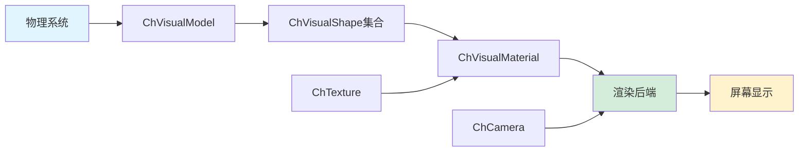
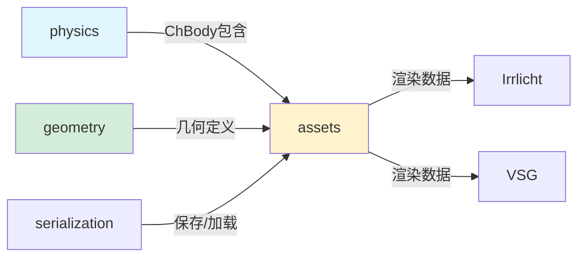

# Assets 模块架构分析

## 概述

`src/chrono/assets` 文件夹包含 Chrono 的可视化和渲染基础设施。该模块提供视觉形状、材质、纹理、相机以及连接到渲染后端（Irrlicht、VSG、OpenGL 等）的抽象可视化系统接口。

## 主要功能

### 核心职责
1. **视觉形状定义**：为物理对象提供几何表示
2. **材质系统**：定义表面外观属性（颜色、纹理、反射等）
3. **相机管理**：控制视点和渲染参数
4. **渲染抽象**：提供与特定渲染引擎无关的接口
5. **颜色和纹理**：管理视觉外观的颜色映射和纹理贴图

## 设计特性

### 架构模式
- **组合模式**：ChVisualModel 作为视觉形状的容器
- **策略模式**：不同的渲染后端实现相同的接口
- **装饰器模式**：材质和纹理作为形状的装饰
- **工厂模式**：方便创建常用视觉形状

### 性能考虑
- **延迟渲染**：仅在需要时更新视觉表示
- **实例化**：支持大量相同形状的高效渲染
- **LOD（细节层次）**：可根据距离调整细节级别
- **缓存友好**：视觉数据结构优化内存访问

## 文件结构和关系

### 核心类
```
ChVisualModel.h/cpp       - 视觉模型容器，包含形状和材质
ChVisualShape.h/cpp       - 所有视觉形状的基类
ChVisualMaterial.h/cpp    - 材质属性定义
ChCamera.h/cpp            - 相机位置和参数
ChColor.h/cpp             - 颜色表示（RGB/RGBA）
ChColormap.h/cpp          - 颜色映射工具
ChTexture.h/cpp           - 纹理定义
ChGlyphs.h/cpp           - 用于可视化向量场的字形
```

### 视觉形状层次结构
```
ChVisualShape（基类）
├── ChVisualShapeBox          - 立方体形状
├── ChVisualShapeSphere       - 球形状
├── ChVisualShapeCylinder     - 圆柱形状
├── ChVisualShapeCapsule      - 胶囊形状
├── ChVisualShapeCone         - 圆锥形状
├── ChVisualShapeEllipsoid    - 椭球形状
├── ChVisualShapeBarrel       - 桶形
├── ChVisualShapePath         - 路径/曲线
├── ChVisualShapeLine         - 线段
├── ChVisualShapeTriangleMesh - 三角网格
├── ChVisualShapeModelFile    - 从文件加载的模型（OBJ、STL等）
├── ChVisualShapePointPoint   - 点云
└── ChVisualShapeSurface      - 参数曲面
```

### 相机系统
```
ChCamera.h/cpp
- 定义视点位置和方向
- 控制视场角（FOV）
- 管理投影参数（透视/正交）
- 支持相机动画和轨迹
```

### 材质系统
```
ChVisualMaterial.h/cpp
属性包括：
- 漫反射颜色
- 镜面反射
- 环境光
- 粗糙度/金属度（PBR）
- 透明度
- 发光属性
- 纹理贴图引用
```

## 架构图



## 类层次结构



## 数据流



## 使用场景

### 1. 为刚体添加视觉形状
```cpp
auto body = chrono_types::make_shared<ChBody>();
auto vis_model = chrono_types::make_shared<ChVisualModel>();

// 创建一个立方体视觉形状
auto box_shape = chrono_types::make_shared<ChVisualShapeBox>(1.0, 2.0, 0.5);

// 设置材质
auto material = chrono_types::make_shared<ChVisualMaterial>();
material->SetDiffuseColor(ChColor(0.8f, 0.2f, 0.2f));
material->SetSpecularColor(ChColor(1.0f, 1.0f, 1.0f));
box_shape->SetMaterial(material);

// 添加形状到视觉模型
vis_model->AddShape(box_shape);
body->AddVisualModel(vis_model);
```

### 2. 加载 OBJ 模型文件
```cpp
auto mesh_shape = chrono_types::make_shared<ChVisualShapeModelFile>();
mesh_shape->SetFilename("path/to/model.obj");
mesh_shape->SetScale(ChVector3d(0.5, 0.5, 0.5));

auto material = chrono_types::make_shared<ChVisualMaterial>();
material->SetKdTexture("path/to/texture.png");
mesh_shape->SetMaterial(material);

vis_model->AddShape(mesh_shape);
```

### 3. 创建带纹理的球体
```cpp
auto sphere = chrono_types::make_shared<ChVisualShapeSphere>(0.5);

auto material = chrono_types::make_shared<ChVisualMaterial>();
material->SetKdTexture("earth_texture.jpg");
material->SetRoughness(0.3f);
sphere->SetMaterial(material);

vis_model->AddShape(sphere);
```

### 4. 设置相机
```cpp
auto camera = chrono_types::make_shared<ChCamera>();
camera->SetPosition(ChVector3d(5, 3, 5));
camera->SetTarget(ChVector3d(0, 0, 0));
camera->SetUpVector(ChVector3d(0, 1, 0));
camera->SetFOV(60.0);
```

### 5. 使用颜色映射
```cpp
ChColormap colormap(ChColormap::ColorMapType::JET);
float value = 0.5;  // 0到1之间
ChColor color = colormap.GetColor(value);
material->SetDiffuseColor(color);
```

## 设计亮点

### 1. 渲染后端独立性
Assets 模块定义了与渲染引擎无关的抽象接口，允许：
- 支持多种渲染后端（Irrlicht、VSG、OpenGL）
- 在运行时切换渲染器
- 添加新渲染器而不修改核心代码

### 2. 材质系统的灵活性
- 支持传统的 Phong 着色模型
- 支持现代的 PBR（物理基础渲染）材质
- 可以组合多个纹理（漫反射、法线、粗糙度等）

### 3. 高效的实例化
- 相同的 ChVisualShape 可以被多个 ChVisualModel 共享
- 减少内存使用和渲染开销

### 4. 序列化支持
- 所有视觉资源都可以序列化
- 支持保存和加载完整的视觉场景

## 与其他模块的交互



### 依赖关系
- **依赖 core**：使用 ChVector、ChQuaternion 等数学类型
- **依赖 geometry**：视觉形状基于几何定义
- **被 physics 使用**：ChBody 包含 ChVisualModel
- **被可视化模块使用**：Irrlicht、VSG 等模块读取视觉数据

## 性能特点

### 优点
1. **延迟更新**：只在渲染时更新视觉数据
2. **内存共享**：形状和材质可以在多个对象间共享
3. **批处理渲染**：相同材质的对象可以批量渲染
4. **LOD 支持**：可根据距离切换细节级别

### 注意事项
1. **纹理加载**：大纹理可能导致内存压力
2. **复杂网格**：高多边形网格影响渲染性能
3. **透明度排序**：透明对象需要特殊处理

## 扩展点

### 添加自定义视觉形状
```cpp
class MyCustomShape : public ChVisualShape {
public:
    virtual void ArchiveOut(ChArchiveOut& archive_out) override {
        // 序列化自定义数据
    }
    
    virtual void ArchiveIn(ChArchiveIn& archive_in) override {
        // 反序列化自定义数据
    }
};
```

### 自定义材质属性
```cpp
auto material = chrono_types::make_shared<ChVisualMaterial>();
material->SetDiffuseColor(ChColor(r, g, b));
material->SetRoughness(0.5f);
material->SetMetallic(0.8f);
material->SetFresnelMax(1.0f);
material->SetFresnelMin(0.0f);
```

## 最佳实践

1. **重用视觉形状**：对相同外观的对象共享 ChVisualShape 实例
2. **优化纹理**：使用适当分辨率的纹理，避免过大的贴图
3. **批量操作**：批量添加形状以减少开销
4. **合理使用细节**：根据应用需求选择适当的网格复杂度
5. **材质管理**：为常用材质创建材质库

## 总结

Assets 模块是 Chrono 可视化系统的核心，提供了：
- 灵活的视觉形状系统
- 强大的材质和纹理支持
- 与渲染后端的抽象接口
- 高效的渲染数据管理

该模块的设计允许 Chrono 支持多种渲染引擎，同时保持核心物理引擎的独立性。
