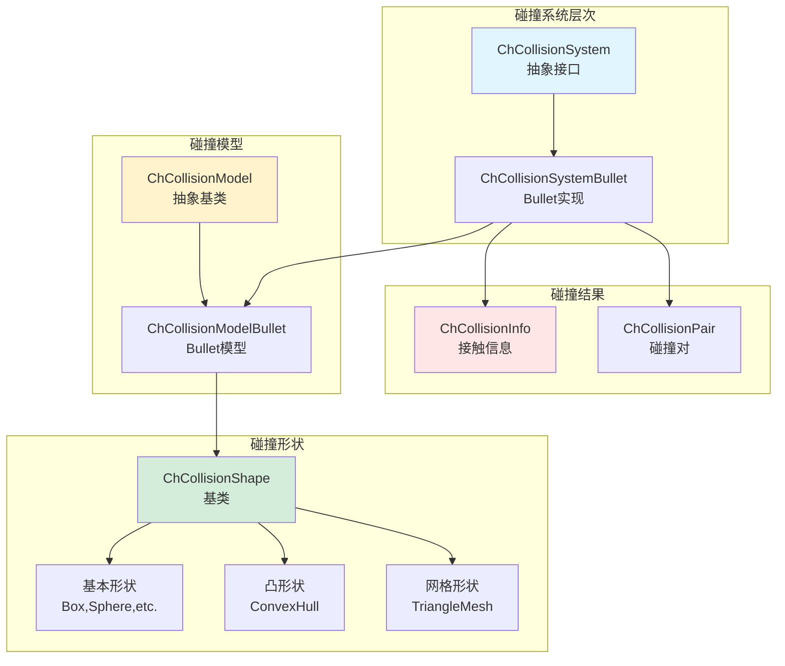
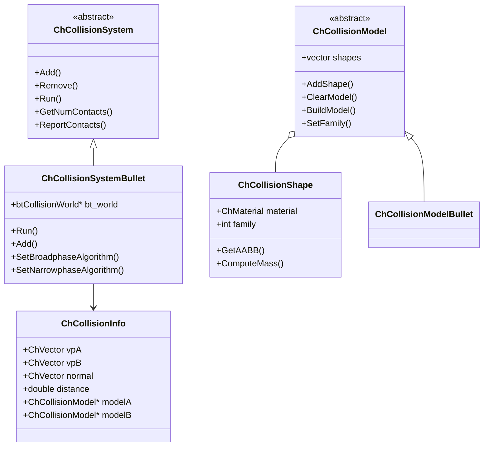
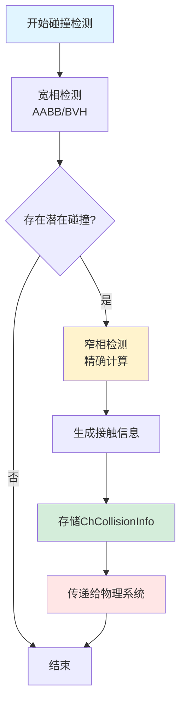
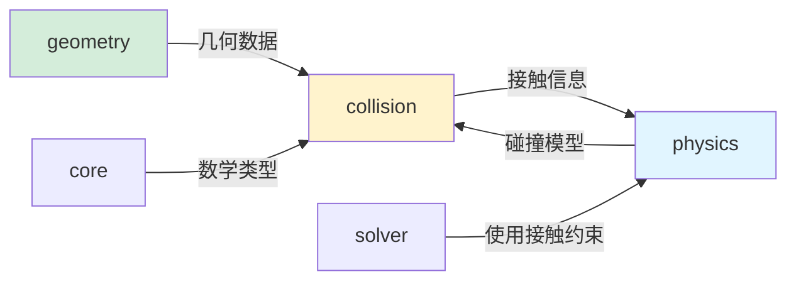

# Collision 模块架构分析

## 概述

`src/chrono/collision` 文件夹实现了 Chrono 的碰撞检测系统，提供了一个灵活的架构来检测各种几何形状之间的接触。该模块包括形状定义、碰撞模型，以及与 Bullet 物理库的集成，用于宽相和窄相碰撞检测。

## 主要功能

### 核心职责
1. **碰撞形状定义**：支持各种几何形状的碰撞表示
2. **宽相检测**：快速排除不可能碰撞的物体对
3. **窄相检测**：精确计算接触点、法线和穿透深度
4. **碰撞模型管理**：为物理对象组织碰撞形状
5. **碰撞信息存储**：记录接触数据供求解器使用
6. **多后端支持**：集成 Bullet 等第三方碰撞检测库

## 设计特性

### 架构模式
- **策略模式**：不同的碰撞检测后端（Bullet、自定义）
- **组合模式**：ChCollisionModel 包含多个碰撞形状
- **工厂模式**：根据类型创建碰撞形状
- **访问者模式**：遍历碰撞对并处理接触
- **桥接模式**：抽象层与具体实现（Bullet）分离

### 性能考虑
- **空间分区**：使用 BVH（层次包围体）加速宽相检测
- **AABB 包围盒**：快速初步排除
- **形状缓存**：重用计算的几何数据
- **并行化支持**：可以并行化碰撞检测
- **接触池**：重用接触对象减少内存分配

## 文件结构和关系

### 核心类
```
ChCollisionModel.h/cpp       - 碰撞模型容器（抽象基类）
ChCollisionShape.h/cpp       - 碰撞形状基类
ChCollisionInfo.h/cpp        - 碰撞信息（接触点、法线等）
ChCollisionPair.h            - 碰撞对表示
ChCollisionSystem.h/cpp      - 碰撞检测系统（抽象接口）
```

### 碰撞形状层次结构
```
ChCollisionShape（基类）
├── ChCollisionShapeBox          - 立方体
├── ChCollisionShapeSphere       - 球体
├── ChCollisionShapeCylinder     - 圆柱体
├── ChCollisionShapeCapsule      - 胶囊体（圆柱+半球）
├── ChCollisionShapeCone         - 圆锥体
├── ChCollisionShapeConvexHull   - 凸包
├── ChCollisionShapeTriangleMesh - 三角网格（凹形）
├── ChCollisionShapeEllipsoid    - 椭球体
├── ChCollisionShapeBarrel       - 桶形
├── ChCollisionShapeRoundedBox   - 圆角立方体
├── ChCollisionShapeRoundedCyl   - 圆角圆柱
├── ChCollisionShapePath2D       - 2D路径形状
├── ChCollisionShapeArc2D        - 2D圆弧
└── ChCollisionShapePoint        - 点（用于粒子）
```

### Bullet 集成
```
bullet/
├── ChCollisionSystemBullet.h/cpp     - Bullet后端实现
├── ChCollisionModelBullet.h/cpp      - Bullet碰撞模型
├── ChCollisionUtilsBullet.h/cpp      - Bullet工具函数
├── cbtMultiBodyConstraintSolver.h    - 多体约束求解器
└── gimpact/                          - GIMPACT算法（凹形）
```

### 碰撞信息
```
ChCollisionInfo.h/cpp
存储的信息：
- 接触点位置（两个物体上的点）
- 接触法线
- 穿透深度
- 碰撞的两个形状
- 碰撞的两个模型
- 接触特征ID（用于接触持久化）
```

## 架构图



## 类层次结构



## 碰撞检测流程



## 使用场景

### 1. 为刚体添加碰撞形状
```cpp
auto body = chrono_types::make_shared<ChBody>();
body->EnableCollision(true);

// 获取碰撞模型
auto collision_model = body->GetCollisionModel();
collision_model->ClearModel();

// 添加一个立方体碰撞形状
auto mat = chrono_types::make_shared<ChContactMaterialNSC>();
collision_model->AddBox(mat, 1.0, 2.0, 0.5);

// 添加一个球体碰撞形状
collision_model->AddSphere(mat, 0.3, ChVector3d(0, 1, 0));

collision_model->BuildModel();
```

### 2. 使用凸包
```cpp
std::vector<ChVector3d> points = {
    ChVector3d(0, 0, 0),
    ChVector3d(1, 0, 0),
    ChVector3d(0, 1, 0),
    ChVector3d(0, 0, 1)
};

collision_model->ClearModel();
collision_model->AddConvexHull(mat, points);
collision_model->BuildModel();
```

### 3. 使用三角网格（凹形）
```cpp
auto trimesh = chrono_types::make_shared<ChTriangleMeshConnected>();
trimesh->LoadWavefrontMesh("mesh.obj");

collision_model->ClearModel();
collision_model->AddTriangleMesh(mat, trimesh, 
                                  false,  // 不是静态
                                  false); // 不是凸形
collision_model->BuildModel();
```

### 4. 设置碰撞族和掩码
```cpp
// 设置碰撞族（family）
collision_model->SetFamily(1);

// 设置碰撞掩码（与哪些族碰撞）
collision_model->DisallowCollisionsWith(2);  // 不与族2碰撞
collision_model->SetFamilyGroup(0x0001);     // 使用位掩码
collision_model->SetFamilyMask(0x0006);      // 与族1和2碰撞
```

### 5. 获取碰撞信息
```cpp
// 在系统运行后获取碰撞信息
auto collision_system = system.GetCollisionSystem();

collision_system->ReportContacts([](const ChCollisionInfo& info) {
    auto modelA = info.modelA;
    auto modelB = info.modelB;
    auto normal = info.vN;
    auto distance = info.distance;
    auto pointA = info.vpA;
    auto pointB = info.vpB;
    
    // 处理碰撞信息
    std::cout << "Contact at: " << pointA << std::endl;
    return true;  // 继续处理其他碰撞
});
```

### 6. 自定义碰撞回调
```cpp
class MyCollisionCallback : public ChCollisionSystem::BroadphaseCallback {
public:
    virtual bool OnBroadphase(ChCollisionModel* modelA, 
                              ChCollisionModel* modelB) override {
        // 在宽相检测阶段过滤某些碰撞对
        return true;  // 返回true继续检测，false跳过
    }
};

auto callback = chrono_types::make_shared<MyCollisionCallback>();
collision_system->RegisterBroadphaseCallback(callback);
```

## 设计亮点

### 1. 多后端支持
- 默认使用 Bullet 作为碰撞检测引擎
- 可以实现自定义碰撞系统
- 抽象接口允许切换后端

### 2. 形状组合
- 一个碰撞模型可以包含多个形状
- 支持复杂物体的精确碰撞表示
- 形状可以有相对位置和方向

### 3. 碰撞过滤
- 基于族（family）的碰撞过滤
- 位掩码提供细粒度控制
- 支持自定义过滤回调

### 4. 凹凸形状支持
- 凸形状：快速精确的检测
- 凹形状（三角网格）：使用 GIMPACT 或 BVH

### 5. 2D 形状支持
- 支持 2D 路径、圆弧等
- 用于履带、轮胎等特殊场景

## 与其他模块的交互



### 依赖关系
- **依赖 core**：ChVector、ChQuaternion、ChFrame 等
- **依赖 geometry**：使用几何定义和计算
- **被 physics 使用**：ChBody 包含 ChCollisionModel
- **与 solver 交互**：碰撞信息转化为约束

## 性能特点

### 优点
1. **高效的宽相检测**：BVH 树和 AABB 加速
2. **优化的凸形检测**：GJK/EPA 算法
3. **并行化潜力**：碰撞检测可并行化
4. **内存效率**：形状数据共享和重用
5. **Bullet 成熟性**：利用经过验证的算法

### 性能考虑
1. **三角网格**：凹网格比凸形状慢
2. **形状数量**：过多形状增加检测成本
3. **更新频率**：每帧都需要检测
4. **内存占用**：大型网格消耗内存

### 优化建议
1. **使用凸分解**：将凹形分解为凸形
2. **简化网格**：使用简化的碰撞网格
3. **合理分组**：使用碰撞族减少检测对数
4. **静态对象优化**：标记不动的物体
5. **包围体层次**：为复杂场景使用 LOD

## Bullet 集成细节

### Bullet 组件
```
btCollisionWorld           - 碰撞世界
btBroadphaseInterface      - 宽相接口
btCollisionDispatcher      - 碰撞分发器
btCollisionConfiguration   - 碰撞配置
btCollisionShape           - Bullet形状（对应ChCollisionShape）
btCollisionObject          - 碰撞对象（对应ChCollisionModel）
```

### 算法支持
```
宽相算法：
- Sweep and Prune (SAP)
- DBVT (Dynamic BVH Tree)

窄相算法：
- GJK (Gilbert-Johnson-Keerthi)
- EPA (Expanding Polytope Algorithm)
- GIMPACT (for concave meshes)
```

## 扩展点

### 自定义碰撞系统
```cpp
class MyCollisionSystem : public ChCollisionSystem {
public:
    virtual void Add(std::shared_ptr<ChCollisionModel> model) override {
        // 添加碰撞模型
    }
    
    virtual void Run() override {
        // 执行碰撞检测
    }
    
    virtual void ReportContacts(ContactCallback* callback) override {
        // 报告碰撞结果
    }
};
```

### 自定义碰撞形状
```cpp
class MyCollisionShape : public ChCollisionShape {
public:
    virtual void GetAABB(ChAABB& aabb) const override {
        // 计算包围盒
    }
    
    virtual double ComputeMass(double density) const override {
        // 计算质量
    }
};
```

## 最佳实践

1. **选择合适的形状**：优先使用基本形状（球、盒、胶囊）
2. **凸分解**：对复杂凹形使用 V-HACD 等工具分解
3. **碰撞过滤**：合理使用族和掩码减少检测
4. **简化网格**：碰撞网格应比视觉网格简单
5. **缓存几何**：重用相同的几何数据
6. **调试可视化**：使用 Irrlicht 等渲染碰撞形状辅助调试

## 调试技巧

### 可视化碰撞形状
```cpp
// 在Irrlicht中显示碰撞形状
vis->GetActiveCamera()->setPosition(irr::core::vector3df(5, 3, 5));
vis->SetSymbolscale(0.01);
vis->ShowCollisionShapes(true);  // 显示碰撞形状
```

### 碰撞统计
```cpp
auto collision_system = system.GetCollisionSystem();
int num_contacts = collision_system->GetNumContacts();
std::cout << "Number of contacts: " << num_contacts << std::endl;
```

## 总结

Collision 模块是 Chrono 物理仿真的关键组件，提供了：
- 灵活的碰撞形状系统
- 高效的碰撞检测算法
- 与 Bullet 的深度集成
- 可扩展的架构设计

该模块的性能直接影响整个仿真的效率，因此选择合适的碰撞形状和优化策略至关重要。
