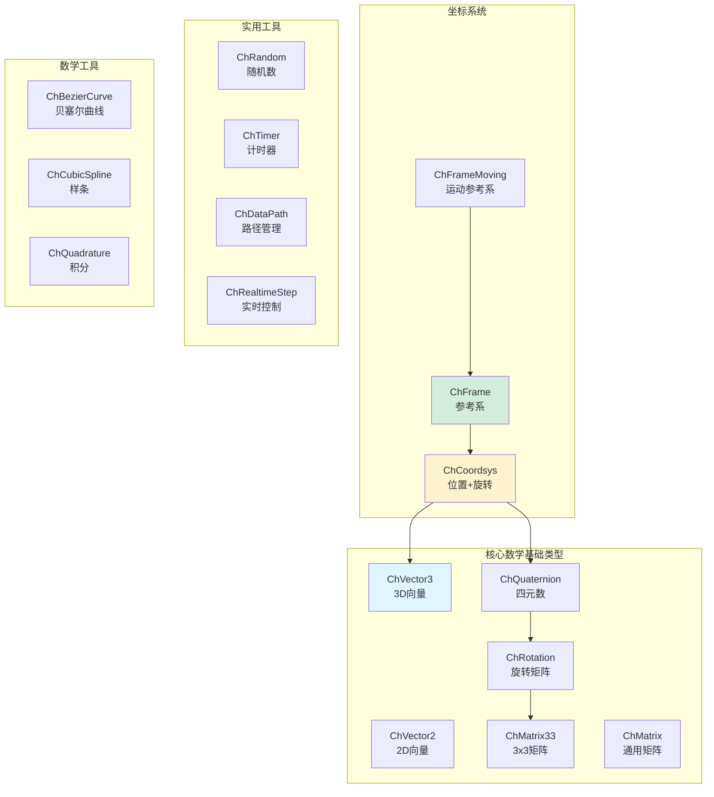
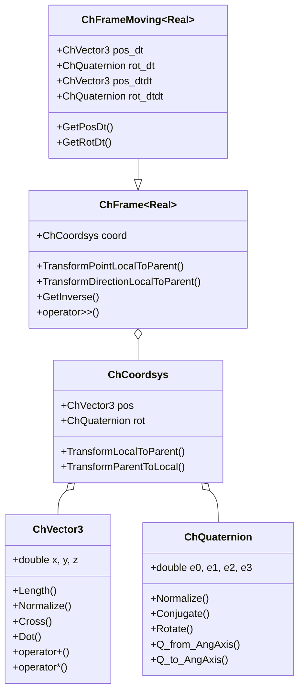
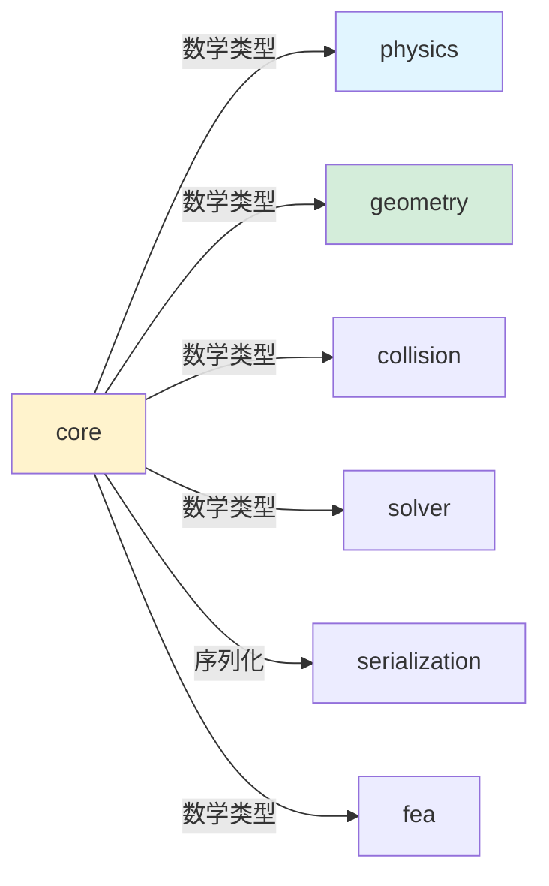

# Core 模块架构分析

## 概述

`src/chrono/core` 文件夹包含构成整个 Chrono 物理引擎基础的基本数据结构和数学基础类型。该模块提供了整个代码库中使用的核心构建块，包括向量、矩阵、四元数、坐标系统以及各种实用工具类。

## 主要功能

### 核心职责
1. **数学基础类型**：向量、四元数、矩阵和坐标系统
2. **序列化基础设施**：类工厂和注册系统  
3. **实用工具类**：随机数生成、计时器、数据路径管理
4. **模板表达式优化**：用于高效数学运算的表达式模板
5. **稀疏矩阵支持**：Eigen 稀疏矩阵操作的扩展
6. **平台抽象**：跨平台兼容性和类型定义

## 设计特性

### 架构模式
- **值语义**：大多数类使用值语义以实现高效的复制和移动操作
- **基于模板的设计**：大量使用 C++ 模板以实现类型灵活性和编译时优化
- **Eigen 集成**：与 Eigen 库紧密集成用于线性代数
- **CRTP（奇异递归模板模式）**：在 ChFrame 层次结构中用于静态多态
- **表达式模板**：用于数学运算以消除临时对象

### 性能考虑
- **仅头文件实现**：许多类仅使用头文件以便内联和优化
- **对齐**：ChAlignedAllocator 确保 SIMD 操作的正确内存对齐
- **零成本抽象**：基于模板的设计允许无运行时开销的抽象
- **稀疏矩阵优化**：针对大规模问题的专用稀疏矩阵扩展
- **表达式模板**：延迟求值和循环融合

## 文件结构和关系

### 核心数学类型
```
ChVector3.h/cpp         - 3D向量 (x, y, z)
ChVector2.h             - 2D向量 (x, y)
ChQuaternion.h/cpp      - 用于旋转的四元数
ChMatrix.h              - 通用矩阵包装器（Eigen）
ChMatrix33.h            - 3x3旋转矩阵
ChMatrixMBD.h           - 多体动力学专用矩阵类型
ChRotation.h/cpp        - 旋转表示（矩阵形式）
```

### 坐标系统
```
ChCoordsys.h/cpp        - 坐标系统：位置 + 旋转（pos + quat）
ChFrame.h               - 参考系：带位置和方向
ChFrameMoving.h         - 运动参考系：带速度和加速度
```

### 序列化和类工厂
```
ChClassFactory.h/cpp    - 用于对象创建的工厂模式
ChChrono.h              - 核心类型定义和宏
ChArchive.h             - 序列化抽象基类（在serialization模块中）
```

### 实用工具
```
ChRandom.h/cpp          - 随机数生成器（多种分布）
ChTimer.h               - 高精度计时器
ChDataPath.h/cpp        - 数据文件路径管理
ChRealtimeStep.h        - 实时步长控制器
ChPlatform.h            - 平台相关定义
ChTypes.h               - 基本类型定义
ChApiCE.h               - API导出宏
```

### 数学工具
```
ChBezierCurve.h/cpp     - Bezier曲线实用程序
ChCubicSpline.h/cpp     - 三次样条插值
ChQuadrature.h/cpp      - 数值积分（高斯积分等）
ChTensors.h             - 张量操作
```

### 高级数学功能
```
ChTemplateExpressions.h           - 用于数学运算的表达式模板
ChSparseMatrixEigenExtensions.h   - 稀疏矩阵扩展
ChMatrixEigenExtensions.h         - 密集矩阵扩展
ChSparsityPatternLearner.h        - 稀疏模式检测和学习
ChAlignedAllocator.h              - SIMD对齐的内存分配器
```

## 架构图



## 类层次结构



## 数学运算示例

### 向量操作
```cpp
ChVector3d v1(1.0, 2.0, 3.0);
ChVector3d v2(4.0, 5.0, 6.0);

// 基本运算
ChVector3d v3 = v1 + v2;
ChVector3d v4 = v1 - v2;
ChVector3d v5 = v1 * 2.0;

// 向量运算
double dot = v1.Dot(v2);
ChVector3d cross = v1.Cross(v2);
double length = v1.Length();
ChVector3d normalized = v1.GetNormalized();

// 分量访问
double x = v1.x();
v1.y() = 5.0;
```

### 四元数和旋转
```cpp
// 从轴角创建四元数
ChVector3d axis(0, 1, 0);  // Y轴
double angle = CH_PI / 4;   // 45度
ChQuaterniond q = QuatFromAngleAxis(angle, axis);

// 旋转向量
ChVector3d v(1, 0, 0);
ChVector3d v_rotated = q.Rotate(v);

// 四元数运算
ChQuaterniond q2 = q.GetConjugate();
ChQuaterniond q3 = q * q2;  // 四元数乘法
q.Normalize();

// 转换为旋转矩阵
ChMatrix33d rot_mat = q.GetMatrix();
```

### 坐标系统变换
```cpp
// 创建坐标系
ChCoordsysd cs1(ChVector3d(1, 2, 3), QuatFromAngleZ(CH_PI/4));
ChCoordsysd cs2(ChVector3d(0, 0, 5), QUNIT);

// 坐标变换
ChVector3d point_local(1, 0, 0);
ChVector3d point_global = cs1.TransformLocalToParent(point_local);
ChVector3d point_back = cs1.TransformParentToLocal(point_global);

// 坐标系级联
ChCoordsysd cs3 = cs1 >> cs2;  // cs2相对于cs1
```

### Frame 使用
```cpp
ChFramed frame1;
frame1.SetPos(ChVector3d(1, 2, 3));
frame1.SetRot(QuatFromAngleY(CH_PI/2));

ChFramed frame2(ChVector3d(4, 5, 6), QuatFromAngleZ(CH_PI/3));

// 点和方向的变换
ChVector3d point(1, 0, 0);
ChVector3d point_transformed = frame1.TransformPointLocalToParent(point);

ChVector3d dir(1, 0, 0);
ChVector3d dir_transformed = frame1.TransformDirectionLocalToParent(dir);

// Frame级联
ChFramed frame3 = frame1 >> frame2;

// 逆变换
ChFramed frame_inv = frame1.GetInverse();
```

### 矩阵操作
```cpp
// Eigen矩阵封装
ChMatrixDynamic<> mat(3, 3);
mat.setIdentity();
mat(0, 0) = 1.0;
mat(1, 1) = 2.0;

// 稀疏矩阵
ChSparseMatrix sparse_mat(100, 100);
sparse_mat.SetElement(10, 10, 5.0);
sparse_mat.SetElement(20, 30, 3.0);

// 矩阵运算
ChMatrixDynamic<> result = mat * mat;
ChVectorDynamic<> vec(3);
vec << 1, 2, 3;
ChVectorDynamic<> result_vec = mat * vec;
```

## 使用场景

### 1. 随机数生成
```cpp
// 创建随机数生成器
ChRandom random;

// 各种分布
double uniform = random.GetUniform(-1.0, 1.0);
double normal = random.GetNormal(0.0, 1.0);
int uniform_int = random.GetUniformInt(1, 10);

// 随机向量
ChVector3d rand_vec = random.GetRandomVectorInSphere(1.0);
ChQuaterniond rand_quat = random.GetRandomQuaternion();
```

### 2. 样条插值
```cpp
// 创建三次样条
ChCubicSpline spline;

// 添加控制点
spline.AddPoint(0.0, 0.0);
spline.AddPoint(1.0, 1.0);
spline.AddPoint(2.0, 0.5);
spline.AddPoint(3.0, 1.5);

// 求值
double t = 1.5;
double value = spline.Eval(t);
double derivative = spline.EvalDer(t);
double second_der = spline.EvalDer2(t);
```

### 3. Bezier曲线
```cpp
// 创建Bezier曲线
std::vector<ChVector3d> control_points = {
    ChVector3d(0, 0, 0),
    ChVector3d(1, 2, 0),
    ChVector3d(3, 2, 0),
    ChVector3d(4, 0, 0)
};

ChBezierCurve bezier(control_points);

// 求值
double u = 0.5;
ChVector3d point = bezier.Eval(u);
ChVector3d tangent = bezier.EvalDer(u);
```

### 4. 计时器
```cpp
ChTimer timer;
timer.start();

// 执行一些操作
PerformSimulation();

timer.stop();
double elapsed = timer.GetTimeSeconds();
std::cout << "Simulation took: " << elapsed << " seconds" << std::endl;
```

### 5. 数据路径管理
```cpp
// 设置Chrono数据目录
ChDataPath::SetChronoDataPath("/path/to/chrono/data");

// 获取完整路径
std::string mesh_path = ChDataPath::GetChronoDataFile("vehicle/hmmwv/hmmwv_chassis.obj");
```

### 6. 实时步长控制
```cpp
ChRealtimeStepTimer realtime_timer;

// 仿真循环
while (system.GetChTime() < 10.0) {
    system.DoStepDynamics(0.01);
    
    // 同步到实时
    realtime_timer.Spin(0.01);
}
```

## 设计亮点

### 1. Eigen 集成
Core 模块与 Eigen 库深度集成：
- ChMatrix 是 Eigen::Matrix 的封装
- 支持 Eigen 的表达式模板
- 零开销的矩阵运算
- 自动向量化（SIMD）

### 2. 类型灵活性
```cpp
// 支持不同精度
ChVector3<float> vec_float;
ChVector3<double> vec_double;

// 支持不同维度
ChVectorN<double, 6> vec6d;  // 6维向量

// 动态大小矩阵
ChMatrixDynamic<double> mat_dynamic;
```

### 3. 表达式模板优化
```cpp
// 无临时对象的高效计算
ChVector3d result = v1 + v2 * 3.0 - v3 / 2.0;
// 编译为单个循环，无中间临时变量
```

### 4. 对齐支持
```cpp
// 使用对齐分配器
std::vector<ChVector3d, ChAlignedAllocator<ChVector3d>> aligned_vectors;
// 确保SIMD指令的正确对齐
```

## 与其他模块的交互



### 被所有模块使用
Core 是整个 Chrono 的基础，几乎所有其他模块都依赖它：
- **physics**：使用向量、四元数表示位置和方向
- **geometry**：使用数学类型定义几何形状
- **collision**：使用坐标系统变换
- **solver**：使用矩阵和向量类型
- **fea**：使用矩阵运算
- **serialization**：使用类工厂系统

## 性能特点

### 优点
1. **零成本抽象**：模板和内联消除运行时开销
2. **SIMD 支持**：通过 Eigen 自动向量化
3. **表达式模板**：消除临时对象
4. **缓存友好**：数据结构紧凑
5. **编译时优化**：大量计算在编译期完成

### 注意事项
1. **编译时间**：大量模板可能增加编译时间
2. **代码膨胀**：模板实例化可能增大二进制大小
3. **调试复杂性**：模板错误信息难以理解

## 坐标系统详解

### 右手坐标系
Chrono 使用右手坐标系：
- X 轴：红色，指向右
- Y 轴：绿色，指向上
- Z 轴：蓝色，指向前（屏幕外）

### 旋转表示
支持多种旋转表示：
```cpp
// 四元数（推荐）
ChQuaterniond q = QuatFromAngleAxis(angle, axis);

// 欧拉角
ChQuaterniond q = QuatFromAngleX(roll) * 
                  QuatFromAngleY(pitch) * 
                  QuatFromAngleZ(yaw);

// 旋转矩阵
ChMatrix33d R;
R.SetFromQuaternion(q);
```

### 变换级联
```cpp
// 多级坐标系
ChFramed world_frame;
ChFramed body_frame(ChVector3d(1, 0, 0), QUNIT);
ChFramed marker_frame(ChVector3d(0, 0.5, 0), QUNIT);

// 计算marker在世界坐标系中的位置
ChFramed marker_in_world = world_frame >> body_frame >> marker_frame;
```

## 数值积分

### 高斯积分
```cpp
ChQuadrature::ChQuadratureTables tables;

// 1D积分
auto f = [](double x) { return x * x; };
double result = ChQuadrature::Integrate1D(f, 0.0, 1.0, 5);  // 5点高斯

// 2D积分
auto f2d = [](double x, double y) { return x * y; };
double result2d = ChQuadrature::Integrate2D(f2d, 0, 1, 0, 1, 5, 5);
```

## 最佳实践

1. **使用 ChVector3d**：默认使用 double 精度
2. **四元数归一化**：定期对四元数归一化
3. **避免欧拉角**：优先使用四元数避免万向节锁
4. **利用表达式模板**：编写紧凑的数学表达式
5. **使用 Eigen**：对大型矩阵运算直接使用 Eigen
6. **检查对齐**：使用 aligned_allocator 存储向量数组

## 扩展点

### 自定义数学类型
```cpp
template <typename Real = double>
class MyCustomVector {
    Real data[3];
public:
    // 实现必要的运算符和方法
    MyCustomVector operator+(const MyCustomVector& other) const;
    Real Dot(const MyCustomVector& other) const;
};
```

## 总结

Core 模块是 Chrono 的数学基础，提供了：
- 高效的向量和矩阵运算
- 灵活的坐标系统变换
- 丰富的数学工具
- 优秀的性能优化

该模块的设计充分利用了现代 C++ 特性和 Eigen 库，在保持高性能的同时提供了良好的易用性。
