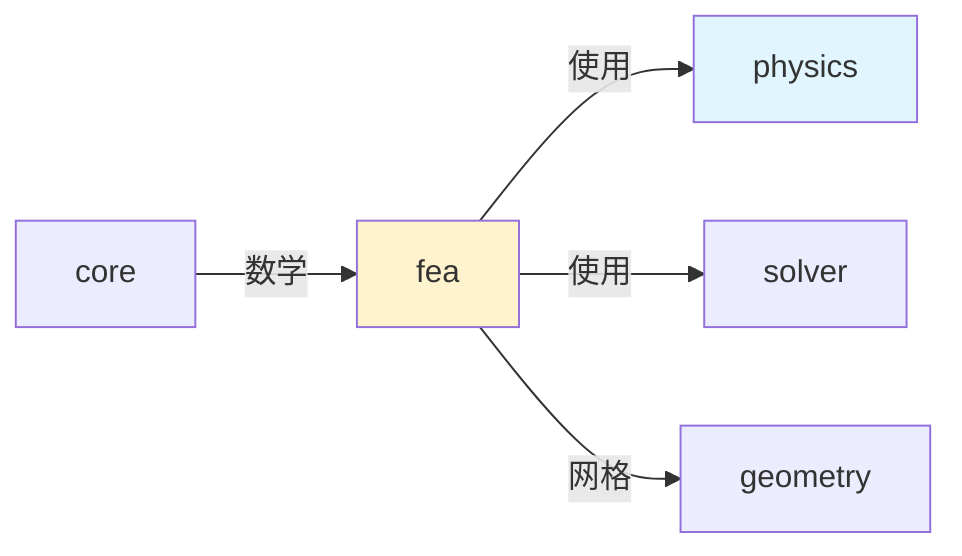

# FEA 模块架构分析

## 概述

`src/chrono/fea` 文件夹实现了有限元分析（FEA）功能，提供结构力学仿真，包括梁、壳、实体和索缆元素，支持小变形和大变形分析。

## 主要功能

### 核心职责
1. **有限元网格**：节点和元素的组织
2. **梁元素**：Euler-Bernoulli、Timoshenko、Cosserat梁
3. **壳元素**：ANCF、Reissner壳单元
4. **实体元素**：3D四面体、六面体单元
5. **索缆元素**：柔性索缆
6. **接触**：FEA与刚体的接触
7. **材料模型**：线弹性、超弹性、塑性

## 文件结构（约140个文件）

### 网格和节点
```
ChMesh.h/cpp                    - FEA网格容器
ChNodeFEA.h/cpp                 - FEA节点基类
ChNodeFEAxyz.h/cpp              - 3DOF位置节点
ChNodeFEAxyzrot.h/cpp           - 6DOF位置+旋转节点
ChNodeFEAxyzD.h/cpp             - 带方向的节点
ChNodeFEAxyzDD.h/cpp            - 双方向节点（壳）
```

### 梁元素
```
ChElementBeam.h/cpp             - 梁元素基类
ChElementBeamEuler.h/cpp        - Euler-Bernoulli梁
ChElementBeamIGA.h/cpp          - IGA梁
ChElementCableANCF.h/cpp        - ANCF索缆
ChElementBeamTaperedTimoshenko.h/cpp - 锥形Timoshenko梁

梁截面：
ChBeamSection.h/cpp             - 截面基类
ChBeamSectionEuler.h/cpp        - Euler梁截面
ChBeamSectionCosserat.h/cpp     - Cosserat梁截面
```

### 壳元素
```
ChElementShell.h/cpp            - 壳元素基类
ChElementShellANCF.h/cpp        - ANCF壳（4节点）
ChElementShellReissner.h/cpp    - Reissner壳（4节点）
ChElementShellBST.h/cpp         - BST壳（3节点）
```

### 实体元素
```
ChElementHexa.h/cpp             - 六面体元素
ChElementTetra.h/cpp            - 四面体元素
ChElementBrick.h/cpp            - 砖单元（8节点）
```

### 索缆元素
```
ChElementCable.h/cpp            - 索缆元素
ChElementCableANCF.h/cpp        - ANCF索缆
ChElementBeamANCF.h/cpp         - ANCF梁
```

### 接触
```
ChContactSurface.h/cpp          - 接触表面基类
ChContactSurfaceMesh.h/cpp      - 网格接触表面
ChContactSurfaceNodeCloud.h/cpp - 节点云接触
```

### 材料
```
ChMaterialShell.h/cpp           - 壳材料
ChContinuumMaterial.h/cpp       - 连续介质材料
ChContinuumElastic.h/cpp        - 弹性材料
ChContinuumPlastic.h/cpp        - 塑性材料
```

## 使用场景

### 1. 创建FEA网格
```cpp
auto mesh = chrono_types::make_shared<ChMesh>();

// 添加到系统
system->Add(mesh);
```

### 2. 创建梁结构
```cpp
// 创建节点
auto node1 = chrono_types::make_shared<ChNodeFEAxyzrot>(
    ChFramed(ChVector3d(0, 0, 0))
);
auto node2 = chrono_types::make_shared<ChNodeFEAxyzrot>(
    ChFramed(ChVector3d(1, 0, 0))
);

mesh->AddNode(node1);
mesh->AddNode(node2);

// 创建截面
auto section = chrono_types::make_shared<ChBeamSectionEulerAdvanced>();
section->SetAsRectangularSection(0.1, 0.05);
section->SetYoungModulus(200e9);
section->SetShearModulus(80e9);
section->SetDensity(7800);

// 创建梁元素
auto beam = chrono_types::make_shared<ChElementBeamEuler>();
beam->SetNodes(node1, node2);
beam->SetSection(section);

mesh->AddElement(beam);
```

### 3. 创建索缆
```cpp
auto builder = chrono_types::make_shared<ChBuilderCableANCF>();

builder->BuildBeam(
    mesh,
    chrono_types::make_shared<ChBeamSectionCable>(),
    10,                              // 元素数量
    ChVector3d(0, 0, 0),            // 起点
    ChVector3d(1, 0, 0)             // 终点
);
```

### 4. 创建壳单元
```cpp
// 创建壳节点（需要位置和方向）
auto node1 = chrono_types::make_shared<ChNodeFEAxyzD>(
    ChVector3d(0, 0, 0),
    ChVector3d(0, 0, 1)
);
// ... 创建更多节点

// 创建壳元素
auto shell = chrono_types::make_shared<ChElementShellANCF_3443>();
shell->SetNodes(node1, node2, node3, node4);

// 设置层和材料
shell->AddLayer(0.01, 0 * CH_DEG_TO_RAD, material);

mesh->AddElement(shell);
```

### 5. FEA与刚体连接
```cpp
// 将FEA节点约束到刚体
auto constraint = chrono_types::make_shared<ChLinkNodeFrame>();
constraint->Initialize(fea_node, rigid_body);
system->Add(constraint);
```

### 6. 应用载荷
```cpp
// 节点力
auto load = chrono_types::make_shared<ChLoadNodeXYZForce>();
load->SetForce(ChVector3d(0, -100, 0));
load->SetNode(node);

auto load_container = chrono_types::make_shared<ChLoadContainer>();
load_container->Add(load);
mesh->Add(load_container);
```

## 求解器配置

FEA需要特殊的求解器：
```cpp
// 使用稀疏直接求解器
auto solver = chrono_types::make_shared<ChSolverSparseLU>();
system->SetSolver(solver);

// 或使用迭代求解器（需要预条件）
auto solver_minres = chrono_types::make_shared<ChSolverMINRES>();
solver_minres->SetMaxIterations(200);
solver_minres->SetTolerance(1e-10);
solver_minres->EnableDiagonalPreconditioner(true);
system->SetSolver(solver_minres);
```

## 性能考虑

### 优点
- 高精度结构分析
- 大变形支持
- 与多体系统集成

### 注意事项
- 计算成本高
- 需要适当的网格
- 求解器选择重要

## 与其他模块的交互



## 最佳实践

1. **网格细化**：关键区域使用更密网格
2. **选择合适元素**：根据问题选择元素类型
3. **求解器**：小问题用直接求解器，大问题用迭代
4. **验证**：与理论解或实验结果对比
5. **材料参数**：使用准确的材料属性

## 总结

FEA 模块提供了强大的结构分析功能，可以与多体动力学无缝集成，适用于柔性体和结构力学仿真。
