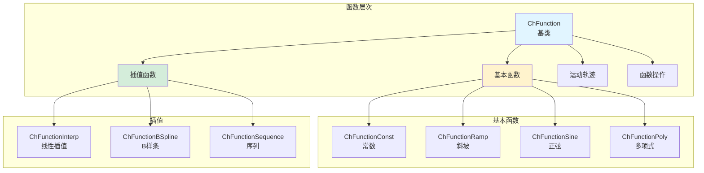
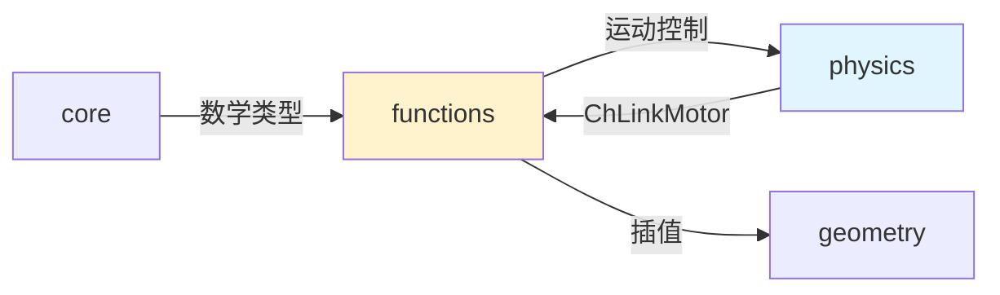

# Functions 模块架构分析

## 概述

`src/chrono/functions` 文件夹提供了数学函数表示，用于时间相关和参数化函数。这些函数在整个 Chrono 中用于运动轨迹、执行器控制、力函数和数据插值。

## 主要功能

### 核心职责
1. **时间函数**：f(t) 形式的标量函数
2. **参数函数**：f(u) 通用参数函数
3. **插值**：各种插值方法
4. **函数运算**：函数的组合、微分、积分
5. **预定义轨迹**：常用的运动轨迹模板

## 文件结构

### 函数基类
```
ChFunction.h                    - 函数抽象基类
ChFunctionBase.h/cpp            - 基础函数实现
```

### 基本函数
```
ChFunctionConst.h/cpp           - 常数函数
ChFunctionRamp.h/cpp            - 线性斜坡
ChFunctionSine.h/cpp            - 正弦函数
ChFunctionPoly.h/cpp            - 多项式
ChFunctionPoly345.h/cpp         - 3-4-5多项式（平滑）
```

### 插值函数
```
ChFunctionInterp.h/cpp          - 线性插值
ChFunctionBSpline.h/cpp         - B样条插值
ChFunctionSequence.h/cpp        - 分段函数序列
ChFunctionLambda.h/cpp          - Lambda函数包装
```

### 运动轨迹
```
ChFunctionConstAcc.h/cpp        - 恒定加速度轨迹
ChFunctionConstJerk.h/cpp       - 恒定加加速度轨迹
ChFunctionCycloidal.h/cpp       - 摆线运动
ChFunctionFillet3.h/cpp         - 圆角过渡
```

### 函数操作
```
ChFunctionDerivative.h/cpp      - 函数求导
ChFunctionIntegral.h/cpp        - 函数积分
ChFunctionOperator.h/cpp        - 函数运算符（加减乘除）
ChFunctionMirror.h/cpp          - 函数镜像
ChFunctionRepeat.h/cpp          - 函数重复
```

### 特殊函数
```
ChFunctionRotation.h/cpp        - 旋转函数（四元数）
ChFunctionPosition.h/cpp        - 位置函数（向量）
ChFunctionSetpoint.h/cpp        - 设定点函数
```

## 架构图



## 使用场景

### 1. 基本函数
```cpp
// 常数函数
auto const_func = chrono_types::make_shared<ChFunctionConst>(5.0);
double value = const_func->GetVal(0);  // 5.0

// 线性斜坡
auto ramp = chrono_types::make_shared<ChFunctionRamp>(0.0, 2.0);
// f(t) = 0 + 2*t
double val_at_1 = ramp->GetVal(1.0);  // 2.0

// 正弦函数
auto sine = chrono_types::make_shared<ChFunctionSine>(
    0.0,    // phase
    1.0,    // frequency (Hz)
    1.0     // amplitude
);
double val = sine->GetVal(0.25);  // sin(2π*1.0*0.25)

// 多项式 a + bx + cx² + dx³
auto poly = chrono_types::make_shared<ChFunctionPoly>();
poly->SetCoefficients({1.0, 2.0, 3.0, 4.0});
```

### 2. 插值
```cpp
// 线性插值
auto interp = chrono_types::make_shared<ChFunctionInterp>();
interp->AddPoint(0.0, 0.0);
interp->AddPoint(1.0, 1.0);
interp->AddPoint(2.0, 0.5);
interp->AddPoint(3.0, 1.5);

double interpolated = interp->GetVal(1.5);

// B样条插值
auto bspline = chrono_types::make_shared<ChFunctionBSpline>();
bspline->SetupData(3,  // 阶数
                   {0.0, 1.0, 2.0, 3.0},  // 点
                   {0.0, 1.0, 0.5, 1.5}); // 值
```

### 3. 运动轨迹
```cpp
// 恒定加速度轨迹（梯形速度）
auto motion = chrono_types::make_shared<ChFunctionConstAcc>();
motion->SetDisplacement(10.0);     // 总位移
motion->SetDuration(2.0);          // 持续时间
motion->SetMaxVelocity(8.0);       // 最大速度
motion->SetAcceleration(5.0);      // 加速度

double pos = motion->GetVal(1.0);
double vel = motion->GetDer(1.0);
double acc = motion->GetDer2(1.0);

// 摆线运动（平滑）
auto cycloidal = chrono_types::make_shared<ChFunctionCycloidal>();
cycloidal->SetDuration(2.0);
cycloidal->SetHeight(5.0);
```

### 4. Lambda函数
```cpp
// 使用C++ lambda定义函数
auto lambda_func = chrono_types::make_shared<ChFunctionLambda>(
    [](double x) { return x * x + 2 * x + 1; }
);

double result = lambda_func->GetVal(3.0);  // 16
```

### 5. 函数操作
```cpp
auto func1 = chrono_types::make_shared<ChFunctionSine>();
auto func2 = chrono_types::make_shared<ChFunctionRamp>(0, 1.0);

// 求导
auto derivative = chrono_types::make_shared<ChFunctionDerivative>();
derivative->SetFunction(func1);
double deriv_val = derivative->GetVal(0.5);

// 积分
auto integral = chrono_types::make_shared<ChFunctionIntegral>();
integral->SetFunction(func2);
integral->SetIntegrationStart(0.0);
double integ_val = integral->GetVal(1.0);

// 函数运算
auto sum = func1 + func2;  // 需要运算符重载
```

### 6. 序列函数
```cpp
// 分段定义的函数
auto sequence = chrono_types::make_shared<ChFunctionSequence>();

// 0-1秒：常数5
auto part1 = chrono_types::make_shared<ChFunctionConst>(5.0);
sequence->InsertFunction(part1, 1.0);

// 1-3秒：线性增长
auto part2 = chrono_types::make_shared<ChFunctionRamp>(5.0, 2.0);
sequence->InsertFunction(part2, 2.0);

// 3-5秒：正弦
auto part3 = chrono_types::make_shared<ChFunctionSine>();
sequence->InsertFunction(part3, 2.0);

double val_at_2 = sequence->GetVal(2.0);
```

### 7. 在电机中使用
```cpp
// 旋转电机的速度控制
auto motor = chrono_types::make_shared<ChLinkMotorRotationSpeed>();
motor->Initialize(body1, body2, frame);

// 使用函数定义速度轨迹
auto speed_func = chrono_types::make_shared<ChFunctionConstAcc>();
speed_func->SetDisplacement(2*CH_PI);  // 一圈
speed_func->SetDuration(5.0);
motor->SetSpeedFunction(speed_func);
```

### 8. 在TSDA中使用
```cpp
auto spring = chrono_types::make_shared<ChLinkTSDA>();
spring->Initialize(body1, body2, false, p1, p2);

// 自定义力-位移关系
auto force_func = chrono_types::make_shared<ChFunctionInterp>();
force_func->AddPoint(0.0, 0.0);       // 自然长度，无力
force_func->AddPoint(0.1, 100.0);     // 拉伸0.1m，100N
force_func->AddPoint(-0.05, -80.0);   // 压缩0.05m，-80N

spring->RegisterForceFunctor(
    [force_func](double time, double rest_length, 
                 double length, double vel,
                 const ChLinkTSDA* link) {
        double deformation = length - rest_length;
        return force_func->GetVal(deformation);
    }
);
```

## 函数属性

### 求值和导数
```cpp
auto func = chrono_types::make_shared<ChFunctionSine>();

double value = func->GetVal(t);      // f(t)
double derivative = func->GetDer(t);  // f'(t)
double second_der = func->GetDer2(t); // f''(t)
```

### 函数特性
```cpp
// 重复函数
auto repeat = chrono_types::make_shared<ChFunctionRepeat>();
repeat->SetFunction(sine_func);
repeat->SetWindow(0, 1.0);  // 每1秒重复

// 镜像函数
auto mirror = chrono_types::make_shared<ChFunctionMirror>();
mirror->SetFunction(sine_func);
mirror->SetMirrorStart(0.5);
```

## 与其他模块的交互



## 最佳实践

1. **选择合适的函数类型**：根据需求选择
2. **使用平滑函数**：避免不连续导致的数值问题
3. **Lambda函数灵活性**：对复杂逻辑使用lambda
4. **缓存函数值**：对昂贵的函数计算进行缓存
5. **验证导数**：确保解析导数正确

## 常用组合

### 梯形速度轨迹
```cpp
auto trapezoid = chrono_types::make_shared<ChFunctionSequence>();
// 加速段
auto accel = chrono_types::make_shared<ChFunctionPoly>();
// 匀速段  
auto const_vel = chrono_types::make_shared<ChFunctionRamp>();
// 减速段
auto decel = chrono_types::make_shared<ChFunctionPoly>();
```

### S曲线轨迹
```cpp
auto s_curve = chrono_types::make_shared<ChFunctionPoly345>();
s_curve->SetupCoefficients(0, 10, 2.0);  // 起点、终点、时间
```

## 总结

Functions 模块提供了：
- 丰富的函数类型
- 灵活的函数组合
- 平滑的运动轨迹
- 强大的插值工具
- 易于扩展的架构

该模块是 Chrono 中控制和轨迹规划的基础。
