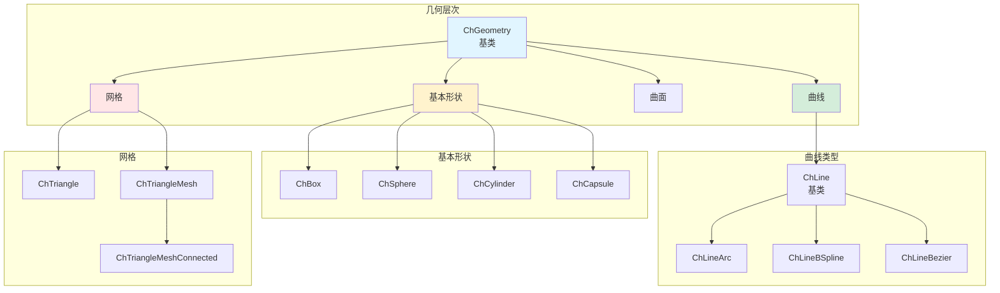
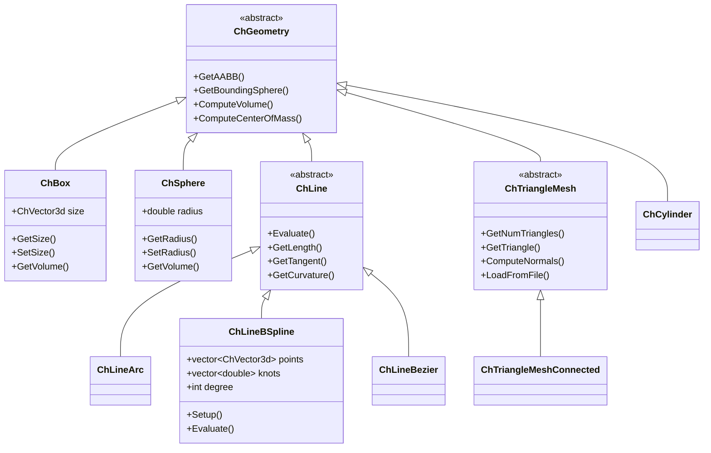
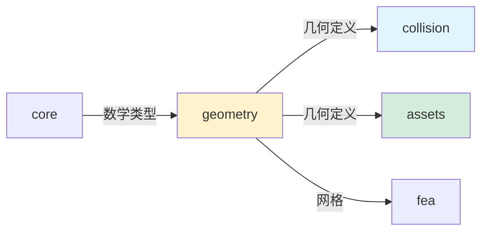

# Geometry 模块架构分析

## 概述

`src/chrono/geometry` 文件夹提供了 Chrono 的几何基础设施，定义了各种几何形状、曲线、曲面和几何操作。该模块为碰撞检测、可视化和有限元分析提供几何基础。

## 主要功能

### 核心职责
1. **基本形状**：定义基本几何形状（盒、球、圆柱等）
2. **曲线和样条**：参数曲线、B样条、NURBS
3. **曲面**：参数曲面和网格表面
4. **三角网格**：三角形网格表示和操作
5. **几何变换**：形状的变换、缩放、旋转
6. **几何查询**：距离计算、相交测试、投影

## 设计特性

### 架构模式
- **策略模式**：不同的几何表示方法
- **访问者模式**：遍历几何元素
- **工厂模式**：创建几何对象
- **组合模式**：复杂几何体的组合

### 性能考虑
- **包围盒缓存**：缓存AABB以加速查询
- **网格优化**：三角网格的拓扑优化
- **延迟计算**：按需计算几何属性
- **内存效率**：共享顶点数据

## 文件结构和关系

### 基本几何形状
```
ChGeometry.h/cpp              - 几何对象基类
ChBox.h/cpp                   - 立方体
ChSphere.h/cpp                - 球体
ChCylinder.h/cpp              - 圆柱体
ChCapsule.h/cpp               - 胶囊体（圆柱+半球）
ChCone.h/cpp                  - 圆锥体
ChEllipsoid.h/cpp             - 椭球体
ChRoundedBox.h/cpp            - 圆角立方体
ChRoundedCylinder.h/cpp       - 圆角圆柱
ChBarrel.h/cpp                - 桶形
```

### 曲线
```
ChLine.h/cpp                  - 曲线基类
ChLineArc.h/cpp               - 圆弧
ChLineBSpline.h/cpp           - B样条曲线
ChLineBezier.h/cpp            - Bezier曲线
ChLineNurbs.h/cpp             - NURBS曲线
ChLinePath.h/cpp              - 路径（分段曲线）
ChLineSegment.h/cpp           - 线段
ChLinePoly.h/cpp              - 多段线
```

### 曲面
```
ChSurface.h/cpp               - 曲面基类
ChSurfaceNurbs.h/cpp          - NURBS曲面
ChSurfaceBSpline.h/cpp        - B样条曲面
```

### 三角网格
```
ChTriangle.h/cpp              - 单个三角形
ChTriangleMesh.h/cpp          - 三角网格基类
ChTriangleMeshConnected.h/cpp - 连接三角网格（共享顶点）
ChTriangleMeshSoup.h/cpp      - 三角形汤（独立三角形）
```

### B样条和NURBS工具
```
ChBasisToolsBSpline.h         - B样条基函数工具
ChBasisToolsNurbs.h           - NURBS基函数工具
```

### 体积形状
```
ChVolume.h/cpp                - 体积基类
ChVolumeBox.h/cpp             - 立方体体积
ChVolumeSphere.h/cpp          - 球体体积
```

## 架构图



## 类层次结构



## 使用场景

### 1. 创建基本形状
```cpp
// 立方体
auto box = chrono_types::make_shared<ChBox>(1.0, 2.0, 0.5);
ChVector3d center = box->GetPos();
ChVector3d size = box->GetSize();
double volume = box->GetVolume();

// 球体
auto sphere = chrono_types::make_shared<ChSphere>(0.5);
double radius = sphere->GetRadius();
double sphere_volume = sphere->GetVolume();

// 圆柱体
auto cylinder = chrono_types::make_shared<ChCylinder>(0.3, 1.0);
double cyl_radius = cylinder->GetRadius();
double height = cylinder->GetHeight();

// 胶囊体
auto capsule = chrono_types::make_shared<ChCapsule>(0.2, 1.0);
double cap_radius = capsule->GetRadius();
double cap_height = capsule->GetHeight();
```

### 2. 创建和使用曲线
```cpp
// B样条曲线
auto spline = chrono_types::make_shared<ChLineBSpline>();
std::vector<ChVector3d> control_points = {
    ChVector3d(0, 0, 0),
    ChVector3d(1, 1, 0),
    ChVector3d(2, 1, 0),
    ChVector3d(3, 0, 0)
};
int degree = 3;
spline->Setup(degree, control_points);

// 在参数 u 处求值
double u = 0.5;
ChVector3d point = spline->Evaluate(u);
ChVector3d tangent = spline->GetTangent(u);

// 获取曲线长度
double length = spline->GetLength(0.0, 1.0);

// Bezier曲线
auto bezier = chrono_types::make_shared<ChLineBezier>();
bezier->Setup(control_points);
ChVector3d bez_point = bezier->Evaluate(0.3);
```

### 3. 圆弧
```cpp
// 创建圆弧
ChVector3d center(0, 0, 0);
ChVector3d normal(0, 0, 1);  // Z轴
double radius = 1.0;
double angle1 = 0;           // 起始角度
double angle2 = CH_PI/2;     // 结束角度

auto arc = chrono_types::make_shared<ChLineArc>(
    ChCoordsysd(center, QuatFromAngleZ(0)),
    radius,
    angle1,
    angle2
);

// 求值
ChVector3d arc_point = arc->Evaluate(0.5);
double arc_length = arc->GetLength();
```

### 4. 三角网格操作
```cpp
// 创建连接三角网格
auto trimesh = chrono_types::make_shared<ChTriangleMeshConnected>();

// 从文件加载
trimesh->LoadWavefrontMesh("model.obj");
// 或
trimesh->LoadSTLMesh("model.stl");

// 手动构建网格
std::vector<ChVector3d> vertices = {
    ChVector3d(0, 0, 0),
    ChVector3d(1, 0, 0),
    ChVector3d(0.5, 1, 0)
};
std::vector<ChVector3i> indices = {
    ChVector3i(0, 1, 2)
};
trimesh->SetCoordsVertices(vertices);
trimesh->SetIndicesVertices(indices);

// 计算法线
trimesh->ComputeNormals();

// 获取网格信息
int num_vertices = trimesh->GetNumVertices();
int num_triangles = trimesh->GetNumTriangles();

// 访问三角形
ChTriangle triangle = trimesh->GetTriangle(0);
ChVector3d v0 = triangle.p1;
ChVector3d v1 = triangle.p2;
ChVector3d v2 = triangle.p3;
```

### 5. 网格变换
```cpp
auto trimesh = chrono_types::make_shared<ChTriangleMeshConnected>();
trimesh->LoadWavefrontMesh("model.obj");

// 平移
ChVector3d translation(1, 0, 0);
trimesh->Transform(translation);

// 旋转
ChMatrix33d rotation;
rotation.SetFromAxisAngle(ChVector3d(0, 1, 0), CH_PI/4);
trimesh->Transform(rotation);

// 缩放
ChVector3d scale(2, 2, 2);
trimesh->Transform(scale);

// 组合变换
ChCoordsysd transform(ChVector3d(1, 2, 3), QuatFromAngleY(CH_PI/2));
trimesh->Transform(transform);
```

### 6. 几何查询
```cpp
// 获取包围盒
ChAABB aabb;
box->GetAABB(aabb);
ChVector3d min_point = aabb.min;
ChVector3d max_point = aabb.max;

// 获取包围球
ChVector3d center;
double radius;
sphere->GetBoundingSphere(center, radius);

// 计算质量属性
double density = 1000.0;
double mass = box->GetVolume() * density;

ChVector3d cog = box->GetCenterOfMass();
ChMatrix33d inertia = box->ComputeInertia(mass);
```

### 7. NURBS曲面
```cpp
auto nurbs_surface = chrono_types::make_shared<ChSurfaceNurbs>();

// 设置控制点网格
int num_u = 4;
int num_v = 4;
std::vector<std::vector<ChVector3d>> control_points(num_u);
for (int i = 0; i < num_u; i++) {
    control_points[i].resize(num_v);
    for (int j = 0; j < num_v; j++) {
        control_points[i][j] = ChVector3d(i, j, sin(i) * cos(j));
    }
}

// 设置节点向量
std::vector<double> knots_u = {0, 0, 0, 0, 1, 1, 1, 1};
std::vector<double> knots_v = {0, 0, 0, 0, 1, 1, 1, 1};

int degree_u = 3;
int degree_v = 3;

nurbs_surface->Setup(degree_u, degree_v, 
                     control_points, 
                     knots_u, knots_v);

// 求值
double u = 0.5, v = 0.5;
ChVector3d surface_point = nurbs_surface->Evaluate(u, v);
ChVector3d normal = nurbs_surface->GetNormal(u, v);
```

### 8. 路径（复合曲线）
```cpp
auto path = chrono_types::make_shared<ChLinePath>();

// 添加线段
auto seg1 = chrono_types::make_shared<ChLineSegment>(
    ChVector3d(0, 0, 0),
    ChVector3d(1, 0, 0)
);
path->AddSubLine(seg1);

// 添加圆弧
auto arc = chrono_types::make_shared<ChLineArc>(
    ChCoordsysd(ChVector3d(1, 0, 0), QUNIT),
    0.5,
    0,
    CH_PI/2
);
path->AddSubLine(arc);

// 添加B样条
auto spline = chrono_types::make_shared<ChLineBSpline>();
// ... 设置spline
path->AddSubLine(spline);

// 求值整个路径
double path_param = 0.5;  // 整个路径的参数
ChVector3d path_point = path->Evaluate(path_param);
```

## 设计亮点

### 1. 统一的几何接口
所有几何对象继承自 `ChGeometry`，提供统一的接口：
```cpp
virtual void GetAABB(ChAABB& bbox) const = 0;
virtual double GetVolume() const;
virtual ChVector3d GetCenterOfMass() const;
virtual ChMatrix33d ComputeInertia(double mass) const;
```

### 2. 参数化表示
曲线和曲面使用参数化表示，支持：
- 精确求值
- 导数计算
- 弧长参数化
- 曲率计算

### 3. 网格灵活性
支持多种网格格式：
- Wavefront OBJ
- STL（ASCII和二进制）
- 自定义格式

### 4. B样条和NURBS支持
完整的B样条和NURBS实现：
- 任意阶数
- 节点插入和细化
- 基函数评估工具

## 与其他模块的交互



### 依赖关系
- **依赖 core**：ChVector、ChMatrix、ChCoordsys
- **被 collision 使用**：碰撞形状基于几何定义
- **被 assets 使用**：视觉形状基于几何定义
- **被 fea 使用**：有限元网格基于三角网格

## 性能特点

### 优点
1. **参数化精确性**：曲线和曲面的精确表示
2. **内存效率**：共享顶点数据（连接网格）
3. **快速查询**：缓存包围盒和包围球
4. **灵活性**：支持多种几何表示

### 注意事项
1. **复杂曲线**：高阶B样条计算成本高
2. **大型网格**：内存占用和处理时间
3. **文件加载**：大型OBJ/STL文件加载慢

### 优化建议
1. **简化网格**：使用网格简化算法
2. **LOD**：为不同距离使用不同细节级别
3. **缓存**：缓存频繁查询的几何属性
4. **共享几何**：相同形状共享几何数据

## 网格处理工具

### 网格简化
```cpp
// 使用外部工具简化网格
trimesh->LoadWavefrontMesh("complex_model.obj");
// 使用 MeshLab、Blender 等工具预处理
```

### 网格修复
```cpp
// 修复网格拓扑
trimesh->RepairDuplicateVertices();
trimesh->ComputeNormals();
```

### 网格转换
```cpp
// 从汤网格转换为连接网格
auto soup = chrono_types::make_shared<ChTriangleMeshSoup>();
// 加载数据...

auto connected = chrono_types::make_shared<ChTriangleMeshConnected>();
connected->MergeFrom(*soup);
```

## 最佳实践

1. **选择合适的表示**：
   - 简单形状：使用基本几何体
   - 复杂形状：使用三角网格
   - 平滑曲线：使用B样条/NURBS

2. **网格优化**：
   - 使用连接网格节省内存
   - 简化碰撞网格
   - 使用LOD层次

3. **曲线使用**：
   - 低阶曲线计算更快
   - 合理设置控制点数量
   - 考虑使用分段线性近似

4. **文件格式**：
   - 小模型：OBJ（易读）
   - 大模型：STL二进制（紧凑）
   - 复杂场景：考虑GLTF/USD

5. **几何变换**：
   - 批量变换多个顶点
   - 缓存变换后的结果
   - 避免频繁变换

## 扩展点

### 自定义几何类型
```cpp
class MyCustomGeometry : public ChGeometry {
public:
    virtual void GetAABB(ChAABB& bbox) const override {
        // 计算包围盒
    }
    
    virtual double GetVolume() const override {
        // 计算体积
    }
    
    virtual void ArchiveOut(ChArchiveOut& archive_out) override {
        // 序列化
    }
};
```

### 自定义曲线
```cpp
class MyCustomCurve : public ChLine {
public:
    virtual ChVector3d Evaluate(double u) const override {
        // 在参数u处求值
        return ChVector3d(u, sin(u), cos(u));
    }
    
    virtual ChVector3d GetTangent(double u) const override {
        // 计算切向量
        return ChVector3d(1, cos(u), -sin(u)).GetNormalized();
    }
};
```

## 实用工具

### 几何工厂
```cpp
// 便捷创建常用形状
auto box = geometry::MakeBox(ChVector3d(1, 2, 0.5));
auto sphere = geometry::MakeSphere(0.5);
auto cylinder = geometry::MakeCylinder(0.3, 1.0);
```

### 几何转换
```cpp
// 将基本形状转换为三角网格
auto box = chrono_types::make_shared<ChBox>(1, 1, 1);
auto mesh = box->GetMesh();  // 生成三角网格表示
```

## 总结

Geometry 模块提供了 Chrono 的几何基础，包括：
- 丰富的基本形状
- 强大的曲线和曲面工具
- 灵活的三角网格处理
- B样条和NURBS支持
- 统一的几何接口

该模块是碰撞检测、可视化和有限元分析的基石，设计兼顾了精确性和效率。
