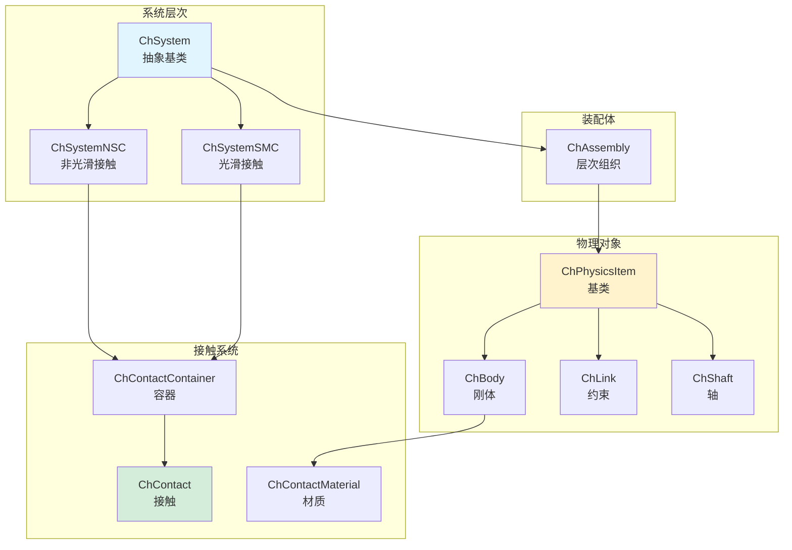
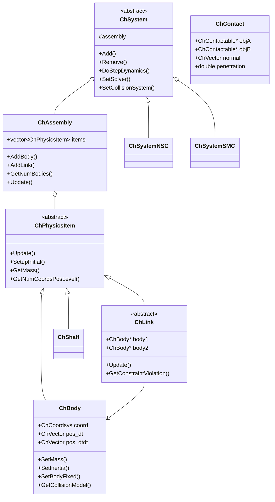
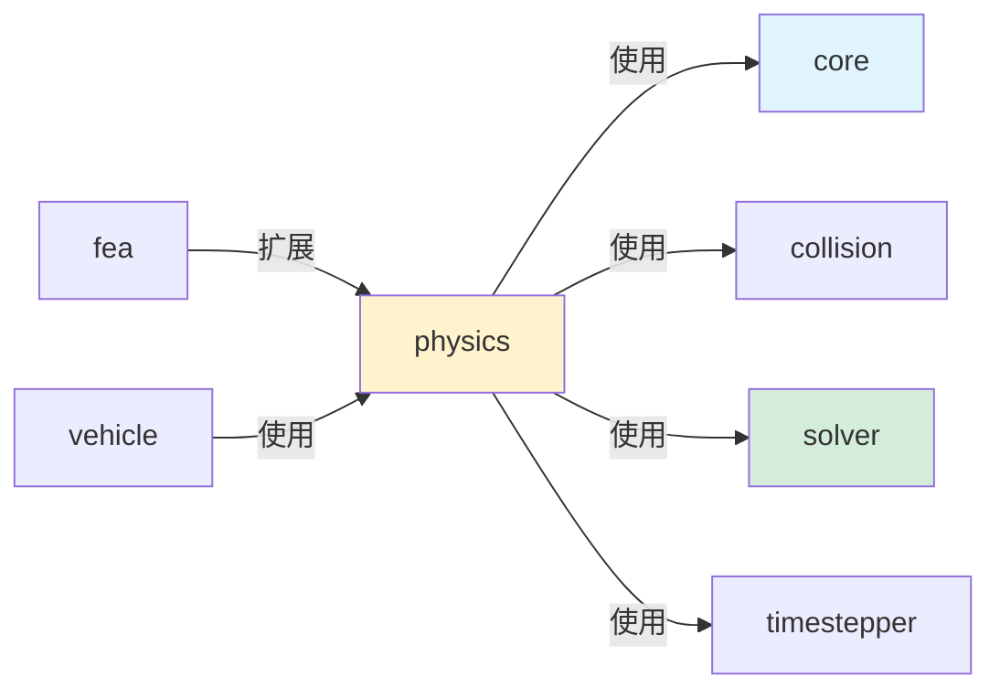

# Physics 模块架构分析

## 概述

`src/chrono/physics` 文件夹包含 Chrono 核心物理引擎的实现，是整个多体动力学仿真能力的核心。该模块实现了仿真系统、刚体、约束（连接）、接触力学和载荷等核心功能。

## 主要功能

### 核心职责
1. **系统管理**：ChSystem - 主仿真协调器
2. **刚体**：ChBody 及其变体表示物理对象
3. **约束系统**：ChLink 层次结构用于物体间的关节和约束
4. **接触力学**：接触容器和材质（NSC 和 SMC 两种表述）
5. **轴系统**：用于动力传动系统的1D旋转元素
6. **载荷和力**：外部载荷、力和力矩
7. **装配体**：物理项目的层次化组织
8. **节点**：质点和粒子系统

## 设计特性

### 架构模式
- **组件模式**：物理项目作为组件添加到系统中
- **策略模式**：不同的求解器和接触表述（NSC vs SMC）
- **组合模式**：ChAssembly 允许层次化组合
- **访问者模式**：用于碰撞检测和约束装配
- **工厂模式**：ChBodyEasy 方便创建刚体

### 性能考虑
- **缓存友好设计**：数据结构优化顺序访问
- **延迟求值**：约束雅可比矩阵仅在需要时计算
- **接触池化**：重用接触对象减少内存分配
- **并行就绪**：设计支持 OpenMP 并行化

## 文件结构和关系

### 核心系统类
```
ChSystem.h/cpp              - 抽象基础系统类
ChSystemNSC.h/cpp           - 非光滑接触（DVI）表述
ChSystemSMC.h/cpp           - 光滑接触（罚函数）表述
ChAssembly.h/cpp            - 层次化组织的容器
```

### 刚体层次结构
```
ChObject.h/cpp              - 根基类（带名称/标签）
ChPhysicsItem.h/cpp         - 所有物理实体的基类
ChBodyFrame.h/cpp           - 刚体的坐标系统
ChBody.h/cpp                - 标准刚体
ChBodyAuxRef.h/cpp          - 带辅助参考系的刚体
ChBodyEasy.h/cpp            - 常用形状的便捷工厂
```

### 约束/连接层次结构
```
ChLinkBase.h/cpp            - 所有约束的基类
ChLink.h/cpp                - 基于标记点的连接基类
ChLinkMarkers.h/cpp         - 使用标记点的连接

现代约束API（Mates）：
ChLinkMate.h/cpp            - 配合约束基类
ChJoint.h/cpp               - 关节约束基类
ChLinkRevolute.h/cpp        - 旋转关节
ChLinkPrismatic.h/cpp       - 移动关节
ChLinkUniversal.h/cpp       - 万向关节
ChLinkSpherical.h/cpp       - 球形关节
ChLinkCylindrical.h/cpp     - 圆柱关节
ChLinkPlanar.h/cpp          - 平面关节

电机：
ChLinkMotor.h/cpp               - 电机基类
ChLinkMotorRotation*.h/cpp      - 旋转电机（角度、速度、扭矩）
ChLinkMotorLinear*.h/cpp        - 线性电机（位置、速度、力）

弹簧阻尼器：
ChLinkTSDA.h/cpp            - 平移弹簧-阻尼-驱动器
ChLinkRSDA.h/cpp            - 旋转弹簧-阻尼-驱动器
ChLinkBushing.h/cpp         - 6自由度衬套元素

传统锁定约束：
ChLinkLock.h/cpp            - 传统锁定约束
ChLinkLockGear.h/cpp        - 齿轮约束
ChLinkLockPulley.h/cpp      - 滑轮约束
```

### 接触系统
```
ChContact.h/cpp                 - 接触基类
ChContactNSC.h/cpp              - NSC（DVI）接触
ChContactSMC.h/cpp              - SMC（罚函数）接触
ChContactContainer.h/cpp        - 容器基类
ChContactContainerNSC.h/cpp     - NSC 接触存储
ChContactContainerSMC.h/cpp     - SMC 接触存储
ChContactMaterial.h/cpp         - 材质基类
ChContactMaterialNSC.h/cpp      - NSC 材质属性
ChContactMaterialSMC.h/cpp      - SMC 材质属性（恢复系数等）
ChContactable.h/cpp             - 可接触对象的接口
```

### 轴系统（1D旋转）
```
ChShaft.h/cpp                   - 1D 旋转元素
ChShaftsCouple.h                - 轴耦合器基类
ChShaftsGear.h/cpp              - 齿轮约束
ChShaftsClutch.h/cpp            - 带啮合的离合器
ChShaftsFreewheel.h/cpp         - 单向耦合
ChShaftsMotor*.h/cpp            - 轴的电机
ChShaftsTorque.h/cpp            - 施加扭矩
ChShaftsThermalEngine.h/cpp     - ICE（内燃机）模型
ChShaftsTorqueConverter.h/cpp   - 扭矩转换器
ChShaftsPlanetary.h/cpp         - 行星齿轮组
```

### 载荷系统
```
ChLoad.h/cpp                - 载荷基类
ChLoadContainer.h/cpp       - 载荷容器
ChLoadable.h                - 可加载对象接口
ChLoader*.h/cpp             - 载荷应用策略
ChLoadsBody.h/cpp           - 刚体上的载荷
ChLoadsNodeXYZ.h/cpp        - 节点上的载荷
ChLoadBodyMesh.h/cpp        - 网格上的分布载荷
```

### 节点和粒子
```
ChNodeBase.h/cpp            - 节点基类
ChNodeXYZ.h/cpp             - 3D 点节点
ChIndexedNodes.h/cpp        - 节点容器
ChIndexedParticles.h/cpp    - 粒子系统
ChParticleCloud.h/cpp       - 粒子云
```

### 特殊元素
```
ChMarker.h/cpp                  - 刚体上的参考点
ChForce.h/cpp                   - 施加的力/力矩
ChConveyor.h/cpp                - 传送带基元
ChFeeder.h/cpp                  - 粒子喂料器
ChMassProperties.h/cpp          - 惯性计算
ChProximityContainer.h/cpp      - 邻近检测容器
```

### 高级功能
```
ChExternalDynamicsDAE.h/cpp     - 外部 DAE 系统耦合
ChExternalDynamicsODE.h/cpp     - 外部 ODE 系统耦合
ChHydraulicActuator.h/cpp       - 液压执行器模型
ChHydraulicCircuit.h/cpp        - 液压回路模型
```

## 架构图



## 类层次结构



## 使用场景

### 1. 创建基本仿真系统
```cpp
// 创建物理系统（选择NSC或SMC）
auto system = chrono_types::make_shared<ChSystemNSC>();
// 或: auto system = chrono_types::make_shared<ChSystemSMC>();

// 设置重力
system->SetGravitationalAcceleration(ChVector3d(0, -9.81, 0));

// 设置求解器
auto solver = chrono_types::make_shared<ChSolverPSOR>();
system->SetSolver(solver);

// 设置碰撞系统
auto collision_system = chrono_types::make_shared<ChCollisionSystemBullet>();
system->SetCollisionSystem(collision_system);
```

### 2. 创建刚体
```cpp
// 方法1：使用ChBody
auto body = chrono_types::make_shared<ChBody>();
body->SetMass(10.0);
body->SetInertiaXX(ChVector3d(1, 1, 1));
body->SetPos(ChVector3d(0, 1, 0));
body->SetRot(QuatFromAngleZ(CH_PI/4));
system->Add(body);

// 方法2：使用ChBodyEasy（推荐）
auto box_body = chrono_types::make_shared<ChBodyEasyBox>(
    1.0, 2.0, 0.5,  // 尺寸
    1000,            // 密度
    true,            // 可视化
    true             // 碰撞
);
box_body->SetPos(ChVector3d(0, 2, 0));
system->Add(box_body);

// 其他EasyBody变体
auto sphere = chrono_types::make_shared<ChBodyEasySphere>(0.5, 1000, true, true);
auto cylinder = chrono_types::make_shared<ChBodyEasyCylinder>(
    chrono::ChAxis::Y, 0.3, 1.0, 1000, true, true
);
```

### 3. 创建关节约束
```cpp
// 旋转关节
auto revolute = chrono_types::make_shared<ChLinkRevolute>();
revolute->Initialize(body1, body2, 
                     ChFramed(ChVector3d(0, 1, 0), QuatFromAngleY(CH_PI/2)));
system->Add(revolute);

// 棱柱关节（滑动）
auto prismatic = chrono_types::make_shared<ChLinkPrismatic>();
prismatic->Initialize(body1, body2,
                      ChFramed(ChVector3d(0, 0, 0), QUNIT));
system->Add(prismatic);

// 球形关节
auto spherical = chrono_types::make_shared<ChLinkSpherical>();
spherical->Initialize(body1, body2, ChFramed(ChVector3d(0, 0, 0)));
system->Add(spherical);
```

### 4. 创建电机
```cpp
// 旋转电机 - 控制角速度
auto motor_speed = chrono_types::make_shared<ChLinkMotorRotationSpeed>();
motor_speed->Initialize(body1, body2, ChFramed(ChVector3d(0, 0, 0), QUNIT));
auto speed_function = chrono_types::make_shared<ChFunctionConst>(CH_PI);  // 180度/秒
motor_speed->SetSpeedFunction(speed_function);
system->Add(motor_speed);

// 旋转电机 - 控制扭矩
auto motor_torque = chrono_types::make_shared<ChLinkMotorRotationTorque>();
motor_torque->Initialize(body1, body2, ChFramed(ChVector3d(0, 0, 0), QUNIT));
auto torque_function = chrono_types::make_shared<ChFunctionConst>(10.0);  // 10 Nm
motor_torque->SetTorqueFunction(torque_function);
system->Add(motor_torque);

// 线性电机 - 控制位置
auto motor_pos = chrono_types::make_shared<ChLinkMotorLinearPosition>();
motor_pos->Initialize(body1, body2, ChFramed(ChVector3d(0, 0, 0), QUNIT));
auto pos_function = chrono_types::make_shared<ChFunctionRamp>(0, 1.0);  // 1 m/s
motor_pos->SetMotionFunction(pos_function);
system->Add(motor_pos);
```

### 5. 弹簧-阻尼器
```cpp
// TSDA（平移弹簧-阻尼-驱动器）
auto spring = chrono_types::make_shared<ChLinkTSDA>();
spring->Initialize(body1, body2, 
                   false,  // 不自动计算长度
                   ChVector3d(0, 0, 0),  // body1上的点
                   ChVector3d(1, 0, 0)); // body2上的点
spring->SetSpringCoefficient(1000.0);  // 刚度
spring->SetDampingCoefficient(50.0);   // 阻尼
spring->SetRestLength(1.0);            // 自然长度
system->Add(spring);

// 自定义力函数
auto custom_force = chrono_types::make_shared<ChLinkTSDA>();
custom_force->RegisterForceFunctor(
    [](double time, double rest_length, double length, double vel,
       const ChLinkTSDA* link) {
        double deformation = length - rest_length;
        double force = -1000 * deformation - 50 * vel;  // F = -kx - cv
        return force;
    }
);
```

### 6. 接触材质
```cpp
// NSC材质
auto mat_nsc = chrono_types::make_shared<ChContactMaterialNSC>();
mat_nsc->SetFriction(0.5f);           // 摩擦系数
mat_nsc->SetRestitution(0.0f);        // 恢复系数
mat_nsc->SetCohesion(0.0f);           // 粘聚力
mat_nsc->SetCompliance(0.0f);         // 柔度
mat_nsc->SetComplianceT(0.0f);        // 切向柔度
mat_nsc->SetRollingFriction(0.0f);    // 滚动摩擦
mat_nsc->SetSpinningFriction(0.0f);   // 旋转摩擦

// SMC材质
auto mat_smc = chrono_types::make_shared<ChContactMaterialSMC>();
mat_smc->SetFriction(0.5f);
mat_smc->SetRestitution(0.3f);
mat_smc->SetYoungModulus(2e5f);       // 杨氏模量
mat_smc->SetPoissonRatio(0.3f);       // 泊松比
mat_smc->SetKn(1e6f);                 // 法向刚度
mat_smc->SetKt(1e6f);                 // 切向刚度
mat_smc->SetGn(1e3f);                 // 法向阻尼
mat_smc->SetGt(1e3f);                 // 切向阻尼
```

### 7. 轴系统（1D动力传动）
```cpp
// 创建轴
auto shaft1 = chrono_types::make_shared<ChShaft>();
shaft1->SetInertia(1.0);
shaft1->SetPos_dt(10.0);  // 初始角速度
system->Add(shaft1);

auto shaft2 = chrono_types::make_shared<ChShaft>();
shaft2->SetInertia(2.0);
system->Add(shaft2);

// 齿轮连接
auto gear = chrono_types::make_shared<ChShaftsGear>();
gear->Initialize(shaft1, shaft2);
gear->SetTransmissionRatio(2.0);  // 传动比 2:1
system->Add(gear);

// 离合器
auto clutch = chrono_types::make_shared<ChShaftsClutch>();
clutch->Initialize(shaft1, shaft2);
clutch->SetTorqueLimit(100.0);      // 最大扭矩
clutch->SetModulation(1.0);         // 1.0=完全啮合, 0.0=完全分离
system->Add(clutch);

// 扭矩
auto torque = chrono_types::make_shared<ChShaftsTorque>();
torque->Initialize(shaft1);
torque->SetTorque(50.0);  // 50 Nm
system->Add(torque);
```

### 8. 载荷
```cpp
// 施加常力
auto force = chrono_types::make_shared<ChForce>();
force->SetBody(body);
force->SetMode(ChForce::ForceType::FORCE);
force->SetVpoint(ChVector3d(0, 0, 0));  // 作用点
force->SetMforce(100.0);                // 力大小
force->SetDir(ChVector3d(1, 0, 0));     // 力方向
body->AddForce(force);

// 使用载荷系统
auto load_container = chrono_types::make_shared<ChLoadContainer>();
system->Add(load_container);

auto body_force = chrono_types::make_shared<ChLoadBodyForce>(
    body,                           // 刚体
    ChVector3d(100, 0, 0),         // 力向量
    false,                          // 不是相对坐标
    ChVector3d(0, 0, 0),           // 作用点
    false                           // 不是相对坐标
);
load_container->Add(body_force);
```

### 9. 运行仿真
```cpp
// 设置时间步长
double time_step = 0.01;

// 仿真循环
while (system->GetChTime() < 10.0) {
    // 更新系统
    system->DoStepDynamics(time_step);
    
    // 获取刚体状态
    ChVector3d pos = body->GetPos();
    ChQuaterniond rot = body->GetRot();
    ChVector3d vel = body->GetPosDt();
    ChVector3d ang_vel = body->GetAngVelLocal();
    
    // 输出信息
    std::cout << "Time: " << system->GetChTime() 
              << " Pos: " << pos << std::endl;
}
```

## 设计亮点

### 1. NSC vs SMC
Chrono 提供两种接触表述：

**NSC（Non-Smooth Contact）**：
- 基于 DVI（微分变分不等式）
- 精确的非穿透约束
- 适合刚性接触
- 隐式时间积分
- 更稳定但可能更慢

**SMC（Smooth Contact）**：
- 基于罚函数
- 允许小穿透
- 适合柔性接触和颗粒
- 显式时间积分
- 更快但需要小时间步

### 2. 模块化设计
- 物理项目可独立添加/移除
- 约束与刚体解耦
- 求解器和碰撞系统可插拔

### 3. 装配体层次
```cpp
auto assembly1 = chrono_types::make_shared<ChAssembly>();
assembly1->Add(body1);
assembly1->Add(body2);
assembly1->Add(joint1);

auto assembly2 = chrono_types::make_shared<ChAssembly>();
assembly2->Add(body3);

auto main_assembly = chrono_types::make_shared<ChAssembly>();
main_assembly->Add(assembly1);
main_assembly->Add(assembly2);

system->Add(main_assembly);
```

## 与其他模块的交互



### 依赖关系
- **依赖 core**：数学类型和坐标系统
- **依赖 collision**：碰撞检测和接触信息
- **依赖 solver**：求解约束和方程
- **依赖 timestepper**：时间积分方案
- **被 fea 扩展**：有限元物理项目
- **被 vehicle 使用**：车辆模型基于物理对象

## 性能特点

### 优点
1. **模块化**：组件可独立优化
2. **并行化支持**：关键路径支持 OpenMP
3. **缓存友好**：连续内存布局
4. **延迟计算**：按需计算雅可比矩阵
5. **对象池**：重用接触对象

### 性能考虑
1. **约束数量**：约束越多求解越慢
2. **接触数量**：接触检测和求解开销
3. **刚体数量**：线性影响性能
4. **时间步长**：小步长增加计算量

### 优化建议
1. **减少约束**：使用最简单的约束类型
2. **固定静止对象**：使用 SetBodyFixed()
3. **合理碰撞过滤**：减少不必要的碰撞检测
4. **选择合适求解器**：根据问题特性选择
5. **使用 SMC**：对大规模颗粒系统使用 SMC

## 最佳实践

1. **选择正确的系统类型**：刚性接触用 NSC，颗粒系统用 SMC
2. **使用 ChBodyEasy**：简化常见形状的创建
3. **设置合理的材质参数**：避免过于刚硬或柔软
4. **固定不动对象**：提高性能
5. **使用装配体**：组织复杂系统
6. **定期清理**：移除不再需要的物理对象
7. **监控性能**：使用 ChTimer 测量瓶颈

## 扩展点

### 自定义物理项目
```cpp
class MyPhysicsItem : public ChPhysicsItem {
public:
    virtual void Update(double mytime, bool update_assets) override {
        // 更新逻辑
    }
    
    virtual int GetNumCoordsPosLevel() override {
        return 3;  // 位置级别的坐标数
    }
    
    virtual int GetNumCoordsVelLevel() override {
        return 3;  // 速度级别的坐标数
    }
};
```

### 自定义约束
```cpp
class MyCustomLink : public ChLink {
public:
    virtual void Update(double mytime, bool update_assets) override {
        // 约束更新
    }
    
    virtual void IntLoadConstraint_C(unsigned int& moff,
                                    ChVectorDynamic<>& C,
                                    double factor) override {
        // 加载约束残差
    }
};
```

## 总结

Physics 模块是 Chrono 的核心，提供了：
- 完整的多体动力学仿真框架
- 灵活的约束和连接系统
- 两种接触力学表述（NSC和SMC）
- 丰富的物理元素（刚体、轴、载荷等）
- 模块化和可扩展的设计

该模块的设计平衡了灵活性、性能和易用性，是构建复杂机械系统仿真的基础。
