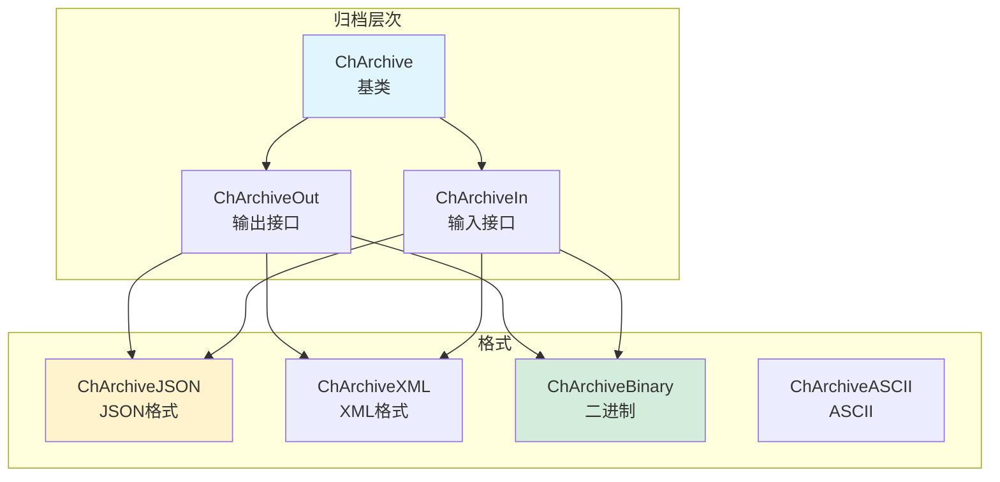
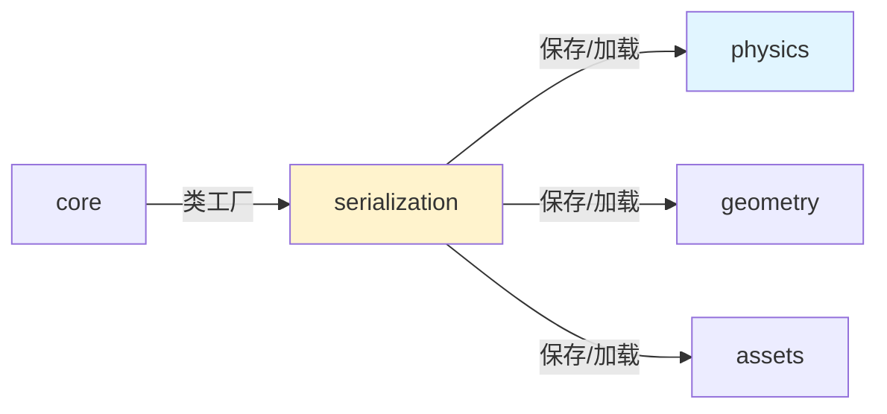

# Serialization 模块架构分析

## 概述

`src/chrono/serialization` 文件夹实现了 Chrono 的序列化和反序列化系统，支持将对象保存到文件并从文件恢复。该模块支持多种格式（JSON、XML、二进制等），并提供对象的版本化和类型安全。

## 主要功能

### 核心职责
1. **对象序列化**：将C++对象转换为可持久化格式
2. **对象反序列化**：从持久化格式恢复对象
3. **多格式支持**：JSON、XML、二进制、ASCII
4. **版本控制**：支持对象版本演化
5. **类型注册**：自动注册和创建对象类型
6. **智能指针支持**：正确处理共享指针

## 文件结构

### 核心类
```
ChArchive.h/cpp             - 归档基类（抽象）
ChArchiveOut.h              - 输出归档接口
ChArchiveIn.h               - 输入归档接口
```

### 格式实现
```
ChArchiveJSON.h/cpp         - JSON格式（推荐）
ChArchiveXML.h/cpp          - XML格式
ChArchiveBinary.h/cpp       - 二进制格式（紧凑）
ChArchiveASCII.h/cpp        - ASCII文本格式（调试）
```

### 辅助工具
```
ChObjectExplorer.h/cpp      - 对象浏览和反射
```

## 架构图



## 使用场景

### 1. 保存系统到JSON
```cpp
// 创建输出归档
ChArchiveOutJSON archive_out("simulation.json");

// 序列化整个系统
archive_out << CHNVP(system);

// 或保存单个对象
auto body = system->GetBodies()[0];
archive_out << CHNVP(body);
```

### 2. 从JSON加载
```cpp
// 创建输入归档
ChArchiveInJSON archive_in("simulation.json");

// 反序列化系统
auto loaded_system = chrono_types::make_shared<ChSystemNSC>();
archive_in >> CHNVP(loaded_system);

// 或加载单个对象
std::shared_ptr<ChBody> loaded_body;
archive_in >> CHNVP(loaded_body);
```

### 3. 二进制格式（高效）
```cpp
// 保存到二进制
ChStreamOutBinaryFile file_out("simulation.dat");
ChArchiveOutBinary archive_out(file_out);
archive_out << CHNVP(system);

// 从二进制加载
ChStreamInBinaryFile file_in("simulation.dat");
ChArchiveInBinary archive_in(file_in);
archive_in >> CHNVP(loaded_system);
```

### 4. 自定义类序列化
```cpp
class MyCustomObject {
public:
    double value;
    std::string name;
    
    // 序列化方法
    void ArchiveOut(ChArchiveOut& archive_out) {
        archive_out << CHNVP(value);
        archive_out << CHNVP(name);
    }
    
    void ArchiveIn(ChArchiveIn& archive_in) {
        archive_in >> CHNVP(value);
        archive_in >> CHNVP(name);
    }
};
```

### 5. 版本控制
```cpp
class MyClass {
public:
    int version;
    double data;
    
    void ArchiveOut(ChArchiveOut& archive_out) {
        archive_out.VersionWrite<MyClass>();
        archive_out << CHNVP(data);
    }
    
    void ArchiveIn(ChArchiveIn& archive_in) {
        int class_version = archive_in.VersionRead<MyClass>();
        
        if (class_version >= 1) {
            archive_in >> CHNVP(data);
        }
        // 处理旧版本...
    }
};

CH_CLASS_VERSION(MyClass, 1)  // 声明版本号
```

### 6. 智能指针序列化
```cpp
// 共享指针自动处理引用
std::shared_ptr<ChBody> body1 = chrono_types::make_shared<ChBody>();
std::shared_ptr<ChBody> body2 = body1;  // 共享引用

ChArchiveOutJSON archive_out("test.json");
archive_out << CHNVP(body1);
archive_out << CHNVP(body2);  // 自动检测共享引用

// 加载时保持引用关系
ChArchiveInJSON archive_in("test.json");
std::shared_ptr<ChBody> loaded1, loaded2;
archive_in >> CHNVP(loaded1);
archive_in >> CHNVP(loaded2);
assert(loaded1.get() == loaded2.get());  // 共享同一对象
```

### 7. 选择性序列化
```cpp
class MyObject {
public:
    double important_data;
    double cached_data;  // 不需要保存
    
    void ArchiveOut(ChArchiveOut& archive_out) {
        archive_out << CHNVP(important_data);
        // cached_data不序列化
    }
    
    void ArchiveIn(ChArchiveIn& archive_in) {
        archive_in >> CHNVP(important_data);
        // 重新计算cached_data
        cached_data = ComputeCachedData();
    }
};
```

### 8. 对象探索（反射）
```cpp
ChObjectExplorer explorer;
explorer.FetchValues(body);

// 访问所有属性
for (const auto& prop : explorer.GetProperties()) {
    std::cout << prop.name << ": " << prop.value << std::endl;
}
```

## 宏和辅助函数

### CHNVP（名称-值对）
```cpp
// 自动使用变量名作为名称
double my_var = 5.0;
archive << CHNVP(my_var);  // 等价于 "my_var" : 5.0

// 或指定自定义名称
archive << CHNVP(my_var, "custom_name");
```

### 类注册
```cpp
// 注册类以支持多态序列化
CH_CLASS_REGISTER(MyDerivedClass)

// 在基类指针中序列化派生类
std::shared_ptr<BaseClass> ptr = chrono_types::make_shared<MyDerivedClass>();
archive << CHNVP(ptr);  // 自动保存实际类型
```

## JSON格式示例

### 输出示例
```json
{
    "system": {
        "_type": "ChSystemNSC",
        "version": 1,
        "time": 0.5,
        "bodies": [
            {
                "_type": "ChBody",
                "name": "ground",
                "mass": 1000.0,
                "pos": [0, 0, 0],
                "rot": [1, 0, 0, 0]
            }
        ]
    }
}
```

## 性能考虑

### 格式比较
```
JSON:
- 优点：可读、可编辑、调试友好
- 缺点：文件较大、解析较慢
- 适用：配置文件、小规模数据

二进制:
- 优点：紧凑、快速
- 缺点：不可读、不可编辑
- 适用：检查点、大规模数据

XML:
- 优点：结构化、可扩展
- 缺点：冗长、解析慢
- 适用：配置、互操作性

ASCII:
- 优点：简单、可读
- 缺点：效率低
- 适用：调试、小数据
```

## 与其他模块的交互



## 最佳实践

1. **使用JSON进行开发**：易于调试
2. **使用二进制用于生产**：性能更好
3. **实现版本控制**：支持向后兼容
4. **谨慎序列化**：只保存必要数据
5. **测试往返**：保存后加载验证
6. **处理错误**：捕获序列化异常

## 常见问题

### 循环引用
```cpp
// 自动处理循环引用
auto body1 = chrono_types::make_shared<ChBody>();
auto body2 = chrono_types::make_shared<ChBody>();
auto link = chrono_types::make_shared<ChLinkLockRevolute>();
link->Initialize(body1, body2, ...);

// body和link互相引用，但序列化正确处理
archive << CHNVP(body1);
archive << CHNVP(link);
```

### 大型系统
```cpp
// 分块保存大型系统
for (auto body : system->GetBodies()) {
    ChArchiveOutJSON archive_out("body_" + body->GetName() + ".json");
    archive_out << CHNVP(body);
}
```

## 总结

Serialization 模块提供了：
- 多格式序列化支持
- 智能指针和引用处理
- 版本控制机制
- 类型安全的序列化
- 易于扩展的架构

该模块使得保存和恢复仿真状态变得简单可靠。
