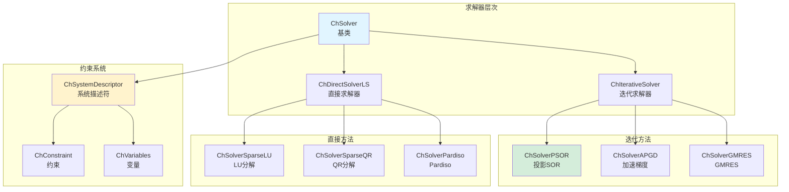
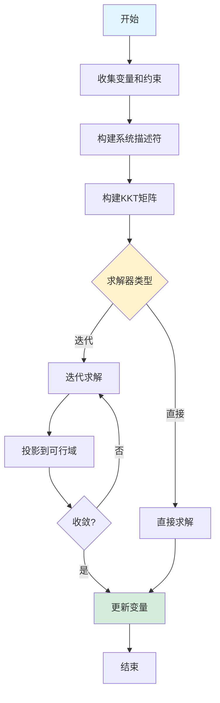
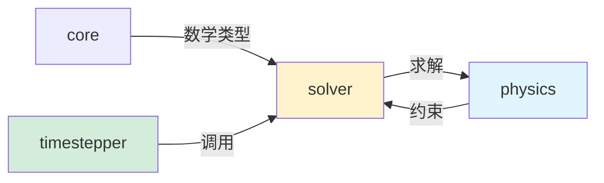

# Solver 模块架构分析

## 概述

`src/chrono/solver` 文件夹实现了 Chrono 的约束求解器系统，负责求解多体系统的运动方程和约束方程。该模块是物理引擎的数学核心，将物理问题转化为线性或非线性方程组并求解。

## 主要功能

### 核心职责
1. **约束表示**：定义各类约束（接触、关节、摩擦等）
2. **约束求解**：求解约束力和拉格朗日乘子
3. **迭代求解器**：提供多种迭代算法（SOR、PSOR、Krylov等）
4. **直接求解器**：提供稀疏直接求解器
5. **KKT系统**：构建和求解 Karush-Kuhn-Tucker 系统
6. **变量管理**：管理系统状态变量和约束变量

## 设计特性

### 架构模式
- **策略模式**：不同的求解器算法可互换
- **构建器模式**：逐步构建约束系统
- **模板方法模式**：求解器基类定义算法框架
- **享元模式**：共享约束雅可比矩阵数据

### 性能考虑
- **稀疏矩阵**：利用系统矩阵的稀疏性
- **缓存优化**：优化数据访问模式
- **并行化**：部分求解器支持 OpenMP
- **预条件**：使用预条件加速收敛
- **热启动**：使用上一步的解作为初值

## 文件结构和关系

### 约束类型
```
ChConstraint.h/cpp                    - 约束基类
ChConstraintTwo.h/cpp                 - 连接两个物体的约束
ChConstraintThree.h/cpp               - 连接三个物体的约束
ChConstraintNgeneric.h/cpp            - 通用 N 体约束

接触约束：
ChConstraintContactNormal.h/cpp       - 法向接触约束（单侧）
ChConstraintContactTangential.h/cpp   - 切向摩擦约束

旋转约束：
ChConstraintRollingNormal.h/cpp       - 滚动摩擦约束
ChConstraintRollingTangential.h/cpp   - 旋转摩擦约束

特殊约束：
ChConstraintThreeBBShaft.h/cpp        - 刚体-刚体-轴约束
ChConstraintThreeGeneric.h/cpp        - 三体通用约束
ChConstraintTuple.h/cpp               - 约束元组
```

### 求解器层次结构
```
ChSolver.h/cpp                        - 求解器抽象基类
ChIterativeSolver.h/cpp               - 迭代求解器基类
ChDirectSolverLS.h/cpp                - 直接求解器基类

迭代求解器：
ChSolverPSOR.h/cpp                    - 投影 SOR（默认，稳定）
ChSolverPJacobi.h/cpp                 - 投影 Jacobi
ChSolverAPGD.h/cpp                    - 加速投影梯度下降
ChSolverBB.h/cpp                      - Barzilai-Borwein
ChSolverGMRES.h/cpp                   - GMRES Krylov 方法
ChSolverMINRES.h/cpp                  - MINRES Krylov 方法
ChSolverBiCGSTAB.h/cpp                - BiCGSTAB Krylov 方法

直接求解器：
ChSolverSparseLU.h/cpp                - 稀疏 LU 分解
ChSolverSparseQR.h/cpp                - 稀疏 QR 分解
ChSolverPardisoMKL.h/cpp              - Intel MKL Pardiso
ChSolverMumps.h/cpp                   - MUMPS 求解器
```

### 变量管理
```
ChVariables.h/cpp                     - 变量基类
ChVariablesGeneric.h/cpp              - 通用变量
ChVariablesBody.h/cpp                 - 刚体变量（6-DOF）
ChVariablesBodyOwnMass.h/cpp          - 带质量矩阵的刚体变量
ChVariablesNode.h/cpp                 - FEA 节点变量
ChVariablesShaft.h/cpp                - 轴变量（1-DOF）
```

### 系统描述
```
ChSystemDescriptor.h/cpp              - 系统描述符
  - 收集所有变量和约束
  - 构建 KKT 系统
  - 管理求解过程
```

### KKT 系统
```
ChKRMBlock.h/cpp                      - KKT 矩阵块
  - K: 刚度矩阵
  - R: 约束雅可比
  - M: 质量矩阵
```

## 架构图



## 求解过程



## KKT 系统结构

约束问题的 KKT 系统：
```
[ M  Cq^T ] [ v  ]   [ f  ]
[ Cq  0   ] [ l  ] = [ b  ]
```

其中：
- M: 质量矩阵
- Cq: 约束雅可比矩阵
- v: 速度
- l: 拉格朗日乘子（约束力）
- f: 外力
- b: 约束右端项

## 使用场景

### 1. 选择和配置求解器
```cpp
auto system = chrono_types::make_shared<ChSystemNSC>();

// 方法1：使用迭代求解器（推荐用于大规模系统）
auto solver = chrono_types::make_shared<ChSolverPSOR>();
solver->SetMaxIterations(100);
solver->SetTolerance(1e-6);
solver->SetOmega(0.8);  // 松弛因子
solver->EnableWarmStart(true);
solver->EnableDiagonalPreconditioner(true);
system->SetSolver(solver);

// 方法2：使用加速投影梯度下降
auto solver_apgd = chrono_types::make_shared<ChSolverAPGD>();
solver_apgd->SetMaxIterations(200);
solver_apgd->SetTolerance(1e-6);
system->SetSolver(solver_apgd);

// 方法3：使用直接求解器（适用于小规模系统）
auto solver_direct = chrono_types::make_shared<ChSolverSparseLU>();
system->SetSolver(solver_direct);

// 方法4：使用 Krylov 方法
auto solver_gmres = chrono_types::make_shared<ChSolverGMRES>();
solver_gmres->SetMaxIterations(100);
solver_gmres->SetTolerance(1e-6);
system->SetSolver(solver_gmres);
```

### 2. 求解器性能调优
```cpp
auto solver = chrono_types::make_shared<ChSolverPSOR>();

// 基本设置
solver->SetMaxIterations(100);      // 最大迭代次数
solver->SetTolerance(1e-6);         // 收敛容差
solver->EnableWarmStart(true);      // 使用热启动

// PSOR 特定参数
solver->SetOmega(0.8);              // 松弛因子 (0,2)
solver->SetSharpnessLambda(1.0);    // Lambda 锐化因子

// 并行化
solver->EnableThreadWrite(true);    // 启用线程写入

// 预条件
solver->EnableDiagonalPreconditioner(true);
```

### 3. 监控求解器性能
```cpp
// 仿真循环中监控
while (system->GetChTime() < 10.0) {
    system->DoStepDynamics(0.01);
    
    auto solver = std::dynamic_pointer_cast<ChIterativeSolver>(
        system->GetSolver()
    );
    
    if (solver) {
        int iterations = solver->GetIterations();
        double residual = solver->GetError();
        
        std::cout << "Time: " << system->GetChTime()
                  << " Iterations: " << iterations
                  << " Residual: " << residual << std::endl;
    }
}
```

### 4. 自定义约束
```cpp
// 访问系统描述符
auto descriptor = system->GetSystemDescriptor();

// 获取约束列表
auto& constraints = descriptor->GetConstraints();

// 遍历约束
for (auto& constraint : constraints) {
    if (constraint->IsActive()) {
        double violation = constraint->GetConstraintViolation();
        double force = constraint->GetLagrangeMultiplier();
        
        std::cout << "Constraint force: " << force 
                  << " Violation: " << violation << std::endl;
    }
}
```

### 5. 使用高级求解器（Pardiso/MKL）
```cpp
// 需要 Intel MKL 库
#ifdef CHRONO_PARDISO_MKL
auto solver_pardiso = chrono_types::make_shared<ChSolverPardisoMKL>();
solver_pardiso->SetSparsityPatternLock(true);  // 锁定稀疏模式
solver_pardiso->UsePartialPivot(true);
system->SetSolver(solver_pardiso);
#endif

// 或使用 MUMPS（需要 MUMPS 库）
#ifdef CHRONO_MUMPS
auto solver_mumps = chrono_types::make_shared<ChSolverMumps>();
solver_mumps->SetSparsityPatternLock(true);
system->SetSolver(solver_mumps);
#endif
```

### 6. 求解静力学问题
```cpp
// 静力学分析使用更严格的收敛条件
auto solver = chrono_types::make_shared<ChSolverPSOR>();
solver->SetMaxIterations(300);      // 更多迭代
solver->SetTolerance(1e-8);         // 更严格的容差
solver->SetOmega(1.0);              // 对静力学问题使用1.0

system->SetSolver(solver);

// 执行静力学求解
system->DoStaticLinear();
```

## 求解器选择指南

### ChSolverPSOR（推荐用于一般用途）
**优点**：
- 稳定可靠
- 适合大多数问题
- 良好的收敛性
- 支持摩擦和单侧约束

**适用场景**：
- 一般多体动力学
- 中等规模系统（< 1000 自由度）
- 有接触和摩擦的系统

**参数建议**：
```cpp
solver->SetMaxIterations(50-200);
solver->SetTolerance(1e-4 to 1e-6);
solver->SetOmega(0.6-1.0);
```

### ChSolverAPGD（用于大规模系统）
**优点**：
- 快速收敛
- 适合大规模问题
- 内存效率高

**适用场景**：
- 大规模颗粒系统
- 复杂接触问题
- GPU 并行计算

**参数建议**：
```cpp
solver->SetMaxIterations(100-500);
solver->SetTolerance(1e-4);
```

### ChSolverGMRES（用于刚性系统）
**优点**：
- Krylov 子空间方法
- 适合病态系统
- 可使用预条件

**适用场景**：
- 刚性约束系统
- 高精度要求
- 数值困难问题

**参数建议**：
```cpp
solver->SetMaxIterations(100-200);
solver->SetTolerance(1e-6);
solver->SetMaxKrylovSubspaceSize(50);
```

### ChSolverSparseLU（直接求解器）
**优点**：
- 精确求解
- 单次求解
- 无需调参

**适用场景**：
- 小规模系统（< 100 自由度）
- 静力学分析
- 需要高精度的问题

**限制**：
- 内存消耗大
- 不适合大规模系统
- 需要额外库（Eigen、MKL等）

## 约束类型详解

### 1. 双边约束（Bilateral）
```cpp
// 例如：固定关节、距离约束
// 约束方程: C(q) = 0
// 无界拉格朗日乘子: -∞ < λ < +∞
```

### 2. 单侧约束（Unilateral）
```cpp
// 例如：接触约束
// 约束不等式: C(q) >= 0
// 非负拉格朗日乘子: λ >= 0
// 互补条件: λ * C = 0
```

### 3. 摩擦锥约束
```cpp
// 库伦摩擦: ||λ_t|| <= μ * λ_n
// λ_n: 法向力
// λ_t: 切向力
// μ: 摩擦系数
```

## 性能特点

### 迭代求解器
**优点**：
- 内存需求低（O(n)）
- 适合大规模问题
- 可并行化
- 支持热启动

**缺点**：
- 可能不收敛
- 需要参数调优
- 收敛速度取决于问题条件数

### 直接求解器
**优点**：
- 精确求解
- 无需参数调优
- 预测性强

**缺点**：
- 内存消耗大（O(n²)）
- 分解时间长（O(n³)）
- 仅适合小规模问题

## 优化技巧

### 1. 使用热启动
```cpp
solver->EnableWarmStart(true);
// 使用上一步的解作为初值，加速收敛
```

### 2. 调整松弛因子
```cpp
// 对于刚性系统，使用较小的 omega
solver->SetOmega(0.6);

// 对于柔性系统，使用较大的 omega
solver->SetOmega(1.0);
```

### 3. 使用预条件
```cpp
solver->EnableDiagonalPreconditioner(true);
// 改善条件数，加速收敛
```

### 4. 锁定稀疏模式
```cpp
// 对于拓扑不变的系统
solver_direct->SetSparsityPatternLock(true);
// 只需一次符号分解
```

### 5. 调整迭代次数和容差
```cpp
// 平衡精度和性能
solver->SetMaxIterations(100);  // 增加以提高精度
solver->SetTolerance(1e-5);     // 降低以提高速度
```

## 与其他模块的交互



### 依赖关系
- **依赖 core**：矩阵和向量类型
- **被 physics 使用**：求解约束和接触
- **被 timestepper 调用**：时间步积分过程中求解
- **与 collision 交互**：处理接触约束

## 调试技巧

### 1. 检查约束违反
```cpp
auto descriptor = system->GetSystemDescriptor();
double max_violation = 0;

for (auto& constraint : descriptor->GetConstraints()) {
    double violation = std::abs(constraint->GetConstraintViolation());
    if (violation > max_violation) {
        max_violation = violation;
    }
}

std::cout << "Max constraint violation: " << max_violation << std::endl;
```

### 2. 监控收敛
```cpp
auto solver = std::dynamic_pointer_cast<ChIterativeSolver>(system->GetSolver());
solver->SetRecordViolation(true);

// 仿真后
auto& violation_history = solver->GetViolationHistory();
// 分析收敛曲线
```

### 3. 使用详细输出
```cpp
solver->SetVerbose(true);
// 打印详细的求解过程信息
```

## 最佳实践

1. **首选 PSOR**：对大多数问题是最佳选择
2. **使用热启动**：显著加速收敛
3. **合理设置容差**：1e-4 到 1e-6 通常足够
4. **监控性能**：跟踪迭代次数和残差
5. **问题特定调优**：根据系统特性调整参数
6. **考虑直接求解器**：小系统可以获得精确解
7. **使用并行化**：大系统启用 OpenMP

## 常见问题

### 求解器不收敛
**可能原因**：
- 约束冲突
- 数值刚性
- 不良条件数

**解决方法**：
- 增加迭代次数
- 调整松弛因子
- 检查约束设置
- 尝试不同求解器

### 求解速度慢
**可能原因**：
- 过多迭代
- 大规模系统
- 密集约束

**解决方法**：
- 启用热启动
- 使用预条件
- 考虑 APGD 或 GMRES
- 减少约束数量

## 总结

Solver 模块是 Chrono 的数学核心，提供了：
- 多种求解器算法（迭代和直接）
- 完整的约束系统
- 高效的稀疏矩阵处理
- 灵活的参数配置

正确选择和配置求解器对仿真性能和精度至关重要。
