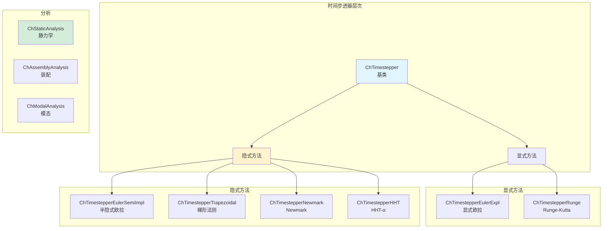
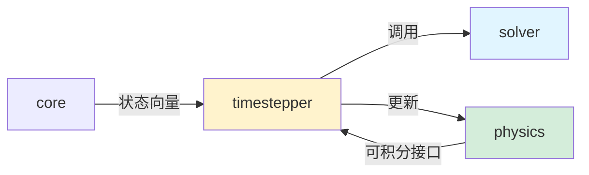

# Timestepper 模块架构分析

## 概述

`src/chrono/timestepper` 文件夹实现了 Chrono 的时间积分器，负责推进仿真时间并求解系统的微分方程。该模块提供了多种时间步进方案，从显式欧拉到隐式高阶方法。

## 主要功能

### 核心职责
1. **时间积分**：将系统状态从 t 推进到 t+Δt
2. **微分方程求解**：求解 ODE/DAE 系统
3. **状态管理**：管理位置、速度、加速度状态
4. **静力学分析**：求解静态平衡
5. **模态分析**：特征值和特征向量计算
6. **稳定性控制**：自适应步长和稳定性检查

## 设计特性

### 架构模式
- **策略模式**：不同的时间积分方案可互换
- **模板方法模式**：定义积分算法框架
- **状态模式**：管理仿真状态
- **命令模式**：封装分析命令

### 性能考虑
- **自适应步长**：根据误差调整时间步
- **预测-校正**：提高精度和稳定性
- **隐式稳定性**：隐式方法的大步长稳定性
- **矩阵重用**：缓存雅可比矩阵

## 文件结构和关系

### 核心类
```
ChIntegrable.h/cpp              - 可积分系统接口
ChState.h                       - 状态向量定义
ChTimestepper.h/cpp             - 时间步进器基类

时间步进器实现：
ChTimestepperEuler.h/cpp        - 显式/半隐式欧拉
ChTimestepperEulerExpl.h/cpp    - 显式欧拉
ChTimestepperEulerSemiImpl.h/cpp - 半隐式欧拉
ChTimestepperRunge.h/cpp        - Runge-Kutta 方法
ChTimestepperTrapezoidal.h/cpp  - 梯形法则
ChTimestepperNewmark.h/cpp      - Newmark 方法
ChTimestepperHHT.h/cpp          - HHT-α 方法
ChTimestepperIorder.h/cpp       - 一阶隐式方法
```

### 分析类
```
ChStaticAnalysis.h/cpp          - 静力学分析
ChAssemblyAnalysis.h/cpp        - 装配分析（初始配置）
ChModalAnalysis.h/cpp           - 模态分析
ChEigenvalueSolver.h/cpp        - 特征值求解器
```

### 状态和变量
```
ChState.h                       - 位置级状态
ChStateDelta.h                  - 速度级状态增量
ChVectorDynamic.h               - 动态大小向量
```

## 架构图



## 时间积分方法

### 显式欧拉
```
v(t+h) = v(t) + h * a(t)
x(t+h) = x(t) + h * v(t+h)

优点：简单快速
缺点：条件稳定，需要小步长
```

### 半隐式欧拉（Symplectic Euler）
```
v(t+h) = v(t) + h * a(t)
x(t+h) = x(t) + h * v(t+h)

优点：保守能量，适合轨道运动
缺点：一阶精度
```

### Runge-Kutta
```
k1 = f(t, y)
k2 = f(t + h/2, y + h*k1/2)
k3 = f(t + h/2, y + h*k2/2)
k4 = f(t + h, y + h*k3)
y(t+h) = y(t) + h/6 * (k1 + 2*k2 + 2*k3 + k4)

优点：四阶精度
缺点：每步需要4次函数评估
```

### 梯形法则（Trapezoidal）
```
v(t+h) = v(t) + h/2 * (a(t) + a(t+h))

优点：二阶精度，无条件稳定
缺点：隐式，需要迭代
```

### Newmark
```
v(t+h) = v(t) + h*[(1-γ)*a(t) + γ*a(t+h)]
x(t+h) = x(t) + h*v(t) + h²*[(1/2-β)*a(t) + β*a(t+h)]

参数：γ = 0.5, β = 0.25 (平均加速度)
优点：可调稳定性和精度
```

### HHT-α（Hilber-Hughes-Taylor）
```
改进的 Newmark，带数值阻尼
α ∈ [-1/3, 0]

优点：高频阻尼，适合刚性系统
缺点：引入人工阻尼
```

## 使用场景

### 1. 选择时间步进器
```cpp
auto system = chrono_types::make_shared<ChSystemNSC>();

// 方法1：使用默认（Euler隐式）
system->SetTimestepperType(ChTimestepper::Type::EULER_IMPLICIT);

// 方法2：显式创建时间步进器
auto stepper = chrono_types::make_shared<ChTimestepperHHT>();
stepper->SetAlpha(-0.2);  // 数值阻尼参数
stepper->SetMaxIters(10);
stepper->SetTolerance(1e-6);
system->SetTimestepper(stepper);

// 方法3：使用Runge-Kutta
auto rk_stepper = chrono_types::make_shared<ChTimestepperRunge>();
rk_stepper->SetOrder(4);  // 4阶RK
system->SetTimestepper(rk_stepper);
```

### 2. 配置时间步进参数
```cpp
// HHT 方法
auto hht = chrono_types::make_shared<ChTimestepperHHT>();
hht->SetAlpha(-0.2);            // 阻尼参数 [-1/3, 0]
hht->SetMaxIters(20);           // 最大迭代次数
hht->SetAbsTolerances(1e-6);    // 绝对容差
hht->SetRelTolerances(1e-4);    // 相对容差
hht->SetMode(ChTimestepperHHT::ACCELERATION);
system->SetTimestepper(hht);

// Newmark 方法
auto newmark = chrono_types::make_shared<ChTimestepperNewmark>();
newmark->SetGamma(0.5);         // γ 参数
newmark->SetBeta(0.25);         // β 参数
newmark->SetMaxIters(10);
system->SetTimestepper(newmark);
```

### 3. 自适应步长
```cpp
// 使用自适应步长控制
auto stepper = chrono_types::make_shared<ChTimestepperHHT>();
stepper->SetStepControl(true);
stepper->SetMinStepSize(1e-5);
stepper->SetMaxStepSize(0.01);

// 仿真循环
double time_step = 0.001;  // 初始步长
while (system->GetChTime() < 10.0) {
    system->DoStepDynamics(time_step);
    
    // 获取建议的下一步长
    time_step = stepper->GetSuggestedStep();
}
```

### 4. 静力学分析
```cpp
// 创建静力学分析
ChStaticAnalysis static_analysis(*system);

// 配置分析
static_analysis.SetMaxIterations(100);
static_analysis.SetIncrementalSteps(10);  // 增量步数
static_analysis.SetResidualTolerance(1e-6);
static_analysis.SetVerbose(true);

// 执行静力学求解
static_analysis.StaticAnalysis();

// 或使用线性静力学
system->DoStaticLinear();

// 或使用非线性静力学
system->DoStaticNonlinear(100, true);  // 迭代次数，详细输出
```

### 5. 装配分析
```cpp
// 装配分析用于找到满足所有约束的初始配置
ChAssemblyAnalysis assembly(*system);

assembly.SetMaxAssemblyIters(100);
assembly.SetTolerance(1e-6);

// 执行装配
bool success = assembly.AssemblyAnalysis();
if (success) {
    std::cout << "Assembly successful" << std::endl;
} else {
    std::cout << "Assembly failed" << std::endl;
}
```

### 6. 模态分析
```cpp
// 创建模态分析
ChModalAnalysis modal_analysis(*system);

// 配置分析
int num_modes = 10;  // 提取10个模态
modal_analysis.SetNumModes(num_modes);

// 执行模态分析
modal_analysis.ComputeModes();

// 获取结果
for (int i = 0; i < num_modes; i++) {
    double freq = modal_analysis.GetFrequency(i);  // Hz
    double omega = modal_analysis.GetOmega(i);     // rad/s
    
    std::cout << "Mode " << i 
              << " Frequency: " << freq << " Hz"
              << " Omega: " << omega << " rad/s" << std::endl;
    
    // 获取模态形状
    ChVectorDynamic<> mode_shape = modal_analysis.GetModeShape(i);
}

// 可视化模态
modal_analysis.SetAnimationMode(3);  // 动画第3个模态
```

### 7. 监控积分误差
```cpp
auto stepper = chrono_types::make_shared<ChTimestepperHHT>();
system->SetTimestepper(stepper);

while (system->GetChTime() < 10.0) {
    system->DoStepDynamics(0.001);
    
    // 获取积分信息
    int num_iters = stepper->GetNumIterations();
    double error = stepper->GetResidual();
    
    if (num_iters >= stepper->GetMaxIters()) {
        std::cout << "Warning: Max iterations reached" << std::endl;
    }
    
    if (error > 1e-3) {
        std::cout << "Warning: Large residual: " << error << std::endl;
    }
}
```

### 8. 处理刚性系统
```cpp
// 刚性系统使用隐式方法和阻尼
auto hht = chrono_types::make_shared<ChTimestepperHHT>();
hht->SetAlpha(-0.3);  // 更强的阻尼

// 或使用更小的步长
double small_timestep = 1e-5;
system->DoStepDynamics(small_timestep);

// 配合适当的求解器
auto solver = chrono_types::make_shared<ChSolverSparseLU>();
system->SetSolver(solver);
```

## 时间步进器选择指南

### ChTimestepperEulerExpl（显式欧拉）
**适用**：
- 简单系统
- 快速原型
- 教学演示

**不适用**：
- 刚性系统
- 高精度要求

**步长**：非常小（< 1e-4）

### ChTimestepperEulerSemiImpl（半隐式欧拉）
**适用**：
- 轨道动力学
- 粒子系统
- 需要能量守恒

**不适用**：
- 高精度要求

**步长**：小（~ 1e-3）

### ChTimestepperRunge（Runge-Kutta）
**适用**：
- 平滑系统
- 中等精度要求
- 无约束或少约束

**不适用**：
- DAE 系统
- 大量约束

**步长**：中等（~ 1e-3）

### ChTimestepperTrapezoidal（梯形法则）
**适用**：
- 一般动力学
- 中等精度
- 无条件稳定需求

**不适用**：
- 高频振荡系统

**步长**：中等（~ 1e-3）

### ChTimestepperNewmark
**适用**：
- 结构动力学
- FEA 系统
- 可调稳定性

**不适用**：
- 需要能量守恒

**步长**：较大（~ 1e-2）

### ChTimestepperHHT（推荐）
**适用**：
- 一般用途
- 刚性系统
- 多体系统
- 需要阻尼高频

**不适用**：
- 需要严格能量守恒

**步长**：较大（~ 1e-2）

## 稳定性和精度

### 稳定性区域
```
显式欧拉：    |1 + λh| < 1  (条件稳定)
半隐式欧拉：  无条件稳定（能量守恒）
梯形法则：    无条件稳定
Newmark:      条件依赖 γ, β
HHT:          无条件稳定
```

### 精度阶数
```
显式欧拉：    O(h)
半隐式欧拉：  O(h)
RK2:          O(h²)
RK4:          O(h⁴)
梯形法则：    O(h²)
Newmark:      O(h²)
HHT:          O(h²)
```

## 与其他模块的交互



### 依赖关系
- **依赖 core**：ChState、ChVectorDynamic
- **依赖 solver**：求解约束和方程
- **被 physics 使用**：ChSystem 调用时间步进器
- **与 physics 交互**：通过 ChIntegrable 接口

## 性能特点

### 显式方法
**优点**：
- 快速（无需求解线性系统）
- 易于并行化
- 低内存占用

**缺点**：
- 条件稳定（小步长）
- 刚性系统不适用

### 隐式方法
**优点**：
- 无条件稳定（大步长）
- 适合刚性系统
- 高精度

**缺点**：
- 每步需要求解线性系统
- 计算成本高
- 需要雅可比矩阵

## 优化建议

1. **选择合适的方法**：根据系统特性选择
2. **调整步长**：平衡精度和性能
3. **使用热启动**：加速隐式求解
4. **监控收敛**：检查迭代次数和残差
5. **自适应步长**：对复杂系统使用
6. **固定静态对象**：减少自由度

## 特殊分析

### 准静态分析
```cpp
// 使用非常小的时间步和强阻尼
system->SetGravitationalAcceleration(ChVector3d(0, -9.81, 0));

// 添加阻尼
for (auto body : system->GetBodies()) {
    body->SetBodyDamping(0.9);  // 强阻尼
}

// 使用小步长和隐式方法
auto hht = chrono_types::make_shared<ChTimestepperHHT>();
hht->SetAlpha(-0.3);
system->SetTimestepper(hht);

system->DoStepDynamics(0.0001);
```

### 瞬态响应分析
```cpp
// 施加脉冲载荷
auto force = chrono_types::make_shared<ChForce>();
force->SetMode(ChForce::ForceType::FORCE);
auto impulse_function = chrono_types::make_shared<ChFunctionSequence>();
// 定义脉冲...
force->SetFunction(impulse_function);

// 使用足够小的步长捕捉瞬态
double dt = 1e-4;
while (t < 1.0) {
    system->DoStepDynamics(dt);
    // 记录响应
}
```

## 最佳实践

1. **测试步长**：从小步长开始，逐渐增大
2. **监控能量**：检查系统能量守恒
3. **检查约束违反**：定期检查约束满足情况
4. **使用适当的求解器**：隐式方法配合适当求解器
5. **记录诊断信息**：保存迭代次数、残差等
6. **验证结果**：与理论或实验结果对比

## 总结

Timestepper 模块是 Chrono 的时间积分核心，提供了：
- 多种时间积分方案
- 隐式和显式方法
- 静力学和模态分析
- 自适应步长控制
- 灵活的配置选项

选择合适的时间步进器和参数对仿真的精度、稳定性和性能至关重要。
