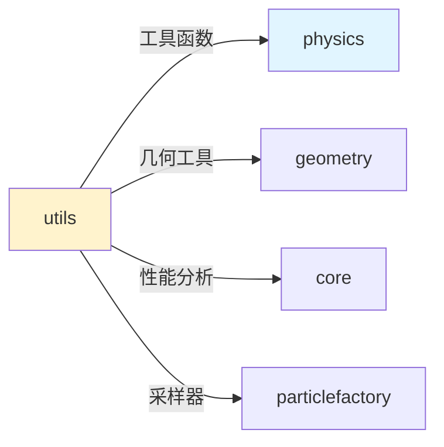

# Utils 模块架构分析

## 概述

`src/chrono/utils` 文件夹提供了各种实用工具和辅助功能，包括几何操作、性能分析、控制器、过滤器和通信工具。这些工具简化了常见任务并扩展了 Chrono 的功能。

## 主要功能

### 核心职责
1. **几何工具**：凸包、网格操作、刚体几何
2. **性能分析**：性能测试和分析工具
3. **控制器**：PID控制器等
4. **过滤器**：信号处理和数据过滤
5. **通信**：套接字通信
6. **OpenMP支持**：并行化工具

## 文件结构

### 几何工具
```
ChBodyGeometry.h/cpp        - 刚体几何属性计算
ChConvexHull.h/cpp          - 凸包计算
ChUtilsGeometry.h/cpp       - 几何实用函数
ChUtilsSamplers.h/cpp       - 采样器（网格、球体等）
ChUtilsGenerators.h/cpp     - 几何生成器
```

### 性能工具
```
ChBenchmark.h               - 性能基准测试
ChProfiler.h/cpp            - 代码性能分析器
ChUtilsInputOutput.h/cpp    - 输入输出工具
```

### 控制和滤波
```
ChControllers.h/cpp         - PID等控制器
ChFilters.h/cpp             - 信号滤波器
```

### 通信
```
ChSocket.h/cpp              - 套接字基类
ChSocketCommunication.h/cpp - 套接字通信
ChSocketTCP.h/cpp           - TCP套接字
ChSocketFramework.h/cpp     - 套接字框架
```

### 并行化
```
ChOpenMP.h/cpp              - OpenMP工具和设置
```

### 其他工具
```
ChConstants.h               - 物理常数
ChForceFunctors.h/cpp       - 力函数子
ChUtils.h                   - 通用工具函数
ChUtilsCreators.h/cpp       - 对象创建辅助
```

## 使用场景

### 1. 计算凸包
```cpp
// 点集
std::vector<ChVector3d> points = {
    ChVector3d(0, 0, 0),
    ChVector3d(1, 0, 0),
    ChVector3d(0, 1, 0),
    ChVector3d(0, 0, 1),
    ChVector3d(0.5, 0.5, 0.5)
};

// 计算凸包
ChConvexHull hull;
hull.ComputeHull(points);

// 获取凸包顶点
auto hull_vertices = hull.GetVertices();
auto hull_faces = hull.GetFaces();

// 使用凸包创建碰撞形状
collision_model->AddConvexHull(material, hull_vertices);
```

### 2. 刚体几何属性
```cpp
// 计算复杂网格的质量属性
ChBodyGeometry body_geo;

// 从三角网格计算
auto trimesh = chrono_types::make_shared<ChTriangleMeshConnected>();
trimesh->LoadWavefrontMesh("model.obj");

double density = 1000.0;  // kg/m³
double mass;
ChVector3d cog;
ChMatrix33<> inertia;

body_geo.ComputeMassProperties(trimesh, density, mass, cog, inertia);

// 应用到刚体
body->SetMass(mass);
body->SetInertia(inertia);
```

### 3. 采样器
```cpp
// 在盒子中生成随机点
ChSamplerBoxVolume sampler_box(ChVector3d(10, 5, 2));
std::vector<ChVector3d> points = sampler_box.Sample(1000);

// 在球体表面采样
ChSamplerSphereSurface sampler_sphere(1.0);
auto sphere_points = sampler_sphere.Sample(500);

// 在网格上采样
ChSamplerTriangleMesh sampler_mesh(trimesh);
auto mesh_points = sampler_mesh.Sample(1000);
```

### 4. PID控制器
```cpp
// 创建PID控制器
ChControllerPID pid;
pid.SetKp(1.0);   // 比例增益
pid.SetKi(0.1);   // 积分增益
pid.SetKd(0.05);  // 微分增益

// 控制循环
double setpoint = 10.0;
double dt = 0.01;

while (running) {
    double measured = GetCurrentValue();
    double control_signal = pid.Compute(setpoint, measured, dt);
    ApplyControl(control_signal);
}

// 重置控制器
pid.Reset();
```

### 5. 滤波器
```cpp
// 低通滤波器
ChFilterLowpass lowpass(0.1);  // 截止频率

double filtered_value = lowpass.Filter(noisy_signal, dt);

// 移动平均滤波器
ChFilterMovingAverage moving_avg(10);  // 窗口大小

for (double value : data) {
    double smoothed = moving_avg.Filter(value);
}

// 卡尔曼滤波器
ChFilterKalman kalman;
kalman.Initialize(initial_state, initial_covariance);
auto filtered_state = kalman.Update(measurement, dt);
```

### 6. 性能分析
```cpp
// 使用性能分析器
ChProfiler profiler;

profiler.StartTimer("simulation_step");
system->DoStepDynamics(0.01);
profiler.StopTimer("simulation_step");

profiler.StartTimer("collision_detection");
system->GetCollisionSystem()->Run();
profiler.StopTimer("collision_detection");

// 打印统计信息
profiler.PrintReport();
```

### 7. 基准测试
```cpp
ChBenchmark::Time benchmark;

benchmark.start();
// 执行要测试的代码
PerformExpensiveOperation();
benchmark.stop();

double elapsed_ms = benchmark.GetTimeMilliseconds();
std::cout << "Operation took: " << elapsed_ms << " ms" << std::endl;
```

### 8. OpenMP配置
```cpp
// 设置OpenMP线程数
ChOpenMP::SetNumThreads(4);

// 获取当前线程数
int num_threads = ChOpenMP::GetNumThreads();

// 获取最大可用线程数
int max_threads = ChOpenMP::GetMaxThreads();

// 在并行区域中
#pragma omp parallel
{
    int thread_id = ChOpenMP::GetThreadNum();
    // 并行代码
}
```

### 9. 套接字通信
```cpp
// 服务器端
ChSocketTCP server_socket;
server_socket.bindSocket(50000);  // 绑定端口
server_socket.listenToClient(1);
auto client_socket = server_socket.acceptClient();

// 发送数据
std::string message = "Hello from server";
client_socket->sendMessage(message);

// 接收数据
std::string received = client_socket->receiveMessage();

// 客户端
ChSocketTCP client_socket;
client_socket.connectToServer("localhost", 50000);
client_socket->sendMessage("Hello from client");
```

### 10. 对象创建器
```cpp
// 批量创建对象
ChParticleCreator creator;
creator.SetDensity(1000.0);
creator.SetShape(ChParticleCreator::Shape::SPHERE, 0.1);

// 在体积中创建粒子
ChVector3d min_point(-5, 0, -5);
ChVector3d max_point(5, 10, 5);
auto particles = creator.CreateParticlesBox(
    system,
    1000,  // 数量
    min_point,
    max_point
);
```

### 11. 网格生成器
```cpp
// 生成网格体
auto mesh = ChUtilsGenerators::GenerateBoxMesh(
    ChVector3d(1, 2, 3),  // 尺寸
    20, 40, 60            // 分割数
);

// 生成球体网格
auto sphere_mesh = ChUtilsGenerators::GenerateSphereMesh(
    1.0,   // 半径
    32     // 细分
);

// 生成圆柱网格
auto cylinder_mesh = ChUtilsGenerators::GenerateCylinderMesh(
    0.5,   // 半径
    2.0,   // 高度
    32     // 细分
);
```

## 常数定义

```cpp
// src/chrono/utils/ChConstants.h
namespace chrono {
namespace constants {
    const double G = 6.67430e-11;        // 万有引力常数
    const double c = 299792458.0;        // 光速 m/s
    const double g = 9.80665;            // 标准重力加速度
    const double R_gas = 8.314462618;    // 气体常数
}
}
```

## 与其他模块的交互



## 性能工具详解

### 性能分析器使用
```cpp
// 嵌套计时
profiler.StartTimer("outer");
  profiler.StartTimer("inner1");
  // 代码1
  profiler.StopTimer("inner1");
  
  profiler.StartTimer("inner2");
  // 代码2
  profiler.StopTimer("inner2");
profiler.StopTimer("outer");

// 获取统计
double avg_time = profiler.GetAverageTime("simulation_step");
double total_time = profiler.GetTotalTime("simulation_step");
int call_count = profiler.GetCallCount("simulation_step");
```

## 几何工具详解

### 刚体几何计算
```cpp
// 从多个形状计算总质量属性
ChBodyGeometry::CompositeProperties props;

// 添加盒子
props.AddBox(ChVector3d(1, 2, 3), density, ChVector3d(0, 0, 0));

// 添加球体
props.AddSphere(0.5, density, ChVector3d(1, 0, 0));

// 添加圆柱
props.AddCylinder(0.3, 1.0, density, 
                  ChVector3d(0, 1, 0),
                  ChQuaterniond(1, 0, 0, 0));

// 获取总质量属性
double total_mass = props.GetMass();
ChVector3d cog = props.GetCOG();
ChMatrix33<> inertia = props.GetInertia();
```

## 最佳实践

1. **使用采样器**：批量生成粒子时使用采样器
2. **性能分析**：定期使用profiler识别瓶颈
3. **凸包优化**：对复杂网格使用凸包简化碰撞
4. **控制器调参**：从保守参数开始调整PID
5. **OpenMP配置**：根据硬件设置合适线程数

## 常用工具函数

### 随机数
```cpp
ChRandom random;
double rand_uniform = random.GetUniform(-1, 1);
double rand_normal = random.GetNormal(0, 1);
```

### 单位转换
```cpp
double deg = CH_RAD_TO_DEG * angle_rad;
double rad = CH_DEG_TO_RAD * angle_deg;
```

## 总结

Utils 模块提供了：
- 丰富的几何工具
- 性能分析和基准测试
- 控制和滤波功能
- 网络通信支持
- 并行化工具
- 对象生成器

该模块大大简化了常见任务，是 Chrono 应用开发的重要辅助。
