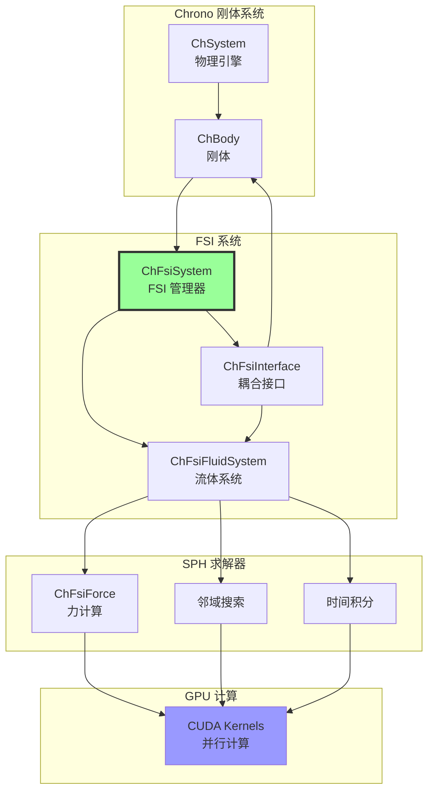
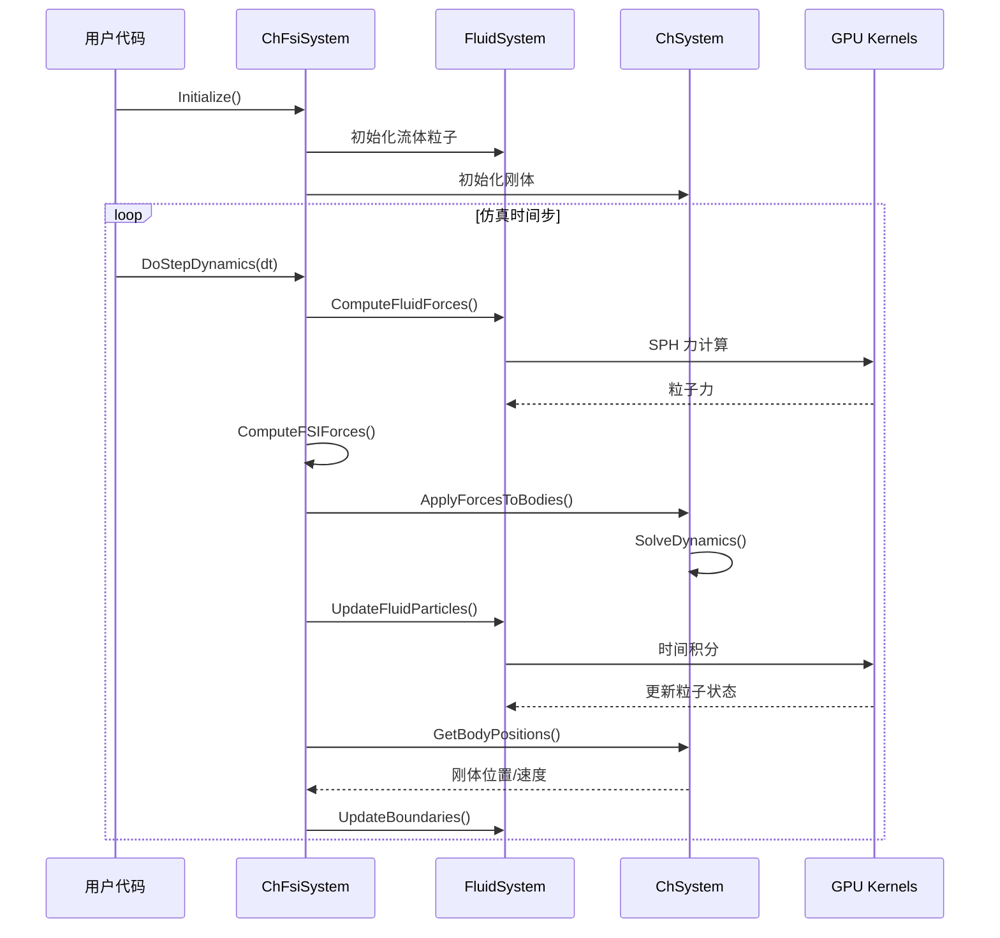
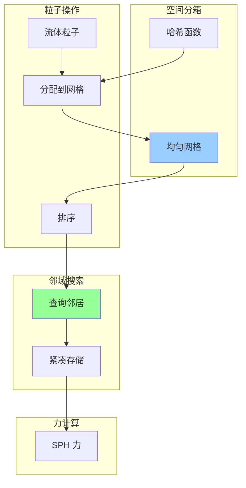
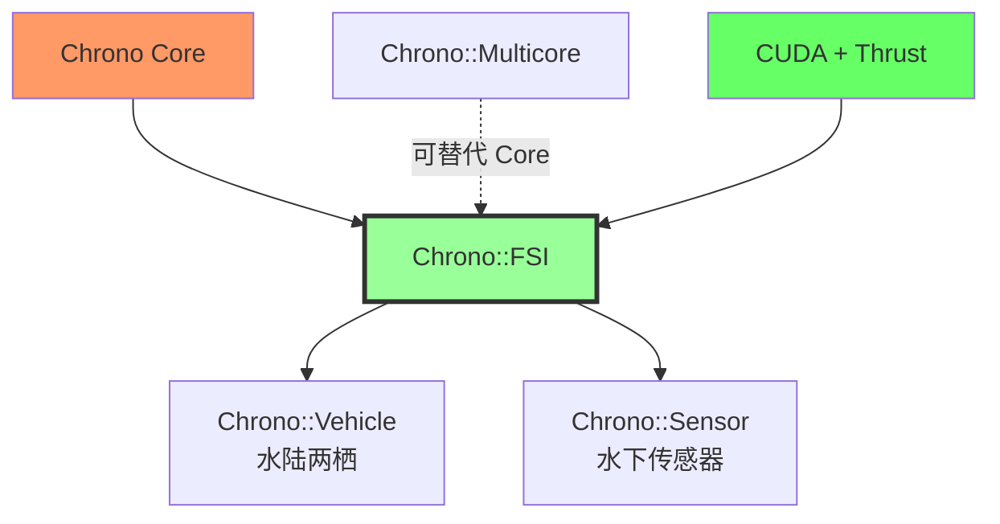

# Chrono::FSI 模块架构分析

## 概述

`chrono_fsi` 模块提供流固耦合（Fluid-Structure Interaction）仿真能力，使用光滑粒子流体动力学（SPH，Smoothed Particle Hydrodynamics）方法求解流体，并与 Chrono 的刚体动力学耦合。该模块广泛应用于船舶工程、水下机器人、波浪能装置和液压系统仿真。

## 主要功能

### 核心职责

1. **SPH 流体求解**：使用粒子方法求解 Navier-Stokes 方程
2. **流固耦合**：流体粒子与刚体的双向作用力计算
3. **自由表面流动**：支持波浪、水花等自由表面现象
4. **多相流**：支持多相流体（如水-空气）
5. **边界条件**：固体边界、周期性边界、入口/出口
6. **GPU 加速**：使用 CUDA 加速 SPH 计算
7. **地形交互**：流体与地形的交互

### 支持的流体模型

- **弱可压缩 SPH（WCSPH）**：标准 SPH 方法
- **不可压缩 SPH（ISPH）**：改进的不可压缩流动
- **隐式 SPH**：更大时间步长的稳定方法

## 设计特点

### 架构模式

- **双向耦合**：流体影响固体，固体影响流体
- **分离式求解**：流体和固体分别求解后耦合
- **粒子方法**：拉格朗日描述，自然处理自由表面
- **邻域搜索**：高效的粒子邻近搜索算法

### 计算特点

- **GPU 加速**：SPH 计算在 GPU 上并行执行
- **自适应时间步**：根据 CFL 条件自动调整
- **稳定性**：使用 XSPH 和人工粘性提高稳定性
- **精度**：支持一阶和二阶 SPH 格式

## 文件结构与关系

```
chrono_fsi/
├── ChApiFsi.h                  # API 导出宏
├── ChFsiSystem.h/.cpp          # FSI 系统主类（核心）
├── ChFsiFluidSystem.h/.cpp     # 流体系统
├── ChFsiInterface.h/.cpp       # 流固接口
├── ChFsiDefinitions.h          # 类型定义和常量
├── ChFsiBenchmark.h            # 性能测试工具
│
├── sph/                        # SPH 方法
│   ├── ChFsiForce.h/.cpp            # 力计算
│   ├── ChFsiForceExplicitSPH.h/.cpp # 显式 SPH 力
│   ├── ChFsiForceI2SPH.h/.cpp       # I2SPH 不可压缩方法
│   ├── ChFsiForceIISPH.h/.cpp       # IISPH 隐式方法
│   ├── ChSphGeneral.h/.cpp          # SPH 通用函数
│   ├── physics/                     # SPH 物理模型
│   │   ├── ChParams.h               # 参数设置
│   │   ├── ChSph.cuh                # SPH CUDA 核心
│   │   ├── ChFluidDynamics.cuh      # 流体动力学
│   │   └── ChBce.cuh                # 边界条件强制
│   └── utils/                       # SPH 工具
│       ├── ChUtilsDevice.cuh        # GPU 工具
│       ├── ChUtilsTypeConvert.h     # 类型转换
│       └── ChUtilsPrintSph.h/.cpp   # 调试打印
│
└── tdpf/                       # 时间离散粒子力（备选方法）
    └── ...
```

## 架构图

### FSI 系统整体架构



### FSI 耦合循环



### SPH 邻域搜索



## 核心类详解

### ChFsiSystem

**职责**：FSI 系统的主类，协调流体和固体仿真

**关键方法**：
```cpp
// 初始化系统
void Initialize();

// 设置流体参数
ChFsiFluidSystem& GetFluidSystem();

// 添加流体区域
void AddFluidDomain(ChVector3d size, ChVector3d pos, 
                     double spacing);

// 添加 SPH 粒子
void AddSPHParticle(ChVector3d pos, ChVector3d vel);

// 添加刚体到 FSI
void AddFsiBody(std::shared_ptr<ChBody> body);

// 执行一个时间步
void DoStepDynamics(double dt);

// 获取粒子数据
const thrust::device_vector<Real4>& GetParticlePositions();
const thrust::device_vector<Real3>& GetParticleVelocities();
```

**配置示例**：
```cpp
ChSystemSMC sys;

// 创建 FSI 系统
ChFsiSystem fsi_system(sys);

// 设置流体参数
auto& fluid = fsi_system.GetFluidSystem();
fluid.SetDensity(1000.0);           // 水的密度 kg/m³
fluid.SetViscosity(1e-3);           // 动力粘度 Pa·s
fluid.SetSoundSpeed(1500.0);        // 声速 m/s
fluid.SetSPHMethod(ChFsiFluidSystem::SPHMethod::WCSPH);
fluid.SetKernelLength(0.02);        // SPH 核函数半径
fluid.SetTimeStep(1e-4);            // 时间步长

// 设置边界条件
fluid.SetBoundaryType(BoundaryType::ADAMI);

// 初始化
fsi_system.Initialize();
```

### ChFsiFluidSystem

**职责**：管理 SPH 流体粒子和求解

**关键参数**：
```cpp
// 流体属性
double density;           // 密度
double viscosity;         // 粘度
double surface_tension;   // 表面张力系数
double sound_speed;       // 声速

// SPH 参数
double kernel_length;     // 核函数半径 h
double particle_spacing;  // 粒子间距
SPHMethod sph_method;     // SPH 方法类型

// 数值参数
double cfl_number;        // CFL 数
double artificial_viscosity; // 人工粘性
bool use_xsph;            // XSPH 速度平滑
```

**流体域创建**：
```cpp
// 创建矩形流体域
fsi_system.AddFluidDomain(
    ChVector3d(2.0, 0.5, 0.5),  // 尺寸
    ChVector3d(0, 0, 0.25),     // 中心位置
    0.01                         // 粒子间距
);

// 手动添加粒子
for (int i = 0; i < num_particles; i++) {
    ChVector3d pos = ...;
    ChVector3d vel = ChVector3d(0, 0, 0);
    fsi_system.AddSPHParticle(pos, vel);
}
```

### ChFsiInterface

**职责**：处理流固耦合力

**边界条件方法**：
1. **ADAMI**：边界粒子方法（推荐）
2. **BCE**：边界条件强制
3. **GHOST**：虚粒子方法

**力计算**：
```cpp
// 流体对固体的力
F_fluid_on_solid = Σ (pressure_force + viscous_force)

// 固体对流体的反作用力
F_solid_on_fluid = -F_fluid_on_solid
```

### ChFsiForce

**职责**：SPH 力计算（压力、粘性、重力）

**力模型**：
- **压力力**：基于状态方程
- **粘性力**：拉普拉斯算子
- **表面张力**：连续表面力（CSF）模型
- **人工粘性**：提高稳定性

## 依赖关系

### 核心依赖
- **Chrono Core**：刚体动力学
- **CUDA**：GPU 加速
- **Thrust**：CUDA 并行算法库

### 可选依赖
- **Chrono::Multicore**：刚体部分加速（可替代 Core）
- **Chrono::Vehicle**：车辆-水交互
- **Chrono::Sensor**：水下传感器

### 被依赖模块
- **Chrono::Vehicle**：水陆两栖车辆
- 用户应用程序

## 使用示例

### 基本流固耦合：漂浮的立方体

```cpp
#include "chrono/physics/ChSystemSMC.h"
#include "chrono_fsi/ChFsiSystem.h"

using namespace chrono;
using namespace chrono::fsi;

int main() {
    // 创建 Chrono 系统
    ChSystemSMC sys;
    sys.SetGravitationalAcceleration(ChVector3d(0, 0, -9.81));
    
    // 创建 FSI 系统
    ChFsiSystem fsi_system(sys);
    
    // 设置流体参数
    auto& fluid = fsi_system.GetFluidSystem();
    fluid.SetDensity(1000.0);
    fluid.SetViscosity(1e-3);
    fluid.SetSoundSpeed(100.0);  // 降低以加快仿真
    fluid.SetSPHMethod(ChFsiFluidSystem::SPHMethod::WCSPH);
    fluid.SetKernelLength(0.01);
    
    // 创建流体域（水池）
    fsi_system.AddFluidDomain(
        ChVector3d(2.0, 1.0, 0.5),  // 2m x 1m x 0.5m
        ChVector3d(0, 0, 0.25),      // 中心在 z=0.25
        0.01                          // 粒子间距 1cm
    );
    
    // 创建浮体（立方体）
    auto box = chrono_types::make_shared<ChBody>();
    box->SetMass(10.0);
    box->SetPos(ChVector3d(0, 0, 0.4));
    box->SetInertiaXX(ChVector3d(1, 1, 1));
    
    // 设置碰撞形状（用于 FSI）
    auto box_shape = chrono_types::make_shared<ChCollisionShapeBox>(
        box->GetContactMethod(), 0.1, 0.1, 0.1);
    box->AddCollisionShape(box_shape);
    box->EnableCollision(true);
    
    sys.AddBody(box);
    
    // 添加到 FSI
    fsi_system.AddFsiBody(box);
    
    // 初始化
    fsi_system.Initialize();
    
    // 仿真循环
    double time_step = 1e-4;
    double time = 0;
    
    while (time < 5.0) {
        fsi_system.DoStepDynamics(time_step);
        time += time_step;
        
        // 输出立方体高度
        if ((int)(time / 0.1) * 0.1 == time) {
            std::cout << "Time: " << time 
                      << " Height: " << box->GetPos().z() << "\n";
        }
    }
    
    return 0;
}
```

### 波浪与船舶交互

```cpp
// 创建海洋波浪
class WaveGenerator {
public:
    void AddWave(ChFsiSystem& fsi, double amplitude, 
                 double wavelength, double phase) {
        // 使用正弦波初始化粒子高度
        auto& particles = fsi.GetParticlePositions();
        // ... 修改粒子 z 坐标和速度
    }
};

// 创建船舶
auto ship = chrono_types::make_shared<ChBody>();
ship->SetMass(1000.0);
ship->SetPos(ChVector3d(0, 0, 1.0));
// ... 设置船舶几何和惯性

// 添加波浪
WaveGenerator wave_gen;
wave_gen.AddWave(fsi_system, 0.1, 5.0, 0.0);  // 10cm 波高，5m 波长

sys.AddBody(ship);
fsi_system.AddFsiBody(ship);
```

### 大坝溃决仿真

```cpp
// 创建大坝结构
double dam_height = 1.0;
double dam_width = 0.5;

// 左侧流体（高水位）
fsi_system.AddFluidDomain(
    ChVector3d(1.0, 0.5, dam_height),
    ChVector3d(-0.5, 0, dam_height/2),
    0.01
);

// 创建可移动的闸门
auto gate = chrono_types::make_shared<ChBody>();
gate->SetMass(10.0);
gate->SetPos(ChVector3d(0, 0, dam_height/2));
gate->SetFixed(true);  // 初始固定

sys.AddBody(gate);
fsi_system.AddFsiBody(gate);

// 仿真循环
double time = 0;
while (time < 10.0) {
    // 在 t=1s 时打开闸门
    if (time > 1.0 && gate->IsFixed()) {
        gate->SetFixed(false);
    }
    
    fsi_system.DoStepDynamics(1e-4);
    time += 1e-4;
}
```

## 性能特点

### 优势

1. **真实物理**：基于 Navier-Stokes 方程的准确流体模拟
2. **自由表面**：自然处理波浪、水花、破碎波
3. **双向耦合**：流体和固体相互影响
4. **GPU 加速**：大规模粒子的快速计算
5. **易于设置**：相比 CFD 网格更简单

### 局限性

1. **计算成本**：大规模问题需要 GPU 且仍较慢
2. **时间步限制**：CFL 条件要求小时间步
3. **粒子数限制**：GPU 内存限制粒子数量
4. **粘性限制**：高粘性流体可能不稳定
5. **精度**：相比高阶 CFD 方法精度较低

### 性能建议

- 使用合适的粒子间距（0.01 - 0.02 m）
- 降低声速以允许更大时间步（但保持物理合理性）
- 使用 ISPH 或 IISPH 方法提高稳定性
- 限制仿真域大小
- 考虑使用多 GPU（如果支持）

### 典型性能数据

| 粒子数 | GPU | 时间步 | 实时比 |
|-------|-----|--------|--------|
| 10K | GTX 1080 | 1e-4 s | ~0.1x |
| 100K | GTX 1080 | 1e-4 s | ~0.01x |
| 1M | RTX 3090 | 1e-4 s | ~0.001x |

## 与其他模块的关系



## 应用场景

### 船舶与海洋工程
- 船舶运动（六自由度）
- 波浪载荷
- 浮式平台稳定性
- 波浪能转换装置

### 水下机器人
- 推进器设计
- 操纵性分析
- 传感器仿真（与 Chrono::Sensor 结合）

### 两栖车辆
- 入水/出水过渡
- 水上航行
- 涉水性能（与 Chrono::Vehicle 结合）

### 液压系统
- 液压缸
- 阀门流动
- 流体传动

### 土木工程
- 大坝溃决
- 洪水仿真
- 结构物冲刷

## 总结

Chrono::FSI 模块通过 SPH 方法提供了强大的流固耦合仿真能力。其 GPU 加速、自由表面处理和双向耦合使其成为海洋工程、水下机器人和两栖车辆仿真的理想工具。虽然计算成本较高，但对于需要准确流体-固体交互的应用，FSI 模块提供了难以替代的物理保真度。与 Chrono::Vehicle 和 Chrono::Sensor 的集成进一步扩展了其在复杂系统仿真中的应用潜力。
