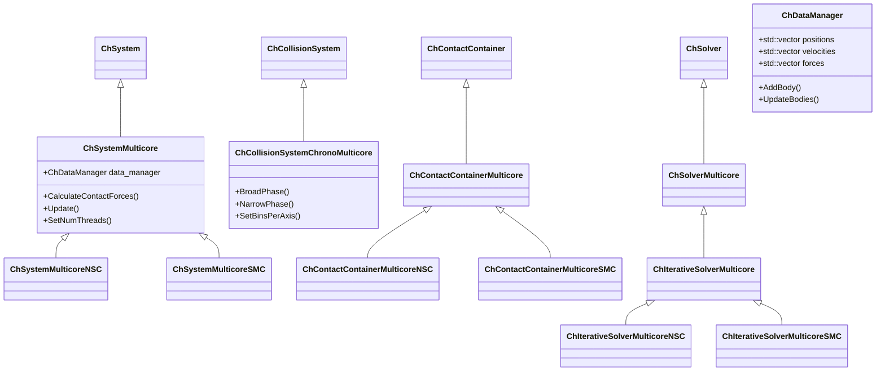
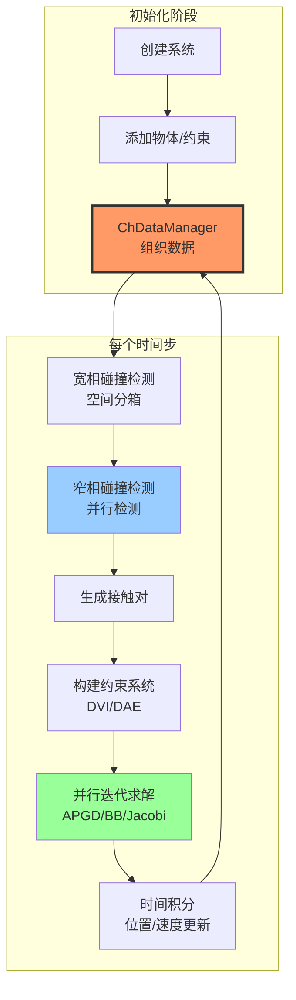
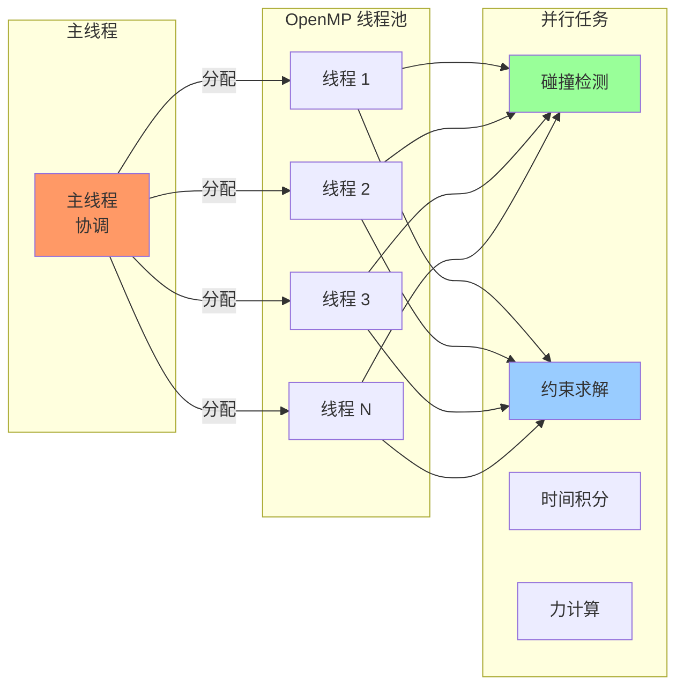
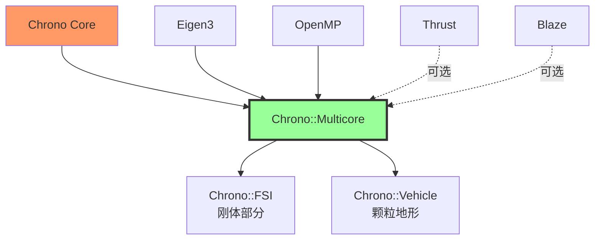

# Chrono::Multicore 模块架构分析

## 概述

`chrono_multicore` 模块提供了基于 OpenMP 的多核并行计算支持，专门针对大规模刚体系统和颗粒动力学仿真进行了优化。该模块采用数据并行方法，能够高效处理包含数十万到数百万个对象的系统。

## 主要功能

### 核心职责

1. **并行碰撞检测**：使用空间分箱（spatial binning）的宽相检测和并行的窄相检测
2. **并行约束求解**：针对大规模接触和约束问题的迭代求解器（APGD、BB、Jacobi、Gauss-Seidel 等）
3. **数据并行物理计算**：使用 SoA（Structure of Arrays）数据布局优化缓存性能
4. **颗粒动力学**：专门针对颗粒材料仿真的优化路径
5. **流体容器支持**：基于 SPH 的简单流体仿真

### 支持的接触模型

- **NSC（Non-Smooth Contact）**：非光滑接触，使用互补性问题求解
- **SMC（Smooth Contact）**：光滑接触，使用惩罚力方法

## 设计特点

### 架构模式

- **数据导向设计（Data-Oriented Design）**：使用 `ChDataManager` 集中管理所有物理数据
- **SoA 内存布局**：将对象属性存储在连续数组中，提高缓存局部性
- **模板化求解器**：针对不同问题类型的专用求解器实现
- **并行优先设计**：所有关键算法都针对并行执行进行优化

### 性能优化

- **OpenMP 并行化**：利用多核 CPU 进行数据并行计算
- **向量化友好**：数据布局支持 SIMD 指令自动向量化
- **减少内存分配**：预分配缓冲区，避免动态内存分配
- **避免虚函数**：在性能关键路径上避免虚函数调用

## 文件结构与关系

```
chrono_multicore/
├── ChApiMulticore.h           # API 导出宏定义
├── ChDataManager.h/.cpp       # 中央数据管理器（核心）
├── ChSettings.h               # 求解器设置和配置
├── ChMulticoreDefines.h       # 类型定义和常量
├── ChTimerMulticore.h         # 性能计时工具
├── ChMeasures.h               # 性能度量
│
├── physics/                   # 物理系统
│   ├── ChSystemMulticoreNSC.h/.cpp  # NSC 系统实现
│   ├── ChSystemMulticoreSMC.h/.cpp  # SMC 系统实现
│   ├── Ch3DOFContainer.h            # 粒子容器
│   ├── ChFluidContainer.h/.cpp      # 流体容器
│   └── ChFluidKernels.h             # SPH 核函数
│
├── collision/                 # 碰撞检测
│   ├── ChCollisionSystemChronoMulticore.h/.cpp  # 多核碰撞系统
│   ├── ChContactContainerMulticore.h/.cpp       # 接触容器基类
│   ├── ChContactContainerMulticoreNSC.h/.cpp    # NSC 接触容器
│   └── ChContactContainerMulticoreSMC.h/.cpp    # SMC 接触容器
│
├── solver/                    # 求解器
│   ├── ChSolverMulticore.h/.cpp                # 求解器基类
│   ├── ChIterativeSolverMulticore.h/.cpp       # 迭代求解器基类
│   ├── ChIterativeSolverMulticoreNSC.cpp       # NSC 迭代求解器
│   ├── ChIterativeSolverMulticoreSMC.cpp       # SMC 迭代求解器
│   ├── ChSolverMulticoreAPGD.cpp               # APGD 求解器
│   ├── ChSolverMulticoreAPGDREF.cpp            # APGD 参考实现
│   ├── ChSolverMulticoreBB.cpp                 # Barzilai-Borwein 求解器
│   ├── ChSolverMulticoreGS.cpp                 # Gauss-Seidel 求解器
│   ├── ChSolverMulticoreJacobi.cpp             # Jacobi 求解器
│   ├── ChSolverMulticoreCG.cpp                 # 共轭梯度求解器
│   ├── ChSolverMulticoreMINRES.cpp             # MINRES 求解器
│   ├── ChSolverMulticore SPGQP.cpp              # SPGQP 求解器
│   ├── ChSystemDescriptorMulticore.h           # 系统描述符
│   └── ChSchurProduct.cpp                       # Schur 补矩阵乘积
│
└── constraints/               # 约束类型
    └── （约束的专用实现）
```

## 架构图

### 类层次结构



### 数据流图



### 并行执行模型



## 核心类详解

### ChDataManager

**职责**：集中管理所有物理对象的数据，使用 SoA 布局

**关键成员**：
```cpp
// 位置、速度、加速度数组
std::vector<real3> pos_rigid;
std::vector<real4> rot_rigid;
std::vector<real3> vel_rigid;
std::vector<real3> omg_rigid;

// 接触数据
std::vector<real3> contact_forces;
std::vector<int2> contact_pairs;

// 约束数据
std::vector<real> gamma;  // 拉格朗日乘子
std::vector<real> b;      // 右端项
```

### ChSystemMulticoreNSC / ChSystemMulticoreSMC

**职责**：多核物理系统的主类，协调所有子系统

**关键方法**：
- `DoStepDynamics()`：执行一个时间步
- `Update()`：更新所有物体状态
- `CalculateContactForces()`：计算接触力
- `SetNumThreads()`：设置 OpenMP 线程数

### ChCollisionSystemChronoMulticore

**职责**：并行碰撞检测

**算法**：
1. **宽相**：使用均匀网格空间分箱，O(N) 复杂度
2. **窄相**：并行检查潜在碰撞对，使用 GJK/EPA 算法

**特点**：
- 支持球体、盒子、圆柱体、胶囊体等基本形状
- 自适应网格尺寸
- 多线程并行检测

### ChIterativeSolverMulticore

**职责**：并行迭代求解约束系统

**支持的求解器**：
- **APGD**：Accelerated Projected Gradient Descent（推荐用于 NSC）
- **BB**：Barzilai-Borwein（快速收敛）
- **Jacobi**：简单并行，易于实现
- **Gauss-Seidel**：更好的收敛性但难以并行化
- **SPGQP**：Spectral Projected Gradient for QP

## 依赖关系

### 核心依赖
- **Chrono Core**：基础物理引擎
- **Eigen3**：线性代数库
- **OpenMP**：多核并行支持

### 可选依赖
- **Thrust**：CUDA/OpenMP 通用并行算法库
- **Blaze**：高性能线性代数库

### 被依赖模块
- **chrono_fsi**：使用 multicore 作为刚体求解器
- **chrono_granular**：某些颗粒仿真场景

## 使用示例

### 基本设置

```cpp
#include "chrono_multicore/physics/ChSystemMulticoreNSC.h"

using namespace chrono;

// 创建多核 NSC 系统
ChSystemMulticoreNSC sys;

// 设置线程数
sys.SetNumThreads(8);

// 配置求解器
sys.GetSettings()->solver.solver_mode = SolverMode::SLIDING;
sys.GetSettings()->solver.max_iteration_normal = 100;
sys.GetSettings()->solver.max_iteration_sliding = 100;
sys.GetSettings()->solver.max_iteration_spinning = 0;
sys.GetSettings()->solver.alpha = 0;
sys.GetSettings()->solver.contact_recovery_speed = 1e6;
sys.GetSettings()->solver.use_full_inertia_tensor = false;
sys.GetSettings()->solver.tolerance = 1e-4;

// 配置碰撞检测
sys.GetSettings()->collision.bins_per_axis = vec3(10, 10, 10);
sys.GetSettings()->collision.narrowphase_algorithm = 
    ChNarrowphase::Algorithm::HYBRID;

// 添加物体
auto floor = chrono_types::make_shared<ChBody>();
floor->SetFixed(true);
floor->SetPos(ChVector3d(0, -1, 0));
// ... 设置碰撞形状 ...
sys.AddBody(floor);

// 添加颗粒
for (int i = 0; i < 10000; i++) {
    auto sphere = chrono_types::make_shared<ChBody>();
    sphere->SetMass(1.0);
    sphere->SetPos(ChVector3d(rand_pos));
    // ... 设置碰撞形状 ...
    sys.AddBody(sphere);
}

// 仿真循环
double time_step = 0.001;
while (sys.GetChTime() < 10.0) {
    sys.DoStepDynamics(time_step);
    // ... 输出结果 ...
}
```

### 颗粒材料仿真

```cpp
// 使用 SMC 模型进行颗粒仿真
ChSystemMulticoreSMC sys;
sys.SetNumThreads(16);

// SMC 接触参数
sys.GetSettings()->solver.contact_force_model = 
    ChSystemSMC::ContactForceModel::Hertz;
sys.GetSettings()->solver.tangential_displ_mode = 
    ChSystemSMC::TangentialDisplacementModel::OneStep;

// 材料属性
auto mat = chrono_types::make_shared<ChContactMaterialSMC>();
mat->SetYoungModulus(1e7);
mat->SetPoissonRatio(0.3);
mat->SetRestitution(0.5);
mat->SetFriction(0.4);

// 创建大量颗粒
for (int i = 0; i < 100000; i++) {
    auto particle = chrono_types::make_shared<ChBody>();
    particle->SetMass(0.001);
    particle->SetPos(ChVector3d(random_position));
    
    auto sphere = chrono_types::make_shared<ChCollisionShapeSphere>(
        mat, 0.01);  // 半径 1cm
    particle->AddCollisionShape(sphere);
    particle->EnableCollision(true);
    
    sys.AddBody(particle);
}

// 运行仿真
sys.DoStepDynamics(0.0001);  // 小时间步
```

## 性能特点

### 优势

1. **可扩展性强**：在多核 CPU 上近乎线性加速
2. **内存高效**：SoA 布局减少缓存未命中
3. **大规模系统**：可处理百万级颗粒系统
4. **快速碰撞检测**：均匀网格分箱，O(N) 复杂度

### 局限性

1. **仅支持简单形状**：不支持复杂网格碰撞
2. **刚体动力学专用**：不支持柔体 FEA
3. **CPU 限制**：相比 GPU 方案（如 DEM）速度较慢
4. **内存占用**：大规模系统需要大量 RAM

### 性能建议

- 对于 10,000+ 物体：使用 multicore
- 对于 1,000,000+ 物体：考虑使用 chrono_dem（GPU）
- 线程数设置为物理核心数
- NSC 用于刚性接触，SMC 用于柔性接触
- 调整 `bins_per_axis` 以优化碰撞检测

## 与其他模块的关系



## 总结

Chrono::Multicore 模块通过数据并行设计和 OpenMP 多线程，为大规模刚体和颗粒动力学仿真提供了高效的解决方案。其 SoA 数据布局和专用求解器使其在多核 CPU 上达到优异性能。对于需要处理数万至数十万物体的应用，这是一个理想的选择。
