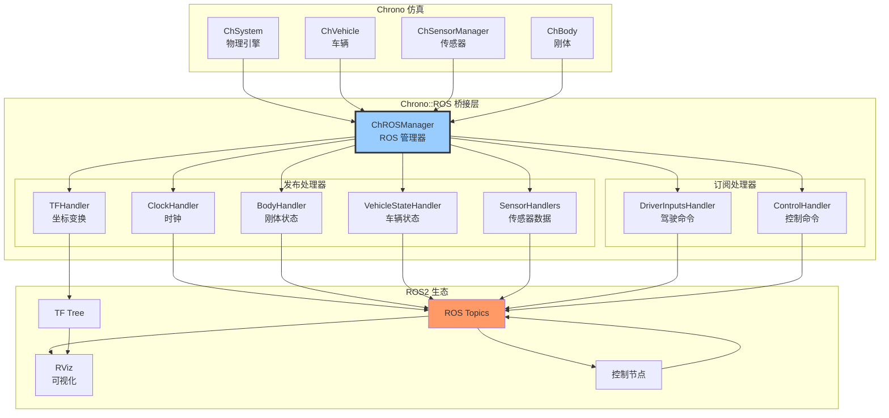
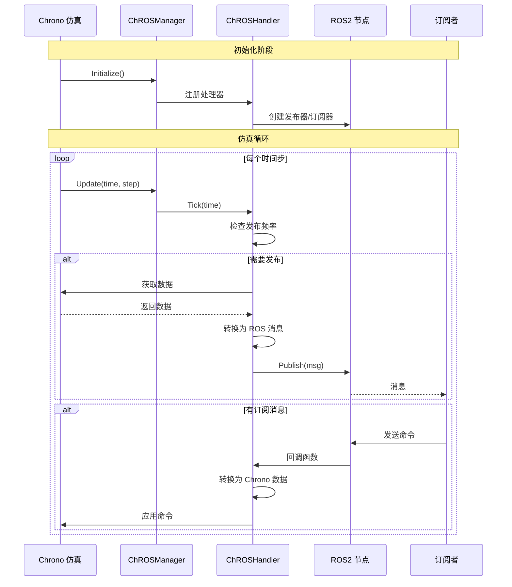
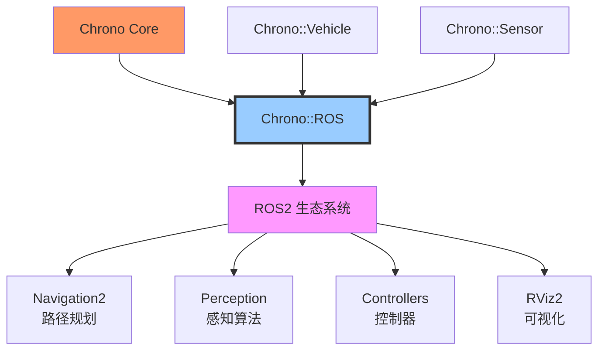

# Chrono::ROS 模块架构分析

## 概述

`chrono_ros` 模块提供了 Project Chrono 与 ROS2（Robot Operating System 2）的接口，使 Chrono 物理仿真能够无缝集成到 ROS 生态系统中。该模块支持话题发布/订阅、TF 变换广播、时钟同步等功能，广泛应用于机器人仿真、自动驾驶测试和硬件在环（HIL）验证。

## 主要功能

### 核心职责

1. **话题发布**：将 Chrono 仿真数据发布为 ROS 话题
2. **话题订阅**：接收 ROS 话题数据并应用到仿真
3. **TF 变换**：广播物体的坐标变换到 TF 树
4. **时钟同步**：发布仿真时钟到 `/clock` 话题
5. **传感器集成**：将 Chrono::Sensor 数据发布为 ROS 消息
6. **车辆接口**：Chrono::Vehicle 与 ROS 的桥接
7. **自定义处理器**：用户可扩展的消息处理器

### 支持的 ROS 消息类型

- **std_msgs**：基本数据类型
- **geometry_msgs**：位姿、速度、加速度
- **sensor_msgs**：图像、点云、IMU、GPS
- **nav_msgs**：里程计、路径
- **tf2_msgs**：TF 变换
- **自定义消息**：用户定义的消息类型

## 设计特点

### 架构模式

- **桥接模式**：连接 Chrono 和 ROS 两个独立系统
- **观察者模式**：监听 Chrono 状态变化并发布
- **策略模式**：不同的处理器处理不同类型的数据
- **工厂模式**：动态创建处理器

### 设计原则

- **松耦合**：Chrono 和 ROS 通过接口分离
- **可扩展性**：易于添加新的处理器类型
- **异步通信**：不阻塞 Chrono 仿真循环
- **时间同步**：支持仿真时钟和实时时钟

## 文件结构与关系

```
chrono_ros/
├── ChApiROS.h                  # API 导出宏
├── ChROSManager.h/.cpp         # ROS 管理器（核心）
├── ChROSInterface.h/.cpp       # ROS 接口基类
├── ChROSHandler.h/.cpp         # ROS 处理器基类
│
└── handlers/                   # 各类处理器
    ├── ChROSHandlerUtilities.h # 工具函数
    ├── vehicle/                # 车辆相关
    │   ├── ChROSDriverInputsHandler.h/.cpp      # 驾驶输入
    │   ├── ChROSVehicleStateHandler.h/.cpp      # 车辆状态
    │   └── ...
    ├── sensor/                 # 传感器相关
    │   ├── ChROSCameraHandler.h/.cpp            # 相机
    │   ├── ChROSLidarHandler.h/.cpp             # 激光雷达
    │   ├── ChROSIMUHandler.h/.cpp               # IMU
    │   ├── ChROSGPSHandler.h/.cpp               # GPS
    │   └── ...
    ├── ChROSClockHandler.h/.cpp                 # 时钟发布
    ├── ChROSTFHandler.h/.cpp                    # TF 变换
    ├── ChROSBodyHandler.h/.cpp                  # 刚体状态
    └── ...
```

## 架构图

### ROS 集成整体架构



### 消息流转过程



### 车辆-ROS 集成示例

```mermaid
graph LR
    subgraph "Chrono::Vehicle"
        Veh[ChWheeledVehicle]
        Driver[ChDriver]
    end
    
    subgraph "ChROSManager"
        StateHandler[VehicleStateHandler<br/>发布]
        InputHandler[DriverInputsHandler<br/>订阅]
    end
    
    subgraph "ROS Topics"
        StateTopic[/vehicle/state<br/>nav_msgs/Odometry]
        InputTopic[/vehicle/driver_inputs<br/>自定义消息]
    end
    
    subgraph "ROS 控制器"
        Controller[路径跟随控制器]
    end
    
    Veh -->|状态| StateHandler
    StateHandler -->|发布| StateTopic
    StateTopic -->|订阅| Controller
    
    Controller -->|命令| InputTopic
    InputTopic -->|订阅| InputHandler
    InputHandler -->|控制| Driver
    Driver -->|输入| Veh
    
    style StateHandler fill:#9f9
    style InputHandler fill:#99f
```

## 核心类详解

### ChROSManager

**职责**：ROS 节点管理器，协调所有处理器

**关键方法**：
```cpp
// 初始化 ROS 节点
ChROSManager(const std::string& node_name);

// 注册处理器
void RegisterHandler(std::shared_ptr<ChROSHandler> handler);

// 更新所有处理器
void Update(double time, double step);

// 自旋 ROS 回调
void SpinSome();

// 获取 ROS 节点
rclcpp::Node::SharedPtr GetNode();
```

**使用示例**：
```cpp
// 创建 ROS 管理器
auto ros_manager = chrono_types::make_shared<ChROSManager>("chrono_ros_node");

// 注册处理器
ros_manager->RegisterHandler(std::make_shared<ChROSClockHandler>());
ros_manager->RegisterHandler(std::make_shared<ChROSTFHandler>(30.0, body, "world", "body_frame"));

// 在仿真循环中更新
while (running) {
    ros_manager->Update(sys.GetChTime(), time_step);
    ros_manager->SpinSome();  // 处理回调
    sys.DoStepDynamics(time_step);
}
```

### ChROSHandler

**职责**：处理器基类，定义数据交换接口

**关键方法**：
```cpp
// 每个时间步调用
virtual void Tick(double time) = 0;

// 初始化
virtual void Initialize(std::shared_ptr<ChROSManager> manager);

// 设置发布频率
void SetUpdateRate(double rate);
```

### ChROSClockHandler

**职责**：发布仿真时钟到 `/clock` 话题

**用途**：
- 使 ROS 节点使用仿真时间而非系统时间
- 支持时间加速/减速仿真
- 与 `use_sim_time` 参数配合

**示例**：
```cpp
auto clock_handler = chrono_types::make_shared<ChROSClockHandler>();
ros_manager->RegisterHandler(clock_handler);

// ROS 节点需要设置参数：use_sim_time: true
```

### ChROSTFHandler

**职责**：广播物体的 TF 变换

**参数**：
- `update_rate`：更新频率 (Hz)
- `body`：要跟踪的 ChBody
- `parent_frame`：父坐标系名称
- `child_frame`：子坐标系名称

**示例**：
```cpp
auto tf_handler = chrono_types::make_shared<ChROSTFHandler>(
    30.0,           // 30 Hz
    vehicle_body,   // 车辆车架
    "world",        // 世界坐标系
    "base_link"     // 车辆坐标系
);
ros_manager->RegisterHandler(tf_handler);
```

### ChROSVehicleStateHandler

**职责**：发布车辆状态（位置、速度、加速度）

**发布话题**：`/vehicle/state`（`nav_msgs/Odometry`）

**示例**：
```cpp
auto state_handler = chrono_types::make_shared<ChROSVehicleStateHandler>(
    10.0,       // 10 Hz
    vehicle     // ChVehicle 实例
);
state_handler->SetTopicName("/my_vehicle/state");
ros_manager->RegisterHandler(state_handler);
```

### ChROSDriverInputsHandler

**职责**：订阅驾驶命令并应用到车辆

**订阅话题**：`/vehicle/driver_inputs`（自定义消息）

**消息内容**：
- `throttle`：油门 [0, 1]
- `steering`：转向 [-1, 1]
- `braking`：制动 [0, 1]

**示例**：
```cpp
auto input_handler = chrono_types::make_shared<ChROSDriverInputsHandler>(
    driver      // ChDriver 实例
);
input_handler->SetTopicName("/my_vehicle/driver_inputs");
ros_manager->RegisterHandler(input_handler);
```

### 传感器处理器

**ChROSCameraHandler**：发布相机图像
```cpp
auto camera_handler = chrono_types::make_shared<ChROSCameraHandler>(
    camera_sensor,          // ChCameraSensor
    "/camera/image_raw"     // 话题名称
);
ros_manager->RegisterHandler(camera_handler);
```

**ChROSLidarHandler**：发布激光雷达点云
```cpp
auto lidar_handler = chrono_types::make_shared<ChROSLidarHandler>(
    lidar_sensor,           // ChLidarSensor
    "/lidar/points"         // 话题名称
);
ros_manager->RegisterHandler(lidar_handler);
```

**ChROSIMUHandler**：发布 IMU 数据
```cpp
auto imu_handler = chrono_types::make_shared<ChROSIMUHandler>(
    imu_sensor,             // ChIMUSensor
    "/imu/data"             // 话题名称
);
ros_manager->RegisterHandler(imu_handler);
```

**ChROSGPSHandler**：发布 GPS 数据
```cpp
auto gps_handler = chrono_types::make_shared<ChROSGPSHandler>(
    gps_sensor,             // ChGPSSensor
    "/gps/fix"              // 话题名称
);
ros_manager->RegisterHandler(gps_handler);
```

## 依赖关系

### 核心依赖
- **Chrono Core**：物理仿真基础
- **ROS2**：Foxy / Humble / Rolling
- **rclcpp**：ROS2 C++ 客户端库

### 可选依赖
- **Chrono::Vehicle**：车辆仿真
- **Chrono::Sensor**：传感器仿真
- **tf2_ros**：TF 变换
- **sensor_msgs**：传感器消息
- **nav_msgs**：导航消息

### 被依赖模块
- 用户应用程序
- ROS2 控制节点

## 使用示例

### 完整示例：车辆与 ROS 集成

```cpp
#include "chrono/physics/ChSystemNSC.h"
#include "chrono_vehicle/ChVehicle.h"
#include "chrono_vehicle/wheeled_vehicle/vehicle/HMMWV.h"
#include "chrono_ros/ChROSManager.h"
#include "chrono_ros/handlers/ChROSClockHandler.h"
#include "chrono_ros/handlers/ChROSTFHandler.h"
#include "chrono_ros/handlers/vehicle/ChROSVehicleStateHandler.h"
#include "chrono_ros/handlers/vehicle/ChROSDriverInputsHandler.h"

using namespace chrono;
using namespace chrono::vehicle;
using namespace chrono::ros;

int main(int argc, char* argv[]) {
    // 初始化 ROS
    rclcpp::init(argc, argv);
    
    // 创建 Chrono 系统
    ChSystemNSC sys;
    
    // 创建车辆
    hmmwv::HMMWV_Full hmmwv(&sys);
    hmmwv.SetInitPosition(ChCoordsys<>(ChVector3d(0, 0, 1)));
    hmmwv.Initialize();
    
    // 创建驾驶员
    auto driver = chrono_types::make_shared<ChDriver>(hmmwv.GetVehicle());
    
    // 创建 ROS 管理器
    auto ros_manager = chrono_types::make_shared<ChROSManager>("chrono_vehicle_node");
    
    // 添加时钟处理器
    auto clock_handler = chrono_types::make_shared<ChROSClockHandler>();
    ros_manager->RegisterHandler(clock_handler);
    
    // 添加 TF 处理器
    auto tf_handler = chrono_types::make_shared<ChROSTFHandler>(
        30.0,                                   // 30 Hz
        hmmwv.GetChassisBody(),                 // 车架
        "world",                                // 父坐标系
        "base_link"                             // 子坐标系
    );
    ros_manager->RegisterHandler(tf_handler);
    
    // 添加车辆状态发布
    auto state_handler = chrono_types::make_shared<ChROSVehicleStateHandler>(
        10.0,                                   // 10 Hz
        hmmwv.GetVehicle()
    );
    state_handler->SetTopicName("/vehicle/state");
    ros_manager->RegisterHandler(state_handler);
    
    // 添加驾驶输入订阅
    auto input_handler = chrono_types::make_shared<ChROSDriverInputsHandler>(
        driver
    );
    input_handler->SetTopicName("/vehicle/driver_inputs");
    ros_manager->RegisterHandler(input_handler);
    
    // 仿真循环
    double time_step = 0.01;
    while (rclcpp::ok()) {
        double time = sys.GetChTime();
        
        // 更新 ROS
        ros_manager->Update(time, time_step);
        ros_manager->SpinSome();
        
        // 同步车辆
        ChDriver::Inputs inputs = driver->GetInputs();
        hmmwv.Synchronize(time, inputs, *terrain);
        
        // 推进仿真
        hmmwv.Advance(time_step);
        sys.DoStepDynamics(time_step);
    }
    
    rclcpp::shutdown();
    return 0;
}
```

### ROS 控制器示例（Python）

```python
#!/usr/bin/env python3
import rclpy
from rclpy.node import Node
from nav_msgs.msg import Odometry
from chrono_ros_interfaces.msg import DriverInputs

class VehicleController(Node):
    def __init__(self):
        super().__init__('vehicle_controller')
        
        # 订阅车辆状态
        self.state_sub = self.create_subscription(
            Odometry,
            '/vehicle/state',
            self.state_callback,
            10)
        
        # 发布驾驶命令
        self.input_pub = self.create_publisher(
            DriverInputs,
            '/vehicle/driver_inputs',
            10)
        
        # 定时器：10 Hz 控制
        self.timer = self.create_timer(0.1, self.control_callback)
        
        self.current_speed = 0.0
        self.target_speed = 10.0  # m/s
    
    def state_callback(self, msg):
        # 获取车辆速度
        vx = msg.twist.twist.linear.x
        vy = msg.twist.twist.linear.y
        self.current_speed = (vx**2 + vy**2)**0.5
    
    def control_callback(self):
        # 简单的速度控制器
        speed_error = self.target_speed - self.current_speed
        
        cmd = DriverInputs()
        cmd.throttle = max(0.0, min(1.0, speed_error * 0.1))
        cmd.steering = 0.0  # 直线行驶
        cmd.braking = 0.0
        
        self.input_pub.publish(cmd)

def main(args=None):
    rclpy.init(args=args)
    controller = VehicleController()
    rclpy.spin(controller)
    controller.destroy_node()
    rclpy.shutdown()

if __name__ == '__main__':
    main()
```

### 在 RViz 中可视化

1. **启动 RViz**：
```bash
rviz2
```

2. **添加显示**：
   - `TF`：显示坐标系
   - `Odometry`：显示车辆轨迹
   - `Image`：显示相机图像（如果有）
   - `PointCloud2`：显示激光雷达数据（如果有）

3. **设置固定坐标系**：`world` 或 `map`

4. **使用仿真时间**：在启动文件中设置 `use_sim_time: true`

## 性能特点

### 优势

1. **无缝集成**：与 ROS 生态系统深度集成
2. **灵活性高**：可自定义处理器
3. **双向通信**：支持发布和订阅
4. **标准消息**：使用 ROS 标准消息类型
5. **时间同步**：支持仿真时钟

### 局限性

1. **ROS 开销**：消息序列化和网络通信有开销
2. **实时性**：大量消息可能影响仿真速度
3. **版本依赖**：需要安装 ROS2

### 性能建议

- 合理设置发布频率，避免过高
- 大数据（图像、点云）使用合适的 QoS 设置
- 考虑使用 ROS2 的 FastDDS 或 CycloneDDS
- 对于实时性要求高的场景，减少消息量

## 与其他模块的关系



## 总结

Chrono::ROS 模块为 Chrono 物理仿真与 ROS 生态系统提供了强大的桥梁。通过标准的发布/订阅机制和丰富的处理器库，可以轻松实现车辆、机器人的闭环仿真，支持感知、决策、控制算法的软件在环（SIL）测试。与 Chrono::Vehicle 和 Chrono::Sensor 的集成使其成为自动驾驶和机器人研究的理想工具。
