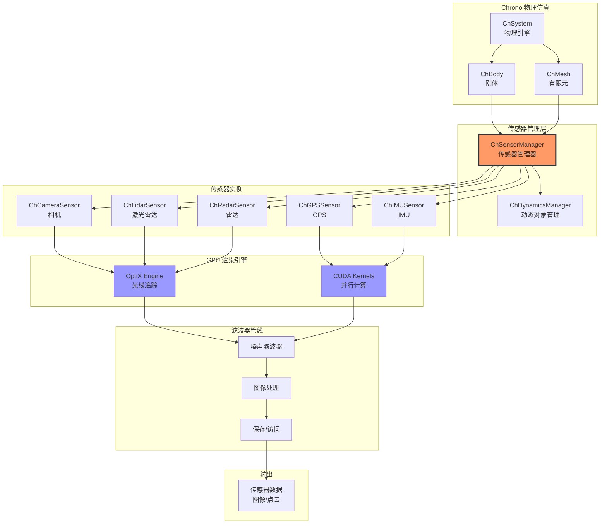
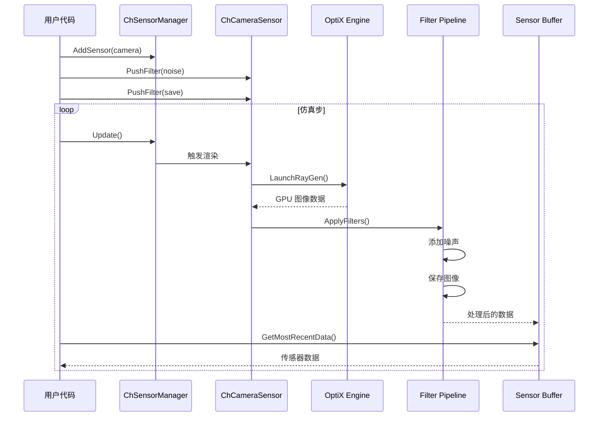
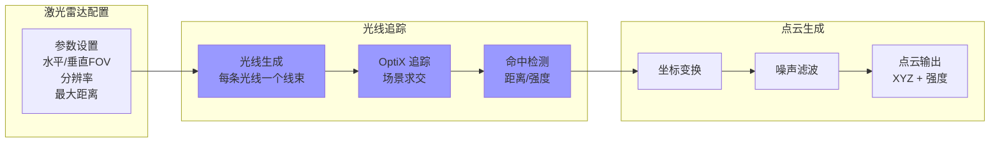
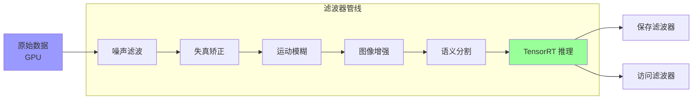
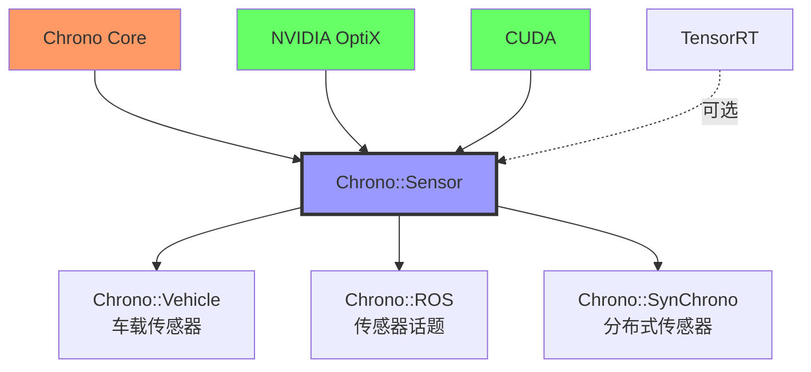

# Chrono::Sensor 模块架构分析

## 概述

`chrono_sensor` 模块提供了基于 GPU 的传感器仿真能力，支持相机、激光雷达、雷达、GPS、IMU 等多种传感器类型。该模块利用 NVIDIA OptiX 光线追踪引擎和 CUDA 并行计算，能够生成高保真的传感器数据，广泛应用于自动驾驶、机器人导航和虚拟测试场景。

## 主要功能

### 核心职责

1. **传感器管理**：统一管理场景中的所有传感器
2. **GPU 渲染**：使用 OptiX 进行光线追踪渲染
3. **相机仿真**：RGB、深度、分割、鱼眼相机等
4. **激光雷达仿真**：多线束、旋转式激光雷达
5. **雷达仿真**：毫米波雷达（基于光线追踪）
6. **IMU/GPS 仿真**：惯性测量单元和全球定位系统
7. **传感器滤波器**：噪声、失真、运动模糊等后处理
8. **数据导出**：保存图像、点云到文件或流式传输

### 支持的传感器类型

- **ChCameraSensor**：RGB、深度、灰度、语义分割
- **ChLidarSensor**：3D 激光雷达（点云）
- **ChRadarSensor**：毫米波雷达
- **ChGPSSensor**：GPS 位置
- **ChIMUSensor**：加速度计和陀螺仪
- **ChTachometerSensor**：转速计

## 设计特点

### 架构模式

- **观察者模式**：传感器观察物理仿真状态
- **管道模式**：传感器数据通过滤波器管道处理
- **策略模式**：不同的传感器使用不同的渲染策略
- **单例模式**：ChSensorManager 管理所有传感器

### 设计原则

- **GPU 优先**：所有密集计算在 GPU 上执行
- **异步渲染**：传感器渲染与物理仿真解耦
- **可配置性**：通过参数和滤波器灵活配置传感器
- **高保真度**：基于物理的渲染（PBR）

## 文件结构与关系

```
chrono_sensor/
├── ChApiSensor.h               # API 导出宏
├── ChSensorManager.h/.cpp      # 传感器管理器（核心）
├── ChDynamicsManager.h/.cpp    # 动态对象管理
│
├── sensors/                    # 传感器类型
│   ├── ChSensor.h/.cpp              # 传感器基类
│   ├── ChOptixSensor.h/.cpp         # OptiX 传感器基类
│   ├── ChCameraSensor.h/.cpp        # 相机传感器
│   ├── ChLidarSensor.h/.cpp         # 激光雷达传感器
│   ├── ChRadarSensor.h/.cpp         # 雷达传感器
│   ├── ChGPSSensor.h/.cpp           # GPS 传感器
│   ├── ChIMUSensor.h/.cpp           # IMU 传感器
│   ├── ChTachometerSensor.h/.cpp    # 转速计传感器
│   └── Sensor.h                     # 传感器类型枚举
│
├── filters/                    # 滤波器/后处理
│   ├── ChFilter.h/.cpp              # 滤波器基类
│   ├── ChFilterAccess.h/.cpp        # 数据访问滤波器
│   ├── ChFilterSave.h/.cpp          # 保存到文件滤波器
│   ├── ChFilterVisualize.h/.cpp     # 可视化滤波器
│   ├── ChFilterCameraNoise.h/.cpp   # 相机噪声滤波器
│   ├── ChFilterLidarNoise.h/.cpp    # 激光雷达噪声
│   ├── ChFilterRadarNoise.h/.cpp    # 雷达噪声
│   ├── ChFilterGPSNoise.h/.cpp      # GPS 噪声
│   ├── ChFilterIMUNoise.h/.cpp      # IMU 噪声
│   ├── ChFilterImageOps.h/.cpp      # 图像操作
│   └── ...
│
├── optix/                      # OptiX 渲染引擎
│   ├── ChOptixEngine.h/.cpp         # OptiX 引擎封装
│   ├── ChOptixGeometry.h/.cpp       # 几何体管理
│   ├── ChOptixPipeline.h/.cpp       # 渲染管线
│   ├── ChOptixUtils.h/.cpp          # 工具函数
│   ├── shaders/                     # OptiX 着色器
│   │   ├── camera_raygen.cu         # 相机光线生成
│   │   ├── lidar_raygen.cu          # 激光雷达光线生成
│   │   ├── radar_raygen.cu          # 雷达光线生成
│   │   ├── closest_hit.cu           # 最近命中着色器
│   │   ├── miss.cu                  # 未命中着色器
│   │   └── ...
│   └── scene/                       # 场景管理
│
├── cuda/                       # CUDA 核函数
│   ├── curand_utils.cu              # 随机数生成
│   ├── image_ops.cu                 # 图像处理
│   ├── pointcloud_ops.cu            # 点云处理
│   └── ...
│
├── tensorrt/                   # TensorRT 集成
│   ├── ChFilterTensorRT.h/.cpp      # TensorRT 推理滤波器
│   └── ...
│
└── utils/                      # 工具函数
    ├── ChVisualMaterial.h/.cpp      # 材质定义
    ├── ChSensorBuffer.h             # 传感器数据缓冲
    └── ...
```

## 架构图

### 传感器系统整体架构



### 相机传感器数据流



### 激光雷达扫描过程



### 传感器滤波器链



## 核心类详解

### ChSensorManager

**职责**：管理所有传感器，协调渲染和更新

**关键方法**：
```cpp
// 添加传感器到场景
void AddSensor(std::shared_ptr<ChSensor> sensor);

// 更新所有传感器
void Update();

// 设置场景和相机
void SetScene(std::shared_ptr<ChScene> scene);
void SetKeyLight(ChVector3f direction, ChColor color);
void SetAmbientLight(ChColor color);

// 设置渲染参数
void SetRayRecursions(int recursions);
void SetSamples(int samples);
```

### ChCameraSensor

**职责**：相机传感器，渲染 RGB、深度、分割图像

**配置参数**：
```cpp
unsigned int width;           // 图像宽度
unsigned int height;          // 图像高度
float hfov;                   // 水平视场角（弧度）
float max_vert_angle;         // 最大垂直角
float min_vert_angle;         // 最小垂直角
float lag;                    // 传感器延迟
unsigned int supersample;     // 超采样因子
CameraLensModel lens_model;   // 镜头模型（针孔/鱼眼）
```

**支持的图像类型**：
- **RGBA8**：标准 RGB 彩色图像
- **DEPTH**：深度图（距离）
- **NORMALS**：表面法向量
- **SEMANTIC**：语义分割
- **INTENSITY**：灰度图

### ChLidarSensor

**职责**：激光雷达传感器，生成 3D 点云

**配置参数**：
```cpp
unsigned int hor_samples;     // 水平采样数
unsigned int vert_samples;    // 垂直采样数
float hfov;                   // 水平视场角
float max_vert_angle;         // 最大垂直角
float min_vert_angle;         // 最小垂直角
float max_distance;           // 最大检测距离
float lag;                    // 传感器延迟
LidarBeamShape beam_shape;    // 光束形状
float vert_divergence_angle;  // 垂直发散角
float hor_divergence_angle;   // 水平发散角
LidarReturnMode return_mode;  // 返回模式（最近/最远/双重）
```

**点云数据结构**：
```cpp
struct PointXYZI {
    float x, y, z;      // 位置
    float intensity;    // 反射强度
};
```

### ChIMUSensor

**职责**：惯性测量单元，测量加速度和角速度

**测量输出**：
```cpp
struct IMUData {
    ChVector3f accel;   // 加速度 (m/s²)
    ChVector3f gyro;    // 角速度 (rad/s)
};
```

**噪声模型**：
- 高斯白噪声
- 随机游走
- 偏置漂移

### ChGPSSensor

**职责**：GPS 传感器，提供全球坐标位置

**输出数据**：
```cpp
struct GPSData {
    double latitude;    // 纬度（度）
    double longitude;   // 经度（度）
    double altitude;    // 海拔（米）
    ChVector3f vel;     // 速度（m/s）
};
```

## 依赖关系

### 核心依赖
- **Chrono Core**：物理仿真基础
- **CUDA**：GPU 并行计算
- **OptiX**：NVIDIA 光线追踪引擎
- **GLM**：数学库
- **GLEW / GLFW**：OpenGL 扩展和窗口管理

### 可选依赖
- **TensorRT**：深度学习推理加速
- **OpenCV**：图像处理（如果使用 OpenCV 滤波器）

### 被依赖模块
- **Chrono::Vehicle**：车载传感器
- **Chrono::ROS**：ROS 传感器话题发布
- **Chrono::SynChrono**：分布式传感器仿真

## 使用示例

### 创建 RGB 相机

```cpp
#include "chrono_sensor/ChSensorManager.h"
#include "chrono_sensor/sensors/ChCameraSensor.h"
#include "chrono_sensor/filters/ChFilterSave.h"
#include "chrono_sensor/filters/ChFilterVisualize.h"

using namespace chrono;
using namespace chrono::sensor;

// 创建物理系统
ChSystemNSC sys;

// 创建传感器管理器
auto sensor_manager = chrono_types::make_shared<ChSensorManager>(&sys);

// 设置场景光照
sensor_manager->SetAmbientLight(ChColor(0.1f, 0.1f, 0.1f));
sensor_manager->SetKeyLight(ChVector3f(-1, -1, -1), 
                             ChColor(1.0f, 1.0f, 1.0f), 500);

// 创建载体物体（例如车辆车架）
auto body = chrono_types::make_shared<ChBody>();
body->SetPos(ChVector3d(0, 0, 1));
sys.Add(body);

// 创建相机传感器
auto camera = chrono_types::make_shared<ChCameraSensor>(
    body,                                    // 安装在哪个物体上
    30.0f,                                   // 更新频率 (Hz)
    chrono::ChFrame<>(ChVector3d(0, 0, 0),  // 相对位姿
                       QuatFromAngleZ(0)),
    1920,                                    // 图像宽度
    1080,                                    // 图像高度
    CH_PI / 3                                // 水平 FOV (60 度)
);
camera->SetName("Front Camera");
camera->SetLag(0.0f);
camera->SetCollectionWindow(0.0f);

// 添加滤波器
// 1. 可视化窗口
camera->PushFilter(chrono_types::make_shared<ChFilterVisualize>(
    1920, 1080, "Camera View"));

// 2. 保存到文件
camera->PushFilter(chrono_types::make_shared<ChFilterSave>(
    "output/camera/"));

// 3. 数据访问滤波器（用于获取图像数据）
camera->PushFilter(chrono_types::make_shared<ChFilterRGBA8Access>());

// 添加传感器到管理器
sensor_manager->AddSensor(camera);

// 仿真循环
double time_step = 0.01;
while (sys.GetChTime() < 10.0) {
    // 更新传感器
    sensor_manager->Update();
    
    // 获取最新图像数据
    auto rgba_buffer = camera->GetMostRecentBuffer<SensorBufferRGBA8>();
    if (rgba_buffer->Buffer) {
        // 处理图像数据
        // rgba_buffer->Buffer 是 PixelRGBA8 数组
    }
    
    // 物理仿真步
    sys.DoStepDynamics(time_step);
}
```

### 创建激光雷达

```cpp
// 创建 16 线束激光雷达
auto lidar = chrono_types::make_shared<ChLidarSensor>(
    body,                                   // 安装物体
    10.0f,                                  // 扫描频率 (Hz)
    chrono::ChFrame<>(ChVector3d(0, 0, 1)), // 传感器位姿
    1800,                                   // 水平采样数
    16,                                     // 垂直线束数
    CH_2PI,                                 // 水平 FOV (360 度)
    CH_PI / 12,                             // 上限垂直角 (+15度)
    -CH_PI / 12,                            // 下限垂直角 (-15度)
    100.0f                                  // 最大距离 (m)
);
lidar->SetName("Lidar");
lidar->SetLag(0.0f);
lidar->SetCollectionWindow(0.1f);  // 采集窗口

// 设置光束参数
lidar->SetBeamShape(LidarBeamShape::RECTANGULAR);
lidar->SetVerticalBeamDivergence(0.003f);
lidar->SetHorizontalBeamDivergence(0.003f);
lidar->SetReturnMode(LidarReturnMode::STRONGEST_RETURN);

// 添加噪声
lidar->PushFilter(chrono_types::make_shared<ChFilterLidarNoiseXYZI>(
    0.01f,  // 距离标准差 (m)
    0.001f, // 水平角标准差 (rad)
    0.001f  // 垂直角标准差 (rad)
));

// 保存点云
lidar->PushFilter(chrono_types::make_shared<ChFilterSavePtCloud>(
    "output/lidar/"));

// 数据访问
lidar->PushFilter(chrono_types::make_shared<ChFilterXYZIAccess>());

sensor_manager->AddSensor(lidar);

// 在仿真循环中获取点云
auto xyzi_buffer = lidar->GetMostRecentBuffer<SensorBufferXYZI>();
if (xyzi_buffer->Buffer) {
    // xyzi_buffer->Buffer 是 PointXYZI 数组
    // xyzi_buffer->Width * xyzi_buffer->Height 个点
}
```

### 创建 IMU 和 GPS

```cpp
// IMU 传感器
auto imu = chrono_types::make_shared<ChIMUSensor>(
    body,                                   // 安装物体
    100.0f,                                 // 更新频率 (Hz)
    chrono::ChFrame<>(ChVector3d(0, 0, 0))  // 传感器位姿
);
imu->SetName("IMU");

// 添加 IMU 噪声模型
imu->PushFilter(chrono_types::make_shared<ChFilterIMUNoiseNormal>(
    ChVector3f(0, 0, 0),     // 陀螺仪均值
    ChVector3f(0.01, 0.01, 0.01),  // 陀螺仪标准差
    ChVector3f(0, 0, -9.81), // 加速度计均值（重力）
    ChVector3f(0.1, 0.1, 0.1)  // 加速度计标准差
));

imu->PushFilter(chrono_types::make_shared<ChFilterIMUAccess>());
sensor_manager->AddSensor(imu);

// GPS 传感器
auto gps = chrono_types::make_shared<ChGPSSensor>(
    body,                                   // 安装物体
    1.0f,                                   // 更新频率 (Hz)
    chrono::ChFrame<>(ChVector3d(0, 0, 0)), // 传感器位姿
    ChVector3d(0, 0, 0)                     // 参考位置
);
gps->SetName("GPS");

// 添加 GPS 噪声
gps->PushFilter(chrono_types::make_shared<ChFilterGPSNoiseNormal>(
    ChVector3f(1.0, 1.0, 2.0)  // 位置标准差 (m)
));

gps->PushFilter(chrono_types::make_shared<ChFilterGPSAccess>());
sensor_manager->AddSensor(gps);

// 获取 IMU 数据
auto imu_buffer = imu->GetMostRecentBuffer<SensorBufferIMU>();
if (imu_buffer->Buffer) {
    IMUData data = imu_buffer->Buffer[0];
    std::cout << "Accel: " << data.accel << "\n";
    std::cout << "Gyro: " << data.gyro << "\n";
}

// 获取 GPS 数据
auto gps_buffer = gps->GetMostRecentBuffer<SensorBufferGPS>();
if (gps_buffer->Buffer) {
    GPSData data = gps_buffer->Buffer[0];
    std::cout << "Lat: " << data.latitude << "\n";
    std::cout << "Lon: " << data.longitude << "\n";
}
```

## 性能特点

### 优势

1. **GPU 加速**：利用 OptiX 光线追踪，渲染速度快
2. **高保真度**：基于物理的渲染，真实感强
3. **灵活配置**：丰富的滤波器和参数设置
4. **多传感器支持**：一站式传感器套件
5. **与 ROS 集成**：方便与机器人系统对接

### 局限性

1. **GPU 依赖**：需要 NVIDIA GPU 和 OptiX SDK
2. **计算成本**：高分辨率、高频率传感器计算昂贵
3. **内存占用**：大量传感器或高分辨率图像占用大量显存
4. **实时性限制**：复杂场景难以实时运行

### 性能建议

- 降低分辨率和更新频率以提高速度
- 使用多个低分辨率传感器而非单个高分辨率传感器
- 合理设置 `collection_window` 避免丢帧
- 使用 TensorRT 滤波器加速深度学习推理
- 对于分布式仿真，每个节点运行独立的传感器

## 与其他模块的关系



## 总结

Chrono::Sensor 模块通过 GPU 加速的光线追踪和并行计算，为物理仿真提供了高保真的传感器数据。其灵活的滤波器架构和丰富的传感器类型使其成为自动驾驶、机器人仿真和虚拟测试的理想工具。与 ROS 和 SynChrono 的集成进一步扩展了其在复杂系统中的应用潜力。
