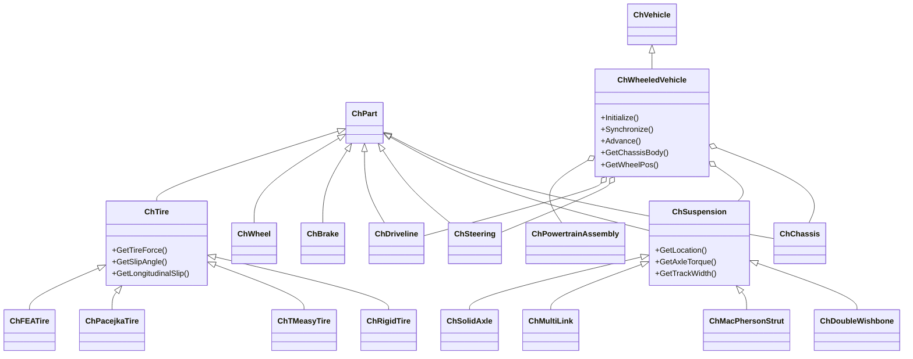
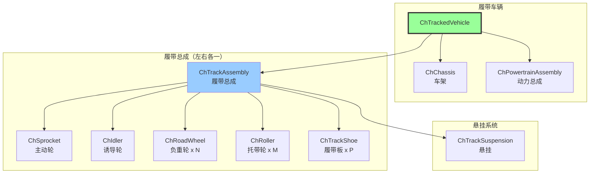
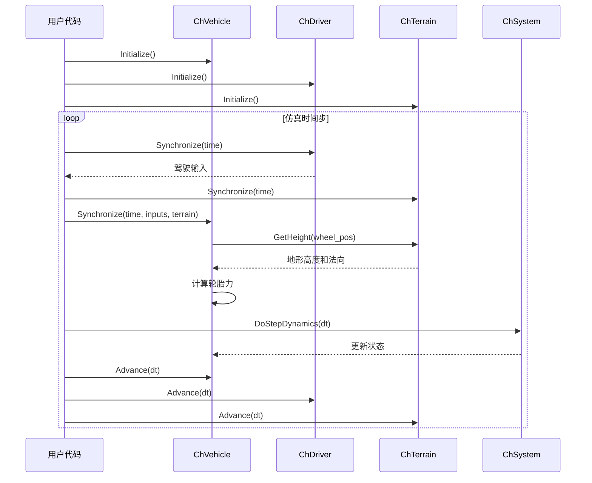
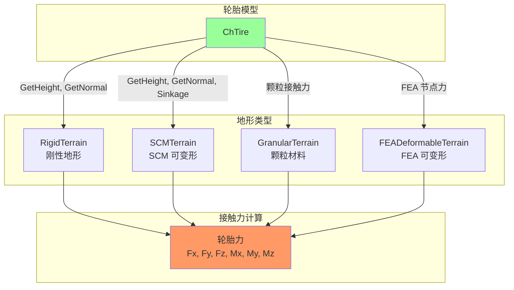
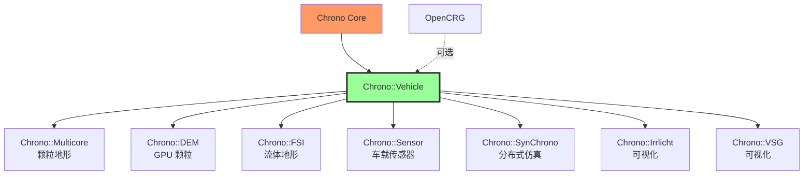

# Chrono::Vehicle 模块架构分析

## 概述

`chrono_vehicle` 模块是 Project Chrono 中用于地面车辆建模和仿真的专用框架。它提供了完整的车辆子系统模板库，支持轮式车辆和履带式车辆，以及多种地形模型。该模块广泛应用于车辆动力学研究、越野性能评估和自动驾驶仿真。

## 主要功能

### 核心职责

1. **车辆建模**：提供参数化的车辆子系统模板
2. **轮式车辆支持**：包括悬挂、转向、传动系统等
3. **履带式车辆支持**：履带、负重轮、诱导轮等子系统
4. **地形建模**：刚性地形、可变形地形（SCM、颗粒地形）
5. **驾驶员模型**：交互式驾驶、路径跟随、数据驱动
6. **轮胎模型**：刚性、TMEASY、Pacejka、FEA 轮胎等
7. **动力系统**：发动机、变速器、差速器模型
8. **协同仿真支持**：多车辆、车辆-地形协同仿真

### 支持的车辆类型

- **轮式车辆**：乘用车、卡车、越野车（2-8 轮）
- **履带式车辆**：坦克、挖掘机、推土机
- **特殊车辆**：铰接车辆、拖车系统

## 设计特点

### 架构模式

- **模板方法模式**：定义车辆组装流程，子类实现具体配置
- **组合模式**：车辆由多个子系统组合而成
- **策略模式**：可互换的轮胎模型、地形模型、驾驶员模型
- **工厂模式**：从 JSON 文件创建车辆

### 设计原则

- **模块化**：每个子系统独立定义和测试
- **可重用性**：子系统可在不同车辆间共享
- **可扩展性**：易于添加新的子系统类型
- **参数化**：通过 JSON 文件配置车辆参数

## 文件结构与关系

```
chrono_vehicle/
├── ChApiVehicle.h              # API 导出宏
├── ChVehicle.h/.cpp            # 车辆基类
├── ChChassis.h/.cpp            # 车架基类
├── ChDriver.h/.cpp             # 驾驶员基类
├── ChDriveline.h/.cpp          # 传动系统基类
├── ChEngine.h/.cpp             # 发动机基类
├── ChTransmission.h/.cpp       # 变速器基类
├── ChPowertrainAssembly.h/.cpp # 动力总成
├── ChTerrain.h/.cpp            # 地形基类
├── ChPart.h/.cpp               # 零部件基类
├── ChSubsysDefs.h/.cpp         # 子系统定义
├── ChWorldFrame.h/.cpp         # 世界坐标系
├── ChVehicleVisualSystem.h/.cpp # 可视化系统
│
├── wheeled_vehicle/           # 轮式车辆
│   ├── ChWheeledVehicle.h/.cpp      # 轮式车辆基类
│   ├── ChTire.h/.cpp                # 轮胎基类
│   ├── ChWheel.h/.cpp               # 车轮
│   ├── ChBrake.h/.cpp               # 制动系统
│   ├── ChSteering.h/.cpp            # 转向系统
│   ├── ChAntirollBar.h/.cpp         # 防倾杆
│   ├── suspension/                   # 悬挂系统
│   │   ├── ChDoubleWishbone.h/.cpp  # 双叉臂悬挂
│   │   ├── ChMacPhersonStrut.h/.cpp # 麦弗逊悬挂
│   │   ├── ChMultiLink.h/.cpp       # 多连杆悬挂
│   │   ├── ChSolidAxle.h/.cpp       # 整体桥悬挂
│   │   └── ...                       # 其他悬挂类型
│   ├── tire/                         # 轮胎模型
│   │   ├── ChRigidTire.h/.cpp       # 刚性轮胎
│   │   ├── ChTMeasyTire.h/.cpp      # TMEASY 轮胎
│   │   ├── ChPacejkaTire.h/.cpp     # Pacejka 轮胎
│   │   ├── ChFEATire.h/.cpp         # FEA 轮胎
│   │   └── ...
│   ├── driveline/                    # 传动系统
│   │   ├── ChShaftsDriveline2WD.h   # 2WD 传动
│   │   ├── ChShaftsDriveline4WD.h   # 4WD 传动
│   │   └── ...
│   └── vehicle/                      # 预定义车辆
│       ├── hmmwv/                    # HMMWV 模型
│       ├── sedan/                    # 轿车模型
│       ├── uaz/                      # UAZ 模型
│       └── ...
│
├── tracked_vehicle/           # 履带式车辆
│   ├── ChTrackedVehicle.h/.cpp      # 履带车辆基类
│   ├── ChTrackAssembly.h/.cpp       # 履带总成
│   ├── ChTrackShoe.h/.cpp           # 履带板
│   ├── ChIdler.h/.cpp               # 诱导轮
│   ├── ChRoadWheel.h/.cpp           # 负重轮
│   ├── ChRoller.h/.cpp              # 托带轮
│   ├── ChSprocket.h/.cpp            # 主动轮
│   ├── suspension/                   # 悬挂系统
│   │   ├── ChLinearDamperRWAssembly.h
│   │   └── ...
│   └── vehicle/                      # 预定义车辆
│       ├── m113/                     # M113 装甲车
│       └── ...
│
├── terrain/                   # 地形模型
│   ├── ChTerrain.h                   # 地形接口
│   ├── RigidTerrain.h/.cpp          # 刚性地形
│   ├── SCMTerrain.h/.cpp            # SCM 可变形地形
│   ├── GranularTerrain.h/.cpp       # 颗粒地形
│   ├── FEADeformableTerrain.h/.cpp  # FEA 可变形地形
│   └── CRGTerrain.h/.cpp            # OpenCRG 地形
│
├── driver/                    # 驾驶员模型
│   ├── ChDriver.h                    # 驾驶员接口
│   ├── ChInteractiveDriver.h/.cpp   # 交互式驾驶
│   ├── ChPathFollowerDriver.h/.cpp  # 路径跟随
│   ├── ChDataDriver.h/.cpp          # 数据驱动
│   └── ChHumanDriver.h/.cpp         # 人类驾驶员模型
│
├── powertrain/                # 动力总成
│   ├── ChEngineSimple.h/.cpp        # 简单发动机
│   ├── ChEngineShafts.h/.cpp        # 轴式发动机
│   ├── ChEngineSimpleMap.h/.cpp     # MAP 发动机
│   ├── ChTransmissionSimple.h/.cpp  # 简单变速器
│   ├── ChTransmissionShafts.h/.cpp  # 轴式变速器
│   └── ChTransmissionAutomatic.h/.cpp
│
├── chassis/                   # 车架子系统
├── utils/                     # 工具函数
├── cosim/                     # 协同仿真
├── fmi/                       # FMI 导出
└── visualization/             # 可视化工具
```

## 架构图

### 轮式车辆类层次结构



### 履带式车辆结构



### 车辆仿真循环



### 地形交互模型



## 核心类详解

### ChWheeledVehicle

**职责**：轮式车辆的主类，管理所有子系统

**关键方法**：
```cpp
// 初始化车辆
void Initialize(const ChCoordsys<>& chassis_pos);

// 同步子系统（在系统求解前调用）
void Synchronize(double time,
                 const ChDriver::Inputs& driver_inputs,
                 const ChTerrain& terrain);

// 推进子系统状态（在系统求解后调用）
void Advance(double step);

// 获取车辆状态
ChVector3d GetVehiclePos() const;
double GetVehicleSpeed() const;
ChVector3d GetWheelPos(int axle, VehicleSide side) const;
```

### ChTrackedVehicle

**职责**：履带式车辆的主类

**关键组件**：
- 左右履带总成
- 主动轮（驱动）
- 诱导轮（张紧）
- 负重轮（支撑）
- 履带板（接地）

### ChTire

**职责**：轮胎模型基类，计算轮胎力

**子类型**：
1. **ChRigidTire**：刚性轮胎，无变形
2. **ChTMeasyTire**：半经验轮胎模型，快速
3. **ChPacejkaTire**：Pacejka 魔术公式，精确
4. **ChFEATire**：有限元轮胎，高保真

**接口**：
```cpp
// 计算轮胎力和力矩
virtual TerrainForce GetTireForce() const = 0;

// 获取轮胎状态
double GetSlipAngle() const;
double GetLongitudinalSlip() const;
double GetCamberAngle() const;
```

### ChTerrain

**职责**：地形模型接口

**主要方法**：
```cpp
// 查询地形高度
virtual double GetHeight(const ChVector3d& loc) const = 0;

// 查询地形法向量
virtual ChVector3d GetNormal(const ChVector3d& loc) const = 0;

// 查询地形属性（摩擦系数等）
virtual float GetCoefficientFriction(const ChVector3d& loc) const;
```

**地形类型**：
- **RigidTerrain**：刚性地形，使用 Chrono 碰撞系统
- **SCMTerrain**：土壤接触模型（Soil Contact Model）
- **GranularTerrain**：离散颗粒地形（GPU 加速）
- **CRGTerrain**：OpenCRG 道路数据格式

## 依赖关系

### 核心依赖
- **Chrono Core**：基础物理引擎
- **Eigen3**：线性代数

### 可选依赖
- **Chrono::Multicore**：颗粒地形加速
- **Chrono::DEM**：GPU 颗粒地形
- **Chrono::FSI**：流-固耦合地形
- **Chrono::Sensor**：车载传感器
- **Chrono::SynChrono**：多车辆分布式仿真
- **Chrono::Irrlicht / VSG**：实时可视化
- **OpenCRG**：CRG 地形格式支持
- **Irrklang**：音效支持

### 被依赖模块
- **Chrono::SynChrono**：分布式车辆仿真
- 用户应用程序

## 使用示例

### 创建 HMMWV 轮式车辆

```cpp
#include "chrono_vehicle/ChVehicleModelData.h"
#include "chrono_vehicle/wheeled_vehicle/vehicle/HMMWV.h"
#include "chrono_vehicle/terrain/RigidTerrain.h"
#include "chrono_vehicle/driver/ChPathFollowerDriver.h"

using namespace chrono;
using namespace chrono::vehicle;
using namespace chrono::vehicle::hmmwv;

// 创建 Chrono 系统
ChSystemNSC sys;
sys.SetCollisionSystemType(ChCollisionSystem::Type::BULLET);

// 创建 HMMWV 车辆
HMMWV_Full hmmwv(&sys);
hmmwv.SetChassisFixed(false);
hmmwv.SetChassisCollisionType(CollisionType::NONE);
hmmwv.SetInitPosition(ChCoordsys<>(ChVector3d(0, 0, 1)));
hmmwv.SetTireType(TireModelType::TMEASY);
hmmwv.Initialize();

// 设置可视化类型
hmmwv.SetChassisVisualizationType(VisualizationType::MESH);
hmmwv.SetSuspensionVisualizationType(VisualizationType::PRIMITIVES);
hmmwv.SetSteeringVisualizationType(VisualizationType::PRIMITIVES);
hmmwv.SetWheelVisualizationType(VisualizationType::MESH);
hmmwv.SetTireVisualizationType(VisualizationType::MESH);

// 创建刚性地形
RigidTerrain terrain(&sys);
auto patch = terrain.AddPatch(
    ChContactMaterialData(),
    ChVector3d(0, 0, 0),
    ChVector3d(0, 0, 1),
    200.0, 200.0);
patch->SetTexture(vehicle::GetDataFile("terrain/textures/tile4.jpg"), 
                  200, 200);
terrain.Initialize();

// 创建路径跟随驾驶员
auto path = StraightLinePath(ChVector3d(0, 0, 0.5), 
                               ChVector3d(100, 0, 0.5));
ChPathFollowerDriver driver(hmmwv.GetVehicle(), path, 
                              "my_path", 10.0);  // 目标速度 10 m/s
driver.GetSteeringController().SetLookAheadDistance(5.0);
driver.GetSteeringController().SetGains(0.5, 0.0, 0.0);
driver.GetSpeedController().SetGains(0.4, 0.0, 0.0);
driver.Initialize();

// 仿真循环
double time_step = 0.01;
double time = 0;

while (time < 20.0) {
    time = sys.GetChTime();
    
    // 获取驾驶输入
    ChDriver::Inputs driver_inputs = driver.GetInputs();
    
    // 同步子系统
    driver.Synchronize(time);
    terrain.Synchronize(time);
    hmmwv.Synchronize(time, driver_inputs, terrain);
    
    // 推进系统
    driver.Advance(time_step);
    terrain.Advance(time_step);
    hmmwv.Advance(time_step);
    sys.DoStepDynamics(time_step);
    
    // 输出车辆状态
    std::cout << "Time: " << time 
              << " Speed: " << hmmwv.GetVehicle().GetSpeed() 
              << " m/s\n";
}
```

### M113 履带式车辆

```cpp
#include "chrono_vehicle/tracked_vehicle/vehicle/M113.h"

// 创建 M113 装甲车
M113 m113(&sys);
m113.SetChassisCollisionType(CollisionType::NONE);
m113.SetInitPosition(ChCoordsys<>(ChVector3d(0, 0, 1)));
m113.SetTrackShoeType(TrackShoeType::SINGLE_PIN);
m113.SetBrakeType(BrakeType::SIMPLE);
m113.SetPowertrainType(PowertrainModelType::SIMPLE_MAP);
m113.Initialize();

// 设置可视化
m113.SetChassisVisualizationType(VisualizationType::MESH);
m113.SetSprocketVisualizationType(VisualizationType::MESH);
m113.SetIdlerVisualizationType(VisualizationType::MESH);
m113.SetRoadWheelVisualizationType(VisualizationType::MESH);
m113.SetTrackShoeVisualizationType(VisualizationType::MESH);

// 创建颗粒地形（需要 Chrono::Multicore）
auto terrain = chrono_types::make_shared<GranularTerrain>(&sys);
terrain->SetGranularMaterial(1000.0,   // 颗粒数量
                              0.02);     // 颗粒半径
terrain->Initialize();

// 仿真...
```

## 性能特点

### 优势

1. **模块化设计**：易于配置和扩展
2. **预定义模型库**：多种标准车辆可直接使用
3. **多种轮胎模型**：从简单到高保真
4. **地形多样性**：支持刚性、可变形、颗粒地形
5. **协同仿真**：支持多车辆、车辆-地形解耦

### 局限性

1. **计算成本**：高保真模型（FEA 轮胎、颗粒地形）计算昂贵
2. **地形限制**：SCM 地形不适合高速或大变形场景
3. **实时性**：复杂车辆难以实时仿真

### 性能建议

- 简单应用使用刚性轮胎 + 刚性地形
- 越野仿真使用 TMEASY 轮胎 + SCM 地形
- 极端地形使用颗粒地形（需要 GPU）
- 多车辆场景考虑 SynChrono 分布式仿真

## 与其他模块的关系



## 总结

Chrono::Vehicle 模块提供了完整的地面车辆仿真框架，从简单的运动学模型到复杂的多体动力学模型。其模块化设计使其既适合快速原型开发，也适合高保真研究。通过与其他 Chrono 模块（Multicore、DEM、Sensor、SynChrono）的集成，可以实现从单车到多车、从刚性地形到复杂地形的各种仿真场景。
