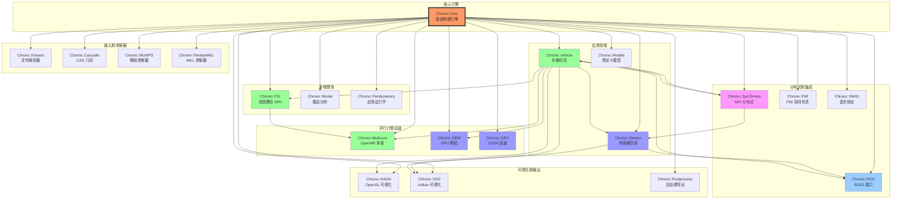
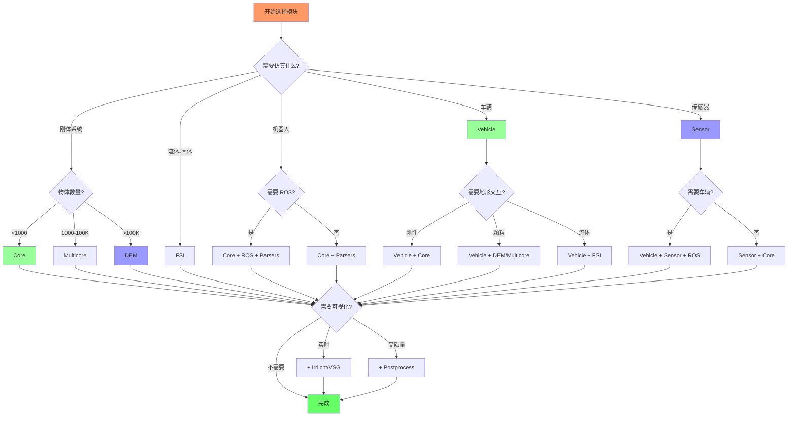

# Project Chrono 模块架构总览

## 文档说明

本文档提供 Project Chrono 所有主要模块的架构总览，包括模块分类、依赖关系和使用场景。这是对各个独立模块分析文档的补充和索引。

## 模块分类

### 核心引擎
- **chrono**：基础物理引擎，提供刚体动力学、柔体 FEA、求解器、碰撞检测等核心功能

### 并行计算模块
- **chrono_multicore**：OpenMP 多核 CPU 并行，用于大规模刚体和颗粒系统
- **chrono_dem**：双 GPU 加速的离散元方法，百万级颗粒仿真
- **chrono_gpu**：CUDA GPU 加速的颗粒动力学（新版本）

### 多物理场仿真模块
- **chrono_fsi**：流固耦合，基于 SPH 方法的流体-刚体交互
- **chrono_modal**：模态分析，用于柔体降阶模型
- **chrono_peridynamics**：近场动力学，用于材料断裂和损伤

### 应用领域模块
- **chrono_vehicle**：完整的地面车辆仿真框架（轮式、履带式）
- **chrono_sensor**：GPU 加速的传感器仿真（相机、激光雷达、雷达、IMU、GPS）
- **chrono_models**：预定义模型库（机器人、车辆等）

### 通信和集成模块
- **chrono_ros**：ROS/ROS2 接口，用于机器人系统集成
- **chrono_synchrono**：基于 MPI 的分布式多智能体仿真
- **chrono_fmi**：功能模拟接口（FMI），用于协同仿真
- **chrono_swig**：SWIG 语言绑定（Python、C#、Java）

### 可视化模块
- **chrono_irrlicht**：基于 Irrlicht 的 OpenGL 实时可视化
- **chrono_vsg**：基于 VulkanSceneGraph 的 Vulkan 现代可视化
- **chrono_postprocess**：后处理和数据导出（POV-Ray、Blender）

### 解析和导入模块
- **chrono_parsers**：文件格式解析器（URDF、OpenSim、Python、Adams）
- **chrono_cascade**：OpenCASCADE CAD 几何引擎集成

### 求解器扩展模块
- **chrono_mumps**：MUMPS 稀疏直接求解器接口
- **chrono_pardisomkl**：Intel Pardiso MKL 高性能求解器接口

### 其他模块
- **chrono_matlab**：MATLAB 接口
- **chrono_thirdparty**：第三方库集合

## 模块依赖关系图

## 模块功能分类总览

### 计算性能分类

| 性能级别 | 模块 | 规模 | 硬件 |
|---------|------|------|------|
| **串行** | Chrono Core | ~1000 物体 | 单核 CPU |
| **多核并行** | Chrono::Multicore | ~100,000 物体 | 多核 CPU (OpenMP) |
| **GPU 并行** | Chrono::DEM, Chrono::GPU | ~1,000,000+ 颗粒 | NVIDIA GPU (CUDA) |
| **分布式** | Chrono::SynChrono | 多智能体 | 集群 (MPI) |

### 物理模型分类

| 物理类型 | 模块 | 应用场景 |
|---------|------|---------|
| **刚体动力学** | Core, Multicore | 机械系统、多体系统 |
| **柔体 FEA** | Core (FEA) | 结构分析、可变形体 |
| **颗粒材料** | Multicore, DEM, GPU | 颗粒流、粉末、沙土 |
| **流体-固体耦合** | FSI | 水下物体、液压系统 |
| **模态分析** | Modal | 振动、动态响应 |
| **断裂和损伤** | Peridynamics | 材料失效、冲击 |

### 应用领域分类

| 应用领域 | 核心模块 | 辅助模块 |
|---------|---------|---------|
| **车辆仿真** | Vehicle | Multicore, DEM, Sensor, SynChrono |
| **机器人仿真** | Core, Models | Sensor, ROS, Parsers (URDF) |
| **自动驾驶** | Vehicle, Sensor | ROS, SynChrono |
| **建筑和工程** | Core, FEA | Modal, Parsers, Postprocess |
| **颗粒工业** | Multicore, DEM | Postprocess |
| **海洋工程** | FSI | Core, Postprocess |

### 可视化方案对比

| 可视化模块 | 图形 API | 性能 | 特点 | 推荐场景 |
|-----------|---------|------|------|---------|
| **Irrlicht** | OpenGL | 中等 | 成熟稳定、易用 | 一般可视化、教学 |
| **VSG** | Vulkan | 高 | 现代化、高性能 | 大规模场景、未来方向 |
| **Postprocess** | 离线渲染 | 最高 | 电影级质量 | 出版物、演示视频 |
| **Sensor** | OptiX | 最高 | 光线追踪、传感器仿真 | 自动驾驶、传感器验证 |

## 典型使用场景与模块组合

### 场景 1：刚体多体系统仿真

**需求**：机械臂、连杆机构

**模块组合**：
- **Core**：基础物理引擎
- **Irrlicht / VSG**：可视化（可选）
- **Parsers**：从 URDF 导入（可选）

**特点**：
- 中小规模（<1000 物体）
- 精确求解器
- 实时或接近实时

### 场景 2：大规模颗粒材料仿真

**需求**：沙堆、粉末流动、谷物装卸

**模块组合**：
- **Core**：基础系统
- **Multicore** 或 **DEM**：并行加速
- **Postprocess**：结果可视化

**特点**：
- 大规模（10,000 - 1,000,000+ 物体）
- 需要并行计算
- 通常离线仿真

### 场景 3：越野车辆仿真

**需求**：车辆在复杂地形上的性能评估

**模块组合**：
- **Core**：物理引擎
- **Vehicle**：车辆建模
- **Multicore** 或 **DEM**：颗粒地形
- **Irrlicht / VSG**：实时可视化

**特点**：
- 中等规模
- 车辆-地形耦合
- 可实时或加速仿真

### 场景 4：自动驾驶仿真

**需求**：传感器-车辆-环境-控制闭环

**模块组合**：
- **Core**：物理引擎
- **Vehicle**：车辆动力学
- **Sensor**：相机、激光雷达
- **ROS**：与控制算法通信
- **SynChrono**：多车辆协同（可选）
- **Parsers**：导入地图/车辆模型

**特点**：
- 多模块集成
- 传感器闭环
- 需要 GPU 加速
- 可能需要分布式计算

### 场景 5：流固耦合仿真

**需求**：水下机器人、船舶、水力机械

**模块组合**：
- **Core**：刚体动力学
- **FSI**：SPH 流体求解
- **Multicore**：加速刚体部分
- **Postprocess**：流场可视化

**特点**：
- 计算密集
- 需要多核或 GPU
- 通常离线仿真

### 场景 6：机器人 ROS 集成

**需求**：机器人在 ROS 环境中测试

**模块组合**：
- **Core**：物理仿真
- **Parsers**：URDF 导入
- **ROS**：话题发布/订阅
- **Sensor**：传感器数据（可选）
- **VSG**：可视化（可选）

**特点**：
- 与 ROS 生态系统集成
- 软件在环测试
- 可实时运行

### 场景 7：分布式多智能体仿真

**需求**：车队、无人机编队、多机器人系统

**模块组合**：
- **Core**：物理引擎
- **Vehicle** 或 **Models**：智能体建模
- **SynChrono**：MPI 分布式通信
- **Sensor**：各智能体传感器
- **ROS**：控制接口

**特点**：
- 分布式计算
- 多节点协同
- 大规模系统

## 模块选择决策树

## 外部依赖总览

### 必需依赖（所有模块）
- **CMake**：构建系统（3.18+）
- **C++ 编译器**：支持 C++14 或更高
- **Eigen3**：线性代数库

### 模块特定依赖

| 模块 | 外部依赖 | 说明 |
|------|---------|------|
| **Multicore** | OpenMP, Thrust, Blaze | 多核并行 |
| **DEM / GPU** | CUDA, Thrust | NVIDIA GPU |
| **Sensor** | CUDA, OptiX, GLM, GLEW, GLFW | GPU 渲染 |
| **ROS** | ROS2 packages | ROS 集成 |
| **SynChrono** | MPI | 分布式通信 |
| **Irrlicht** | Irrlicht Engine | OpenGL 可视化 |
| **VSG** | VulkanSceneGraph | Vulkan 可视化 |
| **Parsers** | TinyXML2, RapidJSON | 文件解析 |
| **Cascade** | OpenCASCADE | CAD 几何 |
| **MUMPS** | MUMPS library | 稀疏求解器 |
| **PardisoMKL** | Intel MKL | 高性能求解器 |
| **MATLAB** | MATLAB Runtime | MATLAB 接口 |
| **Postprocess** | POV-Ray (可选) | 光线追踪渲染 |

## 模块成熟度和推荐使用

| 模块 | 成熟度 | 文档质量 | 推荐度 | 备注 |
|------|--------|---------|--------|------|
| **Core** | ⭐⭐⭐⭐⭐ | ⭐⭐⭐⭐⭐ | 必需 | 核心，非常成熟 |
| **Multicore** | ⭐⭐⭐⭐⭐ | ⭐⭐⭐⭐ | 强烈推荐 | 大规模系统首选 |
| **Vehicle** | ⭐⭐⭐⭐⭐ | ⭐⭐⭐⭐⭐ | 强烈推荐 | 车辆仿真标准 |
| **Sensor** | ⭐⭐⭐⭐ | ⭐⭐⭐⭐ | 推荐 | 传感器仿真强大 |
| **ROS** | ⭐⭐⭐⭐ | ⭐⭐⭐⭐ | 推荐 | ROS 集成必备 |
| **FSI** | ⭐⭐⭐⭐ | ⭐⭐⭐ | 推荐 | 流固耦合唯一选择 |
| **DEM** | ⭐⭐⭐⭐ | ⭐⭐⭐ | 推荐 | 大规模颗粒 |
| **SynChrono** | ⭐⭐⭐⭐ | ⭐⭐⭐ | 推荐 | 分布式唯一 |
| **Irrlicht** | ⭐⭐⭐⭐ | ⭐⭐⭐⭐ | 推荐 | 稳定的可视化 |
| **VSG** | ⭐⭐⭐ | ⭐⭐⭐ | 新兴 | 现代化替代 |
| **Parsers** | ⭐⭐⭐⭐ | ⭐⭐⭐ | 推荐 | URDF 导入常用 |
| **Postprocess** | ⭐⭐⭐⭐ | ⭐⭐⭐ | 推荐 | 高质量输出 |
| **Modal** | ⭐⭐⭐ | ⭐⭐⭐ | 专用 | 模态分析专用 |
| **Cascade** | ⭐⭐⭐ | ⭐⭐ | 专用 | CAD 几何专用 |
| **MUMPS / Pardiso** | ⭐⭐⭐ | ⭐⭐ | 专用 | 大规模稀疏系统 |
| **FMI** | ⭐⭐⭐ | ⭐⭐ | 专用 | 协同仿真 |
| **Peridynamics** | ⭐⭐⭐ | ⭐⭐ | 研究 | 断裂模拟研究 |
| **SWIG** | ⭐⭐⭐⭐ | ⭐⭐⭐ | 推荐 | Python 绑定 |
| **Models** | ⭐⭐⭐⭐ | ⭐⭐⭐⭐ | 推荐 | 预定义模型 |
| **MATLAB** | ⭐⭐⭐ | ⭐⭐ | 可选 | MATLAB 用户 |

## 版本兼容性

- **当前分析基于版本**：Chrono 9.0.1
- **最低 CMake 版本**：3.18
- **最低 C++ 标准**：C++14
- **推荐 C++ 标准**：C++17 或 C++20
- **CUDA 版本**：11.0+ （用于 DEM、Sensor）
- **OptiX 版本**：7.x （用于 Sensor）
- **ROS 版本**：ROS2 Foxy / Humble / Rolling

## 学习路径建议

### 初学者路径
1. **Core**：学习基础刚体动力学
2. **Irrlicht**：添加可视化
3. **Parsers**：导入模型
4. **Models**：使用预定义模型

### 车辆工程师路径
1. **Core**：基础
2. **Vehicle**：车辆建模
3. **Irrlicht / VSG**：可视化
4. **Multicore / DEM**：地形仿真

### 机器人工程师路径
1. **Core**：基础
2. **Parsers (URDF)**：导入机器人
3. **ROS**：ROS 集成
4. **Sensor**：传感器仿真

### 高性能计算路径
1. **Core**：基础
2. **Multicore**：多核并行
3. **DEM**：GPU 加速
4. **SynChrono**：分布式计算

### 自动驾驶研究者路径
1. **Core + Vehicle**：车辆动力学
2. **Sensor**：传感器仿真
3. **ROS**：感知-决策-控制集成
4. **SynChrono**：多车辆场景

## 总结

Project Chrono 提供了一个模块化、可扩展的多物理仿真平台。通过合理组合不同的模块，可以构建从简单机械系统到复杂自动驾驶场景的各种仿真应用。模块间清晰的接口和依赖关系使得系统既易于入门，又能支持高级应用。

核心建议：
1. **从小做起**：先用 Core 掌握基础
2. **按需添加**：根据应用需求逐步添加模块
3. **关注性能**：大规模系统优先考虑 Multicore/DEM
4. **善用工具**：Parsers、Models 可大幅加速开发
5. **集成生态**：ROS、SynChrono 扩展应用范围

## 相关文档

- [Chrono架构分析文档.md](./Chrono架构分析文档.md) - 综合架构分析（中文）
- [模块分析-chrono_multicore.md](./模块分析-chrono_multicore.md) - Multicore 模块详解
- [模块分析-chrono_vehicle.md](./模块分析-chrono_vehicle.md) - Vehicle 模块详解
- [模块分析-chrono_sensor.md](./模块分析-chrono_sensor.md) - Sensor 模块详解
- [architecture-diagrams_zh.md](./architecture-diagrams_zh.md) - 架构图表集合
- [README_zh.md](./README_zh.md) - 文档目录说明

---

**文档版本**：v1.0  
**基于 Chrono 版本**：9.0.1  
**最后更新**：2025-11-19
